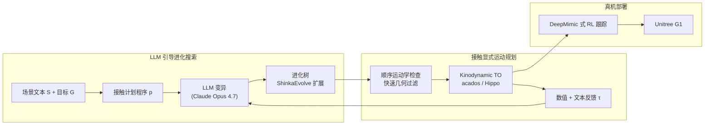

# MotionDisco（极端人形 Loco-Manipulation 运动发现）

**MotionDisco**（*Motion Discovery for Extreme Humanoid Loco-Manipulation*，arXiv:2606.06139，TUM · NYU · CMU）提出：在 **不依赖遥操作或人体动作重定向** 的前提下，用 **LLM 引导的进化式程序搜索** 在离散 **接触模式序列** 空间中发现 **接触丰富、长时程** 的人形 loco-manipulation 全身轨迹，并经 **分层运动学剪枝 + 接触显式 kinodynamic 轨迹优化** 的数值与文本反馈闭环指导搜索；发现轨迹训 **DeepMimic 式 RL 跟踪** 后在 **Unitree G1** 真机 **零样本** 部署。

## 一句话定义

**把「接触计划」写成可变异 Python 程序，用 LLM 进化搜索 + 轨迹优化反馈闭环从零合成长时程全身 loco-manip，再 RL 跟踪上真机**——绕过人体演示瓶颈的运动发现路线。

## 英文缩写速查

| 缩写 | 英文全称 | 简要说明 |
|------|----------|----------|
| LLM | Large Language Model | 变异接触计划程序并消费优化器文本反馈 |
| TO | Trajectory Optimization | 接触显式 kinodynamic 参考轨迹求解 |
| RL | Reinforcement Learning | DeepMimic 式跟踪策略，部署发现轨迹 |
| TAMP | Task and Motion Planning | 离散接触子任务 + 连续运动规划的耦合问题 |
| IK | Inverse Kinematics | 顺序运动学可行性阶段的快速几何过滤 |
| G1 | Unitree G1 | 论文真机验证平台 |

## 为什么重要

- **数据入口范式转换：** 主流 loco-manip 依赖 **MoCap/视频 → 重定向 → RL 跟踪** 或 **遥操作采集**；MotionDisco 把探索重心移到 **自动化接触计划搜索**，理论上可为 **无人类示范的新场景** 生成参考轨迹，并自然产出 **同一任务的多解多样性**（单次搜索内多样接触分配）。
- **LLM × 优化闭环有实证增益：** 相对 **单次 LLM 调用**，迭代搜索 + **文本失败反馈** 在 8 项任务上显著提高 **有效接触计划比例** 并降低 **TO cost**；首条可行解可在 **分钟级** 出现，使组合爆炸的接触空间探索具备工程可行性。
- **真机闭环里程碑：** 作者称 **首个** 完全通过 **自动化进化搜索** 发现并在真机上执行 **长时程 loco-manipulation** 的工作（攀台、穿障、桌下取放等），与 [ResMimic](./paper-resmimic.md)、[OmniRetarget](./paper-hrl-stack-03-omniretarget.md) 等 **演示驱动** 路线形成鲜明对照。
- **团队谱系：** TUM Khadiv 组在 **人形 TAMP / 动态 loco-manip** 上持续积累（Humanoids 2025 TAMP、ICRA 2026 动态发现 workshop 等）；MotionDisco 把 **程序进化（ShinkaEvolve 族）** 与 **接触显式 TO（acados / Hippo）** 推到 **G1 真机**。

## 核心机制（归纳）

| 模块 | 作用 |
|------|------|
| **场景与目标文本** $\mathcal{S}, \mathcal{G}$ | 物体标签、位姿、尺寸与离散/连续目标（期望接触、末端/物体位姿） |
| **接触计划程序** $p_n$ | Python API：`walk()` 处理平地直线步态；`append_mode()` 表达抓取、放置、登高等子目标 |
| **LLM 变异 + 进化树** | 基于父节点分数 $F_n$ 与反馈 $\tau_n$ 变异程序；**ShinkaEvolve** 岛屿采样 + 新颖性拒绝 |
| **顺序运动学检查** | 快速剔除碰撞/限位/切换不一致的接触序列；返回 **失败模式/切换** 文本 |
| **Kinodynamic TO** | 对通过运动学检验的序列求解全身–物体轨迹、接触力矩与阶段时长 |
| **RL 跟踪部署** | DeepMimic 奖励 + 域随机化；G1 零样本执行发现轨迹 |

### 流程总览

## 实验要点（索引级）

| 轴 | 报告口径（以论文为准） |
|----|------------------------|
| **平台** | **Unitree G1**；平坦掌、无手指闭合（双手同时接触才能持物） |
| **任务** | **8** 项：Banana、Box Stacking、Climb Table w/ Box、Long-Dist. Pick & Place、Move Through Clutter、Parkour Pick & Place 1/2、Under-Table Pick & Place |
| **消融** | SC（单次 LLM）多项失败；MD w/o TF 全场景可解但 valid%/cost 差于 **MD（含文本反馈）** |
| **效率** | 首条可行解 **1.34–7.49 min**（任务依赖）；Parkour 2 单次搜索产出 **多样接触计划** |
| **真机** | 发现轨迹 → RL 跟踪 → **零样本** 多任务连续成功（见项目页视频） |

## 常见误区或局限

- **误区：** 把 MotionDisco 等同于「LLM 直接输出关节轨迹」；关键是 **离散接触模式程序搜索** + **TO 反馈闭环**，连续运动由优化器恢复。
- **误区：** 认为已解决开放环境部署；当前 **假设已知场景文本**、**无感知**，且接触模型仅 **单边粘附 + 箱状刚体**。
- **局限：** `walk()` 为 **直线平地步态**，不自动绕障——可动物体须先移开；与 **重定向/遥操作路线** 相比，搜索仍依赖准确场景几何与手工目标规格。
- **对照：** 若已有高质量人类演示，[Motion Retargeting Pipeline](../concepts/motion-retargeting-pipeline.md) + [DynaRetarget / SBTO](../methods/dynaretarget-sbto-motion-retargeting.md) 动态精炼可能更高效；MotionDisco 瞄准 **无示范的新接触技能发现**。

## 与其他工作对比

| 工作 | 关系 |
|------|------|
| **[ResMimic](./paper-resmimic.md)** | 演示/跟踪范式：GMT 预训练 + 残差 loco-manip；依赖上游参考动作 |
| **[OmniRetarget](./paper-hrl-stack-03-omniretarget.md)** | 交互保留 **人体→人形** 重定向数据工厂 |
| **[TAMP for Humanoid Loco-manip](./paper-notebook-task-and-motion-planning-for-humanoid-loco-manip.md)** | 同人形 TAMP 问题域；MotionDisco 用 **LLM 程序进化** 探索接触序列 |
| **Code as Policies / PRoC3S** | 同类 LLM→程序路线；MotionDisco 面向 **全身接触模式** 而非桌面原语 |
| **DeepMimic 跟踪栈** | 下游部署接口与 [Whole-Body Tracking Pipeline](../concepts/whole-body-tracking-pipeline.md) 一致 |

## 关联页面

- [Loco-Manipulation](../tasks/loco-manipulation.md) — 任务定义与技术路线 §19
- [Motion Retargeting Pipeline](../concepts/motion-retargeting-pipeline.md) — 演示驱动上游对照
- [Teleoperation](../tasks/teleoperation.md) — 人类在环采集对照
- [Contact-Rich Manipulation](../concepts/contact-rich-manipulation.md) — 接触丰富操作概念
- [Whole-Body Tracking Pipeline](../concepts/whole-body-tracking-pipeline.md) — 发现轨迹 → RL 跟踪 → 真机
- [Unitree G1](./unitree-g1.md) — 硬件平台

## 参考来源

- [MotionDisco 论文摘录（arXiv:2606.06139）](../../sources/papers/motiondisco_arxiv_2606_06139.md)

## 推荐继续阅读

- [MotionDisco 项目页](https://atarilab.github.io/motiondisco.io/)
- [MotionDisco 论文（arXiv:2606.06139）](https://arxiv.org/abs/2606.06139)
- [演示视频（YouTube）](https://youtu.be/DHiVz34QYlw)
