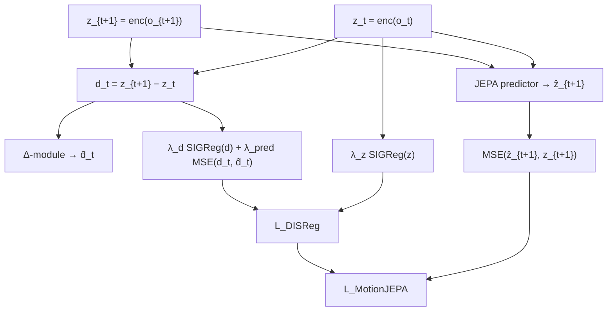
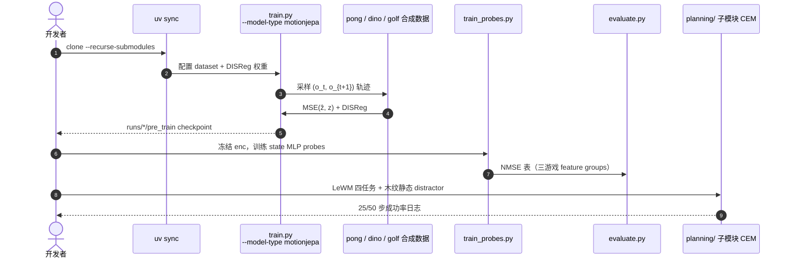

# MotionJEPA：在隐空间捕获视觉变化以防止时间特征坍塌

**MotionJEPA**（*Preventing Temporal Feature Collapse by Capturing Visual Changes in Latent Space*，[arXiv:2609.23881](https://arxiv.org/abs/2609.23881)；[项目页](https://mkarmann.github.io/motion-jepa-project-page/)，[代码](https://github.com/mkarmann/motion-jepa)）在标准 JEPA 上加入 **DISReg**（Difference Image and Single image embedding **Reg**ularization）：用 **差分 embedding 预测** 激励动态特征，用 **SIGReg** 塑形单帧分布，**无需像素重建** 也 **不依赖动作标签** 即可缓解「只学慢特征」的时间坍塌。实现继承 [LeWM](./paper-lewm.md) 骨干；官方仓库 **已开源**（规划评测在 `planning/` 子模块）。

## 一句话定义

**用「预测帧间差分 embedding + 单帧 SIGReg」把 JEPA 的静态/动态信息拉平衡，使 latent 既保留背景结构又编码运动，并在静态背景干扰下的 CEM 规划上相对 LeWM 均值成功率提升约 61 / 58 个百分点（25/50 步）。**

## 英文缩写速查

| 缩写 | 英文全称 | 简要说明 |
|------|----------|----------|
| JEPA | Joint-Embedding Predictive Architecture | 隐空间预测下一视图表征，无像素解码 |
| DISReg | Difference Image and Single image embedding Regularization | 本文正则：差分动态项 + 单帧 SIGReg 静态项 |
| SIGReg | Sketched Isotropic Gaussian Regularizer | [LeJEPA](./paper-lejepa.md) 系防坍塌分布约束 |
| IDM | Inverse Dynamics Model | 动作标签逆动力学基线（规划对照） |
| CEM | Cross-Entropy Method | 与 LeWM 相同的测试时隐空间 MPC |
| NMSE | Normalized Mean Squared Error | probing 指标；1.0 等价于预测均值 |

## 为什么重要

- **坍塌机制说清：** 无重建 JEPA 天然偏向 **slow features**（记分牌、静态背景），运动对象特征被抑制——项目页 Pong visual probe 上 LeWM* 重建记分牌而球模糊，SMWM* 几乎只编码球拍。
- **比「加 IDM」更通用：** 逆动力学防坍塌但 **需要动作**；DISReg 的 **动态项只要求 \(z_t,z_{t+1}\) 含变化信息**，不约束 \(z\) 的整体形状，适合 **无动作标签** 的预训练世界模型。
- **规划可读性：** Golf 单特征 latent 轨迹 PCA 显示 MotionJEPA **低曲率**，LeWM* 近乎单点塌缩——与 distractor 下 CEM 成功率直接相关。
- **工程可复现：** 与 LeWM 同代码栈（`train.py` / probing 表 / 多基线），便于 ablate DISReg 相对 SIGReg 变体。

## 核心信息

| 项 | 内容 |
|----|------|
| **机构** | 牛津大学；vivo Tech Research GmbH / vivo 蓝图影像实验室；比勒费尔德大学；Slater Labs；冷泉港实验室；布朗大学；AMI Labs |
| **arXiv** | [2609.23881](https://arxiv.org/abs/2609.23881) |
| **项目页** | <https://mkarmann.github.io/motion-jepa-project-page/> |
| **代码** | <https://github.com/mkarmann/motion-jepa> |
| **开源** | **已开源**（主仓训练+probing；`planning/` 为子模块） |

## 流程总览

默认权重（三游戏统一，无 per-env 搜参）：\(\lambda_z{=}0.25\), \(\lambda_{\mathrm{pred}}{=}0.5\), \(\lambda_d{=}2\)。

## 核心原理

### 相对 LeWM / 逆动力学

| 路线 | 防坍塌信号 | 动作标签 |
|------|------------|----------|
| LeWM + SIGReg | 下一 embedding MSE + 全码 SIGReg | 训练用动作，易偏 slow features |
| SMWM*（基线） | 动作条件逆动力学风格 | **需要** |
| IDM（规划基线） | 逆动力学预训练 | **需要** |
| **MotionJEPA** | 下一 MSE + **DISReg**（差分预测 + 双 SIGReg） | **预训练不要动作** |

### DISReg 损失（项目页）

\[
\mathcal{L}_{\mathrm{DISReg}}
= \lambda_z\,\mathrm{SIGReg}(z)
+ \lambda_d\,\mathrm{SIGReg}(d)
+ \lambda_{\mathrm{pred}}\,\mathrm{MSE}(d_t,\hat{d}_t)
\]

\[
\mathcal{L}_{\mathrm{MotionJEPA}}
= \mathcal{L}_{\mathrm{DISReg}}
+ \mathrm{MSE}(z_{t+1},\hat{z}_{t+1})
\]

动态项 MSE 只推动 **视觉变化** 进入 \(z\)，不像直接对 \(z\) 强加形状约束那样压制静态结构。

## 源码运行时序图

官方 [mkarmann/motion-jepa](https://github.com/mkarmann/motion-jepa)（归档 [sources/repos/motion-jepa.md](../../sources/repos/motion-jepa.md)）：

- **最短离线路径：** `bash run.sh pong motionjepa ./runs/pong_motionjepa`（或 `run_all_environments_three_seeds.sh motionjepa`）。
- **规划复现：** 初始化 `planning/` 子模块后再跑 CEM（与主 README 分工一致）。

## 实验与评测

### 离线 latent probing（三合成游戏）

- 冻结 \(z\)，用 residual MLP 预测各 **feature group**；NMSE=1 表示 probe 无信息。
- **MotionJEPA** 为表中 **唯一** 在所有 group 上 NMSE **≤ 0.1** 的方法（项目页 Latent Probing 表；相对 LeWM* / SMWM* / LeWM-Time* / LeWM-Flat* / LeWM-Detached*）。
- 跨三游戏平均 NMSE 最优行：**MotionJEPA (Ours)**（例如 Pong avg. **0.004**，Dino **0.021**，Golf **0.061**）。

### 规划 under static distractors（四 LeWM 控制任务）

背景换 **木纹纹理**（每 episode 固定 crop），测试 split 初态，CEM horizon **25 / 50** 环境步。

| 方法 | Cube | PushT | Reach. | 2Room | **Mean** |
|------|------|-------|--------|-------|----------|
| LeWM @ 25 | 43.6 | 4.0 | 5.2 | 28.8 | **20.4** |
| IDM @ 25 | 76.0 | 83.6 | 49.2 | 100.0 | 77.2 |
| **MotionJEPA @ 25** | **78.0** | 78.4 | **71.2** | 99.6 | **81.8** |
| LeWM @ 50 | 24.4 | 2.4 | 2.0 | 18.4 | **11.8** |
| IDM @ 50 | 53.2 | 26.0 | 62.0 | 96.0 | 59.3 |
| **MotionJEPA @ 50** | **63.2** | **28.0** | **98.0** | 92.0 | **70.3** |

四环境均值：相对 IDM **+4.6 pp（25 步）** 与 **+11.0 pp（50 步）**；相对 LeWM **+61.4 / +58.5 pp**。

## 工程实践

| 项 | 说明 |
|----|------|
| 依赖 | Python 3.11 + uv；SIGReg/骨干来自 LeWM 官方实现 |
| 子模块 | 规划实验 **必须** `--recurse-submodules` |
| 基线开关 | `--model-type lewm|smwm|motionjepa|...` 与 `configs/*_optimized.yaml` |
| 许可 | Git 根目录无 LICENSE；论文 CC BY 4.0（README badge） |

## 局限与风险

- 主结果在 **合成游戏 + LeWM 四仿真任务**，未覆盖真机 VLA 或互联网规模视频。
- SMWM / LeWM* 等 starred 基线带 **per-environment 超参搜索**，MotionJEPA 用 **单一 DISReg 权重**——公平性偏向本文，但亦证明调参负担更低。
- IDM 在部分短 horizon 仍具竞争力；长 horizon（50 步）MotionJEPA 优势更大，部署需按 horizon 验证。
- 仓库 **无 SPDX 许可文件**，商用复现前需自行确认作者意图与 LeWM 上游许可。

## 与其他页面关系

| 页面 | 关系 |
|------|------|
| [LeWM](./paper-lewm.md) | 架构与 SIGReg 来源；规划协议与四任务一致 |
| [LeJEPA](./paper-lejepa.md) | SIGReg 理论起点 |
| [LeVJEPA](./paper-levjepa.md) | 无动作视频 JEPA；无 distractor 规划实验 |
| [WCM](./paper-wcm-world-critic-model.md) | 同属 JEPA 隐空间、防坍塌叙事 |

## 结论

**总判：MotionJEPA 把「时间坍塌」从玄学调参收成可解释的 DISReg——差分分支补动态、SIGReg 稳静态——并在静态干扰 planning 上给出相对 LeWM 量级的成功率跃迁。**

1. 读表征质量先看 **probing NMSE 全组≤0.1**，再看 Golf latent 轨迹是否低曲率。
2. 规划对比务必带 **static distractor**；干净背景下 LeWM 与 MotionJEPA 差距会缩小。
3. 复现从 `motion-jepa` **子模块克隆** 起，规划与 probing 分两条 README 路径。
4. 需要动作标签防坍塌时对照 **IDM**；要无动作预训练优先 DISReg 而非纯 SIGReg-on-\(z\)。
5. 与 [LeWM](./paper-lewm.md) 联合读：同一 CEM 栈，差异在 **预训练目标** 而非规划器。

## 关联页面

- [LeWM](./paper-lewm.md)
- [LeJEPA](./paper-lejepa.md)
- [LeVJEPA](./paper-levjepa.md)
- [生成式世界模型](../methods/generative-world-models.md)
- [潜空间想象](../concepts/latent-imagination.md)

## 参考来源

- [MotionJEPA 论文归档](../../sources/papers/motionjepa_arxiv_2609_23881.md)
- [motion-jepa 仓库归档](../../sources/repos/motion-jepa.md)
- [项目页归档](../../sources/sites/motion-jepa-project-page.md)

## 推荐继续阅读

- [arXiv:2609.23881](https://arxiv.org/abs/2609.23881)
- [项目页（表格与可视化）](https://mkarmann.github.io/motion-jepa-project-page/)
- [LeWM 论文](https://arxiv.org/abs/2603.19312)
