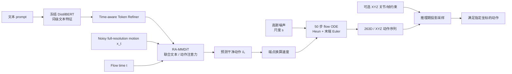
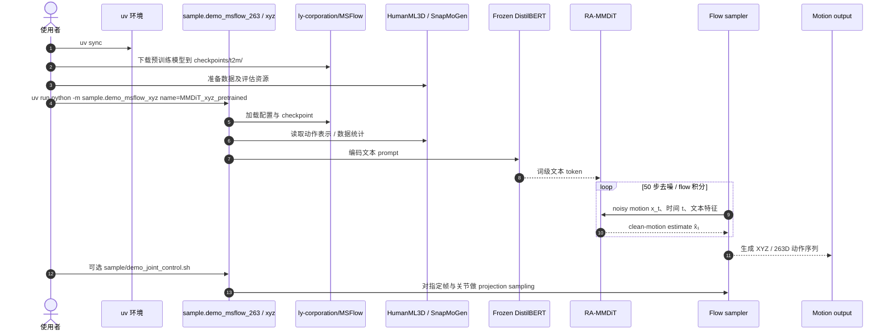

# MotionSpaceFlow：在原始动作空间直接做流匹配

**MotionSpaceFlow**（MSFlow，*Representation-Aware Flow Matching in Direct Motion Space*，[arXiv:2609.34190](https://arxiv.org/abs/2609.34190)，[项目页](https://yu1ut.com/MSFlow-HP/)）由 LY Corporation 的 Qing Yu、Kent Fujiwara 提出，是文本驱动人体动作生成框架。

## 一句话定义

在连续动作表示本身上训练 flow matching，让模型直接生成原始时间分辨率的动作序列，并让注意力模式与动作表示相匹配。

## 英文缩写速查

| 缩写 | 英文全称 | 简要说明 |
|------|----------|----------|
| MSFlow | MotionSpaceFlow | 本项目简称 |
| RA-MMDiT | Representation-Aware Multimodal Diffusion Transformer | 联合更新文本 token 与动作帧特征的主干 |
| FM | Flow Matching | 学习从高斯噪声到动作分布的连续向量场 |
| CFG | Classifier-Free Guidance | 推理时加强文本条件的采样方式 |
| FID | Fréchet Inception Distance | 以动作嵌入分布评估生成质量 |
| XYZ | Global 3D joint coordinates | 每帧 22 个关节的绝对三维坐标 |
| ODE | Ordinary Differential Equation | flow matching 的采样轨迹积分形式 |

## 为什么值得关注

- **动作不压进 latent。** 263D 或 XYZ 运动张量就是生成变量，不需学习式动作 encoder/decoder，也不做时间下采样；因此可直接访问单帧和单关节。
- **表示会改变架构选择。** HumanML3D 263D 的根部速度等是增量特征，causal attention 更合适；全局 XYZ 则采用 bidirectional attention 保持整段坐标的连贯性。两者不是可互换的同一个“输入格式”。
- **文本特征保持细粒度。** RA-MMDiT 联合更新词级文本 token 与全分辨率动作帧 token；相比先把文本压成单一条件向量，每帧可以从联合注意力中取得相关语义。
- **动作后编辑可在采样时做。** XYZ projection sampler 可在不做控制条件训练的情况下，固定指定帧、关节及坐标轴；论文报告约束坐标误差为零。
- **不是机器人控制策略。** 输出仍是人体运动学序列。要用作机器人参考动作，还需骨架重定向、接触/物理检查和下游控制验证。

## 核心信息

| 字段 | 内容 |
|------|------|
| 作者 / 机构 | Qing Yu、Kent Fujiwara / LY Corporation |
| 论文 | arXiv:2609.34190（2026-09-28） |
| 任务 | 文本→人体动作；推理期关节/帧空间约束 |
| 表示 | HumanML3D 增量 263D；全局 XYZ 66D；扩展实验含 MotionStreamer 272D 与 SnapMoGen 296D |
| 主干 | 68M 参数、8 个 RA-MMDiT blocks、宽度 512；冻结 DistilBERT 文本特征 + flow-time-aware Token Refiner |
| 采样 | 高斯源尺度 `s=5`，50 步 flow；Heun 积分并在末端做 Euler 更新 |
| 官方开放材料 | [代码](https://github.com/lycorp-jp/MSFlow)、[预训练权重](https://huggingface.co/ly-corporation/MSFlow)、[项目页](https://yu1ut.com/MSFlow-HP/) |

## 流程总览

## 核心机制

### 1. 直接在动作空间生成

设干净动作序列为 `x₁`，随机高斯源为 `x₀ = sε`，中间路径为：

[
`xₜ = (1−t)x₀ + t x₁`，其中 `ε ~ N(0, I)`。
]

网络预测干净动作 (hat{x}_1=f_	heta(x_t,t,c))，再由当前状态和预测端点计算速度，沿 ODE 积分到终点。直接生成消除了“生成 latent → 通过固定 decoder 重建”的限制；论文也明确指出，这并不代表直接生成在所有情形都必然优于 latent 模型。

### 2. 源噪声尺度需要按表示选择

直接运动表示在不同维度和时间位置上的方差各异。论文推导各方向信噪比与中间协方差，发现增大源尺度 `s` 会让信号更晚出现，同时改善中间分布的条件数。主模型选择 `s=5`。这是作用在 flow path 的训练/推理参数，不等同于只在推理时调节的 temperature。

### 3. Attention mask 随时间语义变化

- **263D 增量表示：** 每帧含根部速度等增量量，累积后得到全局轨迹；causal mask 偏向向前一致的时序演化。
- **66D 全局 XYZ：** 每帧是 22 个关节的绝对位置，bidirectional mask 利用前后上下文维持整段骨架一致。
- **RA-MMDiT：** 每帧动作映射到 512 维；冻结 DistilBERT 生成词级特征，经两层 time-aware Token Refiner 投影到相同宽度。8 个多模态块通过 joint attention 联合更新两种 token。

### 4. 推理期空间约束

XYZ 变体在去噪过程中注入指定帧、关节和坐标轴的约束，末端再执行硬投影，消除剩余数值误差。论文控制评测报告被约束坐标轨迹误差、位置误差为零；这里的“精确”只针对所定义的线性坐标条件，不延伸到碰撞、接触或物理约束。

## 源码运行时序图

以下命令和模块路径来自官方 README；运行前需安装依赖、下载 checkpoint、评估器并准备数据：

代码还提供 263D 与 XYZ 两套 train/eval 命令；其中 XYZ 关节控制 demo 直接见[代码仓来源归档](../../sources/repos/msflow-lycorp-jp.md)。

## 论文结果与评测读法

| 基准与协议 | 结果 | 应如何解读 |
|-------------|------|------------|
| HumanML3D，67D MARDM evaluator，10 次评测 | 263D：FID 0.046±0.004；R-Precision 0.571 / 0.764 / 0.853；XYZ：FID **0.038±0.004** | 263D 的文本检索相关指标点估计更高；XYZ 的 FID 最低，不能把两类表示混成一个结果 |
| SnapMoGen，原生 296D | R-Precision 0.910 / 0.969 / 0.984；FID 16.342；multimodality 12.538 | 相比 CMDM 对齐更强，但 FID 未超过 CMDM 的 14.451 或 MoMask++ 的 15.061 |
| HumanML3D 推理期空间控制 | 约束帧/关节坐标的报告误差为 0 | 只表示线性坐标约束满足，不表示物理可行 |

以上均为论文报告的实验结果，不等价于跨数据集、跨表示的同协议统一排名。

## 工程实践与开放范围

| 资源 | 状态 |
|------|------|
| 官方实现 | [lycorp-jp/MSFlow](https://github.com/lycorp-jp/MSFlow)：demo、训练、评测代码 |
| 预训练模型 | [Hugging Face](https://huggingface.co/ly-corporation/MSFlow) |
| 数据 | 由使用者按 HumanML3D / SnapMoGen 上游说明准备；评估依赖 GloVe 与 MARDM evaluators |
| 许可 | 仓库 README 标注 CC0 1.0；第三方依赖和数据仍按其上游许可 |
| 可用性风险 | 官方 README 称代码仓为临时开放，未来可能转只读或私有 |

263D demo: `uv run python -m sample.demo_msflow_263 name=MMDiT_pretrained`；XYZ demo: `uv run python -m sample.demo_msflow_xyz name=MMDiT_xyz_pretrained`；约束采样示例：`bash sample/demo_joint_control.sh`。训练命令为 `uv run python -m train.train_msflow_263 name=<exp_name>` 与 `uv run python -m train.train_msflow_xyz name=<exp_name>`。完整准备步骤见[代码仓归档](../../sources/repos/msflow-lycorp-jp.md)。

## 结论

**MotionSpaceFlow 把文本驱动动作生成从压缩 latent 拉回全分辨率动作空间，并证明表示感知的 flow path 与时序 attention 对生成质量和可控性都关键。**

1. **使用场景：** 需要直接编辑任意人体帧/关节的文本动作生成研究与动画原型，尤其 XYZ 投影采样。
2. **看指标时分清表示：** 263D 在检索/文本相似指标更强；XYZ 在 HumanML3D 的 FID 更低。
3. **控制来自投影：** 任意帧/关节线性等式条件可在推理阶段注入，无需控制条件训练。
4. **不能直接当机器人策略：** 人体骨架输出仍缺机器人重定向、接触动力学与闭环控制。
5. **复现前固定代码快照：** 仓库当前为临时开放，按 README 记录 Git commit、环境和数据来源。

## 局限与风险

- **未覆盖物理约束。** 论文的采样器处理线性坐标条件，不保证碰撞避免、接触、关节限位、平衡或动力学可行。
- **数据域有限。** 主要验证 HumanML3D 与 SnapMoGen；跨骨架、运动域和实际应用的泛化仍需测试。
- **长序列开销。** 不做时间压缩换来逐帧访问，但会带来较长 token 序列的计算与显存开销。
- **临时开源。** LY Corporation 的 README 表明仓库可能调整成只读或私有；checkpoint、依赖与第三方资产许可需分别确认。
- **不是机器人可执行动作。** 必须经过 skeleton mapping / retargeting，并由物理仿真或真实控制验证。

## 关联页面

- [Diffusion-based Motion Generation](../methods/diffusion-motion-generation.md) — 动作扩散与流匹配方法总览
- [Probability Flow](../formalizations/probability-flow.md) — 连续向量场与 ODE 采样基础
- [HumanML3D](../entities/dataset-bfm-humanml3d.md) — 263D 经典文本–人体动作表示与数据集
- [Awesome Text-to-Motion](../entities/awesome-text-to-motion-zilize.md) — 文本驱动动作生成论文索引
- [UniMate](../entities/paper-unimate.md) — 同属文本驱动动作生成，重点在跨骨骼拓扑

## 推荐继续阅读

- [MotionSpaceFlow 项目页](https://yu1ut.com/MSFlow-HP/)
- [MotionSpaceFlow arXiv HTML](https://arxiv.org/html/2609.34190v1)
- [MotionSpaceFlow GitHub](https://github.com/lycorp-jp/MSFlow)
- [预训练模型](https://huggingface.co/ly-corporation/MSFlow)
- [Flow Matching for Generative Modeling](https://arxiv.org/abs/2210.02747)

## 参考来源

- [论文来源归档](../../sources/papers/motionspaceflow_arxiv_2609_34190.md)
- [官方项目页归档](../../sources/sites/motionspaceflow-yu1ut.md)
- [官方代码仓归档](../../sources/repos/msflow-lycorp-jp.md)
