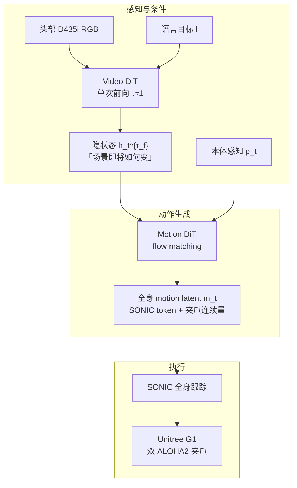

# MotionWAM（实时人形 Loco-Manipulation · World Action Model）

**MotionWAM**（*Towards Foundation World Action Models for Real-Time Humanoid Loco-Manipulation*，arXiv:2606.09215，Mondo Robotics · 港科大（广州）· 港科大）提出：把 **视频世界模型的中间去噪特征** 作为策略条件，在 **统一全身 motion latent** 中 **端到端** 预测人形 **locomotion + 操作**，从而摆脱「上身关节目标 + 下身粗基座命令」分层范式对 **任务驱动足部行为** 的限制，并在 **单次 Video DiT 前向** 下达到 **闭环实时** 部署。

## 一句话定义

**用一次「想象未来」的 Video DiT 隐状态驱动 Motion DiT，在 SONIC 统一 token 空间里同时生成全身运动与手部操作**——把 WAM 从桌面臂推到 **实时人形全身 loco-manipulation**。

## 英文缩写速查

| 缩写 | 英文全称 | 简要说明 |
|------|----------|----------|
| WAM | World Action Model | 联合视频动力学与动作生成的具身策略 |
| VLA | Vision-Language-Action | 本文主要对照基线范式（静态 VLM 先验） |
| DiT | Diffusion Transformer | Video / Motion 双骨干的扩散 Transformer |
| FSQ | Finite Scalar Quantization | SONIC motion token 的离散瓶颈量化 |
| VR | Virtual Reality | PICO 三点追踪采集 Stage 3 全身演示 |
| RGB | Red-Green-Blue | 头部 RealSense D435i 彩色 egocentric 输入 |

## 为什么重要

- **WAM 的「速度墙」与人形「空间墙」同时被点名：** 既有 WAM 在高维 latent 上 **迭代去噪太慢**，难以闭环平衡人形；分层系统又让腿只能 **被动保平衡**，无法 **踩踏板、踢球** 等 **足端任务语义**——MotionWAM 用 **$\tau_f \approx 1$ 单次前向隐状态** 与 **统一 motion token** 同时回应两条线。
- **与 VLA 的对照实验干净：** 全部方法在 **同一 Stage 3 演示** 上微调，且经 **同一 SONIC 低层接口** 执行；最强 VLA（GR00T-N1.7）平均 **43.9%** vs MotionWAM **76.1%**，说明 **视频动力学先验** 对 **闭环物理人形** 的增益难以用 **更强语义 VLM** 单独替代。
- **与 [LEGS](./paper-legs-embodied-gaussian-splatting-vla.md) 形成互补：** 二者均在 **G1 + SONIC + 语言条件** 栈上工作，但 LEGS 走 **合成数据 + VLA 微调**，MotionWAM 走 **大规模 egocentric 视频预训练 + WAM 联合建模**——代表 loco-manip **数据工厂 vs 世界–动作基础模型** 两条 2026 路线。
- **机构与谱系：** 摩多机器人 / 港科大（广州）团队；架构与训练接口受同团队 **DiT4DiT**（arXiv:2603.10448）启发，可视为 **VAM/WAM 向人形实时全身** 的推进。

## 核心结构

| 模块 | 作用 |
|------|------|
| **Video DiT** | 自 Cosmos-Predict2.5-2B 初始化；对 egocentric 条件帧与未来帧 latent 做 flow matching；在固定 flow 步 **hook 隐状态** $\mathbf{h}_t^{\tau_f}$（**不做完整未来去噪**） |
| **Motion DiT** | 以 $\mathbf{h}_t^{\tau_f}$、本体 $p_t$、具身标签 $e$ 为条件，对 **全身 motion latent** 做 flow matching |
| **统一 motion latent** | $\mathbf{m}_t = (\mathbf{m}_t^{\text{cont}}, k_t)$：SONIC **FSQ token**（locomotion/躯干/身高/足端）+ **连续夹爪通道** |
| **SONIC 解码** | 推理时对离散索引 **最近邻取整**，经 [SONIC](../methods/sonic-motion-tracking.md) 全身控制器输出关节命令 |
| **三阶段训练** | Stage 1 仅视频；Stage 2 视频+动作联合；Stage 3 目标任务全身遥操作微调 |

### 流程总览

### 与分层 upper–lower 范式的分界

| 范式 | 下身接口 | 足端任务能力 |
|------|----------|--------------|
| **分层 VLA + LLC** | 基座速度 / 身高 / 朝向 | 腿主要 **稳基座** |
| **MotionWAM** | 与上身同一 **motion token** | **踩踏板、踢球** 等 **任务驱动足端** |

## 实验要点（索引级）

| 轴 | 报告口径（以论文为准） |
|----|------------------------|
| **平台** | Unitree G1；双 ALOHA2 夹爪；头部 RealSense D435i；策略 **RTX 4090 WebSocket**；对比频率在 **A100** 上测 |
| **任务** | **9** 项全身 loco-manipulation（腰控、身高、蹲行、足端交互、身手协调）；每任务 **20** 次 |
| **主结果** | 平均成功率 **76.1%** vs GR00T-N1.7 **43.9%**（**+32.2%** 绝对）；Kick Soccer / Load Cart / Retrieve Item / Wipe Board 等 **全身协调** 任务差距最大 |
| **消融** | 无 Stage 1：**−11%** 平均；无 Stage 2：**−28%** |
| **效率** | MotionWAM **4.9 Hz**；Cosmos Policy **0.7 Hz**；GR00T-N1.7 **6.5 Hz** |
| **数据** | Stage 1 **~2136 h** egocentric 视频；Stage 3 每任务 **200** episodes **PICO VR** 全身遥操作（SMPL→G1） |

## 常见误区或局限

- **误区：** 把 MotionWAM 等同于「任意视频生成 + 人形头」；关键是 **单次前向隐状态条件化** 与 **SONIC 统一 token**，而非追求像素级未来帧质量。
- **误区：** 认为 VLA 微调演示即可覆盖全身 loco-manip；论文显示 **Qwen3DiT**（容量匹配、仅换 VLM 先验）在 **locomotion-heavy** 任务上接近 **零成功率**。
- **局限：** 目前仅在 **G1** 上验证三阶段配方；**严格新物体 OOD** 未报告；**单目 egocentric** 在物体出视野或头摄漂移时易失稳（见论文 Failure Cases）。

## 方法栈

见上文 **核心结构**、**流程总览** 与 **三阶段训练**（§3.3）；Video DiT 自 Cosmos-Predict2.5-2B 初始化，Motion DiT 以 flow matching 回归 SONIC 统一 latent，部署经 WebSocket 闭环查询。

## 与其他工作对比

| 工作 | 关系 |
|------|------|
| **DiT4DiT**（arXiv:2603.10448） | 同团队前序 **双 DiT + flow matching** VAM；MotionWAM 扩展到 **人形实时全身** 与 **统一 motion token** |
| **Cosmos Policy** | 同类世界模型策略；需 **迭代去噪未来** → **0.7 Hz**；MotionWAM **单次前向隐状态 → 4.9 Hz** |
| **GR00T-N1.7 / π₀.₅** | 同演示微调 VLA 基线；**静态 VLM 先验** 在 locomotion-heavy 任务上大幅落后 |
| **LEGS** | 同 **G1 + SONIC** 栈；LEGS 走 **3DGS 合成 + VLA**，MotionWAM 走 **egocentric 视频 WAM 预训练** |
| **分层 upper–lower loco-manip** | 下身仅基座命令；无法表达 **任务驱动足端**（踢球、踩踏板） |

## 关联页面

- [World Action Models（WAM）](../concepts/world-action-models.md) — Joint 族与人形实时实例坐标
- [Loco-Manipulation](../tasks/loco-manipulation.md) — 全身移动操作任务与技术路线
- [SONIC](../methods/sonic-motion-tracking.md) — 统一 motion token 低层解码接口
- [VLA](../methods/vla.md) — GR00T / π₀.₅ 等对照基线语境
- [Unitree G1](./unitree-g1.md) — 论文硬件平台
- [LEGS](./paper-legs-embodied-gaussian-splatting-vla.md) — 同 G1+SONIC 栈的 VLA 数据路线对照
- [WorldVLN](./paper-worldvln-aerial-vln-wam.md) — 另一 WAM 闭环部署实例（空中 VLN）

## 参考来源

- [MotionWAM 论文摘录（arXiv:2606.09215）](../../sources/papers/motionwam_arxiv_2606_09215.md)

## 推荐继续阅读

- [MotionWAM 论文（arXiv:2606.09215）](https://arxiv.org/abs/2606.09215)
- [DiT4DiT：Jointly Modeling Video Dynamics and Actions（arXiv:2603.10448）](https://arxiv.org/abs/2603.10448) — 同团队前序双 DiT VAM 框架
- [World Action Models: The Next Frontier in Embodied AI（arXiv:2605.12090）](https://arxiv.org/abs/2605.12090) — WAM 综述
