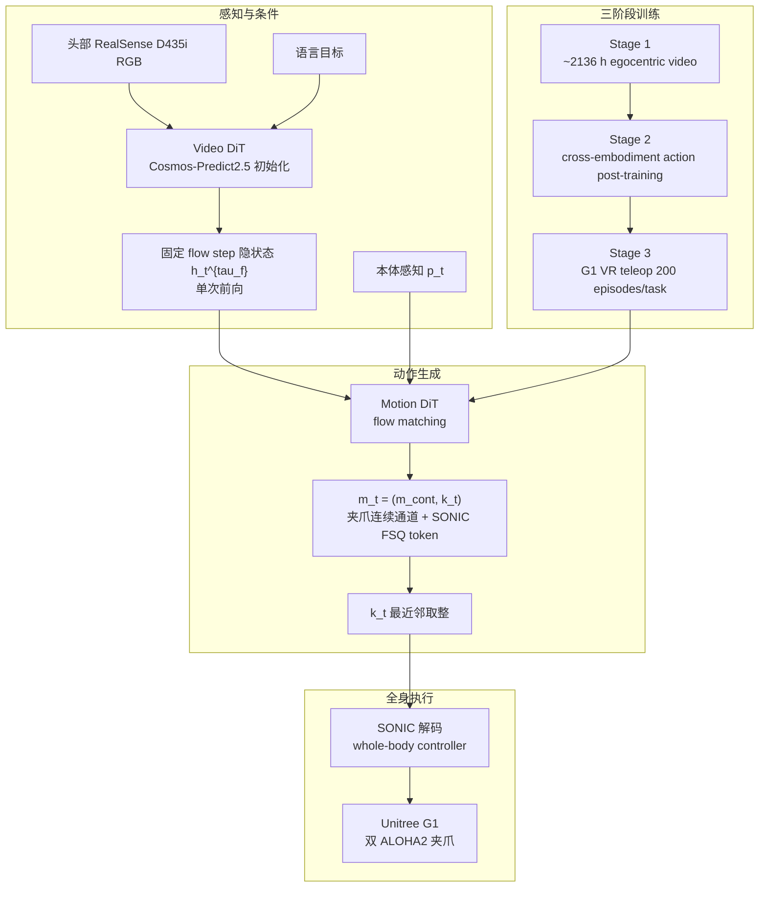

# MotionWAM（实时人形 Loco-Manipulation · World Action Model）

**MotionWAM**（*Towards Foundation World Action Models for Real-Time Humanoid Loco-Manipulation*，arXiv:[2606.09215](https://arxiv.org/abs/2606.09215)）提出把 **视频世界模型的中间去噪特征** 接到 **统一全身 motion token** 动作空间：Video DiT 只做一次前向，提供「场景即将如何变化」的隐状态；Motion DiT 在该隐状态、本体与语言目标条件下预测 SONIC token 和手部连续通道，实时驱动 Unitree G1 的 locomotion、躯干、身高、足端交互与双手操作。

## 一句话定义

MotionWAM 用一次 Video DiT「想象未来」的隐状态驱动 Motion DiT，在 SONIC 统一 token 空间里同时生成全身移动、足端交互和手部操作动作。

## 英文缩写速查

| 缩写 | 英文全称 | 简要说明 |
|------|----------|----------|
| WAM | World Action Model | 把视频动力学先验与动作生成联合起来的策略范式 |
| DiT | Diffusion Transformer | Video / Motion 双骨干所用扩散 Transformer |
| VLA | Vision-Language-Action | GR00T / π0.5 等对照基线范式 |
| FSQ | Finite Scalar Quantization | SONIC motion token 的离散瓶颈量化 |
| SONIC | Scalable Online Neural whole-body Integrated Control | 统一 motion token 解码为全身关节动作的低层接口 |
| RGB | Red-Green-Blue | 头部 RealSense D435i egocentric 输入 |
| VR | Virtual Reality | PICO 三点追踪采集 Stage 3 全身示范 |
| ACT | Action Chunking with Transformers | 非 VLA visuomotor baseline |

## 为什么重要

- **同时点破 WAM 的速度墙和人形动作空间墙。** 传统 WAM 需要对未来视频/动作 latent 迭代去噪，太慢；分层人形系统又让腿只接基座命令，难以表达踢球、踩踏板等任务驱动足端行为。
- **统一全身 motion token。** MotionWAM 不再把上身关节和下身 base command 分开，而是通过 SONIC token 覆盖 locomotion、torso、height、foot interaction 与 hand manipulation。
- **对照基线公平。** Diffusion Policy、ACT、π0.5、GR00T-N1.7、Qwen3DiT 都在同一 Stage 3 数据上微调，并通过同一 SONIC 接口执行；MotionWAM 平均 **76.1%**，最强基线 GR00T-N1.7 **43.9%**。
- **实时性来自中间特征，而非完整视频生成。** 它 hook 固定 flow 步的 Video DiT hidden state，不追求像素级未来帧完整去噪；A100 上 **4.9 Hz**，显著快于 Cosmos Policy **0.7 Hz**。
- **接触横切面代表 VLA/WM 调用。** 在 [Loco-Manip 接触分类 05：VLA/世界模型调用](../overview/loco-manip-contact-category-05-vla-world-models.md) 中，它是将足端和手端接触能力暴露给世界动作模型的核心例子。

## 流程总览

## 核心机制（详细）

### 1. 问题 formulation：动作来自世界模型中间态

MotionWAM 不让策略直接从静态图像和语言抽动作，也不要求世界模型完整生成未来视频。它将策略条件写成当前 egocentric observation、本体状态，以及 Video DiT 在某个去噪步的 hidden state $\mathcal{H}(o_{t+1}^{\tau_v})$。这个中间态包含未来场景变化的动力学线索，但计算成本接近一次前向。

这一点解释了它相对 Cosmos Policy 的速度优势：不是模型更小，而是避免在闭环控制中多步生成高维视频。

### 2. 双 DiT：Video DiT 与 Motion DiT 的职责分离

| 模块 | 职责 |
|------|------|
| Video DiT | 从 egocentric RGB、语言和条件帧学视觉动力学；自 Cosmos-Predict2.5-2B 初始化 |
| Hidden hook | 在固定 flow step 取 transformer hidden state，作为 motion generation 条件 |
| Motion DiT | 以 hidden state、本体和 embodiment projector 为条件，flow matching 预测 motion latent |
| Embodiment projector | Stage 2 多具身数据时包住共享 trunk，部署时使用 Unitree G1 projector |

保持 video objective 作为 Stage 2 的 representation regularizer，可防止加入动作监督后把视觉动力学先验覆盖掉。

### 3. 统一 motion latent 与 SONIC 解码

全身 motion latent 写作 $\mathbf{m}_t=(\mathbf{m}_t^{cont},\tilde{k}_t)$：

- $\tilde{k}_t$：SONIC FSQ token 的连续槽，代表 locomotion、torso、height、foot interaction 等全身动作意图；
- $\mathbf{m}_t^{cont}$：夹爪/手部连续通道；
- 推理时 $\hat{k}_t=\mathrm{round}(\hat{\tilde{k}}_t)$，经 [SONIC](../methods/sonic-motion-tracking.md) 解码为关节命令。

相比「上身 18-D 关节/末端 + 下身 base velocity」接口，统一 token 允许腿部成为任务执行器：踢球、踩踏板、蹲行和身高手臂协调都可以从同一动作空间输出。

### 4. 三阶段训练

| 阶段 | 数据与目标 | 作用 |
|------|------------|------|
| Stage 1 | 约 **2,136 h** egocentric human / humanoid video；仅训 Video DiT | 学第一视角视觉动力学 |
| Stage 2 | 异构 Unitree G1 数据；加入 Motion DiT 与 per-embodiment projector | 把视觉动力学接到动作 token |
| Stage 3 | Unitree G1 全身遥操作数据，每任务 **200 episodes**；PICO VR 三点追踪，SMPL → G1 | 适配九项真实 loco-manip 任务 |

消融显示去 Stage 1 平均成功率约降 **11%**，去 Stage 2 约降 **28%**，说明「视频动力学预训练」和「动作接地」都不可省。

### 5. 真机系统与评测

| 轴 | 论文报告 |
|----|----------|
| 硬件 | Unitree G1 + 双 ALOHA2 grippers + head-mounted Intel RealSense D435i RGB |
| 遥操作 | PICO VR three-point tracking → SMPL → G1 |
| 部署 | 策略 WebSocket server 跑在 RTX 4090，机器人闭环查询 |
| 任务 | 9 项全身 loco-manipulation；腰控、身高、蹲行、足端交互、身手协调 |
| 试验 | 每任务 20 次 |
| 主结果 | MotionWAM **76.1%** 平均成功率；GR00T-N1.7 **43.9%**；绝对提升约 **32%** |
| 实时频率 | MotionWAM **4.9 Hz**；Cosmos Policy **0.7 Hz**；GR00T-N1.7 **6.5 Hz**；Qwen3DiT **9.0 Hz** |

论文列举的任务强调全身协调，如 Kick Soccer、Load Cart、Retrieve Item、Wipe Board 等；MotionWAM 在 locomotion-heavy / foot-interaction 场景中领先更明显。

## 评测与结果

真机评测在 Unitree G1 + 双 ALOHA2 夹爪 + 头部 RealSense D435i 上进行，覆盖九项强调全身协调的 loco-manipulation 任务（腰控、身高调节、蹲行、任务驱动足端交互与身–手协调，如 Kick Soccer、Load Cart、Do Laundry、Wipe Board），每任务 20 次试验。

- **主结果：** MotionWAM 平均成功率 **76.1%**，最强 VLA 基线 GR00T-N1.7 为 **43.9%**，绝对提升约 **32 个百分点**；在 locomotion-heavy / 足端交互场景领先更明显。
- **对照公平性：** Diffusion Policy、ACT、π0.5、GR00T-N1.7、Qwen3DiT 均在同一 Stage 3 数据上微调，并通过同一 SONIC 接口执行，隔离出「视频动力学先验 + 统一动作空间」的增益。
- **实时性：** A100 上 **4.9 Hz**，约为 Cosmos Policy（0.7 Hz）的 7×，与 GR00T-N1.7（6.5 Hz）、Qwen3DiT（9.0 Hz）同量级；实时性来自单次前向 hook 隐状态而非完整未来视频去噪。
- **消融：** 去 Stage 1（视频动力学预训练）平均成功率约降 **11%**，去 Stage 2（跨具身动作后训练）约降 **28%**，说明两阶段均不可省。

> 以上均为论文报告值；截至 2026-07-22 无官方代码/权重，社区尚无法独立复现这些数字。

## 源码运行时序图

**不适用。** 截至 2026-07-22，arXiv abs / HTML 未列官方项目页、GitHub、Hugging Face 或数据下载入口；未发现可运行官方仓库。因此当前只能依据论文全文与 survey source 编译方法页，不能给出官方代码运行时序。

## 工程实践（含开源状态）

| 项 | 结论 |
|----|------|
| arXiv | <https://arxiv.org/abs/2606.09215> |
| 独立项目页 / 代码 | **未发现**（abs / HTML 均无 Code 链） |
| 用户常见关联 URL | <https://dit4dit.github.io/> 为同团队前序 **[DiT4DiT](./paper-dit4dit-video-action-model.md)** 项目页（[代码已开源](https://github.com/Mondo-Robotics/DiT4DiT)），**不是** MotionWAM 发布页 |
| 源码运行时序图 | **不适用**（无官方可运行仓）；低层解码依赖已开源的 [SONIC / GR00T-WholeBodyControl](../methods/sonic-motion-tracking.md) |
| 可复现依赖 | Cosmos-Predict2.5、SONIC token / controller、Unitree G1、PICO VR teleop、D435i、ALOHA2 grippers |
| 部署形态 | RTX 4090 WebSocket policy server + G1 闭环查询 |
| 复现边界 | 模型结构、数据规模和实验协议可从论文理解；训练数据、权重、代码、teleop pipeline 未开放 |

## 结论

**实时 loco-manip 增益来自「单次 hook 视频动力学隐状态 + 统一 SONIC 全身 token」，不是更大或更慢的完整未来视频生成；Stage 2 动作接地比 Stage 1 更不可省。**

1. **主结果量级** — 九项真机（每任务 20 次）平均成功率 **76.1%** vs GR00T-N1.7 **43.9%**（约 **+32** 个百分点），loco/足端交互场景领先更明显。
2. **实时性来自少算，不是更小模型** — A100 上 **4.9 Hz** ≈ Cosmos Policy（**0.7 Hz**）的 7×；与 GR00T-N1.7（6.5 Hz）、Qwen3DiT（9.0 Hz）同量级。
3. **消融：Stage 2 > Stage 1** — 去 Stage 1 约降 **11%**，去 Stage 2 约降 **28%**；视频预训练与跨具身动作接地都要保留，后者更关键。
4. **对照公平性已隔离贡献** — 基线同用 Stage 3 数据与 SONIC 接口微调，增益应归因于视频动力学先验 + 统一动作空间。
5. **统一 token 让腿可任务化** — \(\mathbf{m}_t=(\mathbf{m}_t^{cont},\tilde{k}_t)\) 相对「上身精细 + 下身 base vel」分层，支撑踢球/踩踏板/蹲行等。
6. **复现边界清楚** — 截至页内核查无官方代码/权重/数据；4.9 Hz 仍依赖 SONIC 低层，不能当完整 VLA 替代。

## 与其他工作对比

| 维度 | MotionWAM | GR00T-N1.7 / π0.5（静态 VLA 基线） | Cosmos Policy（迭代式视频 WAM） | DiT4DiT（同团队前序 VAM） |
|------|-----------|-----------------------------------|-------------------------------|--------------------------|
| 条件先验 | Video DiT 单次前向的去噪隐状态，携带未来动力学 | 静态图像 + 语言的 VLM 先验，无显式未来 | 对未来视频/动作 latent 多步迭代去噪 | 双 DiT + flow matching，面向桌面/通用 |
| 动作空间 | 统一全身 SONIC token，腿可任务驱动落脚 | 上身精细关节 + 下身粗粒度基座命令分层 | 随基座策略而定 | 通用动作 latent，未做全身统一 |
| 实时闭环 | 单次前向，接近实时人形控制 | 可实时，但缺视频动力学先验 | 多步生成，闭环频率显著偏低 | 未针对实时人形闭环优化 |
| 人形全身 loco-manip | 覆盖腰/身高/蹲行/足端交互/身手协调 | 上下身动作空间不一致，足端难任务化 | 未演示人形全身任务 | 非人形全身场景 |
| 开源状态 | 截至 2026-07-22 无官方代码 | 有公开实现 | 有公开实现 | 已开源 |

## 局限与风险

- **未开源。** 没有官方代码/权重/数据，社区无法复查 Stage 1–3 数据清洗、projector、SONIC token 对接和真机控制细节。
- **平台单一。** 主实验只在 Unitree G1 + ALOHA2 gripper 上验证；跨硬件泛化仍是 Stage 2 设想而非公开 benchmark。
- **新物体 OOD 不充分。** 论文未报告严格新物体/新场景大规模泛化；九项任务更像目标任务套件。
- **单目 egocentric 视野风险。** 物体出视野、头部相机抖动、遮挡和照明变化会直接影响 hidden state 条件质量。
- **实时性仍低于常规低层控制频率。** 4.9 Hz 对高层动作查询足够接近实时，但底层稳定仍依赖 SONIC 和机器人控制栈。
- **不是完整 VLA 替代。** 语言理解只是目标条件的一部分，核心增益来自视频动力学中间态与统一全身动作空间。

## 关联页面

- [World Action Models（WAM）](../concepts/world-action-models.md) — WAM 概念与 Joint 族坐标。
- [Loco-Manipulation](../tasks/loco-manipulation.md) — 全身移动操作任务背景。
- [Loco-Manip 161 篇技术地图](../overview/humanoid-loco-manip-161-papers-technology-map.md) 与 [04 生成式运动/语言/轨迹](../overview/loco-manip-161-category-04-generative-language-trajectory.md) — MotionWAM 的 161 survey 坐标。
- [运动小脑 E 可提示控制](../overview/motion-cerebellum-category-05-promptable-control.md) — MotionWAM 的 motion-cerebellum 坐标。
- [Loco-Manip 接触分类 05：VLA/世界模型调用](../overview/loco-manip-contact-category-05-vla-world-models.md) — 接触横切面坐标。
- [SONIC](../methods/sonic-motion-tracking.md) — 统一 motion token 的低层解码接口。
- [VLA](../methods/vla.md) — GR00T / π0.5 等对照基线语境。
- [Unitree G1](./unitree-g1.md) — 论文硬件平台。
- [DiT4DiT](./paper-dit4dit-video-action-model.md) — 同团队前序双 DiT VAM。
- [LEGS](./paper-legs-embodied-gaussian-splatting-vla.md) — 同 G1 + SONIC 栈的数据工厂路线对照。
- [WorldVLN](./paper-worldvln-aerial-vln-wam.md) — 另一 WAM 闭环部署实例。

## 参考来源

- [MotionWAM 论文摘录（arXiv:2606.09215）](../../sources/papers/motionwam_arxiv_2606_09215.md)
- [loco_manip_161_survey_100_motionwam.md](../../sources/papers/loco_manip_161_survey_100_motionwam.md)
- [DiT4DiT 项目页归档](../../sources/sites/dit4dit-project.md) — 同团队前序 VAM 落地页（勿与 MotionWAM 混淆）
- [motion_cerebellum_64_catalog.md](../../sources/papers/motion_cerebellum_64_catalog.md)
- [wechat_embodied_ai_lab_humanoid_loco_manip_161_survey.md](../../sources/blogs/wechat_embodied_ai_lab_humanoid_loco_manip_161_survey.md)
- [wechat_embodied_ai_lab_humanoid_motion_cerebellum_survey.md](../../sources/blogs/wechat_embodied_ai_lab_humanoid_motion_cerebellum_survey.md)
- [wechat_embodied_ai_lab_loco_manip_contact_survey.md](../../sources/blogs/wechat_embodied_ai_lab_loco_manip_contact_survey.md)
- Zheng et al., *MotionWAM: Towards Foundation World Action Models for Real-Time Humanoid Loco-Manipulation*, arXiv:2606.09215, 2026. <https://arxiv.org/abs/2606.09215>

## 推荐继续阅读

- [MotionWAM 论文](https://arxiv.org/abs/2606.09215)
- [MotionWAM arXiv HTML](https://arxiv.org/html/2606.09215v1)
- [DiT4DiT 论文实体](./paper-dit4dit-video-action-model.md)
- [World Action Models: The Next Frontier in Embodied AI](https://arxiv.org/abs/2605.12090)
- [Loco-Manip 接触技术地图](../overview/loco-manip-contact-technology-map.md)
