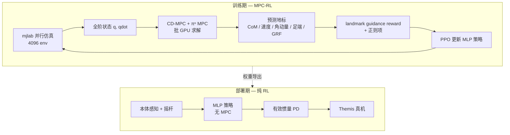

# MPC-RL（人形 Locomotion 与 Loco-Manipulation 的训练期 MPC 指导）

**MPC-RL**（*Accelerating and Scaling MPC-Guided Reinforcement Learning for Humanoid Locomotion and Manipulation*，arXiv:2606.05687，Caltech · JHU）提出：在 **大规模并行 RL 训练** 中嵌入 **质心动力学 MPC（CD-MPC）**，把预测轨迹转为 **landmark guidance reward** 监督 PPO；配套 **[πⁿ MPC](../methods/pi-mpc.md)** 实现 **无构造、并行于时域** 的 GPU 批 MPC，使长时域指导在训练内可行；**部署时仅运行学得的 MLP 策略**，无需在线 MPC。

## 一句话定义

**训练时让 MPC「画好未来地标」，RL 学全身跟踪；推理时 MPC 退场，策略单独上真机**——把物理预测结构写进奖励，而不是写进部署闭环。

## 英文缩写速查

| 缩写 | 英文全称 | 简要说明 |
|------|----------|----------|
| MPC-RL | MPC-Guided Reinforcement Learning | 训练期 MPC 轨迹指导、部署期纯 RL 的混合框架 |
| CD-MPC | Centroidal-Dynamics MPC | 以质心状态与接触力为决策变量的 MPC 模块 |
| PPO | Proximal Policy Optimization | 本文 on-policy 策略优化算法（rsl-rl） |
| CoM | Center of Mass | 质心位置，MPC 地标奖励核心量 |
| GRF | Ground Reaction Force | 地面反力，mpc_grf 软对齐 MPC 解 |
| ADMM | Alternating Direction Method of Multipliers | πⁿ MPC 底层并行求解框架 |

## 为什么重要

- **填补「训练期 MPC 指导」工程空白：** 残差 MPC+RL、离线轨迹库等多在 **部署期** 或 **离线库** 提供结构；MPC-RL 在 **每次 rollout** 在线解 CD-MPC，把 **长时域预测** 直接注入奖励，且部署 **无 MPC 延迟**。
- **可扩展的批 MPC：** 传统稀疏 QP / CusADi 式构造在长时域 × 数千环境时 **VRAM 与编译成本** 过高；πⁿ MPC 把时域作 batch 维 **GPU 并行 ADMM**，使 4096 env × 长 horizon 成为可训练配置。
- **从 locomotion 推到 loco-manipulation：** 除行走、推恢复、未知负重外，真机 **290 kg 推车**（约为机器人体重 829%）展示 MPC 接触/交互模型对 **操作任务** 的训练指导价值。
- **与 [MPC vs RL](../comparisons/mpc-vs-rl.md) 选型互补：** 不是「在线 MPC 还是 RL」，而是 **MPC 当训练教师、RL 当执行者** 的第三条混合轴。

## 方法

| 模块 | 作用 |
|------|------|
| **CD-MPC** | 质心状态 $\xi=[c,l_G,k_G]$；离散质心动力学 + CWC / 摩擦约束；Raibert 足端规划（loco-manip 可含手部接触） |
| **Landmark reward** | 从全轨迹取 $N_L$ 个预测地标；**prediction-confidence weighting** $\alpha=\{0.5,0.25,0.15,0.07,0.03\}$ 融合 CoM / 速度 / 角动量指数奖励 |
| **πⁿ MPC** | [π MPC](../methods/pi-mpc.md) 的时变扩展；PyTorch/JAX；velocity-form + 变量分裂 → 闭式并行 ADMM |
| **PPO 栈** | mjlab + rsl-rl；4096 env；200 Hz 物理 / 50 Hz 控制；非对称 actor–critic |
| **部署策略** | 关节位置增量 + 有效惯量 PD（$K_p=J_{\mathrm{eff}}\omega_n^2$）；actor 仅本体感知 + 命令 |

### 流程总览

### MPC 奖励块 vs Base-RL（locomotion）

| 信号 | Base-RL | MPC-RL |
|------|---------|--------|
| 线/角速度跟踪 | `lin_vel` / `ang_vel` 指数奖励 | 由 `mpc_com` / `mpc_lin_vel` 等 **MPC 地标** 替代 |
| 角动量 | `ang_mom_reg` 惩罚 | `mpc_ang_mom` 对 MPC 参考调节 |
| 足端 / 力 | — | `mpc_foot`（Raibert 落点）、`mpc_grf`（软对齐 MPC 接触力） |

## 实验要点（索引级）

| 轴 | 报告口径（以论文为准） |
|----|------------------------|
| **平台** | Themis 人形；mjlab 仿真训练 |
| **对比** | 纯 RL（同正则块）；MPC horizon / 更新率 / 奖励结构消融 |
| **仿真** | 时变速度跟踪、推恢复、约束满足：MPC-RL 优于纯 RL |
| **真机** | 跑步机行走；未知 10 kg 背心/载荷；推恢复；**290 kg 推车** |
| **求解器** | πⁿ MPC 相对 qpth / qpax / CusADi / consensus ADMM 的批扩展性与显存 |

## 常见误区或局限

- **误区：** 认为部署仍需在线 MPC；本文 **测试时无 MPC**，MPC 仅 **训练期奖励与 critic 特权信息**。
- **误区：** 把 landmark reward 等同于逐步 MPC 跟踪；**confidence weighting** 刻意 **降权远端地标**，避免质心模型失配拖累策略。
- **局限：** 主要在 **Themis** 验证；CD-MPC 为质心抽象，全身细节仍靠 RL + 正则；πⁿ MPC 针对 **线性化 CD-MPC**，非通用全身 NMPC 替代品。

## 与其他工作对比

| 工作 | 关系 |
|------|------|
| **残差 MPC + RL（部署期）** | 测试时 MPC 仍在环；MPC-RL **训练用、部署不用** |
| **离线轨迹库（Opt2Skill 等）** | 库覆盖有限；MPC-RL **在线交互式** 重算参考 |
| **[π MPC](../methods/pi-mpc.md)** | 算法基础；πⁿ MPC 加时变矩阵与 GPU 批实现 |
| **CusADi / qpth** | 需 QP 构造或编译；πⁿ MPC **construction-free** |

## 关联页面

- [π MPC](../methods/pi-mpc.md) — 并行于时域 ADMM 求解器与 πⁿ 扩展
- [Centroidal Dynamics](../concepts/centroidal-dynamics.md) — CD-MPC 预测模型
- [MPC vs RL](../comparisons/mpc-vs-rl.md) — 训练期指导的混合范式坐标
- [Loco-Manipulation](../tasks/loco-manipulation.md) — 推车等交互任务语境
- [Model Predictive Control](../methods/model-predictive-control.md) — MPC 基础
- [Reinforcement Learning](../methods/reinforcement-learning.md) — PPO 训练栈

## 参考来源

- [MPC-RL 论文摘录（arXiv:2606.05687）](../../sources/papers/mpc_rl_arxiv_2606_05687.md)
- [π MPC 论文摘录（arXiv:2601.14414）](../../sources/papers/pi_mpc_arxiv_2601_14414.md)
- [junhengl/mpc-rl 仓库](../../sources/repos/junhengl_mpc_rl.md)

## 推荐继续阅读

- [MPC-RL 论文（arXiv:2606.05687）](https://arxiv.org/abs/2606.05687)
- [π MPC 论文（arXiv:2601.14414）](https://arxiv.org/abs/2601.14414)
- [MPC-RL 演示视频](https://youtu.be/PrcbXkA1kYg)
- [junhengl/mpc-rl 代码](https://github.com/junhengl/mpc-rl)
