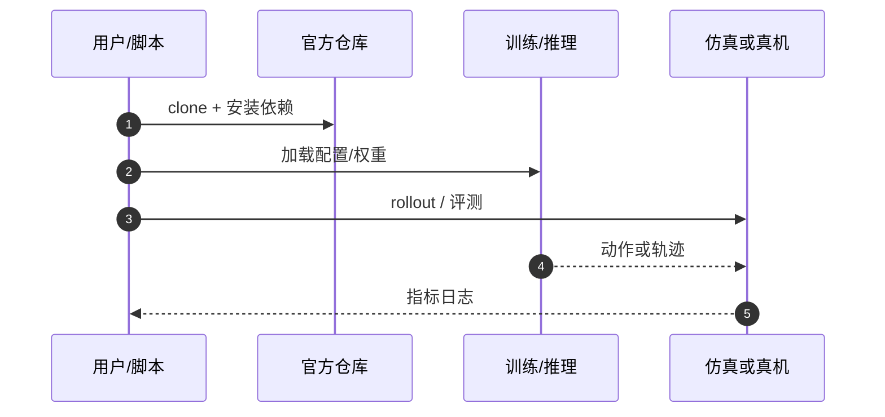

# MRSVLMRA（arXiv:2609.27816）

**Safe Multi-Robot Coordination via VLM-LLM Reasoning and Reachability Analysis**（[代码](https://github.com/TUM-CPS-HN/MRSVLMRA)，[arXiv:2609.27816](https://arxiv.org/abs/2609.27816)）来自 [具身智能小站 · 13 篇盘点](../../sources/blogs/wechat_embodied_13_papers_forgetmimic_2026-09-24.md)（2026-09-24）。

## 一句话定义

**感知不对称多机协作：有相机四足共享语义场景，LLM 分工，zonotope 可达性门拦截不安全语言建议。**

## 英文缩写速查

| 缩写 | 英文全称 | 简要说明 |
|------|----------|----------|
| VLA | Vision-Language-Action | 视觉–语言–动作策略 |
| RL | Reinforcement Learning | 强化学习 |
| TO | Trajectory Optimization | 轨迹优化 |
| HITL | Human-in-the-Loop | 人在回路 |

## 为什么重要

- 异构队里并非每台都有视觉；需把 VLM/LLM 高层语义与 **形式化安全门** 结合。
- 纳入 [13 篇技术地图](../overview/embodied-13-papers-technology-map.md) 阅读坐标。
- 开源结论（步骤 2.5，2026-09-24）：**已开源**。

## 核心机制

| 项 | 内容 |
|----|------|
| **arXiv** | [2609.27816](https://arxiv.org/abs/2609.27816) |
| **开源** | **已开源** |
| **要点** | VLM 场景理解 → LLM 任务分配；reachable tubes / zonotope 门验证执行边界。 |
| **文内指标** | Go2 + SVEA 异构设定（文内实验以 PDF 为准）。 |

## 源码运行时序图

## 实验与评测

- Go2 + SVEA 异构设定（文内实验以 PDF 为准）。
- **读法：** 公众号归纳；逐项 baseline 与协议以 arXiv PDF 为准。

## 与其他工作对比

- 横向索引见 [13 篇技术地图](../overview/embodied-13-papers-technology-map.md)。

## 结论

**语言规划必须过可达性过滤器** — 开源仓可复现协调栈骨架。

1. 开源边界：**已开源** — 以项目页/仓库实际链接为准（入库日 2026-09-24）。
2. 核心机制：VLM 场景理解 → LLM 任务分配；reachable tubes / zonotope 门验证执行边界。…
3. 部署前核对任务协议与硬件条件，勿直接横比公众号摘录数字。

## 关联页面

- [Autonomous Exploration](../tasks/autonomous-exploration.md)
- [Safety Filter](../concepts/safety-filter.md)
- [Vla](../methods/vla.md)
- [Embodied 13 Papers Technology Map](../overview/embodied-13-papers-technology-map.md)

## 参考来源

- [13 篇盘点（公众号）](../../sources/blogs/wechat_embodied_13_papers_forgetmimic_2026-09-24.md)
- [Safe Multi-Robot Coordination via VLM-LLM Reasoning and Reachability Analysis](../../sources/papers/mrsvlmra_arxiv_2609_27816.md)

## 推荐继续阅读

- [arXiv:2609.27816](https://arxiv.org/abs/2609.27816) — 原文
