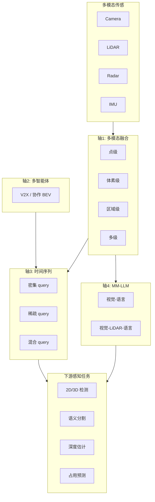

# MSFP Survey（具身 AI 多传感器融合感知）

**MSFP Survey**（*A Survey of Multi-sensor Fusion Perception for Embodied AI: Background, Methods, Challenges and Prospects*，Ruan et al.，[arXiv:2506.19769](https://arxiv.org/abs/2506.19769)，清华 / USTC / 合工大）从 **任务无关** 视角系统梳理具身 AI 中的 **多传感器融合感知（MSFP）**。本页为知识库独立详情节点（编译自 arXiv 摘要、公众号导读与公开元数据，非原文镜像）。

## 一句话定义

以四条技术轴（多模态 / 多智能体 / 时间序列 / MM-LLM）组织 MSFP 文献，帮助读者按 **融合粒度、通信成本与实时性** 选型，而不是只记单一 3D 检测 pipeline 名称。

## 英文缩写速查

| 缩写 | 英文全称 | 简要说明 |
|------|----------|----------|
| MSFP | Multi-Sensor Fusion Perception | 多传感器融合感知，本文主题 |
| LiDAR | Light Detection and Ranging | 激光雷达，输出稀疏 3D 点云 |
| BEV | Bird's-Eye View | 鸟瞰视角表征，常见于时序与多相机融合 |
| MM-LLM | Multi-Modal Large Language Model | 多模态大语言模型，用于感知-推理-规划 |
| V2X | Vehicle-to-Everything | 车路协同通信，多智能体融合典型场景 |
| IMU | Inertial Measurement Unit | 惯性测量单元，提供运动学约束 |

## 为什么重要

- 具身系统必须 **同时** 处理相机、LiDAR、雷达、IMU 等异构传感：单模态在光照、雨雾、遮挡下各有失效模式；MSFP 是 **补盲与降不确定性** 的基础设施。
- 既有综述常 **绑死自动驾驶 3D 检测** 或 **只讲 early/late fusion**；本文把 **协作感知、时序 query 与 MM-LLM** 纳入同一框架，对机器人导航、群体智能与 VLA 感知栈均有索引价值。
- 与本库 [Sensor Fusion](../concepts/sensor-fusion.md)（偏 **状态估计 / InEKF-VIO**）互补：MSFP Survey 覆盖 **语义/几何感知任务**（检测、分割、深度、占用）侧的多模态栈。

## 核心信息

| 字段 | 内容 |
|------|------|
| 机构 | 清华大学（Tsinghua）、中国科学技术大学（USTC）、合肥工业大学 |
| 年份 | 2025（arXiv v1: 2025-06-24） |
| 类型 | Survey |
| 开源状态 | 综述；无官方代码仓库 |
| 原文 | https://arxiv.org/abs/2506.19769 |

## 核心原理

### 四条技术轴（taxonomy）

| 轴 | 核心问题 | 典型粒度 / 范式 | 文内代表 |
|----|----------|-----------------|----------|
| **多模态融合** | 相机 + LiDAR + 雷达如何对齐特征 | 点 / 体素 / 区域 / 多级 | PointPainting、TransFusion、EPNet++ |
| **多智能体融合** | 遮挡/远距时如何借邻居传感补盲 | 中间特征交换、通信调度 | CoBEVT、V2VNet、HM-ViT、How2Com |
| **时间序列融合** | 单帧不足时如何利用历史 | 密集 / 稀疏 / 混合 BEV query | BEVFormer、StreamPETR、UniAD |
| **MM-LLM 融合** | 语言推理如何接入 3D 感知 | 视觉-语言 / 视觉-LiDAR-语言 | DriveVLM、OmniDrive、LiDAR-LLM |

### 流程总览

模块边界以原文 taxonomy 为准；上图固定 **四条轴 → 感知任务** 的阅读骨架。

### 背景层（文内覆盖）

- **传感器互补：** 相机语义 rich 但光照敏感；LiDAR 几何精确但稀疏且受天气影响；毫米波雷达测速好、轮廓稀疏。
- **数据集索引：** KITTI、nuScenes、Waymo Open、Argoverse、A*3D 等（规模、传感器配置与场景多样性）。
- **任务：** 检测、分割、深度、占用——MSFP 为下游规划/控制提供 **统一场景表征**。

## 工程实践

| 选型维度 | 建议读法 |
|----------|----------|
| **融合粒度** | 点级对齐成本高、细节好；体素/区域级更适合实时 BEV；多级融合鲁棒但算力大 |
| **时序范式** | 闭环低延迟优先 **稀疏 query**（StreamPETR/Sparse4D）；离线/多任务可用 **混合 query**（UniAD） |
| **协作感知** | 带宽受限时学 **何时/与谁通信**（When2Com/How2Com），而非全量特征广播 |
| **MM-LLM** | 可解释规划有价值，但 **点云-文本对齐** 与延迟是部署主瓶颈；常借 BEV 投影或 Q-Former 桥接 |
| **与状态估计分工** | MSFP 产出 **语义/几何感知**；[Sensor Fusion](../concepts/sensor-fusion.md) 产出 **位姿/速度/接触** — 栈内勿混为一谈 |

| 检查项 | 建议 |
|--------|------|
| 一手来源 | 方法名与数字以 [arXiv PDF](https://arxiv.org/abs/2506.19769) 为准 |
| 开源边界 | 综述；引用列表非复现包 |
| 本库定位 | 感知栈 taxonomy 枢纽；深入公式与表格读原文 |

## 源码运行时序图

**不适用**（文献综述；截至入库日无官方可运行代码仓库）。

## 实验与评测读法

- 综述条目关注 **分类框架与开放挑战**，不把引用数量当作方法排名。
- 对照具体方法时，对齐 **任务定义、传感器配置、融合粒度与延迟预算**，再比 mAP / NDS / IoU。
- 数据集章节可用于 **benchmark 选型**（城市 vs 高速、极端天气覆盖、多雷达配置等）。

## 结论

**MSFP Survey 应作为具身感知栈的「四条轴地图」阅读：先确定你的瓶颈是模态互补、协作补盲、时序记忆还是语言推理，再下钻到具体 fusion 粒度与方法族。**

- **任务无关组织** 是其最大价值——不只服务自动驾驶 3D 检测，也索引群体机器人与 MM-LLM 感知线。
- **多模态四粒度**（点/体素/区域/多级）决定算力与稀疏场景表现；**时序三范式**（密集/稀疏/混合 query）决定能否进实时闭环。
- **多智能体融合** 的关键tradeoff 是 **通信带宽 vs 遮挡补盲**；勿默认「特征全广播」最优。
- **MM-LLM 轴** 强调可解释规划，但部署要单独评估 **点云-语言对齐成本与端到端延迟**。
- 与 [Ultra-Fusion](../entities/paper-ultra-fusion-multi-sensor-slam.md) 等 **SLAM/定位** 工作正交互补：本文偏 **语义几何感知任务**，Ultra-Fusion 偏 **退化感知定位因子图**。
- 数值、分类边界与引用列表以 arXiv 原文为准；本页是编译索引。

## 局限与风险

- 综述 **截止日** 前的 MM-LLM 与 VLA 感知线迭代极快，读时需对照最新 arXiv 分支。
- 文内大量方法源自 **自动驾驶 benchmark**；迁移到 **人形/操作臂** 时需重标定传感器布局、延迟与控制频率。
- **勿把 MSFP 与状态估计融合混谈**：InEKF/VIO 解决 pose/velocity；MSFP 解决「场景里有什么、在哪里、占多少空间」。

## 与其他工作对比

| 维度 | MSFP Survey | [Sensor Fusion（概念）](../concepts/sensor-fusion.md) | [Ultra-Fusion SLAM](../entities/paper-ultra-fusion-multi-sensor-slam.md) |
|------|-------------|------------------------------------------------------|---------------------------------------------------------------------------|
| 层级 | 感知任务（检测/分割/占用） | 状态估计（pose/速度/接触） | 定位 SLAM（因子图） |
| 融合对象 | 相机+LiDAR+雷达 语义几何 | IMU+视觉+腿式里程计 | LiDAR+视觉+IMU+GNSS 退化调度 |
| 组织方式 | 四条技术轴 taxonomy | 方法族（VIO/InEKF/VILENS） | 单篇系统 + 基准 |
| 关系 | 感知栈总地图 | 控制栈上游状态输入 | 导航定位专项 |

## 关联页面

- [Sensor Fusion（状态估计侧）](../concepts/sensor-fusion.md)
- [具身感知六种空间表征](../concepts/embodied-perception-six-spatial-representations.md)
- [机器人视觉感知栈选型闭环](../queries/robot-perception-stack-selection-loop.md)
- [Ultra-Fusion（韧性多传感器 SLAM）](./paper-ultra-fusion-multi-sensor-slam.md)
- [Object Detection（方法）](../methods/object-detection.md)
- [Navigation / SLAM 栈概览](../overview/navigation-slam-autonomy-stack.md)

## 参考来源

- [msfp_survey_arxiv_2506_19769.md](../../sources/papers/msfp_survey_arxiv_2506_19769.md)
- [wechat_embodied_heart_msfp_survey_tsinghua_2026-09-22.md](../../sources/blogs/wechat_embodied_heart_msfp_survey_tsinghua_2026-09-22.md)

## 推荐继续阅读

- [arXiv:2506.19769](https://arxiv.org/abs/2506.19769) — 一手 PDF 与完整引用表
- [微信公众号导读](https://mp.weixin.qq.com/s/fLitz6CshVfAAQPQuusq4A) — 中文四条轴速读
