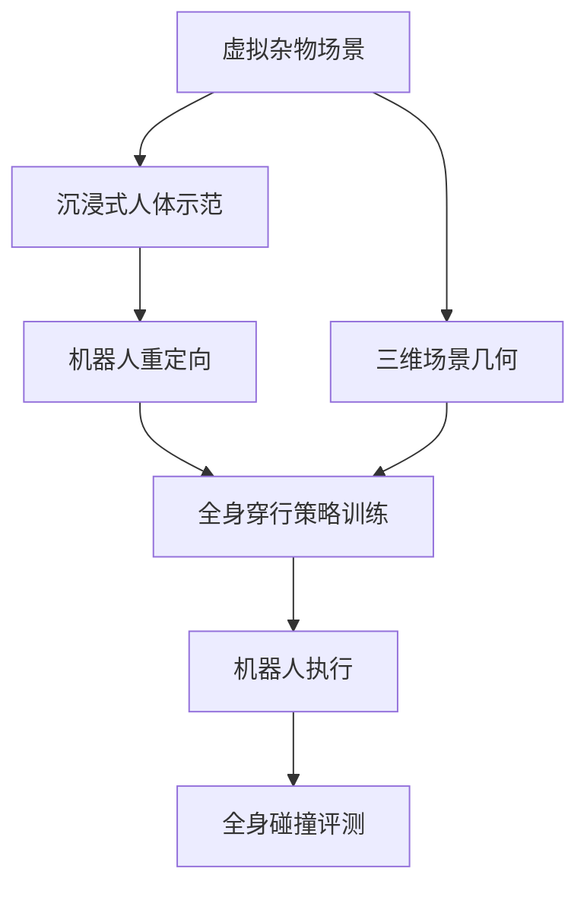

# Moving Through Clutter：场景感知的人形杂物穿行

**Moving Through Clutter（MTC）**（*Learning Scene-Aware Humanoid Locomotion through 3D Clutter from Immersive Human Demonstrations*，[arXiv:2609.21107](https://arxiv.org/abs/2609.21107)）研究人形如何在低矮结构和狭窄杂物空间中行走，同时避免头、躯干和四肢与环境碰撞。

## 一句话理解

把完整三维场景和沉浸式人类穿行示范结合起来，让策略考虑全身轮廓，而非只看脚下地面。

## 英文缩写速查

| 缩写 | 英文全称 | 简要说明 |
|---|---|---|
| MTC | Moving Through Clutter | 论文提出的学习框架 |
| G1 | Unitree G1 | 文章中的人形机器人平台 |

## 流程总览

以下按本页已归纳的机制与资料绘制，表示模块或阅读路径关系。

## 方法要点

- 在程序化虚拟杂物场景采集沉浸式人体示范。
- 将人体动作重定向到机器人，并结合场景几何训练行走策略。
- 文章报告 Unitree G1 在低矮障碍与狭缝穿行上的仿真和真机演示。

## 与相邻工作

MTC把[动作重定向](../concepts/motion-retargeting.md)与三维场景约束接入移动策略；这和主要针对足底落脚的感知 locomotion 形成补充。

## 参考来源

- [arXiv:2609.21107](https://arxiv.org/abs/2609.21107)
- [作者项目页](https://xutong05.github.io/publication/mtc/)
- [Day 2 文章来源索引](../../sources/blogs/humanoid_motion_intelligence_day2_locomotion_motion_priors_2026_10_03.md)

## 评测

文章报告 MTC-Challenge 无碰撞通过率约 70.2%，并展示 G1 低矮结构与狭缝穿行。

## 与其他工作对比

与主要关注足底落点的感知行走相比，MTC加入头、躯干和四肢周围的三维空间约束。

## 结论

MTC把三维场景几何和沉浸式动作示范用于全身穿行，而不只约束脚下落点。

## 关联页面

- [motion-retargeting](../concepts/motion-retargeting.md)
- [humanoid-locomotion](../tasks/humanoid-locomotion.md)
- [paper-deep-whole-body-parkour](./paper-deep-whole-body-parkour.md)
