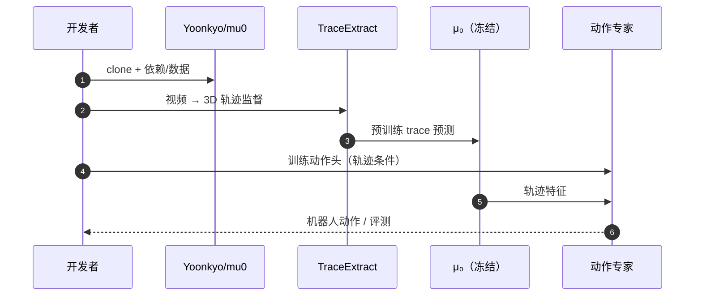

# μ₀（3D Interaction-Trace World Model）

**μ₀: A Scalable 3D Interaction-Trace World Model**（[arXiv:2606.13769](https://arxiv.org/abs/2606.13769)，[项目页](https://mu0-wm.github.io/)，[代码](https://github.com/Yoonkyo/mu0)，**IROS 2026 RoboWoMo Workshop 最佳论文**）由 **马里兰大学、首尔大学** 等提出：世界模型 **不预测稠密像素、也不直接回归具身动作**，而是预测 **关键交互点的 3D 轨迹**（物体/工具/手/接触区），用 **B 样条控制点 + 流匹配** 表示未来运动；**TraceExtract** 从人类/机器人视频自动构建 3D 监督。

## 一句话定义

**用 3D 交互轨迹当中间语言：上游 WM 只吃视频就能学物理变化，下游动作专家把轨迹特征映射到任意机器人——冻结 μ₀ 即可复用。**

## 英文缩写速查

| 缩写 | 英文全称 | 简要说明 |
|------|----------|----------|
| WM | World Model | 世界/动力学预测模型 |
| VLA | Vision-Language-Action | 视觉–语言–动作策略 |
| HOI | Hand–Object Interaction | 手–物交互区域 |
| WS | Workshop | RoboWoMo 研讨会 |

## 为什么重要

- 纳入 [IROS 2026 九篇获奖盘点](../../sources/blogs/wechat_iros_2026_awards_9_papers_2026-10-02.md)。
- 与像素 WM、action-labeled VLA 对照：**action-free 预训练** 仍报告与 **π₀** 等 **action 监督 VLA** 竞争的性能（论文主张）。
- **开源结论（2026-10-02）：已开源** — `Yoonkyo/mu0`。

## 核心机制

| 模块 | 作用 |
|------|------|
| **TraceExtract** | 选关键点 → 3D 跟踪对齐 → 运动事件 + 语言描述 |
| **μ₀ 骨干** | 预训练 VLM 上下文 + **trace expert** |
| **下游** | 冻结 μ₀；**动作专家** 输出具身控制 |

## 源码运行时序图

## 实验与评测

- 2D/3D trace 预测对比 **trace 专用模型与 tokenized VLM** 等基线（论文表格）。
- 下游：**trace-conditioned policy** vs **action-pretrained VLA**。

## 与其他工作对比

| 路线 | 预测/监督目标 | 与 μ₀ 差异 |
|------|---------------|------------|
| **像素 [生成式世界模型](../methods/generative-world-models.md)** | 稠密未来帧 | μ₀ 只预测关键交互点 3D 轨迹，目标更紧凑、与具身无关 |
| **action-labeled [VLA](../methods/vla.md)**（如 [π₀](./paper-pi0.md)） | 具身动作 | 需动作标注数据；μ₀ action-free 预训练，论文主张下游可与之竞争 |
| **trace 专用模型 / tokenized VLM** | 2D/3D trace | 论文表格中的 trace 预测基线 |
| **[HumanEgo](./paper-sa-2605-24934-humanego-zero-shot-robot-learning-from-minutes-o.md)**（同盘点） | 人类 ego 视频 → 直接策略 | μ₀ 走轨迹 WM → 动作专家再接地 |

## 结论

**μ₀ 把 world model 目标从像素换成 3D 轨迹，是跨具身数据缩放的一条中间路线** — TraceExtract 质量决定上限。

1. **已开源** 仓库含 TraceExtract + 训练入口；先读 README 数据许可。
2. **冻结 WM + 动作专家** 便于换机器人，但动作专家仍要 **具身数据或 sim**。
3. 与 **HumanEgo**（同盘点）对照：HumanEgo 走 **人类 ego → 直接策略**；μ₀ 走 **轨迹 WM → 再接地**。
4. 部署时关注 **关键点跟踪误差** 在接触阶段的累积。

## 关联页面

- [IROS 2026 九篇获奖地图](../overview/iros-2026-awards-9-papers-technology-map.md)
- [Generative World Models](../methods/generative-world-models.md)
- [HumanEgo](./paper-sa-2605-24934-humanego-zero-shot-robot-learning-from-minutes-o.md)

## 参考来源

- [IROS 2026 九篇获奖盘点（公众号）](../../sources/blogs/wechat_iros_2026_awards_9_papers_2026-10-02.md)
- [μ₀ sources 归档](../../sources/papers/mu0_wm_arxiv_2606_13769.md)
- [mu0 仓库归档](../../sources/repos/mu0.md)

## 推荐继续阅读

- GitHub：<https://github.com/Yoonkyo/mu0>
