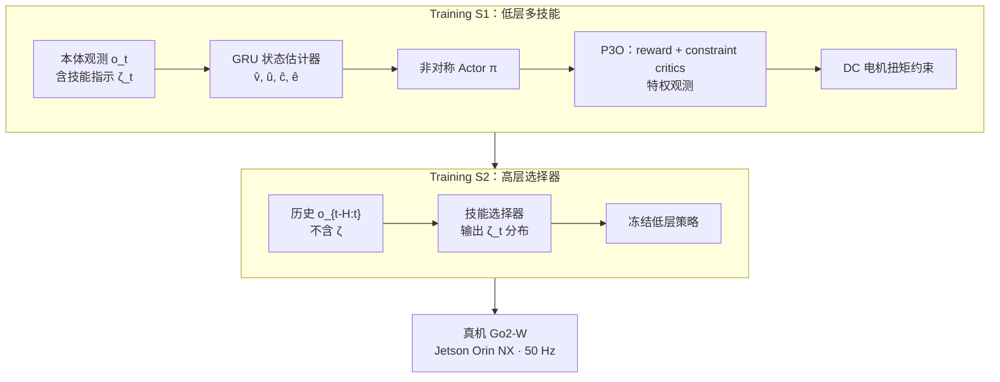

---

type: entity
tags: [paper, wheel-legged, quadruped, multi-skill, blind-locomotion, constrained-rl, p3o, sim2real, unitree-go2w, isaac-lab, unitree]
status: complete
updated: 2026-07-24
arxiv: "2605.13058"
venue: ICRA 2026
project: https://hyzenthlayer.github.io/mujica/
related:
  - ../concepts/wheel-legged-quadruped.md
  - ../concepts/sim2real.md
  - ../tasks/hybrid-locomotion.md
  - ../tasks/locomotion.md
  - ./quadruped-robot.md
  - ./unitree.md
  - ./robot-lab.md
  - ./dreamwaq-plus.md
  - ./paper-aware-wheeled-legged-reflexive-evasion.md
sources:
  - ../../sources/papers/mujica_arxiv_2605_13058.md
  - ../../sources/papers/aware_arxiv_2604_23761.md
summary: "MUJICA（arXiv:2605.13058，ICRA 2026）在 Unitree Go2-W 上用单一本体策略联合全向移动、高台攀爬与摔倒恢复，以 DC 电机硬约束 P3O 与高层技能选择器实现安全零样本 sim2real 与自主模态切换。"
---

# MUJICA：轮足多技能统一本体控制架构

**MUJICA**（*Multi-skill Unified Joint Integration of Control Architecture*，arXiv:2605.13058，**ICRA 2026**）面向 **轮足四足** 的 **纯本体感知** 控制：在 **单一低层策略** 内联合学习 **全向移动、高台攀爬、摔倒恢复** 三类差异巨大的技能，并以 **速度相关 DC 电机硬约束**（P3O）保障真机安全，再用 **高层技能选择器** 仅依本体反馈自动切换技能。在 **Unitree Go2-W** 上实现零样本 sim2real，报告 **1 m 室内高台** 与无人工干预的连续多技能任务链。

## 英文缩写速查

| 缩写 | 英文全称 | 简要说明 |
|------|----------|----------|
| MUJICA | Multi-skill Unified Joint Integration of Control Architecture | 本文提出的轮足多技能统一控制框架 |
| RL | Reinforcement Learning | 通过与环境交互最大化长期回报来学习策略的范式 |
| PPO | Proximal Policy Optimization | 足式 locomotion 中最常用的 on-policy 策略梯度算法 |
| P3O | Penalized Proximal Policy Optimization | 将安全约束并入 PPO 的惩罚式约束 RL 框架 |
| C-POMDP | Constrained Partially Observable Markov Decision Process | 带约束的部分可观测 MDP，本文问题形式化 |
| Sim2Real | Simulation to Real | 把仿真中学到的策略迁移落地真机的工程主线 |
| IMU | Inertial Measurement Unit | 惯性测量单元，提供加速度与角速度 |
| GRU | Gated Recurrent Unit | 门控循环单元，用于历史本体序列编码 |
| DC | Direct Current | 直流电机；本文强调速度–扭矩包络约束 |

## 为什么重要

- **轮足「多技能单策略」：** 相对 MoE 蒸馏或手工切换，用 **技能指示变量 $\zeta_t$** 在同一 Actor 内解耦异构动力学（滚动 vs 翻转恢复 vs 高台钩挂），避免专家动作冲突。
- **电机包络即安全层：** 将 **低速恒扭矩、高速线性降额**（及小腿位置相关上限）写成 **P3O 硬约束**，把违规率从 **>90%** 压到 **<3.5%**，并避免真机高台攀爬时大腿顶限引发过流保护——这是轮足极限机动常被忽视的 sim2real 细节。
- **盲走 + 环境推断：** 状态估计器同时预测 **线速度、轮–地距离、分段碰撞概率**，比仅估速度或隐变量的 DreamWaQ 类基线在轮足多任务上更稳（论文 Fig. 4）。
- **自主技能编排：** S2 阶段在冻结低层上训练选择器，链式任务（楼梯恢复→楼梯攀爬→高台）成功率 **91%**，优于无 indicator 的奖励工程方案（TABLE III）。

## 流程总览

## 核心机制（归纳）

### 1）问题形式化与动作空间

- 建模为 **C-POMDP**：最大化回报同时满足接触、碰撞、**DC-motor** 等约束期望上限。
- **观测：** IMU 角速度/重力、速度指令、关节位姿/速度、上一步动作、$\zeta_t$。
- **动作：** 腿关节为相对默认姿态的角度偏移经 **PD** 得扭矩；轮关节为 **期望角速度** 经阻尼控制——显式区分 **滚动模态** 与 **摆动模态**。

### 2）状态估计器

- 对过去 **H=6** 帧本体经 GRU 编码，监督预测：**基座线速度**、**轮–地距离**（平坦抑制抬腿）、**thigh/calf 碰撞概率**（用头/身碰撞感知台沿）、**隐变量**（SwAV 对比学习，参考 HIM）。
- 消融显示三项估计 **缺一不可**；去速度估计对非恢复任务伤害最大。

### 3）多任务奖励与 DC 约束

| 技能 | 主要奖励 | 约束要点 |
|------|----------|----------|
| 全向移动 | 线速度 + 角速度跟踪 | DC 电机、thigh/calf 碰撞（鼓励用轮接触） |
| 高台攀爬 | 线速度跟踪 | 同上；需轮–腿协同「钩挂–抬升」 |
| 摔倒恢复 | 重力对齐 + 站立姿态 | 同上；任意初始姿态翻转 |

- **DC 约束：** 按电机手册的速度–扭矩曲线裁剪；无约束时仿真可「暴力跳台」，真机会 **大腿顶限大扭矩** 触发保护（Fig. 6）。

### 4）两阶段训练与课程

- **S1：** $33\times 20$ 多任务网格（楼梯/坡/离散/粗糙/坑洞），每行固定任务与 $\zeta$；30k 迭代。
- **S2：** 冻结低层，选择器在统一速度指令下自主学习 $\zeta$；10k 迭代。
- **域随机化：** 摩擦、质量、外力、推搡、电机增益等（TABLE II）；**4096** 并行 Isaac Lab 环境。

## 实验与评测

- **单技能：** 5 类 OOD 任务 × 10 难度，全面优于 DreamWaQ+P3O 与 Vanilla PPO。
- **连续任务：** 技能选择器 95% / 95% / 91%（三阶段），显著高于无 indicator 基线。
- **真机：** 30° 楼梯恢复、不规则 20 cm 楼梯、**80 cm 户外 / 100 cm 室内高台**；IROS 2025 四足挑战赛演示；电机保护全程未触发。

## 结论

**轮足极限机动的可部署解，是「单 Actor + 技能指示 ζ + DC 电机硬约束」，而不是更大扭矩或无约束的暴力跳台。**

1. **P3O 把电机包络写成硬约束** — 违规率从 >90% 压到 <3.5%，避免真机高台时大腿顶限过流保护；无约束仿真「能跳」不等于真机能上。
2. **三技能共用低层、选择器只管 ζ** — 全向移动 / 高台攀爬 / 摔倒恢复用同一策略；S2 链式任务成功率 95%/95%/91%，优于无 indicator 奖励工程。
3. **盲走靠轮–地距离与碰撞估计** — GRU 估速度、轮–地距离、thigh/calf 碰撞概率，缺一不可；无需外感知也能推断台沿。
4. **真机读点对齐极限场景** — Go2-W 零样本：30° 楼梯恢复、不规则 20 cm 楼梯、80 cm 户外 / 100 cm 室内高台；电机保护全程未触发。
5. **别和 AWARE / MoE 混读** — AWARE 是外源障碍反射避障；本文是攀爬/恢复统一盲走。多技能用离散 ζ，避免 MoE 加权平均冲突动作。

## 常见误区

1. **「轮足高台靠更大扭矩就行」：** 忽略 **速度–扭矩包络** 会在顶限关节产生危险脉冲；MUJICA 用约束换 **可部署的极限性能**。
2. **「多技能 = MoE 加权混合」：** 本文强调 **单 Actor + 离散 $\zeta$**，避免左右转等冲突动作的加权平均。
3. **「盲走做不了高台」：** 通过 **轮–地距离 + 碰撞估计** 推断台沿与接触，无需外感知传感器。
4. **「技能切换靠人工规则」：** S2 选择器仅本体历史即可在倒地/平地/台面前切换，适合非结构化连续任务。

## 与其他工作对比

| 路线 | 感知 | 多技能方式 | 轮足极限机动 |
|------|------|------------|--------------|
| **MUJICA** | 纯本体 | 单策略 + $\zeta$ + 选择器 | **1 m 高台、摔倒恢复** |
| [AWARE](./paper-aware-wheeled-legged-reflexive-evasion.md) | 动捕障碍状态 | 高层 RAR + **双专家硬切换** | **高动态反射避障**（M20；非攀爬） |
| [DreamWaQ++](./dreamwaq-plus.md) | 点云 + 本体 | 单任务障碍感知 | 四足楼梯/OOD，非轮足高台 |
| MoE-loco / 混合专家 | 本体 | 门控多专家 | 步态切换为主 |
| Chamorro ICRA'24 盲楼梯 | 本体 + 地形布尔 | 双任务指示 | 楼梯攀爬，非统一三技能 |
| Science Robotics 轮足导航 | 感知导航栈 | 学习与导航耦合 | 强调自主导航而非极限攀爬 |
| [SWAP](./paper-swap-parkour.md) | 深度 + RSSM WM | 单任务跑酷 WM | **纯四足** 1.63 m 攀台（非轮足）；对照「高台」不同机体与感知栈 |

## 参考来源

- [MUJICA（arXiv:2605.13058）](../../sources/papers/mujica_arxiv_2605_13058.md)
- Li et al., *MUJICA: Multi-skill Unified Joint Integration of Control Architecture for Wheeled-Legged Robots* (ICRA 2026)
- [项目页](https://hyzenthlayer.github.io/mujica/)

## 关联页面

- [轮足四足机器人](../concepts/wheel-legged-quadruped.md)、[Hybrid Locomotion](../tasks/hybrid-locomotion.md)、[Locomotion](../tasks/locomotion.md)
- [Sim2Real](../concepts/sim2real.md) — 零样本部署与域随机化
- [四足机器人](./quadruped-robot.md)、[Unitree](./unitree.md)、[robot_lab](./robot-lab.md)（Go2W 仿真入口）
- [DreamWaQ++](./dreamwaq-plus.md) — 四足感知 loco 对照；本文走 **盲走 + 轮足异构技能**
- [AWARE](./paper-aware-wheeled-legged-reflexive-evasion.md) — 同轮足形态，任务轴为 **外源快速障碍反射规避**（非攀爬/恢复）

## 推荐继续阅读

- [arXiv:2605.13058](https://arxiv.org/abs/2605.13058) — 全文与消融
- [MUJICA 项目页](https://hyzenthlayer.github.io/mujica/) — 真机视频（高台、技能切换、IROS 2025 挑战）
- Lee et al., Science Robotics 2024（轮足导航）— 轮足 RL 另一条主线
- Zhang & Wang, ARIS 2024 — 轮足盲走 MoE 对照
