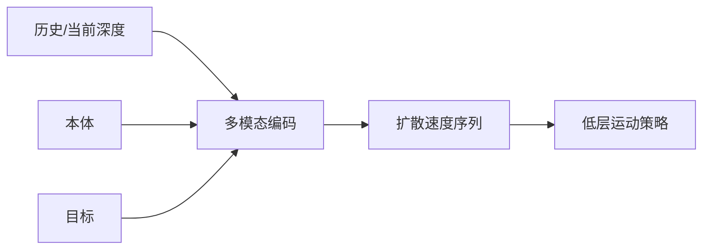

# MulDP：四足跑酷自主导航扩散策略

**MulDP**（[arXiv:2609.03984](https://arxiv.org/abs/2609.03984)）由 **复旦大学智能机器人与先进制造学院** 提出（公众号周更 ingest 见 [策展索引](../../sources/blogs/wechat_shenlan_weekly_papers_2026-09-04.md)）。

## 一句话定义

四足跑酷导航要 **提前加速、细调速度**——MulDP 用扩散直接出 **时序连贯的速度命令**，而不是只避障 waypoint。

## 英文缩写速查

| 缩写 | 英文全称 | 简要说明 |
|------|----------|----------|
| MulDP | Multimodal Diffusion Policy | 本文多模态扩散导航策略 |
| QPND | Quadruped Parkour Navigation Dataset | 宣称首个跑酷导航多模态集 |
| DME | Decision Memory Encoder | 近 5 步规划记忆编码器 |

## 为什么重要

模块化建图规划难做 **动态跑酷**；纯视觉 waypoint 与 **机身几何/动力学** 脱节；E2E RL/VLA 成本高。

## 核心信息

| 项 | 内容 |
|----|------|
| **机构** | 复旦大学智能机器人与先进制造学院 |
| **开源** | 见 [工程实践](#工程实践) |

## 核心原理

三编码器：历史深度+本体 Transformer、当前深度 CNN、决策记忆 MLP；条件扩散 denoise **未来速度 horizon**；5 Hz 重规划，首命令送低层 locomotion policy。QPND 在 Isaac Sim 采集+增广。

### 流程总览

## 源码运行时序图

**不适用** — 截至 **2026-09-07** 无可运行官方代码（或本文为硬件/协议类工作）。

## 工程实践

| 项 | 说明 |
|----|------|
| 开源状态 | 见论文摘录与项目页核查结论 |
| 复现入口 | 以 arXiv 为准 |

## 实验与评测

| 指标 | MulDP | NavDP* |
|------|-------|--------|
| SR | **89.7%** | 59.0% |
| w/o 本体 | 69.5% | — |
| w/o DME | 7.4% SR | — |

## 结论

跑酷导航需要 **本体+决策记忆+扩散时序**；QPND 与 MulDP 是四足 **自主穿越** 方向的实用组合。

1. 可与全局规划器叠用。
2. 消融：去 DME 几乎不收敛到目标。
3. 真机实验论文宣称有效（见原文）。
4. **QPND 未见公开下载**。
5. **代码未开源**。

## 局限与风险

依赖仿真数据与特定低层 policy；泛化地形未完全展开。

## 关联页面

- [locomotion](../tasks/locomotion.md)
- [diffusion-policy](../methods/diffusion-policy.md)
- [paper-contact-guided-exploration-locomanipulation.md](./paper-contact-guided-exploration-locomanipulation.md)

## 参考来源

- [muldp_arxiv_2609_03984.md](../../sources/papers/muldp_arxiv_2609_03984.md)
- [公众号周更 21 篇索引](../../sources/blogs/wechat_shenlan_weekly_papers_2026-09-04.md)

## 推荐继续阅读

- [https://arxiv.org/abs/2609.03984](https://arxiv.org/abs/2609.03984)
