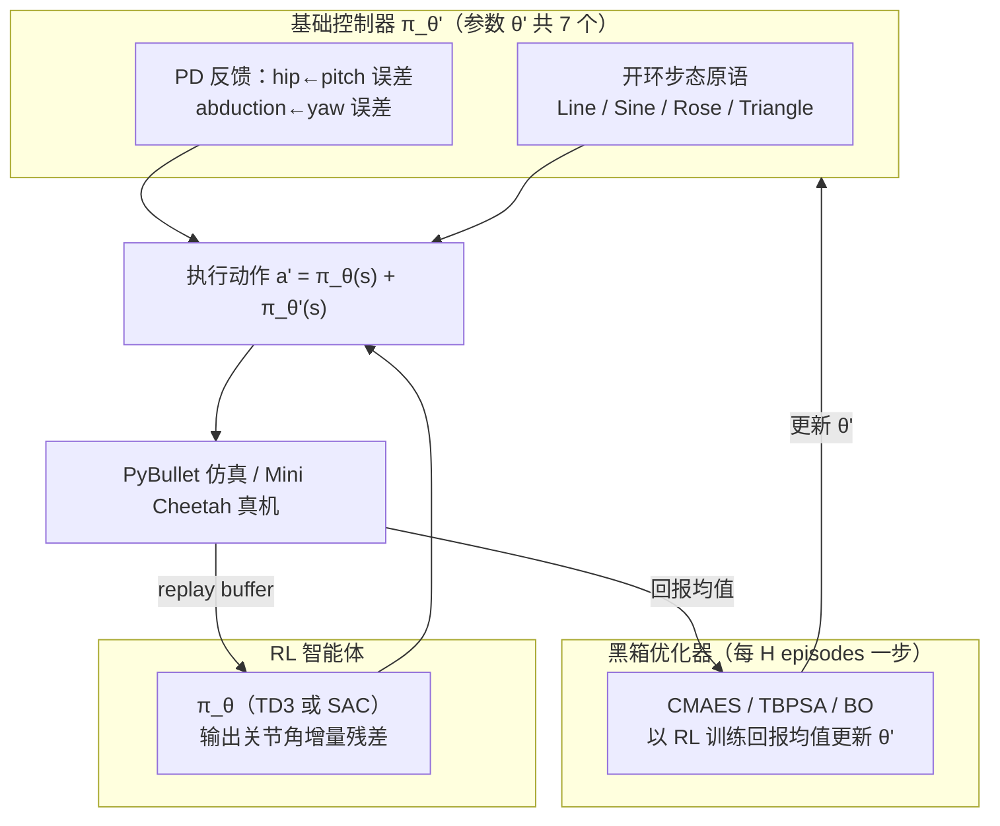
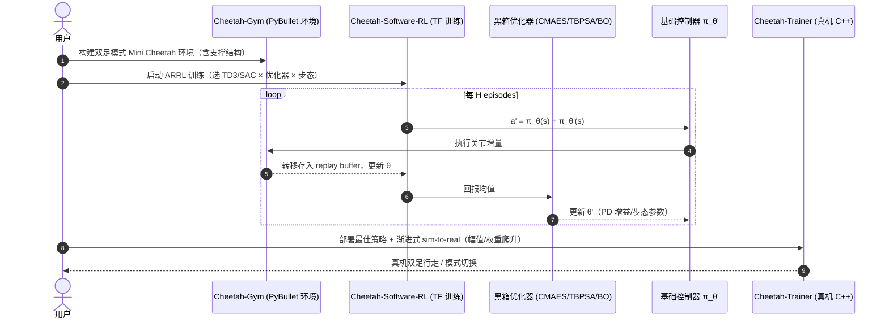

# Multi-Modal Legged Locomotion Framework with Automated Residual RL（ARRL，RA-L/IROS 2022）

**Multi-Modal Legged Locomotion Framework with Automated Residual Reinforcement Learning**（Chen Yu、Andre Rosendo，上海科技大学，IEEE RA-L / IROS 2022，[arXiv:2202.12033](https://arxiv.org/abs/2202.12033)，[项目页](https://chenaah.github.io/multimodal/)，代码三仓：[Cheetah-Gym](https://github.com/Chenaah/Cheetah-Gym) / [Cheetah-Software-RL](https://github.com/Chenaah/Cheetah-Software-RL) / [Cheetah-Trainer](https://github.com/Chenaah/Cheetah-Trainer)）让市售四足机器人（Mini Cheetah）通过**轻量机械改造 + 手工过渡动作序列**获得双足行走能力，并提出 **ARRL**：基础控制器不再手调参数，而是由黑箱优化器与 RL 残差**同步**训练——Residual RL 的「自动化」变体。

## 英文缩写速查

| 缩写 | 英文全称 | 简要说明 |
|------|----------|----------|
| ARRL | Automated Residual Reinforcement Learning | 本文算法：base 控制器参数由优化器自动训练 + RL 学残差 |
| TD3 | Twin Delayed DDPG | 确定性 off-policy RL；本任务最优组合成员 |
| SAC | Soft Actor Critic | 随机性 off-policy RL；本任务陷入局部最优 |
| CMAES | Covariance Matrix Adaptation Evolution Strategy | 黑箱参数优化器之一（仿真组合最优） |
| TBPSA | Test-Based Population Size Adaptation | pcCMAES 变体优化器 |
| BO | Bayesian Optimisation | 高斯过程黑箱优化器；sim-to-real 后真机表现最佳族 |
| IK | Inverse Kinematics | 过渡动作与步态原语生成中的足端→关节换算 |
| CoM | Center of Mass | 过渡序列中始终投影在等效足域中心 |
| ZMP | Zero-Moment Point | 传统双足判据，文中作为手工建模脆弱性的反面对照 |

## 为什么重要

- **Residual RL 的「去手调」一步**：经典 Residual RL 仍需人工设计并调节 base 控制器；ARRL 把 base（PD 反馈 + 开环步态原语，7 个参数）交给黑箱优化器与 RL 残差同步训练——「连基础控制器也不用调」。
- **硬件-算法协同的多模态方案**：一个 3D 打印支撑 stick（四足模式不影响、双足模式提供支撑多边形）+ IK 过渡序列，把「四足改双足」的成本压到轻量低价。
- **诚实的能力边界数据**：论文给出仿真 vs 真机的完整对照——ARRL 仿真最强（≈4000 vs 纯 TD3 2580），但直迁真机 reality gap 巨大（纯 TD3 真机仅 31 回报/0.04 m），渐进式 sim-to-real 策略后纯黑箱优化器反而真机得分最高。这组数据是评估「残差方法真机迁移」的重要参照。
- **回答「哪些阶段需要多强的残差」**：步态原语设计（Line 明显差于 Sine/Rose/Triangle）直接决定 ARRL 上限，说明 base 结构仍主导最终能力。

## 核心原理（方法）

### ARRL 同步训练结构

- **base 参数**：$\theta'=\{A/\omega,\omega,K_{pp},K_{dp},K_{py},K_{dy},\delta_x\}$（步态幅频 + 两组 PD 增益 + 步长），随机初始化后由优化器按 $H$ 个 episode 的 RL 训练回报均值更新——即「用 RL 的探索-利用综合表现来调 base」。
- **非平稳性处理**：SAC/TD3 假设 MDP 平稳，故优化器更新频率低于 RL（每 $H$ episode 一步），近似「短期动力学不变」。
- **动作**：8 个关节（前腿 abduction×2、全髋×4、后腿膝×2）的位置增量，乘以增益 $k_a$。
- **奖励**：$r=\text{height}-0.25\max(|a_{front}|)+\text{distance}-\text{cost}_l+0.5$（走得远、能耗低、存活奖励）。

### 渐进式 Sim2Real 策略

部署时不直接全量执行：步态幅值 $A$ 与 base 权重 $k_2t$ 在满足 pitch 误差阈值（0.15 / 0.35）的前提下**渐进爬升**至设定值——先让上肢闭环稳定，再逐步放开腿部动作，显著改善真机平衡。

## 实验与评测

- **仿真基线**：纯 SAC 1097.23（局部最优），纯 TD3 2580.14；纯黑箱优化器介于两者之间（Rose 步态 + CMAES 最高）。
- **ARRL（仿真）**：除「TD3+Line」外，六组 ARRL 组合均优于对应纯 RL；**TD3+CMAES+Rose ≈ 4000** 为全局最优；Line 步态各法皆差 → 步态原语设计主导上限。
- **真机直迁（Table I）**：reality gap 巨大——纯 TD3 真机 31.23（0.04 m）vs 仿真 2580.14；ARRL 各组合同样低位（多数 <0.5 m）。
- **渐进 sim-to-real（Table II）**：4 组 ARRL 行走 >1 m（TD3+CMAES+Triangle 2.47 m、TD3+BO+Triangle 2.01 m 等）；**纯黑箱优化器真机总分反而最高**（CMAES+Rose 4.75 m）——作者明示 ARRL 仿真最优、真机迁移性「很好但非最佳」。
- **模式切换**：支撑结构四足模式无影响、双足模式提供支撑多边形；过渡与逆过渡序列真机均可行。

## 源码运行时序图

官方代码三仓（项目页 Code 区）：[Cheetah-Gym](https://github.com/Chenaah/Cheetah-Gym)（PyBullet 环境）、[Cheetah-Software-RL](https://github.com/Chenaah/Cheetah-Software-RL)（TF 训练/测试）、[Cheetah-Trainer](https://github.com/Chenaah/Cheetah-Trainer)（真机 TF/C++）+ 支撑结构 STL。

- **复现要点**：TF1 时代训练栈；真机端依赖 MIT Cheetah-Software 系控制框架改造，需核对自己平台的电机/通信接口。

## 结论

**ARRL 把 Residual RL 的最后一个手调环节（base 控制器参数）也自动化了：黑箱优化器调 base、RL 学残差、两者以「H episodes 为节拍」同步。仿真上它全面超过纯 RL 与纯优化器；真机上则要靠渐进式权重爬升，且纯优化器 base 反而更稳——base 结构（步态原语）比学习算法更决定上限。**

1. **最优配方（仿真）** — TD3 + CMAES + Rose 步态 ≈ 4000 回报；SAC 的熵正则在本任务注入过多噪声，全线偏弱。
2. **步态原语是第一瓶颈** — Line 步态下所有方法表现接近且都差；换 Sine/Rose/Triangle 后差距立现。选 base 结构优先于选 RL 算法。
3. **真机读法要分两表** — Table I（直迁）证明 reality gap 严重；Table II（渐进策略）才是部署数字：4 组 ARRL >1 m，Triangle 步态迁移性最好（水平抬脚留误差容限）。
4. **同步训练的非平稳性要显式处理** — 优化器低频更新（每 H episodes）维持近似平稳假设；高频联动会破坏 SAC/TD3 的 MDP 假设。
5. **渐进式部署策略可复用** — 「幅值与 base 权重按误差阈值爬升」的思路可移植到其他残差系统的真机上线流程。

## 常见误区或局限

- **仿真最优 ≠ 真机最优**：ARRL 仿真领先，但渐进 sim-to-real 后纯黑箱优化器真机得分更高；引用该文支持「残差方法真机优势」需谨慎。
- **双足性能有限**：行走距离米级、20 秒 episode；与专用双足平台（Cassie/Atlas）的敏捷性不可比——价值在「四足平台低成本多模态」而非双足性能本身。
- **机械改造前提**：需要安装支撑结构（附 STL）；无改造的四足平台不适用。
- **纯 TD3 真机崩盘（0.04 m）** 说明仿真训练缺乏随机化/鲁棒化设计；论文未用 domain randomization。

## 与其他工作对比

| 维度 | ARRL | [Residual RL（Johannink）](./paper-residual-rl-robot-control.md) | [Versatile Jumping](./paper-versatile-jumping-action-residuals.md) |
|------|------|------------------------------------------------------------------|---------------------------------------------------------------------|
| base 参数来源 | **优化器自动训练** | 人工设计 | 人工设计（单质点控制器） |
| RL 算法 | TD3/SAC | TD3 | ARS |
| base 更新频率 | 每 H episodes | 固定 | 固定 |
| 平台 | Mini Cheetah（四足改双足） | Sawyer 臂 | Go1 |
| 开源 | 已开源（三仓） | 未开源 | 未开源 |

## 关联页面

- [Residual Policy Learning 方法页](../methods/residual-policy-learning.md)
- [Residual RL（Johannink）](./paper-residual-rl-robot-control.md)
- [Versatile Jumping](./paper-versatile-jumping-action-residuals.md)
- [Locomotion](../tasks/locomotion.md)
- [Reinforcement Learning](../methods/reinforcement-learning.md)

## 推荐继续阅读

- 项目页（切换/行走视频 + 代码入口）：<https://chenaah.github.io/multimodal/>
- 代码三仓：<https://github.com/Chenaah/Cheetah-Gym> · <https://github.com/Chenaah/Cheetah-Software-RL> · <https://github.com/Chenaah/Cheetah-Trainer>

## 参考来源

- [Residual Policy / Residual RL 论文精读清单摘录](../../sources/personal/residual-policy-reading-list.md)
- [multimodal 项目页归档](../../sources/sites/multimodal-chenaah-github-io.md)
- [Cheetah-Trainer 代码仓库归档](../../sources/repos/cheetah-trainer.md)
- Yu & Rosendo, *Multi-Modal Legged Locomotion Framework with Automated Residual Reinforcement Learning*, IEEE RA-L / IROS 2022. <https://arxiv.org/abs/2202.12033>
