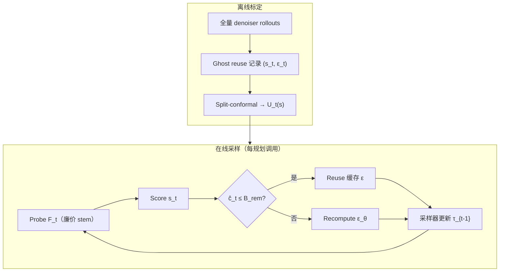

# Muninn（轨迹扩散免训练加速）

**Muninn**（*Your Trajectory Diffusion Model But Faster*，arXiv:2605.09999，[RSS 2026](https://arxiv.org/abs/2605.09999)，[代码](https://github.com/gokulp01/Muninn)）是 UIUC 等提出的 **training-free 缓存包装器**：在 **不改 denoiser 权重、不重训** 的前提下，用 **廉价 probe 特征** 与 **DDPM/DDIM 采样器解析灵敏度** 估计逐步复用风险，经 **split-conformal 标定** 形成 **轨迹偏差预算**，在线选择性 **复用或重算** denoiser，使状态空间轨迹扩散规划器与 [Diffusion Policy](../methods/diffusion-policy.md) 类策略逼近 **全量计算教师** 的同时显著降延迟。

## 一句话定义

**把轨迹扩散的去噪链当作可预算的「记忆复用」问题**——用 probe 变化预测复用误差、用采样器系数放大到最终轨迹偏差，在用户给定的 $(\eta_{\mathrm{traj}}, \alpha)$ 证书下跳过冗余 forward。

## 英文缩写速查

| 缩写 | 英文全称 | 简要说明 |
|------|----------|----------|
| DDPM | Denoising Diffusion Probabilistic Models | 概率扩散采样；Muninn 解析 $K_t, L_t'$ 灵敏度系数 |
| DDIM | Denoising Diffusion Implicit Models | 确定性扩散采样变体，同样可写出仿射更新 |
| D4RL | Datasets for Deep Data-Driven Reinforcement Learning | 离线 RL 基准套件；论文主要仿真评测之一 |
| DP | Diffusion Policy | visuomotor 扩散策略家族；Table III 加速对象 |
| RL | Reinforcement Learning | 离线轨迹扩散规划常作条件策略/轨迹优化器 |

## 为什么重要

- **部署瓶颈的共性解法**：轨迹扩散规划（[Diffuser](https://github.com/jannerm/diffuser) 等）与操作 [Diffusion Policy](../methods/diffusion-policy.md) 都受 **逐步 denoiser 调用** 制约；Muninn 提供 **模型无关** 包装层，而非为每个骨干重训蒸馏网。
- **风险可解释**：相对 FixedSkip / FewSteps 等 **不算误差传播** 的 inference 捷径，Muninn 用 conformal 上界 + 灵敏度加权，给出 **轨迹偏离概率证书**（相对全量教师）。
- **与训练期加速正交**：可与 **蒸馏少步采样器、窄网络** 叠加（论文 DP3 实验）；适合「已有大教师、先要实时」的工程路径。
- **开源可复现**：[`gokulp01/Muninn`](https://github.com/gokulp01/Muninn) 提供 `muninn` 核心包与 **~90 行 Diffuser 适配器**，覆盖 calibrate → eta 选择 → eval 全管线。

## 核心结构

| 模块 | 作用 |
|------|------|
| **Probe $\Psi$** | 仅跑 denoiser **stem**（或注意力前缀），得 $F_t \in \mathbb{R}^{d_F}$ |
| **Score $s_t$** | $\|F_t - F_{t+1}\|_1 / (\|F_{t+1}\|_1 + \omega)$，衡量表示是否已稳定 |
| **灵敏度 $L_t$** | 由采样器仿射系数递推：$\|\Delta_0\| \leq \sum_t L_t \|e_t\|$ |
| **Conformal $U_t(s)$** | 离线 ghost-reuse 标定 $(s_t, \epsilon_t)$，得高概率 $\|e_t\|$ 上界 |
| **预算策略** | 若 $\Gamma L_t U_t(s_t) \leq B_{\mathrm{rem}}$ 则 reuse 缓存噪声预测，否则 recompute |
| **用户旋钮** | $\eta_{\mathrm{traj}}$：偏差容忍；$\alpha$：全局风险；前后若干步 **禁止 reuse** |

### 流程总览

### 评测覆盖（索引级）

| 家族 | 代表模型 | 主要指标 |
|------|----------|----------|
| 离线 RL 轨迹规划 | Diffuser, Dec. Diff., Diff-QL, AdaptDiff | D4RL 归一化分、延迟、evals/step、$\hat{p}_{\mathrm{viol}}$ |
| 构型空间运动规划 | MPD, EDMP | 成功率、碰撞率、延迟 |
| Visuomotor 策略 | Diffusion Policy, DP3 | 成功率、每步推理延迟 |
| 真机闭环 | GC-Diffuser, BCOD, Diffusion Policy | ASV / Crazyflie / SO-ARM100 航点与操作 |

论文报告最高约 **4.6×** 墙钟加速（因模型与 $\eta$ 而异），任务指标与 Full 教师 **基本持平**，硬件上在相近成功率下延迟约 **减半至 1/3**。

## 常见误区或局限

- **误区：Muninn 是新的扩散规划器** — 它是 **wrapper**；行为上逼近 **原教师**，教师不安全则 Muninn 也不自动变安全。
- **误区：证书等于碰撞保证** — 界的是 **与全量采样的轨迹距离**；接触、约束、闭环稳定仍需外层滤波或 MPC。
- **局限：分布漂移** — conformal 假设标定与部署 **可交换**；新障碍统计、新动力学域需 **重标定**。
- **局限：需模型内部访问** — 要能廉价取 **中间表示** 作 probe；极浅 probe 可能信息不足。
- **局限：仓库集成深度** — 官方开箱以 **Diffuser + D4RL** 为主；DP / 真机管线需自行实现 `DiffusionAdapter`（接口已文档化）。

## 关联页面

- [Diffusion Policy](../methods/diffusion-policy.md) — visuomotor 扩散策略与推理延迟瓶颈
- [Diffusion-based Motion Generation](../methods/diffusion-motion-generation.md) — 全身/轨迹级扩散生成家族
- [Reinforcement Learning](../methods/reinforcement-learning.md) — 离线 RL 轨迹扩散规划语境
- [Manipulation](../tasks/manipulation.md) — 操作任务中的扩散策略部署

## 与其他工作对比

| 路线 | 是否重训 | 风险建模 | 与 Muninn 关系 |
|------|----------|----------|----------------|
| FewSteps / 截断 horizon | 否 | 无 | 均匀省步，易损任务指标 |
| FixedSkip | 否 | 无 | 固定复用间隔，忽略 $L_t$ 非均匀放大 |
| 蒸馏 1-step / 窄网 | 是 | 无显式界 | Muninn 可 **叠在** 蒸馏教师上 |
| LearnedExit | 是 | 学习式、无分布自由保证 | 需额外训练与架构绑定 |
| **Muninn** | **否** | **conformal + 灵敏度预算** | 针对 **逐步 denoiser 冗余** |

## 参考来源

- [Muninn 论文摘录（arXiv:2605.09999）](../../sources/papers/muninn_arxiv_2605_09999.md)
- [gokulp01/Muninn 代码索引](../../sources/repos/muninn.md)

## 推荐继续阅读

- Janner et al., [*Planning with Diffusion for Flexible Behavior Synthesis*](https://arxiv.org/abs/2205.09991) — Diffuser 原论文与 Muninn 官方集成后端
- Chi et al., [*Diffusion Policy*](https://arxiv.org/abs/2303.04137) — visuomotor 扩散策略基线
- [Diffusion Policy 方法页](../methods/diffusion-policy.md) — 本库对 DP 训练与加速变体的归纳
- [Muninn GitHub README](https://github.com/gokulp01/Muninn) — `DiffusionAdapter` 集成与 Diffuser 复现命令
