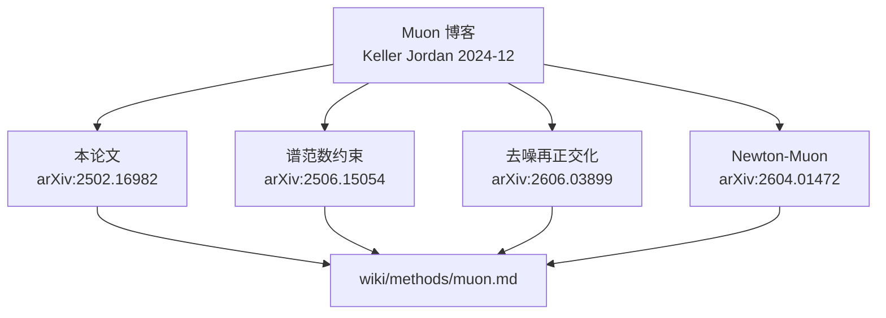

# Muon is Scalable for LLM Training（arXiv:2502.16982）

**Muon is Scalable for LLM Training** 是 **月之暗面（Moonshot AI）** 发表的 Muon **第一篇大规模验证论文**（arXiv:2502.16982），也是目前引用最多、影响力最大的 Muon 工作。论文证明：在正确配置 **Weight Decay** 与 **Per-parameter Update Scale** 后，基于矩阵正交化的 Muon 可直接用于 **Billion-scale LLM** 预训练，无需大量额外超参搜索。

## 一句话定义

**用两大工程技巧把博客提出的 Muon 推到 LLM 规模，并以 Moonlight MoE 与 scaling law 证明相对 AdamW 约 2× 计算效率。**

## 英文缩写速查

| 缩写 | 英文全称 | 简要说明 |
|------|----------|----------|
| Muon | MomentUm Orthogonalized by Newton–Schulz | 论文验证的矩阵正交化优化器 |
| MoE | Mixture of Experts | Moonlight 16B 采用专家混合 |
| WD | Weight Decay | 规模化训练必备解耦正则 |
| FLOPs | Floating Point Operations | scaling law 比较维度 |
| LLM | Large Language Model | 论文主实验对象 |
| AdamW | Adam with decoupled Weight decay | 主要对照基线 |

## 为什么重要

- **填补规模化空白：** 此前 Muon 强结果集中在小规模 LM 与 speedrun；本文首次系统证明 **Billion 参数** 可训。
- **工程可复现：** 开源 **内存最优、通信高效** 的分布式 Muon；发布 Moonlight **预训练 / 指令微调 / 中间 checkpoint**。
- **Pareto 前沿：** Moonlight 3B/16B（5.7T tokens）在更少 FLOPs 下超越同期模型。

## 核心贡献

| 贡献 | 说明 |
|------|------|
| Weight Decay | 解耦 WD 是 Muon 大模型稳定的必要条件 |
| Per-parameter Update Scale | 按参数形状调节步长，减少超参调优 |
| Scaling law | 计算最优训练下相对 AdamW **~2×** 效率 |
| Moonlight | 3B / 16B MoE，5.7T tokens，Muon 训练 |
| 开源 | 分布式 Muon 实现 + 模型 checkpoint |

## 与 Muon 知识脉络的关系

**注意：** Muon 的 **原始提出** 是博客（[sources/blogs/muon_keller_jordan_2024.md](../../sources/blogs/muon_keller_jordan_2024.md)），本论文是 **规模化验证** 而非算法首发。

## 核心信息

| 字段 | 内容 |
|------|------|
| 机构 | 月之暗面（Moonshot AI） |
| arXiv | [2502.16982](https://arxiv.org/abs/2502.16982) |
| 模型 | Moonlight 3B / 16B MoE |
| 训练数据 | 5.7T tokens |
| 对照 | AdamW + scaling law |

## 实验与评测

- Scaling law：相对 AdamW 约 **2×** 计算效率（compute-optimal training）。
- Moonlight 3B/16B MoE（5.7T tokens）刷新 Pareto 前沿。
- 对照基线：AdamW + 同等数据与算力预算。

## 对比

| 维度 | AdamW | Muon（本论文验证） |
|------|-------|-------------------|
| 参数范围 | 全部 | 主要 2D 隐藏层 + AdamW 混用 |
| 规模化 | 成熟基线 | 需 WD + per-param scale |
| 效率 | 基线 | ~2× FLOPs 效率（scaling law） |

## 关联页面

- [Muon（方法页）](../methods/muon.md)
- [AdamW](../methods/adamw.md)
- [Deep Learning Optimizers 对比](../comparisons/deep-learning-optimizers.md)
- [Transformer](../concepts/transformer.md)

## 参考来源

- [Muon Optimizer 论文与理论文献摘录](../../sources/papers/muon_optimizer_primary_refs.md)
- [Muon 原始博客](../../sources/blogs/muon_keller_jordan_2024.md)

## 推荐继续阅读

- [arXiv:2502.16982 全文](https://arxiv.org/abs/2502.16982)
- [Keller Jordan Muon 博客](https://kellerjordan.github.io/posts/muon/)
- [Moonlight 模型与代码](https://github.com/MoonshotAI/Moonlight)
