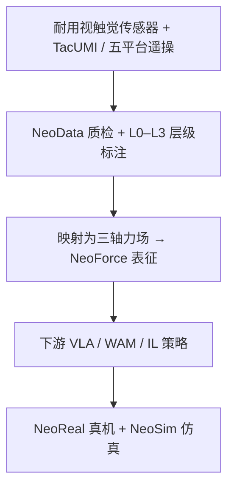

# 𝒩₀-Foundation（Towards the Age of Tactile Intelligence）

**𝒩₀-Foundation**（读作 *Neo-Foundation*，*Towards the Age of Tactile Intelligence*，[项目页](https://research.neoteai.com/n0-foundation/)，[技术报告 PDF](https://research.neoteai.com/assets/n0-foundation-report.pdf)）由 **新智具身智能（NeoteAI）** 与 **复旦 TEAI** 于 **2026-07-25** 发布：把 **视触觉硬件、大规模多模态数据、硬件无关力场表征与标准化评测** 收成一条可扩展的触觉中心具身操作基础路径。

| 机构 | 新智具身智能（NeoteAI）；复旦大学可信具身智能研究院（TEAI） |
|------|--------------------------------------------------------------|
| 日期 | 2026-07-25 |
| 形态 | Technical Report（项目页） |
| 开源 | **部分开源**（OpenNeoData 已放；NeoForce 待 2026-07-31） |

## 一句话定义

**先把接触采得到、力场表示统一、评测对齐，再谈往策略里加触觉——而不是只加一路触觉图像。**

## 英文缩写速查

| 缩写 | 英文全称 | 简要说明 |
|------|----------|----------|
| NeoData | NeoData | >30k h 同步视触觉语料（全量） |
| OpenNeoData | Open NeoData | 5k h 开源子集 |
| NeoForce | NeoForce | 三轴力场监督的视触觉表征模型 |
| NeoReal | NeoReal | 真机 10 任务接触评测套件 |
| NeoSim | NeoSim | 仿真 12 任务（对齐力场格式） |
| TacUMI | 𝒩₀-TacUMI | 双手触觉 + 腕部鱼眼的手持采集夹爪 |
| RGB | Red-Green-Blue | 外视/腕视彩色观测 |

## 为什么重要

- **规模与本体覆盖**：>30k h / 1.4M ep / 6 本体 / 450+ 任务，且 **每指视触觉同步**——与多数「偶发贴触觉」数据集不可同日而语。
- **力场优于外观**：固定 π₀.₅ 时，NeoForce 条件 **32.5%/47.5** > 触觉图像拼接 **27.5%/41.4**，支持「物理接触状态 > 设备相关外观」选型。
- **下游共用底座**：[𝒩₀-VTLA](./paper-n0-vtla.md) 与 [𝒩₀-TWAM](./paper-n0-twam.md) 都建立在 NeoData / NeoForce 叙事上。

## 流程总览

## 核心原理

### 采集与数据

| 项 | 内容 |
|----|------|
| **传感器** | 相机式视触觉：耐磨玻璃 + 弹性纹理层 + 嵌入 RGB |
| **TacUMI** | 双触觉、160° 腕部鱼眼、IR 6-DoF、磁吸开度；约定对齐机器人平台 |
| **机器人本体** | Franka FR3、Piper、ARX X5、UR5e、Flexiv Rizon 4s |
| **占比** | TacUMI ≈ **57%** 轨迹；近 100 名操作员 |
| **层级** | L3 任务 → L2 子任务 → L1 动作 → L0 原子段（VLM 模板 + 人核 + 信号边界） |

### NeoForce

- 统一表示：传感面稠密 **三轴力场**（两剪切 + 法向）。
- 模型：RGB 与力场 chunk patch 化 → 共享 Transformer；重建力场/接触掩码 + 教师引导 latent 预测 + 跨模态对齐。

### 评测套件

- **NeoReal**：10 个真机接触任务；标准化初态、复位与成功判据；报成功率与 progressive score。
- **NeoSim**：12 个单臂/双臂任务；渲染与真实同格式的力场，便于力场条件策略仿真评测。

## 源码运行时序图

**不适用（截至 2026-07-26）。** 官方 [N0-Foundation](https://github.com/neoteai/N0-Foundation) 仓仅有 README / LICENSE / diagrams；**无可辨识的训练或推理入口**。OpenNeoData 可经 Hugging Face / ModelScope 申请下载（LeRobot v3.0），但不构成完整「表征训练 → 策略评测」可运行流水线。NeoForce 权重与代码在仓库 Roadmap 中标为 **By July 31, 2026**。

## 工程实践

| 项 | 实践要点 |
|----|----------|
| **数据入口** | [OpenNeoData](https://huggingface.co/datasets/NeoteAIEmbodied/OpenNeoData) · ModelScope 镜像；门禁收集联系方式；**CC-BY-NC-SA-4.0** |
| **触觉怎么接策略** | 优先试 **力场/NeoForce 条件**，不要默认「多拼一路触觉相机」 |
| **评测** | 接触任务同时看 **binary success** 与 **progressive**；双手互接触任务在 NeoSim 上仍是瓶颈 |
| **硬件** | 真机复现需 InTac 类视触觉指；公司 SDK 见 [neoteai-release](../../sources/repos/neoteai-release.md) |

## 实验与评测

| 设定 | 结果（项目页） |
|------|----------------|
| π₀.₅ 无触觉（NeoReal 均） | **26.5% / 38.1** |
| + 触觉图像拼接 | 27.5% / 41.4 |
| + 触觉 action-expert 条件 | 30.0% / 44.3 |
| + **NeoForce 表征条件** | **32.5% / 47.5** |
| NeoSim π₀.₅ / LingBot-VA | 45.8% / 32.1% |

## 结论

**𝒩₀-Foundation 的真贡献是把「采得到的同步视触觉 + 设备无关力场 + 对齐评测」做成可扩展底座；OpenNeoData 已够做表征/加载实验，但 NeoForce 与全量语料在入库日仍不可完整复现。**

1. **优先复用 OpenNeoData + LeRobot v3.0 加载器**，不要等模型仓。
2. **触觉接入排序**（同骨干）：NeoForce > action-expert 条件 > 图像拼接 > 无触觉。
3. **纯视觉策略在 NeoReal 上仍低**（~26%）：接触任务不要只刷视觉 VLA 榜。
4. **TacUMI 占比高**：跨本体迁移时要显式处理手持 vs 真机动力学差。
5. **许可为 NC**：产品化前先确认授权。
6. **跟进 2026-07-31 NeoForce 开源节点**，再补训练时序图。

## 与其他工作对比

| 工作 | 关系 |
|------|------|
| **[Deform360](./paper-deform360-deformable-visuotactile-dataset.md)** | 同为大规模真实视触觉数据；Deform360 偏可变形体 WM，Foundation 偏跨本体操作语料 + 力场表征 |
| **[𝒩₀-VTLA](./paper-n0-vtla.md) / [𝒩₀-TWAM](./paper-n0-twam.md)** | 下游策略消费者；共用 NeoData / NeoForce 叙事 |
| **纯视觉 VLA（π₀.₅ 等）** | Foundation Table 2 显示接触任务上视觉 alone 远不够 |

## 局限与风险

- 全量 NeoData 未开源；论文规模数字 ≠ 可下载子集。
- NeoForce 与评测脚手架代码待发布。
- 力场估计依赖特定传感器标定；跨厂商传感器需重标定/适配。
- Technical Report 非 arXiv 编号；引用以项目页 BibTeX 为准。

## 关联页面

- [NeoteAI](./neoteai.md) · [𝒩₀-VTLA](./paper-n0-vtla.md) · [𝒩₀-TWAM](./paper-n0-twam.md)
- [视触觉融合](../concepts/visuo-tactile-fusion.md) · [接触丰富操作](../concepts/contact-rich-manipulation.md)
- [Deform360](./paper-deform360-deformable-visuotactile-dataset.md) — 另一条大规模真实视触觉数据轴
- [具身大模型评测基准选型闭环](../queries/embodied-eval-benchmark-selection-loop.md) — NeoReal（真机 10 任务）/ NeoSim（仿真 12 任务）属其 ③ 策略任务成功率评测层：接触丰富操作的力场条件真机 + 仿真套件

## 参考来源

- [sources/papers/n0_foundation.md](../../sources/papers/n0_foundation.md)
- [sources/sites/research-neoteai-com.md](../../sources/sites/research-neoteai-com.md)
- [sources/repos/n0-foundation.md](../../sources/repos/n0-foundation.md)

## 推荐继续阅读

- [项目页](https://research.neoteai.com/n0-foundation/)
- [OpenNeoData](https://huggingface.co/datasets/NeoteAIEmbodied/OpenNeoData)
- [技术报告 PDF](https://research.neoteai.com/assets/n0-foundation-report.pdf)
