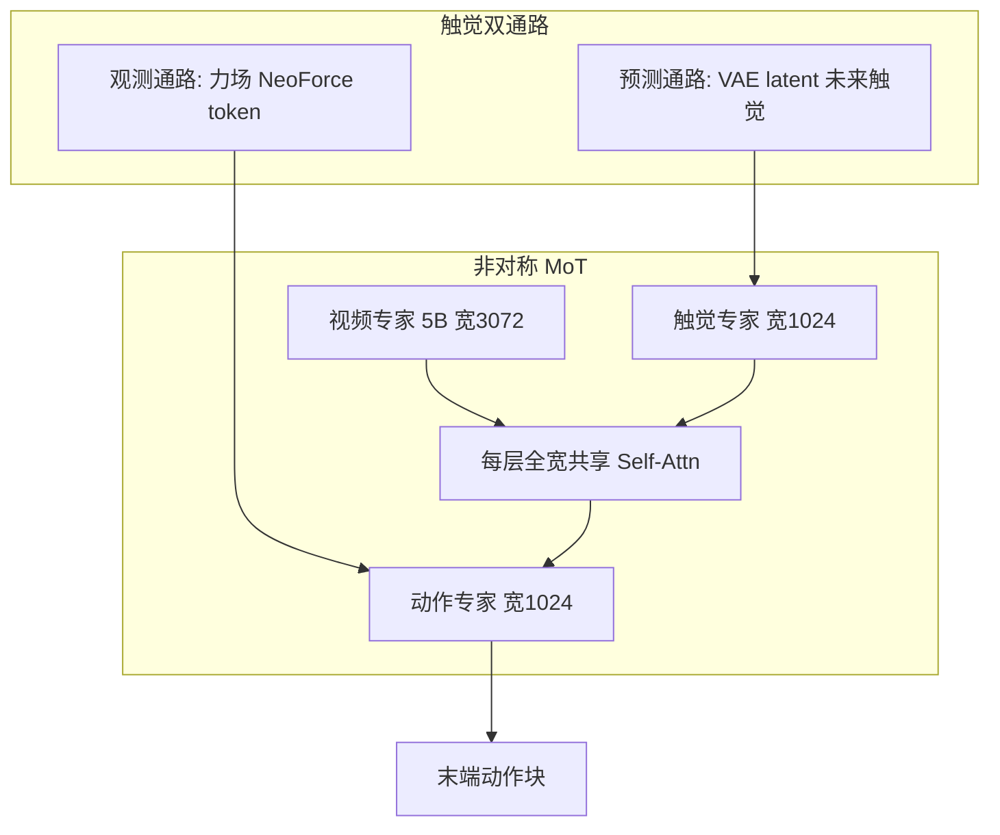

# 𝒩₀-TWAM（Tactile-Native World Action Model）

**𝒩₀-TWAM**（*Scaling Tactile-Native World Action Model for Contact-Rich Manipulation*，[项目页](https://research.neoteai.com/n0-twam/)，[技术报告 PDF](https://research.neoteai.com/assets/n0-twam-report.pdf)）是 [NeoteAI](./neoteai.md) × 复旦 TEAI 的 **触觉原生世界–动作模型**：用非对称 Mixture-of-Transformers **联合生成未来视频与未来触觉**，再从该多模态未来 **去噪动作**；训练在 NeoData 上，评测覆盖 UniVTAC、NeoSim 与八项真机接触任务。

| 机构 | 新智具身智能（NeoteAI）；复旦 TEAI |
|------|-----------------------------------|
| 日期 | 2026-07-25 |
| 参数 | ~**7.16B** 可训（视频专家全宽 + 触/动瘦专家） |
| 开源 | **待发布代码/权重**（By July 31, 2026；仓为占位） |

## 一句话定义

**把「下一刻会看见什么、摸到什么、该怎么动」放进同一个生成模型，并让触觉同时承担预见与在线纠正。**

## 英文缩写速查

| 缩写 | 英文全称 | 简要说明 |
|------|----------|----------|
| TWAM | Tactile World Action Model | 触觉原生世界–动作模型 |
| WAM | World Action Model | 世界预测与动作联合建模 |
| MoT | Mixture-of-Transformers | 模态私有权重 + 共享注意力 |
| VAE | Variational Autoencoder | 冻结因果视频 VAE 编码视/触 |
| NeoForce | NeoForce | 观测通路力场 token 编码器 |
| FM | Flow Matching | 视 / 触 / 动等权目标 |
| UniVTAC | UniVTAC | 八任务仿真接触套件 |

## 为什么重要

- **接触作为未来一等公民**：相对只预测视频的 WAM 与不显式建模下一刻的 VLA，TWAM 强制策略「预见接触」。  
- **工程可部署的非对称 MoT**：~7.2B 约等于三全宽专家一半；推理缓存视/触 K/V，动作步只跑瘦专家。  
- **与 [VT-WAM](./paper-vt-wam-visuotactile-contact-rich.md) 同族对照**：二者都是视触觉 Joint WAM；𝒩₀-TWAM 强调 **规模化 NeoData + 预测/观测双通路 + 触觉标点调度**。

## 流程总览

## 核心原理

### Predict-then-act

Frame-id 因果级联：视频与触觉专家先共生成即将到来的场景与接触，动作专家再条件于 **刚预测的** 视–触对去噪；共享 mask 禁止读未来 chunk。

### 双通路触觉

| 通路 | 表示 | 角色 | 训练 |
|------|------|------|------|
| **预测** | 与场景视频同 VAE + latent FM；相对初始触觉帧残差 | 预见 onset / slip / load / release | 大规模预训练 **启用** |
| **观测** | InTac→三轴力图→NeoForce；零初始化 cross-attn | 反应式、传感器接地纠正 | 任务后训练再 **激活** |

### 规模化训练

- ~**7.5M** clips；多视角 RGB + 每指触觉视频 + 语言 + **20 维** 双手末端动作。  
- 课程：先真机，再混入 TacUMI 至约 **60%** batch。  
- **128×H800**、30k steps；后训练语言/触觉条件各 **10%** dropout（触觉为整段移除）。

### Tactile punctuation

接触事件切分长演示；部署时预测触觉预见阶段切换，观测触觉确认物理完成后调度器前进。

## 源码运行时序图

**不适用（截至 2026-07-26）。** [neoteai/N0-TWAM](https://github.com/neoteai/N0-TWAM) 仅 README / diagrams；模型、推理服务、预训练/后训练权重与 UniVTAC·NeoSim 适配均标 **By July 31, 2026**。项目页 Checkpoints 与 Code 指向同一占位仓。

## 工程实践

| 项 | 要点 |
|----|------|
| **延迟** | 缓存预测视/触 K/V；滚动缓存与异步 chunk 掩盖预测延迟 |
| **预训练陷阱** | 若预训练就开观测触觉，模型易走捷径、不学接触动力学 |
| **仿真** | 观测通路接口接模拟力场，保持与 NeoForce 同条件面 |
| **选型** | 双手持续互接触、抓稳/滑移/落座视觉歧义 → 优先看 TWAM 相对 FastWAM / π₀.₅ 的增益 |

## 实验与评测

| 套件 | 𝒩₀-TWAM | 主要对照 |
|------|---------|----------|
| UniVTAC | **84.5%** | — |
| NeoSim 均 | **49.4%** | π₀.₅ 45.8% · LingBot-VA 32.1% |
| NeoSim 双手 | **42.3%** | π₀.₅ 34.3% |
| 真机八任务均 | **46.3%** | π₀.₅ 30.0% · LingBot-VA 21.9% · FastWAM 14.4% |
| 泛化均分 | **51.7%** | — |
| 消融满配任务均 | **67.0%** | 去预测触 56.4% · 去观测触 50.0% |
| 预训练 20% 数据 | UniVTAC **65.4%** | 满配 84.5% |

## 结论

**𝒩₀-TWAM 证明在接触丰富操作上，把未来触觉与未来视觉一起生成再动作，能稳定超过强 VLA 与纯视觉 WAM；双通路消融说明预见与在线力场纠正都不可省，但官方栈入库日尚未可跑。**

1. **主收益场景**：抓稳、载荷、滑移、落座等 **视觉歧义接触**。  
2. **架构取舍**：非对称 MoT 用参数换推理时只重跑动作专家。  
3. **训练纪律**：预训练禁观测触觉捷径。  
4. **数据敏感**：20% 预训练数据 → UniVTAC 大跌，规模不是装饰。  
5. **与 VTLA**：同公司双路线——要联合世界预演选 TWAM，要 VLA+离线 RL 选 VTLA。  
6. **与 VT-WAM**：同族；比硬件、数据规模与是否开源时分开记账。

## 与其他工作对比

| 工作 | 关系 |
|------|------|
| **[VT-WAM](./paper-vt-wam-visuotactile-contact-rich.md)** | 同族视触觉 Joint WAM；𝒩₀-TWAM 强调 NeoData 规模与双通路角色分离 |
| **FastWAM / LingBot-VA** | 纯视觉或弱触觉 WAM；真机接触均分显著落后 |
| **[𝒩₀-VTLA](./paper-n0-vtla.md)** | 同底座 VTLA；不联合生成未来视频，延迟与接口不同 |

## 局限与风险

- 代码/权重未发布；真机数字依赖 InTac 与 NeoForce 估计器。  
- 预测地平线、控制频率、更多传感器覆盖仍是报告中的 future work。  
- 双手任务仍远未饱和（NeoSim 双手 42.3%）。  
- 名称易与视觉-only WAM / 其他 VT-* 工作混淆，引用写全 𝒩₀-TWAM。

## 关联页面

- [NeoteAI](./neoteai.md) · [𝒩₀-Foundation](./paper-n0-foundation.md) · [𝒩₀-VTLA](./paper-n0-vtla.md)
- [VT-WAM](./paper-vt-wam-visuotactile-contact-rich.md) · [World Action Models](../concepts/world-action-models.md)
- [接触建模类别](../overview/wm-action-consequence-category-02-contact-modeling.md)

## 参考来源

- [sources/papers/n0_twam.md](../../sources/papers/n0_twam.md)
- [sources/sites/research-neoteai-com.md](../../sources/sites/research-neoteai-com.md)
- [sources/repos/n0-twam.md](../../sources/repos/n0-twam.md)

## 推荐继续阅读

- [项目页](https://research.neoteai.com/n0-twam/)
- [技术报告 PDF](https://research.neoteai.com/assets/n0-twam-report.pdf)
- [VT-WAM（arXiv:2607.02503）](./paper-vt-wam-visuotactile-contact-rich.md)
