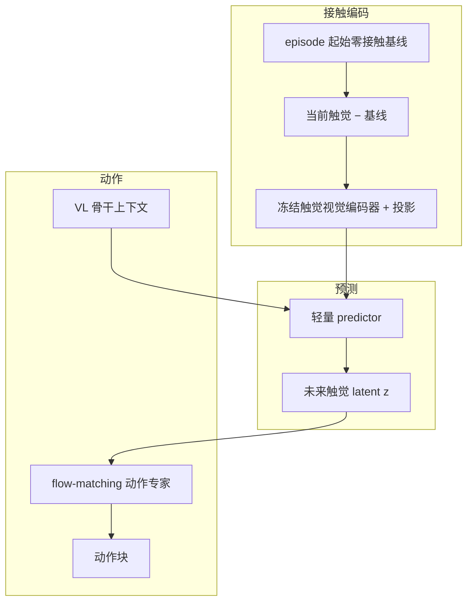

# 𝒩₀-VTLA（Latent Tactile Tokens · Vision-Tactile-Language-Action）

**𝒩₀-VTLA**（*Scaling Vision-Tactile-Language-Action Model with Latent Tactile Tokens*，[项目页](https://research.neoteai.com/n0-vtla/)，[技术报告 PDF](https://research.neoteai.com/assets/n0-vtla-report.pdf)）是 [NeoteAI](./neoteai.md) × 复旦 TEAI 在 [𝒩₀-Foundation](./paper-n0-foundation.md) / NeoData 上预训练的 **VTLA**：不把触觉当额外相机，而是 **预测下一动作块将造成的触觉变化 latent**，再条件 flow-matching 动作专家；部署语料侧用 **ALTER** 做 advantage 条件离线 RL。

| 机构 | 新智具身智能（NeoteAI）；复旦 TEAI |
|------|-----------------------------------|
| 日期 | 2026-07-25 |
| 开源 | **待发布代码/权重**（Roadmap: By July 31, 2026；仓为占位） |

## 一句话定义

**让动作专家消费的是「即将发生的接触估计」，而不是「已经发生的触觉图像」。**

## 英文缩写速查

| 缩写 | 英文全称 | 简要说明 |
|------|----------|----------|
| VTLA | Vision-Tactile-Language-Action | 视觉–触觉–语言–动作基础策略 |
| ALTER | Advantage Labeling from Trajectory Events and Relative Progress | 部署语料 → 阶段相对 advantage |
| FM | Flow Matching | 动作块去噪目标 |
| HIL | Human-in-the-Loop | 人机纠正轨迹进入 ALTER |
| NeoReal | NeoReal | 真机接触评测套件 |
| UniVTAC | UniVTAC | 仿真/接触评测套件之一 |
| VLA | Vision-Language-Action | 视觉–语言–动作基线族 |

## 为什么重要

- **纠正「触觉当相机」反模式**：接触信息稀疏、短窗；预测净变化 latent 比拼原始触觉帧更贴合 [视触觉融合](../concepts/visuo-tactile-fusion.md) 的阶段切换直觉。
- **离线可继续涨点**：ALTER 把失败、掉落、HIL 纠正变成阶段内 advantage，无需再交互——与 [TACO](./paper-taco-tactile-wm-vla-posttrain.md) 的「失败→纠错数据」叙事可对照。
- **同底座对照 WAM**：[𝒩₀-TWAM](./paper-n0-twam.md) 走联合未来生成；VTLA 走 **预测接触 token → 动作**，延迟与工程复杂度不同。

## 流程总览

## 核心原理

### Predictive Touch

1. 每指：当前触觉相对 **开爪零接触基线** 差分 → 压制凝胶静态外观与安装偏置。  
2. Predictor 在 VL 上下文中估计 horizon 末相对当前的触觉变化，经 **对比匹配 + L1 空间重建** 锚定。  
3. \(z\) **prepend** 到 noisy action suffix；**当前接触 token 不直接**进 VL 前缀或动作专家。

### 三阶段训练

| 阶段 | 做法 |
|------|------|
| 1 Predictor | 只接地未来触觉目标 |
| 2 Action alignment | 掩码 VL 注意力，迫使专家依赖 \(z\) |
| 3 End-to-end | 恢复 VL 注意力；触觉编码器骨干保持冻结 |

### ALTER

- 语料：清洁示教 + 自主 rollout + HIL 纠正 + 分段恢复。  
- 触觉接触变化 + 运动/夹爪/视觉事件 → 候选边界；阶段内排序，**top 30% → Advantage: positive**。  
- 部署恒用 positive 条件做离线 flow-matching 改进。

## 源码运行时序图

**不适用（截至 2026-07-26）。** [neoteai/N0-VTLA](https://github.com/neoteai/N0-VTLA) 仅 README / diagrams；模型代码、预训练权重、后训练配方与 checkpoint 均标为 **By July 31, 2026**。项目页 Code/Checkpoints 链到同一占位仓。

## 工程实践

| 项 | 要点 |
|----|------|
| **数据** | 依赖 NeoData / [OpenNeoData](./paper-n0-foundation.md)；每 episode 前 ≥0.5 s 开爪零接触 |
| **动作空间** | 固定宽度容器；chunk 相对首姿态；单臂/双臂/手持共用 |
| **部署学习** | 保留失败与纠正轨迹；用触觉事件助分段，勿只留成功 demo |
| **与 TWAM 选型** | 要较低延迟、强 VLA 生态 → VTLA；要显式未来视触预演 → TWAM |

## 实验与评测

| 套件 | 𝒩₀-VTLA | 对照 |
|------|---------|------|
| NeoReal 九任务均成功率 | **47.2%** | π₀.₅ **29.4%** |
| NeoReal 均 progressive | **56.8** | 42.3 |
| UniVTAC + NeoSim 均 | **63.8%** | 最强基线 **44.0%** |
| UniVTAC | **83.1%** | InternVLA-A1 67.1% |
| NeoSim | **50.8%** | π₀.₅ 45.8% |
| ALTER：毛巾 / 装袋 / 纸箱 | **95 / 80 / 75%** | π₀.₅+ALTER 90 / 75 / 60% |

## 结论

**𝒩₀-VTLA 把触觉从「多一路观测」改成「动作生成内部的未来接触估计」，并用 ALTER 让固定部署语料继续涨点；数字有吸引力，但入库日仍无法本地跑通训练栈。**

1. **方法真影响**：预测 latent 接触 + 三阶段迫使动作专家消费它。  
2. **ALTER 是次主轴**：同 ALTER 下仍领先 π₀.₅，说明预训练触觉底座有留存优势。  
3. **Board Insertion 等从 0→25%** 显示接触歧义任务收益最大。  
4. **不要把当前触觉直接拼进 VL 前缀**——与作者设计相反。  
5. **复现卡点**：等 7/31 代码与权重；当前只能消化报告与 OpenNeoData。  
6. **和 TACO 对照**：ALTER 偏 advantage 条件；TACO 偏生成纠错片段——可组合而非互斥。

## 与其他工作对比

| 工作 | 关系 |
|------|------|
| **[TACO](./paper-taco-tactile-wm-vla-posttrain.md)** | 同为「部署失败→再学习」；TACO 偏生成纠错片段，ALTER 偏 advantage 条件 |
| **OmniVTLA 等 tactile VLA** | 多把当前触觉当输入；𝒩₀-VTLA 强调 **预测未来接触 latent** |
| **[𝒩₀-TWAM](./paper-n0-twam.md)** | 同公司 WAM 路线；VTLA 更贴 VLA 生态与离线 RL |

## 局限与风险

- 官方实现未落地；结果以项目页/报告为准，独立复现前勿当产线基线。  
- 依赖视触觉硬件与零接触基线协议。  
- Offline RL 对分段与事件检测质量敏感；错误边界会污染 advantage。  
- 与 OmniVTLA 等名称相近工作勿混淆（不同机构/配方）。

## 关联页面

- [NeoteAI](./neoteai.md) · [𝒩₀-Foundation](./paper-n0-foundation.md) · [𝒩₀-TWAM](./paper-n0-twam.md)
- [VLA](../methods/vla.md) · [TACO](./paper-taco-tactile-wm-vla-posttrain.md)
- [视触觉融合](../concepts/visuo-tactile-fusion.md)

## 参考来源

- [sources/papers/n0_vtla.md](../../sources/papers/n0_vtla.md)
- [sources/sites/research-neoteai-com.md](../../sources/sites/research-neoteai-com.md)
- [sources/repos/n0-vtla.md](../../sources/repos/n0-vtla.md)

## 推荐继续阅读

- [项目页](https://research.neoteai.com/n0-vtla/)
- [技术报告 PDF](https://research.neoteai.com/assets/n0-vtla-report.pdf)
- [𝒩₀-TWAM（同栈 WAM）](./paper-n0-twam.md)
