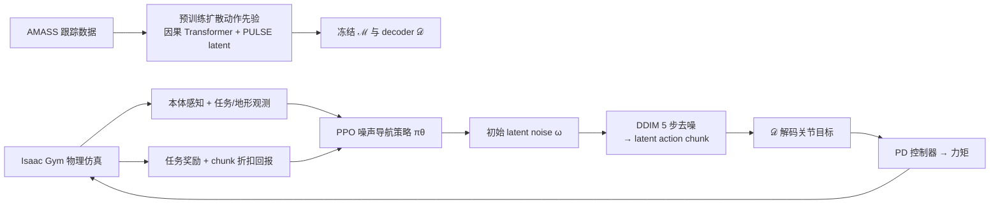
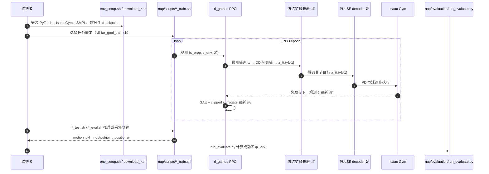

# NaP-Control：扩散先验噪声导航的快速全身角色控制

**NaP-Control**（*Navigating Diffusion Prior for Versatile and Fast Character Control*，[arXiv:2605.20209](https://arxiv.org/abs/2605.20209)）由苏黎世联邦理工提出：在冻结的任务无关扩散动作先验上，用强化学习直接预测任务最优的 **初始扩散噪声**，从而把全身物理角色控制从「测试时迭代梯度引导」切换到「训练期环境交互 + 推理期单次去噪」。

## 一句话定义

**NaP 把预训练扩散策略当作自然运动流形，用 PPO 在 latent noise 空间导航以最大化任务奖励，一次 DDIM 去噪即可生成物理可行动作，兼顾运动保真、成功率与实时推理。**

## 英文缩写速查

| 缩写 | 英文全称 | 简要说明 |
|------|----------|----------|
| NaP | Navigating Diffusion Prior | 本文框架简称，强调在扩散先验噪声空间导航 |
| RL | Reinforcement Learning | 用 PPO 学习噪声导航策略 |
| PPO | Proximal Policy Optimization | 训练噪声导航 actor-critic 的 on-policy 算法 |
| DDIM | Denoising Diffusion Implicit Models | 5 步 ODE 求解器，平衡训练稳定与推理速度 |
| GAE | Generalized Advantage Estimation | PPO 优势估计，稳定 chunk 级回报 |
| PD | Proportional–Derivative | 将目标关节位置转为仿真力矩的底层控制器 |

## 为什么重要

- **解决扩散角色控制的推理瓶颈：** UniPhys 等依赖测试时可微引导，FPS 低且对非可微目标不友好；NaP 把任务优化前移到 RL 训练期。
- **把 DSRL 噪声导航扩展到全身物理控制：** 从低维操作/运动学合成，推进到接触丰富、长时域稳定的 Isaac Gym 闭环。
- **保留先验运动质量的同时提升任务指标：** 平坦远目标相对 UniPhys 成功率 98.4% vs 81.9%，推理 22.5 vs 2.9 FPS。
- **简单奖励即可驱动复杂行为：** 敏捷右手到达仅用位置奖励；坐姿交互无需 HOI 训练数据仍能自然落座。
- **未见地形泛化：** 先验仅在平地训练，通过高度图观测 + 课程学习适应楼梯/坡面/离散块。

## 核心信息

| 字段 | 内容 |
|------|------|
| 机构 | 苏黎世联邦理工（ETH Zürich） |
| 发表 | 2026 · arXiv（cs.GR） |
| 仿真 | Isaac Gym；SMPL-like 24 关节；30 Hz |
| 先验数据 | AMASS 跟踪参考动作（沿用 UniPhys 训练范式） |
| 基线 | UniPhys、PULSE、CLoSD、MaskedMimic；远目标对比 AMP/CML/AdaptNet |
| 开源 | **已开源**（核查日 2026-08-24）：[chiawenchen/NaP](https://github.com/chiawenchen/NaP)；需自备 SMPL 与 Isaac Gym Preview 4 |

## 流程总览

## 核心机制（方法栈）

### 1. 扩散动作先验预训练

- 在 AMASS 跟踪轨迹上预训练 **任务无关** 因果 Transformer 扩散模型，条件于历史状态–动作轨迹 ℋ。
- 状态采用比 UniPhys 更紧凑的表示：全局根轨迹（位置/6D 朝向/线角速度）+ 骨盆局部系关节旋转与角速度，去掉冗余局部位置/线速度。
- 动作用 PULSE latent action 𝒵 编码，扩散建模状态–latent 对轨迹；推理时用冻结 decoder 还原关节目标。

### 2. Latent noise 导航（核心）

- 导航策略 πθ 不直接输出关节动作，而输出扩散 **初始噪声** ω（DSRL 思路）。
- 将 ω 重复为 k 步 chunk，经 DDIM 一次去噪得到 latent action 序列，解码后 **开环** 执行 k 个仿真步；chunk 内回报折扣累加后写入 PPO buffer。
- 扩散先验 + decoder 被视为 MDP 环境的一部分，保证动作留在自然运动流形上，减少传统 test-time guidance 的分布外漂移。

### 3. 任务与奖励

| 任务 | 要点 |
|------|------|
| 远目标到达 | 位置 + 朝向 + 分阶段稳定性惩罚，抑制绕圈 |
| 敏捷右手到达 | 仅位置奖励，需全身协调停步/下蹲/侧移 |
| 速度控制 | 水平速度跟踪 + 朝向对齐 |
| 物体交互（坐沙发） | 骨盆到目标座区距离奖励 |
| 崎岖地形 | 头部中心 4×4 m 高度图（12.5 cm 分辨率）+ 课程学习 |

### 4. 实现细节

- 先验：12 层 Transformer，hidden 768，8 heads；状态 224 维 + latent 32 维。
- Chunk：平坦 k=8（速度优先），崎岖/敏捷 k=4（反应性优先）。
- 控制：目标关节位置 → PD 力矩；骨盆高度 <0.15 m 早停。

## 源码运行时序图

训练与评测入口对齐 [NaP 仓库](../../sources/repos/nap_control.md) 的 `nap/scripts/` 与 `nap/evaluation/`。

## 实验与评测（论文摘要）

| 对比 | 关键结论 |
|------|----------|
| vs UniPhys | 远目标 FPS **22.5 vs 2.9**；成功率 **98.4% vs 81.9%**；jerk 更低 |
| vs PULSE / CLoSD / MaskedMimic | 相近或更高成功率，jerk 显著更低（运动更平滑） |
| vs AMP / CML（远目标平坦） | 成功率 98.4%，jerk 1266，样本 327M（优于 AMP 1200M） |
| 崎岖地形 | 远目标成功率 86.0%，优于 MaskedMimic；jerk 优于 PULSE |

消融：紧凑状态表示、联合 state-action noise 导航优于仅 action noise；5 步 DDIM 为训练/推理折中。

## 工程实践

| 项 | 内容 |
|----|------|
| **开源状态** | **已开源**（截至 **2026-08-24**）：见 [项目页](../../sources/sites/nap-control-project.md) 与 [仓归档](../../sources/repos/nap_control.md) |
| **复现入口** | `git clone --recursive` → conda + Isaac Gym → `download_data.sh` → 任务 `*_train.sh` / `*_test.sh` |
| **依赖注意** | SMPL 模型、Isaac Gym Preview 4、`UniPhys` 子模块；集群可用 Singularity 脚本 |
| **选型提示** | 需要扩散先验运动质量 + 多任务/fast 推理时优先 NaP；若可接受测试时引导且任务可微，UniPhys 仍可作为对照 |
| **与机器人栈关系** | 当前为 **图形学物理角色**（SMPL + Isaac Gym），与 Unitree 等人形真机 RL 有方法谱系关联但无官方真机入口 |

## 局限与风险

- **平台绑定：** Isaac Gym Preview 4 已停更，复现门槛高于 MuJoCo/mjlab 生态。
- **先验与解码器冻结：** 下游任务无法通过微调扩散权重修正系统性偏差，仅优化初始噪声。
- **开环 chunk：** k 步内无逐步反馈，高难度接触任务需更小 chunk 换取反应性。
- **无真机验证：** 论文与代码均面向仿真角色；迁移到真实人形需重定向、观测与 PD/力矩接口重做。
- **数据与许可：** 依赖 AMASS/SMPL 与 checkpoint 下载脚本，完整复现需逐项核对许可。

## 结论

**NaP-Control 把「扩散先验 + 测试时引导」改成「冻结先验 + RL 噪声导航」，是扩散角色控制走向实时可用的关键一步：任务成功率与运动平滑度双升，同时去掉推理期迭代优化。**

- **首要收益是推理效率：** 相对 UniPhys 约 **7.7×** FPS 提升，且成功率更高——对游戏引擎与交互式动画管线有直接意义。
- **训练期环境交互不可替代：** 纯离线扩散策略在远目标、坐姿等非训练分布任务上成功率明显落后；噪声导航用 PPO 闭环补齐。
- **奖励工程可极简化：** 敏捷到达与坐姿等任务表明，自然性主要由先验流形承担，任务层只需稀疏几何奖励。
- **地形扩展靠观测而非重训先验：** 高度图 + 课程学习让平地先验在未见崎岖场景仍可用，但成功率会下降（远目标崎岖 86%）。
- **与 UniPhys 形成互补谱系：** 同一 ETH 团队线上，UniPhys 强调统一 planner–controller 扩散框架；NaP 专注 **如何高效调用** 已训练先验——读论文宜对照 [UniPhys](./paper-bfm-40-uniphys.md)。
- **机器人读者应看方法而非平台：** latent noise steering、action chunking 与 compact state 设计可对照 [AMP 变体对比](../comparisons/amp-add-smp-motion-prior-variants.md)，但勿直接假设 G1 可复现。

## 与其他页面的关系

- 直接基线与先验范式：[UniPhys](./paper-bfm-40-uniphys.md)
- 角色动画 vs 机器人边界：[Character Animation vs Robotics](../concepts/character-animation-vs-robotics.md)
- 对抗式 motion prior 对照：[AMP](../methods/amp-reward.md)、[AMP/ADD/SMP 对比](../comparisons/amp-add-smp-motion-prior-variants.md)
- 运动学扩散引导对照：[GMD](./paper-notebook-guided-motion-diffusion-for-controllable-human-m.md)
- 综述入口：[Humanoid AMP Motion Prior Survey](../overview/humanoid-amp-motion-prior-survey.md)

## 参考来源

- [nap_control_arxiv_2605_20209.md](../../sources/papers/nap_control_arxiv_2605_20209.md) — 论文策展摘录
- [nap-control-project.md](../../sources/sites/nap-control-project.md) — 官方项目页（开源核查）
- [nap_control.md](../../sources/repos/nap_control.md) — 官方代码仓库归档
- 论文：<https://arxiv.org/abs/2605.20209>

## 推荐继续阅读

- [NaP-Control 项目页](https://chiawenchen.github.io/nap-control-project/) — 视频演示与 BibTeX
- [UniPhys 论文](https://arxiv.org/abs/2504.12540) — 扩散 planner–controller 与 NaP 先验训练范式来源
- [DSRL / Steering diffusion with RL](https://arxiv.org/abs/2410.02485) — 低维噪声导航先例（NaP 在 Related Work 中引用）
