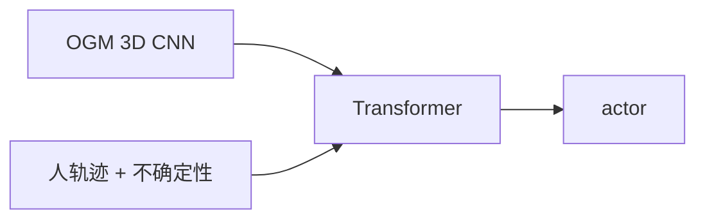
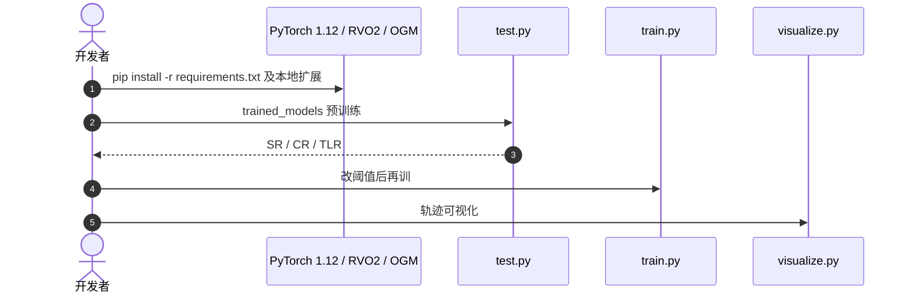

# 接近–安全跟随：别把跟紧和防撞塞进同一个 reward

**接近–安全跟随**（*Navigating the Proximity-Safety Balance*；[arXiv:2608.10056](https://arxiv.org/abs/2608.10056)，[项目页](https://nav-ps-balance.github.io/)，[代码](https://github.com/tasl-lab/nav-ps-balance)）由 **宾夕法尼亚大学 / 加州大学河滨分校 / 斯坦福 / NVIDIA / 佐治亚理工** 提出（IROS 2026）：人群里跟目标，跟太近会撞人，跟太远会丢目标。

## 一句话定义

**把跟随拆成稀疏任务奖励和几条有行为含义的 cost 阈值，用 PPO-Lagrangian 一起学，并把行人预测不确定性写进代价。**

## 英文缩写速查

| 缩写 | 英文全称 | 简要说明 |
|------|----------|----------|
| SR / CR / TLR | Success / Collision / Target-Lost Rate | 主评测三件套 |
| AFD | Average Following Distance | 平均跟随距离 |
| PPO | Proximal Policy Optimization | 策略优化；本文用 Lagrangian 多 critic |
| DtACI | Distribution-free Time-series Adaptive Conformal Inference | 在线预测不确定性 |
| OGM | Occupancy Grid Map | 静态障碍编码 |
| ORCA | Optimal Reciprocal Collision Avoidance | 行人仿真对照 |

## 为什么重要

- dense reward 里的权重没有物理单位，换密度就要重调。
- cost 阈值（如跟随距离、碰撞）可以直接说给部署工程师。
- 真机 ROSMASTER X3 零样本，说明仿真约束能带走。

## 核心信息

| 项 | 内容 |
|----|------|
| **机构** | 宾夕法尼亚大学；加州大学河滨分校；斯坦福大学；英伟达；佐治亚理工学院 |
| **会议** | IROS 2026 |
| **开源** | **已开源**（训练/评测 + 预训练权重） |

## 核心原理

### 方法栈

3D CNN 吃局部 OGM；人位置、预测轨迹与 DtACI 不确定性做成 token，与机器人状态在 Transformer 融合。一个 actor + 四个 critic（奖励、跟随、人碰撞、障碍碰撞），GAE 各自算，Lagrangian 合成 PPO 损失。推理只跑 actor。

### 流程总览

## 源码运行时序图

官方仓 [tasl-lab/nav-ps-balance](https://github.com/tasl-lab/nav-ps-balance)（归档见 [sources/repos/nav-ps-balance.md](../../sources/repos/nav-ps-balance.md)）：

- **最短复现：** 按 README 钉 numpy 1.23.5 与 `--no-build-isolation` → `python test.py`。

## 工程实践

| 项 | 建议 |
|----|------|
| 调参 | 改 δF / δH，不要先改 dense 权重 |
| 依赖 | OGM C++ 扩展是硬性；缺 pybind11 会装失败 |
| 对照 | 必须同时报 SR、CR、TLR；只报成功会藏「丢目标」 |

## 实验与评测

ID：SR **78.08%**、总体 CR 16.16%（RL+ACI 71.60% / 20.72%）。OOD 走廊 SR **89.76%**。调阈值可在「更安全」与「跟更紧」之间切换，比把奖励权重乘 2 更可控。真机穿行行人与静态障碍。

## 与其他工作对比

相对 [PGIF-MPPI](./paper-pgif-mppi.md)：PGIF 是规划代价里的行人高斯场，本页是跟随 RL 的约束分解。相对 [iCrowdNav](./paper-icrowdnav.md)：iCrowdNav 学让行，本页学跟目标。相对 [HUI360](./paper-hui360.md)：HUI360 预测会不会来交互，本页假设已有跟随目标。

## 结论

**跟随的接近–安全权衡应该是可调阈值，而不是藏在 reward 里的无名权重。**

1. **三条 cost 分开** — 跟随、人、障碍各有单位。
2. **不确定性进代价** — 不熟悉行人模型时才保得住。
3. **ID 78% 不是天花板** — 看 OOD 奔跑与成组行人。
4. **仿真仓可跑** — 先 `test.py` 再考虑 ROS 2 真机。

## 局限与风险

- 钉死旧 PyTorch / numpy，新环境容易装挂。
- 真机平台是 ROSMASTER X3，不是人形。
- 目标身份假定已知，不做重识别。

## 关联页面

- [PGIF-MPPI](./paper-pgif-mppi.md)
- [iCrowdNav](./paper-icrowdnav.md)
- [HUI360](./paper-hui360.md)
- [PPO](../methods/ppo.md)
- [导航与自主栈](../overview/navigation-slam-autonomy-stack.md)

## 参考来源

- [论文摘录](../../sources/papers/nav_ps_balance_arxiv_2608_10056.md)
- [项目页归档](../../sources/sites/nav-ps-balance.md)
- [官方仓归档](../../sources/repos/nav-ps-balance.md)
- [具身智能小站 10 篇盘点（2026-08-18）](../../sources/blogs/wechat_embodied_station_contact_predict_adapt_10_papers_2026-08-18.md)

## 推荐继续阅读

- [项目页](https://nav-ps-balance.github.io/)
- [tasl-lab/nav-ps-balance](https://github.com/tasl-lab/nav-ps-balance)
