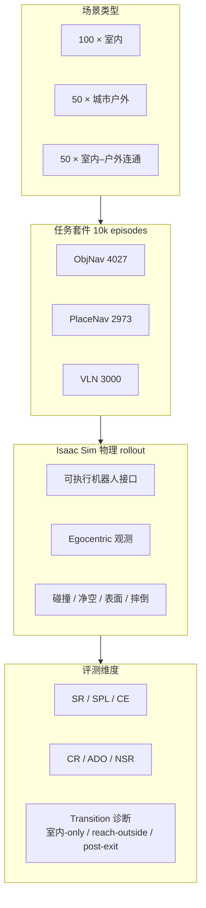
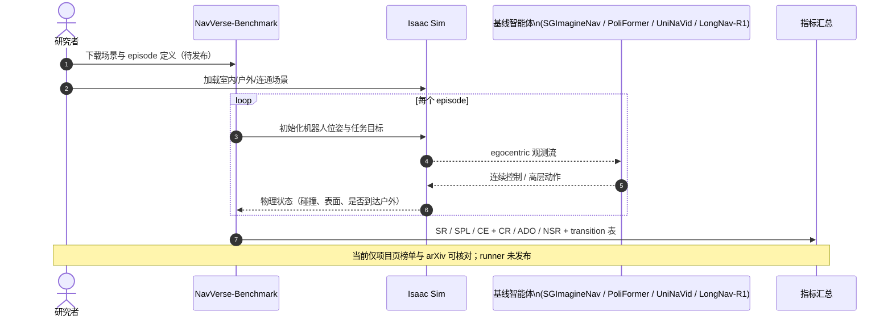

# NavVerse：室内–户外连续具身导航基准

**NavVerse**（*Benchmarking Indoor-to-Outdoor Embodied Navigation in Continuous Robot Simulation*，[arXiv:2607.19695](https://arxiv.org/abs/2607.19695)，[项目页](https://umich-curly.github.io/NavVerse-Benchmark/)，**密歇根大学（UMich）CURLY 实验室**）提出首个系统评测 **室内 → 室外连通场景** 的物理启用导航基准：机器人在 **Isaac Sim** 中通过可执行接口 rollout，在 **ObjNav / PlaceNav / VLN** 三类任务上同时报告 **任务成功、路径效率与安全/运动学** 指标，并专门诊断 **出口寻找与穿越后的适应失败**。

## 一句话定义

**用 10,000 个可执行机器人 episode，把「从建筑里走出来并继续在街上完成任务」测成可比的物理–语义–安全问题，而不是把室内 VLN 与户外导航分开打分。**

## 英文缩写速查

| 缩写 | 英文全称 | 简要说明 |
|------|----------|----------|
| NavVerse | Navigation Universe / NavVerse Benchmark | 本文室内–户外连通导航基准 |
| VLN | Vision-and-Language Navigation | 依据自然语言路线指令导航 |
| ObjNav | Object-Goal Navigation | 按物体类别寻找目标 |
| PlaceNav | Place-Goal Navigation | 按语义地点/POI（餐厅、银行等）导航 |
| SR | Success Rate | 任务是否到达目标 |
| SPL | Success weighted by Path Length | 成功前提下奖励更短路径 |
| CE | Coverage Efficiency | 每米行程新覆盖空间效率 |
| CR | Collision Rate | 碰撞频率（安全） |
| ADO | Average Distance to Obstacles | 与障碍平均距离（安全） |
| NSR | Navigable Surface Ratio | 在可通行表面上的时间比（安全） |

## 核心信息

| 字段 | 内容 |
|------|------|
| **机构** | 密歇根大学（University of Michigan / UMich）；CURLY 实验室 |
| **arXiv** | [2607.19695](https://arxiv.org/abs/2607.19695)（2026-07-22） |
| **仿真** | **Isaac Sim** 物理启用连续 rollout |
| **场景** | 100 室内 + 50 城市户外 + 50 室内–户外连通（scene-disjoint） |
| **Episode** | **10,000**（ObjNav 4,027 / PlaceNav 2,973 / VLN 3,000） |
| **开源（截至 2026-09-13）** | **待发布** — arXiv + 项目页已上线；GitHub 仓仅 `website` 静态站，**未见** 仿真/评测代码与数据 |

## 为什么重要

- **填补评测空白：** [VLN-CE](./paper-vln-02-vln-ce.md) 等把离散图搬到连续 3D，但多在 **单一场景类型** 内；NavVerse 显式测 **出口、边界穿越与户外继续行动** 的跨域失败。
- **PlaceNav 抬升语义地平线：** 相对 ObjNav 的物体类别，**地点级 POI**（汉堡店、银行）需要户外拓扑与 storefront 语义，更接近配送/校园任务。
- **物理改变「进步」定义：** 可执行 rollout 暴露碰撞、净空、表面合法性、摔倒与超时——仅用 SR/SPL 会掩盖不安全或无效移动（与 [ESI-Bench](./esi-bench.md)「行动选择」叙事互补，但聚焦 **跨场景导航**）。
- **零样本对照清晰：** 同一协议下并排 **模块化 / RL / VLA / VLA-RL**，便于读 [VLN 四范式复现](../overview/vln-open-source-repro-paradigms.md) 与 [VLA](../methods/vla.md) 在 **transition** 场景的短板。

## 基准构造（核心结构）

| 模块 | 内容 |
|------|------|
| **场景来源** | 室内 mesh + 城市资产；scene-disjoint split |
| **城市 enrichment** | 道路、地形、车辆、POI 店面目标 |
| **Hybrid assembly** | 室内布局通过 **门–立面** 接到面向道路的出口 |
| **ObjNav** | 导航至物体类别（沙发、长椅等），egocentric 观测 |
| **PlaceNav** | 导航至语义地点（「找汉堡薯条的地方」） |
| **VLN** | 跟随自然语言路线（穿窗出门、沿人行道到公交站等） |

### 流程总览

## 源码运行时序图

官方标注 **Code Coming soon**；截至 **2026-09-13**，GitHub 仓仅托管项目站（`website` 分支），**无可运行评测入口**。预期发布后的复现路径（待官方确认）：

- **现状：** 项目页可查看 **零样本榜单** 与 transition 诊断；**不可** 本地复现 rollout。
- **仓内实际内容：** 静态 HTML/JS/CSS + 媒体资源，见 [sources/repos/navverse-benchmark.md](../../sources/repos/navverse-benchmark.md)。

## 工程实践

| 项 | 建议 |
|----|------|
| **选型** | 研究 **跨场景导航 / 出口适应 / 户外 POI 接地** → 关注 NavVerse；仅室内 VLN-CE 分数 **不可外推** |
| **读榜** | 同时看 **SR + 安全三联（CR/ADO/NSR）+ transition 表**；UniNaVid SR 高不等于安全最优 |
| **复现** | 关注 `UMich-CURLY/NavVerse-Benchmark` 是否发布非 `website` 分支或 Isaac Sim 安装文档 |
| **开源状态** | **待发布**（arXiv + 项目页 **已上线**；代码/数据 **未见**） |

## 评测与指标（零样本摘要）

> 以下为项目页 **All Scenes** 零样本结果（0–100% SR；SPL 为路径效率分数）。完整分场景表见 [项目页](https://umich-curly.github.io/NavVerse-Benchmark/)。

### 任务完成（SR / SPL）

| 任务 | 方法 | 类型 | SR | SPL |
|------|------|------|-----|-----|
| ObjNav | **UniNaVid** | VLA | **11.62%** | **2.58** |
| ObjNav | SGImagineNav | Modular | 6.42% | 0.61 |
| ObjNav | PoliFormer | RL | 5.81% | 1.00 |
| ObjNav | LongNav-R1 | VLA-RL | 4.59% | 0.62 |
| PlaceNav | **UniNaVid** | VLA | **11.38%** | **3.30** |
| PlaceNav | LongNav-R1 | VLA-RL | 6.50% | 1.23 |
| VLN | UniNaVid | VLA | 10.67% | 3.21 |

### 安全与效率（ObjNav / PlaceNav 摘录）

| 方法 | CR ↓ | ADO ↑ | NSR ↑ | CE ↑ |
|------|------|-------|-------|------|
| **SGImagineNav** | **0.21** (ObjNav) | 0.98 | **0.16** | 0.48 |
| UniNaVid | 0.31 | 0.81 | 0.12 | 0.52 |
| LongNav-R1 | 0.34 | **1.17** (ObjNav) | 0.13 | **0.50** |

### Transition 诊断（读榜要点）

- 大量 indoor-to-outdoor episode **在到达户外前即失败**（pre-exit / indoor-only）。
- 穿越出口后，**户外覆盖效率（post-exit CE）普遍下降**；各方法主导失败模式不同（wrong-goal / fall / timeout）。
- **PlaceNav** 从纯 outdoor 到 indoor-to-outdoor 的跌幅最明显，说明 **POI 接地 + 场景切换** 是主要瓶颈。

## 结论

**NavVerse 把「室内 VLN 高分」与「真机能从楼里走到街上」拆开度量：连通场景、PlaceNav 与物理安全指标一起说明，当前零样本 agent 远未解决跨上下文导航。**

- 最有信息量的不是绝对 SR（全方法 <12% 量级），而是 **transition 失败分解**——许多 episode 死在出口前，户外段效率再低说明「出了门也不会走」。
- **UniNaVid 等端到端 VLA 零样本 SR/SPL 领先**，但 **SGImagineNav 模块化方法 CR/NSR 更好**——成功、安全、效率 **无单一主导者**，选型不能只看 SR。
- **PlaceNav** 是户外语义与 POI 接地的试金石；outdoor → indoor-to-outdoor 跌幅大于 ObjNav/VLN，提示 **地点级目标** 比物体类别更难跨域。
- 适用边界：截至入库日 **代码待发布**，榜单只能作方法对照锚点；与 [DA-Nav](./paper-da-nav.md) 等真机户外 VLN 互补但 **仿真协议不可直接混比**。
- 开放问题：transition-aware 探索、出口发现、穿越后快速适应与 **安全约束下的 VLA** 部署。

## 常见误区或局限

- **误区：** 把 Habitat/VLN-CE 室内 SR 直接等同于「能走出建筑」——NavVerse 显示 **连通场景** 会暴露额外失败模式。
- **误区：** 只看 SR 选模型——**CR/ADO/NSR** 与 transition 表可能推翻「SR 最高即可部署」的判断。
- **局限：** 当前为 **仿真基准**；Isaac Sim 与真机动力学/感知仍有 gap。
- **局限：** **代码与数据未发布**，第三方无法独立复现榜单数字。

## 与其他工作对比

| 对照对象 | NavVerse 的差异 |
|----------|----------------|
| **VLN-CE** | 连续 3D VLN，但主要在室内；NavVerse 加 **户外 + 连通 + PlaceNav** |
| **DA-Nav** | 真机城市尺度户外 VLN；NavVerse 强调 **室内–户外单 episode + 物理 rollout 安全指标** |
| **ESI-Bench** | 主动空间智能 QA；NavVerse 聚焦 **长程导航任务与跨场景 transition** |
| **HM3D ObjNav / R2R** | 单域物体或语言导航；NavVerse 统一 **三任务 + 三场景类型 + 安全诊断** |

## 关联页面

- [视觉–语言导航（VLN）](../tasks/vision-language-navigation.md)
- [零样本物体导航](../tasks/zero-shot-object-navigation.md)
- [VLN-CE](./paper-vln-02-vln-ce.md) — 连续环境 VLN 经典基准
- [VLN 四范式开源复现](../overview/vln-open-source-repro-paradigms.md) — UniNaVid 等基线语境
- [ESI-Bench](./esi-bench.md) — 另一物理启用具身空间评测轴
- [VLA](../methods/vla.md) — UniNaVid / LongNav-R1 等方法族

## 推荐继续阅读

- 论文 PDF：[arXiv:2607.19695](https://arxiv.org/pdf/2607.19695)
- 项目页：[umich-curly.github.io/NavVerse-Benchmark](https://umich-curly.github.io/NavVerse-Benchmark/)
- GitHub（项目站）：[UMich-CURLY/NavVerse-Benchmark](https://github.com/UMich-CURLY/NavVerse-Benchmark)

## 参考来源

- [NavVerse 论文摘录](../../sources/papers/navverse_arxiv_2607_19695.md)
- [NavVerse 项目页归档](../../sources/sites/navverse-benchmark-github-io.md)
- [NavVerse-Benchmark 仓库归档](../../sources/repos/navverse-benchmark.md)
