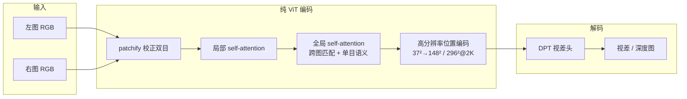

# NBS：No Bias Stereo

**NBS**（*No Bias Stereo*，arXiv:[2608.28933](https://arxiv.org/abs/2608.28933)，[项目页](https://intrinsic-experimental.github.io/nbs-website/)，Intrinsic × Texas A&M）主张：**立体匹配不再需要相关体、迭代 refinement 或冻结深度专家等架构归纳偏置**——一个 **DINOv2 初始化的端到端 ViT**（局部/全局交替 self-attention + **DPT 视差头**）配合 **大规模合成数据**（2.4M 内部场景 + 13 公共集）即可在 **ETH3D、SimpleProc、XYZ-IBD** 上同时取得 **SOTA 精度与更优 GPU 效率**（A100 FP16：**0.060 s** / **1.23 GB** @ 966×546）。

## 一句话定义

**用纯 ViT 注意力替代立体匹配里所有手工几何结构，靠数据规模而非架构偏置赢精度与速度。**

## 英文缩写速查

| 缩写 | 英文全称 | 简要说明 |
|------|----------|----------|
| NBS | No Bias Stereo | 本文：无架构归纳偏置的 ViT 立体匹配 |
| ViT | Vision Transformer | 端到端骨干；无 correlation volume |
| DPT | Dense Prediction Transformer | 密集视差解码头（ISL 风格） |
| EPE | End-Point Error | 视差端点误差（像素） |
| bad@X | Bad Pixel Rate @ X px | 误差 > X 像素的像素占比 |
| FP16 | 16-bit Floating Point | 半精度推理；配合 Flash-Attention |

## 核心信息

| 字段 | 内容 |
|------|------|
| **机构** | Intrinsic（Google）；德州农工大学（Texas A&M University） |
| **arXiv** | [2608.28933](https://arxiv.org/abs/2608.28933)（2026 预印本） |
| **骨干** | **DINOv2 初始化 ViT-Large**；早期局部 attention → 交替 **全局** attention |
| **解码** | **DPT 风格** dense disparity head；masked L1 + 多尺度 gradient-matching |
| **训练** | 分辨率课程 **966×546 → 1932×1330**；**2.4M 内部合成 + 13 公共数据集** |
| **开源（截至 2026-09-09）** | **未开源** — 项目页 **无 GitHub**；论文写 code at 项目 URL 但页内仅 BibTeX/演示 |

## 为什么重要

- **范式级论断：** 立体匹配长期被认为 **必须** 相关体 + 迭代优化才能又快又准；NBS 用项目页全表 SOTA 挑战该信念，并声称解锁 **scaling laws** 式持续改进空间。
- **机器人深度上游：** 双目深度是 SLAM、抓取、Real2Sim、人形感知的通用输入；更高效的基础立体模型降低 **on-robot 深度栈** 时延与显存（对照 FoundationStereo 在 NuRec / LadderMan 等线的角色，见 [立体匹配基础模型方法页](../methods/stereo-matching-foundation-models.md)）。
- **与通用 ViT 趋势一致：** 跨图匹配与单目语义由 **同一 attention** 动态分工，对遮挡、透明、无纹理区域更鲁棒（项目页定性对比）。

## 流程总览

**刻意省略：** correlation volume、迭代 refinement、冻结 monocular depth expert。

## 核心原理

### 1. 无偏置 ViT 立体匹配

将校正双目 patch 化为联合 token 序列，在 **局部** 层提取细粒度特征，在 **全局** 层让 token 同时 attend 到 **跨视图对应**（立体几何）与 **视图内语义**（单目先验）。无显式代价体或循环更新。

### 2. 高分辨率位置编码

亚像素视差依赖精细空间定位。NBS 将 DINOv2 默认 **37×37** 位置网格上采样至 **148×148**（2K 推理 **296×296**），项目页报 bad@0.5 最多改善 **7.2 pt**，纹理丰富区域更锐利。

### 3. 数据替代几何工程

多阶段扩大分辨率与场景多样性，混合 **2.4M 内部合成** 与 **13 个公共数据集**。「纯规模」取代手工设计的匹配算子与多阶段 pipeline。

### 4. 效率来自「plain transformer」

Flash-Attention + FP16：相对自身 FP32 **5.4×** 加速；相对 FoundationStereo / S²M² 等 prior SOTA，**4× 更快、2.8× 更低峰值显存** 且精度更优（SimpleProc-S 表）。

## 评测要点（项目页摘要）

| 基准 | NBS（代表列） | 阅读提示 |
|------|---------------|----------|
| **ETH3D** | EPE **0.09**，bad@1 **0.16**，bad@4 **0.02** | 用户所称「ETH3D two-view 第一」即此类排行榜 |
| **SimpleProc-S** | bad@4 **0.63** | 程序生成 **OOD** 严格测试；bad@4 约为次佳 **~50%** |
| **SimpleProc-M** | bad@4 **1.26** | 中等难度变体 |
| **XYZ-IBD** | EPE **11.39**，bad@4 **23.39** | 工业场景重定向评测 |
| **效率 @966×546** | **0.060 s**，**1.23 GB**，351.5M params | vs FoundationStereo 0.872 s / 6.74 GB |

对照基线含 CREStereo、CroCo、Selective-IGEV、FoundationStereo、S²M² — 见 [立体匹配基础模型](../methods/stereo-matching-foundation-models.md)。

## 源码运行时序图

**不适用**（截至 2026-09-09）：[项目页](https://intrinsic-experimental.github.io/nbs-website/) **未列出 GitHub 仓库**，无可运行官方实现。代码发布后预期路径为：加载校正双目 → ViT 前向 → DPT 视差输出；应更新 `sources/sites/nbs-intrinsic-experimental.md` 并补本图。

## 工程实践

| 项 | 建议 |
|----|------|
| **今日复现** | **不可** — 等官方权重/代码；可先对照 [FoundationStereo](https://github.com/NVlabs/FoundationStereo) / [S²M²](https://github.com/junhong-3dv/s2m2) 开源栈 |
| **选型** | 要 **已开源零样本立体** → FoundationStereo；要 **Middlebury/ETH3D 榜** → 跟进 S²M² 与 NBS 论文数字 |
| **机器人集成** | 双目校正 + 固定 baseline；注意 NBS 训练分辨率课程与 **2K 位置编码** 对部署分辨率的匹配 |
| **评测口径** | ETH3D **two-view** 与 KITTI **driving** 指标不可直接横比；读表时区分 EPE vs D1-all |
| **许可** | 代码未发布；内部 2.4M 合成集 **未声明开放** |

## 对比定位

| 对照 | NBS 差异 |
|------|----------|
| **FoundationStereo** | 基础模型 + 零样本泛化路线；NBS 强调 **无相关体纯 ViT** + **更优效率** |
| **S²M²** | 可扩展可靠深度；NBS SimpleProc 精度更高，S²M² 原始论文在 Middlebury 等亦强 |
| **Selective-IGEV / IGEV** | 迭代 geometry encoding volume；NBS **单趟 ViT** |
| **CroCo** | 跨视图 completion 预训练 + 立体微调；NBS 用 **DINOv2** 初始化而非 CroCo |
| **CREStereo / RAFT-Stereo** | 循环/多级相关场；经典 **强归纳偏置** 代表 |
| [DINOv2](./paper-dinov2.md) | NBS **初始化骨干**（ViT-L） |
| [DPT](./paper-dpt.md) | NBS **视差解码头** 范式 |

## 结论

**NBS 的核心信息不是「又一个立体网络」，而是「立体匹配终于可以像 LLM 一样靠 scale 吃掉手工几何」——但代码与内部数据尚未开放，工程侧仍要按开源基线排期。**

- **真影响指标的是去掉相关体与迭代环**：纯 ViT + DPT 在 ETH3D / SimpleProc / XYZ-IBD **全列最佳或并列最佳**，并同时拿到 **更低时延与显存**——说明瓶颈可从架构工程转向 **数据与算力**。
- **DINOv2 + 高分辨率位置编码是必要配方**：不是随机 ViT；亚像素视差依赖 **148×148（2K 为 296×296）** 位置网格，否则 bad@0.5 可差 **7+ pt**。
- **数据规模是第二根支柱**：2.4M 内部合成 + 13 公共集的多阶段课程，是「No Bias」能 work 的前提；**勿在中小数据集上期待同等结论**。
- **对照实验划清了旧范式边界**：CREStereo / CroCo / Selective-IGEV / FoundationStereo / S²M² 在同一套新 benchmark 上仍落后，支撑「归纳偏置不再必要」的叙事。
- **机器人读法**：双目深度栈可预期走向 **更轻、更通用的 ViT 立体前端**；在权重发布前，NuRec / Real2Sim 仍多用 **FoundationStereo** 类已开源模型。
- **开放风险**：**无 GitHub**、内部合成数据未开放 — 复现与商用需等待 Intrinsic 后续发布。

## 局限与风险

- **代码与权重未公开**（截至 2026-09-09）。
- **内部 2.4M 合成集** 不可复现完整训练配方。
- **KITTI 驾驶场景** 在项目页主表中未强调 — 自动驾驶部署需单独验证。
- **Intrinsic 隶属 Google** 生态，许可与产品化路径待代码发布时核实。

## 关联页面

- [立体匹配基础模型与基准生态](../methods/stereo-matching-foundation-models.md) — S²M² / FoundationStereo / IGEV / CroCo 等对照轴
- [DINOv2](./paper-dinov2.md) — 骨干初始化
- [DPT](./paper-dpt.md) — 密集视差头
- [ETH3D 立体基准](./eth3d-stereo-benchmark.md) — NBS 主报榜基准
- [Middlebury 立体基准](./middlebury-stereo-benchmark.md)
- [KITTI 立体基准](./kitti-stereo-benchmark.md)
- [State Estimation](../concepts/state-estimation.md) — 深度在状态估计链中的位置
- [Sim2Real](../concepts/sim2real.md) — Real2Sim 深度上游

## 参考来源

- [NBS 论文摘录](../../sources/papers/nbs_arxiv_2608_28933.md)
- [NBS 项目页归档](../../sources/sites/nbs-intrinsic-experimental.md)
- [立体匹配生态书目](../../sources/papers/stereo_matching_ecosystem_bibliography.md)
- Taamazyan et al., *NBS: No Bias Stereo* — <https://arxiv.org/abs/2608.28933>
- 项目页：<https://intrinsic-experimental.github.io/nbs-website/>

## 推荐继续阅读

- 项目页交互对比：<https://intrinsic-experimental.github.io/nbs-website/>
- FoundationStereo（已开源零样本对照）：<https://github.com/NVlabs/FoundationStereo>
- S²M²（ICCV 2025 对照）：<https://github.com/junhong-3dv/s2m2>
- ETH3D benchmark：<https://www.eth3d.net/low_res_two_view.php>
