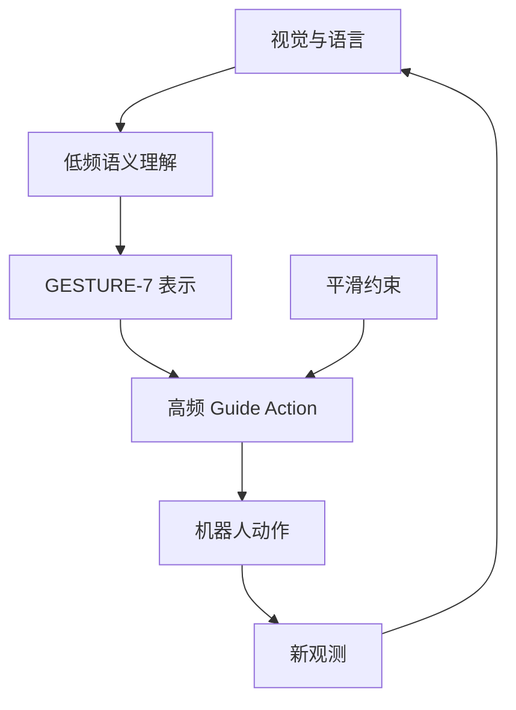

# NebulaVLA

**NebulaVLA: A Dual-Frequency Vision-Language-Action Model With Guide Action for Robotic Manipulation**（arXiv:[2608.16503](https://arxiv.org/abs/2608.16503)）— **中兴通讯（ZTE）**。多模空间 [2026.08.17–08.23 周报](../../sources/blogs/wechat_duomo_vla_weekly_trends_2026-08-17_part1.md) 策展条目；细节以 arXiv 为准。

## 一句话定义

低频理解 + 高频 Guide Action；统一语言化动作跨本体。

## 英文缩写速查

| 缩写 | 英文全称 | 简要说明 |
|------|----------|----------|
| VLA | Vision-Language-Action | 视觉–语言–动作策略 |
| RL | Reinforcement Learning | 强化学习后训练或微调 |
| TTA | Test-Time Augmentation / Adaptation | 测试时增强或适配 |
| SR | Success Rate | 任务成功率 |
| LIBERO | LIBERO Benchmark | 常见操作仿真基准套件 |

## 流程总览

以下按本页已归纳的机制与资料绘制，表示模块或阅读路径关系。

## 核心信息

| 项 | 内容 |
|----|------|
| **机构** | 中兴通讯（ZTE） |
| **评测** | LIBERO-Plus；AgiBot A2 实机 |
| **开源** | 待核实（截至 2026-09-29） |

## 为什么重要

- 纳入 [一周 VLA 趋势（2026.08.17 第一篇）](../overview/vla-weekly-trends-2026-08-17-part1-technology-map.md) 横切面索引。
- 与 [VLA](../methods/vla.md) 方法页及同周其他 **16/16 独立 canonical 节点** 交叉对照。

## 评测与指标

- **仿真：** **LIBERO-Plus** 平均成功率 **85.5%**，显著优于同步（单频）基线（数值摘自 arXiv 摘要，完整表格与基线设定以原文为准）。
- **效率：** 动作生成加速约 **2.7×**（异步双频：高层语义推理与低层动作控制解耦）。
- **实机：** AgiBot A2（见核心信息）；跨本体靠统一的语言化动作表示 **GESTURE-7**，平滑性靠 **Guide Action** 的 mask 平滑约束。

## 与其他工作对比

| 维度 | NebulaVLA | 对照 |
|------|-----------|------|
| 快慢系统 | 异步双频单模型 | [Fast-in-Slow](./cn-os-fast-in-slow.md)：慢推理系统组织任务、快策略执行 |
| 提速手段 | 架构解耦（降低高层调用频率） | [SAFE-Pruner](./paper-safe-pruner.md)：视觉 token 剪枝；[Shallow-π](./paper-shallow-pi.md)：层蒸馏 |
| 跨本体 | GESTURE-7 统一动作表示 | [π₀](./paper-pi0.md)：统一动作维度的 flow 动作专家 |

## 结论

**NebulaVLA 在本库中作为 arXiv:2608.16503 的 canonical 详情节点；部署与复现前请对照原文 PDF/HTML 与作者发布资源。**

1. **canonical 唯一性** — 全库仅此一页绑定 arXiv:2608.16503。
2. **读法** — 先读公众号策展摘要，再读 arXiv 方法与实验节。
3. **开源** — 待核实（截至 2026-09-29）。
4. **安全/评测类**（若适用）— 勿把任务成功率等同于安全或授权跟随。

## 关联页面

- [VLA](../methods/vla.md)
- [Manipulation](../tasks/manipulation.md)
- [一周 VLA 趋势地图（2026.08.17）](../overview/vla-weekly-trends-2026-08-17-part1-technology-map.md)

## 参考来源

- [nebulavla_arxiv_2608_16503.md](../../sources/papers/nebulavla_arxiv_2608_16503.md)
- [多模空间周报归档](../../sources/blogs/wechat_duomo_vla_weekly_trends_2026-08-17_part1.md)
- arXiv：<https://arxiv.org/abs/2608.16503>

## 推荐继续阅读

- [arXiv 摘要页](https://arxiv.org/abs/2608.16503)
