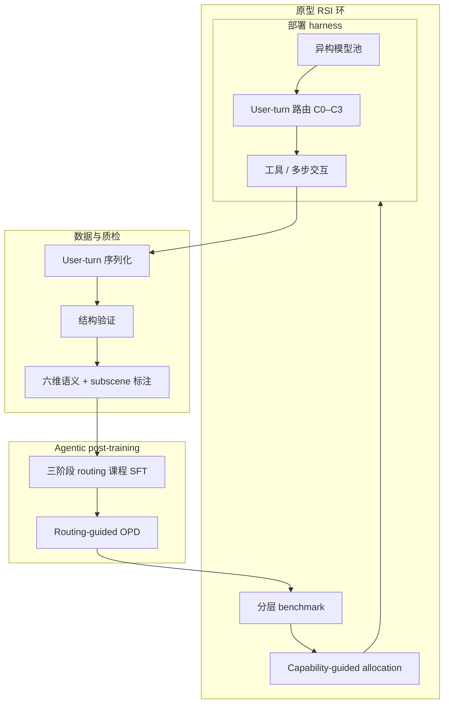
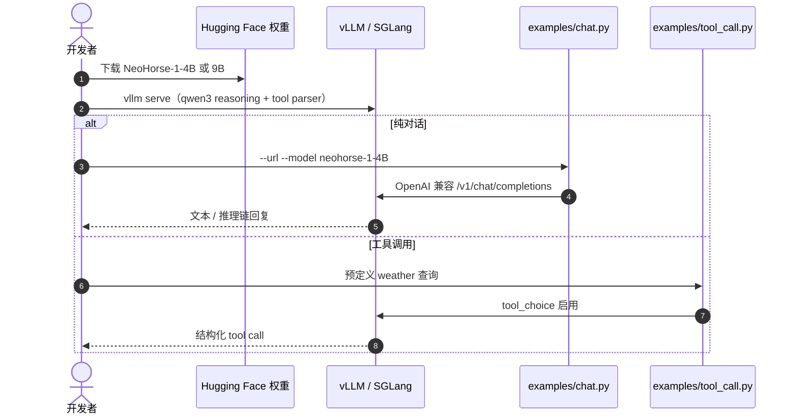

# NeoHorse-1：Routing Harness 上的 Agentic Post-Training 与 RSI 原型

**NeoHorse-1**（*Towards Recursive Self-Improvement via Agentic Post-Training with Routing Harness*，NeoHorse Team / [TokenRhythm](https://tokenrhythm.ai/)，arXiv:[2609.08183](https://arxiv.org/abs/2609.08183)，[代码](https://github.com/TokenRhythm/NeoHorse)）提出：已部署的 **agent routing harness** 天然携带 **能力需求估计、实际路由与交互结果**，可把部署经验组织成 **下一轮 post-training mixture**，并在评测反馈下做 **capability-guided allocation**，形成 **evaluation–selection–update** 闭环——作为通向 **递归自改进（RSI）** 的 **initial prototype**（非已证实的 ignition）。

## 一句话定义

**别只蒸馏静态轨迹——让 routing harness 告诉你「这一轮有多难、实际走了哪条 tier、最后成没成」，再用同一条信号排课程、做 on-policy 蒸馏，并把评测短板写回下一锅数据。**

## 英文缩写速查

| 缩写 | 英文全称 | 简要说明 |
|------|----------|----------|
| RSI | Recursive Self-Improvement | 系统用自身运行证据驱动下一轮改进；本文为 harness 原型环 |
| OPD | On-Policy Distillation | 学生在自生成前缀上接受 teacher token 监督 |
| SFT | Supervised Fine-Tuning | 三阶段 routing 引导课程微调 |
| BFCL | Berkeley Function Calling Leaderboard | 工具调用/agentic 评测之一 |
| Harness | Agent execution layer | 管理上下文、工具与环境交互的执行层 |
| C0–C3 | Capability service tiers | 路由估计的四档相对能力需求（非固定模型 ID） |

## 核心信息

| 字段 | 内容 |
|------|------|
| 机构 | NeoHorse Team / TokenRhythm Technologies |
| 基座 | Qwen3.5-4B、Qwen3.5-9B |
| 发布 | NeoHorse-1-4B/9B（BF16、GGUF、MLX）；后续 **NeoHorse-Jev-4B** 决策头（见官方 README） |
| 上下文 | 原生 262,144 tokens（文档称可扩展至约 1,010,000） |
| 部署 | 文本 in/out；推荐 **SGLang** / **vLLM**，Qwen3 系 **thinking mode** + tool parser |
| 开源状态 | **部分开源**：权重、推理示例、技术报告 PDF **已发布**；routing 生产 harness、训练管线与私有轨迹 **未公开**（见 [`sources/repos/neohorse.md`](../../sources/repos/neohorse.md)） |

## 为什么重要

- **把 RSI 从口号落到可记录机制：** 交互留下 **prediction–action–outcome** 与六维语义质量，而不只是最终答案字符串。
- **Routing 当课程信号而非 served-model 标签：** 用户 override、可用性与策略会污染「实际用了哪个模型」；论文用 **router 预测的能力需求** 排序样本（对齐 [Agentic Routing](https://arxiv.org/abs/2607.11399) 叙事）。
- **SFT + OPD 同进度：** 课程解决 **coverage**；OPD 把监督对齐到 **学生自己的 rollout 前缀**，缓解 teacher 轨迹 off-policy 偏差。
- **对本库读者：** 机器人侧的 [Physical Agentic AI](./paper-physical-agentic-ai.md)、[LLM 控制接口](../concepts/llm-robotics-control-interfaces.md) 同样依赖 **harness 与门控**；NeoHorse 展示 **纯文本 agent 栈** 上如何把 harness 日志变成 **可迭代的训练分布**（与具身 RSI 的 [有界权重/harness 闭环](../concepts/recursive-self-improvement.md) 对照阅读）。

## 方法

| 模块 | 机制 |
|------|------|
| **数据单元** | Trajectory → **user-turn**（保留交错推理/工具/可见回复 + harness 上下文）→ **subscene**（Scene / Goal / Outcome 标注） |
| **质检** | 去重 + 评测去污染 + **结构验证**（工具因果闭包）+ **六维语义**（goal、instruction、tool、evidence、recovery、termination） |
| **Routing 记录** | 每 turn：**raw 预测**、策略调整后决策、**实际服务 tier**（C0–C3）；与 outcome 对齐做 deficiency 分层 |
| **Post-training** | **Routing-guided 三阶段 SFT 课程** + 同阶段的 **routing-guided OPD** |
| **闭环** | 分层评测 → **model-deficiency profile** → 下一轮 mixture 向短板倾斜；新 checkpoint 回到 harness 产新轨迹 |

### 流程总览

### 源码运行时序图

节点对齐 [`sources/repos/neohorse.md`](../../sources/repos/neohorse.md)。仓库 **不提供** 训练/ harness 服务端；下图仅为 **权重推理复现** 路径。

## 工程实践

| 项 | 读法 |
|----|------|
| 复现评测数字 | 需 **thinking mode**、官方 chat template、与论文一致的 harness（如 QwenClawBench 用 **OpenSquilla**）；勿用默认 greedy 短输出 |
| 本地部署 | README 给出 **262144** `max-model-len`；显存不足应 **下调** 而非假设「原生=总能开满」 |
| 4B vs 9B | 9B 在 **长链 debug、失败恢复、策略切换**（WorkBuddy / PinchBench 轨迹）上优势更大；4B 后训练已可在多项 agent 指标 **追平 9B 基座 Qwen3.5** |
| 数据选型 | 同课程下 **routing-harness 轨迹** 优于匹配预算的公开 **Toucan** 合成工具数据（Table 3，+2.65 pp 五基准 avg） |
| RSI 定位 | 对照 [RSI 四层标准](../concepts/recursive-self-improvement.md)：本文更接近 **持久改进 + 有界数据闭环原型**，**不是** 自主设计下一代架构的 ignition |
| 机器人迁移 | 若要把同一 flywheel 接到真机 agent，需先固定 **可回放轨迹 schema** 与 **自动 verify**；见 [真机 autoresearch harness](../queries/real-robot-policy-autoresearch-harness.md) |

## 实验与评测

| 轴 | 报告口径 |
|----|----------|
| **Agentic** | QwenClawBench、WorkBuddy Bench、PinchBench、VitaBench、BFCL v4、τ²-Bench（Airline/Retail/Telecom） |
| **Coding** | HumanEval、LiveCodeBench v6 |
| **Instruction** | IFEval、IFBench |
| **Macro-average（十项）** | NeoHorse-1-4B **64.87**（Qwen3.5-4B **58.94**）；NeoHorse-1-9B **69.04**（Qwen3.5-9B **65.60**） |
| **增益集中区** | Harness 多步执行、工具交互、难代码题；指令跟随提升相对平稳 |
| **Case study** | 调度/审计（证据检索与路径一致性）、WorkBuddy 泄漏审计（README 容忍窗口 vs 自创 2s）、Gomoku HTML（点击索引与落子状态） |

## 结论

**NeoHorse-1 的可复制价值在「harness 日志 → 质检 → routing 排序 → SFT+OPD → 评测反哺 mixture」这条链，而不是单点 benchmark 涨分。**

1. **Macro-average +5.93（4B）说明 post-training  broad，不是某一两项 agent 榜刷出来的。**
2. **4B 后训练追平 9B 基座** 表明 **数据与课程** 可部分换 **参数量**——但 9B 在失败恢复与策略切换上仍更稳，scale 仍付交互税。
3. **Routing 预测作课程键** 避免把「实际 served 模型」误当难度——部署策略噪声会系统性污染标签。
4. **OPD 与课程同进度** 是把「会模仿 teacher 轨迹」推进到「在自家 prefix 上对齐 teacher 知识」的关键一步。
5. **开源边界要读清：** 权重与 **examples/** 可跑通服务；**复现 flywheel 需自建 harness 与训练栈**。
6. **RSI 诚实定位：** 报告自称为 **initial prototype**；跨迭代 sustained loop 仍是下一步，勿与 MetaRSI / ignition 叙事混读。

## 局限与风险

- **训练与 harness 未公开：** 外部只能验证 **推理侧** 与论文描述，无法审计完整数据配比与路由策略。
- **Thinking + 超长输出：** 评测配置（51200 / 32768 max output）成本高；与生产延迟/成本 tradeoff 未在同一表内展开。
- **去污染与 judge 依赖：** 语义维与 VitaBench 等需 **外部 judge 模型**；换 judge 可能漂移绝对分。
- **具身 gap：** 基准为 **文本 agent**；迁移到 [物理 agent 编排](./paper-physical-agentic-ai.md) 需额外 **安全门控与状态估计**。

## 关联页面

- [递归自改进（概念）](../concepts/recursive-self-improvement.md) — 四层标准与 NeoHorse 原型环对照
- [RSI Survey（2607.07663）](./paper-rsi-survey-2607-07663.md) — RSI taxonomy 与验证层级
- [Physical Agentic AI](./paper-physical-agentic-ai.md) — 多机器人 harness 门控 vs 文本 routing flywheel
- [LLM 机器人控制接口](../concepts/llm-robotics-control-interfaces.md) — 规划层 agent 与物理执行分离

## 参考来源

- [NeoHorse-1 论文归档（arXiv:2609.08183）](../../sources/papers/neohorse_arxiv_2609_08183.md)
- [NeoHorse 仓库归档](../../sources/repos/neohorse.md)
- [TokenRhythm 项目入口归档](../../sources/sites/tokenrhythm.md)

## 推荐继续阅读

- 技术报告：<https://arxiv.org/abs/2609.08183>
- 模型合集：<https://huggingface.co/collections/TokenRhythm/neohorse-1>
- Agentic Routing 数据飞轮：<https://arxiv.org/abs/2607.11399>
- OpenSquilla（文内 harness）：TokenRhythm aiXiv 预印本（README / 报告引用）
