# NestDex：嵌套策略 + Copilot 灵巧遥操作

**NestDex**（*Nested Policy Learning with Copilot Assisted Teleoperation for Dexterous Manipulation*，[arXiv:2608.13362](https://arxiv.org/abs/2608.13362)，[项目页](https://aus.bot/research/nestdex/)）来自 **悉尼大学（The University of Sydney）** / **Australian Centre for Robotics** / **PAIR Lab** 与 **范德堡大学（Vanderbilt University）**：把可复用的本体感觉手技能嵌进示范采集，操作员只管臂与 1-DoF clutch；完整示范再训**独立**的外层 visuomotor。

## 一句话定义

**别让操作员同时编「臂往哪走」和「20 个手指关节怎么接触」——内层手技能当 copilot 采完整任务，外层策略部署时把内层卸掉。**

## 英文缩写速查

| 缩写 | 英文全称 | 简要说明 |
|------|----------|----------|
| NestDex | Nested Dexterous Policies | 本文嵌套内层手技能 / 外层任务策略框架 |
| H-VAE | Hand-action Variational Autoencoder | 把 20-DoF 手指令压到 10-D latent 作 BC 目标 |
| VLM | Vision-Language Model | 采数期按腕相机画面选择当前内层技能 |
| ACT | Action Chunking with Transformers | 内外层均预测动作块并用时间集成执行 |
| BC | Behavior Cloning | 外层 visuomotor 的监督目标 |
| DoF | Degree of Freedom | 本文 clutch 为 1-DoF；WujiHand I 为 20-DoF |

## 为什么重要

- **对准灵巧采数的真正瓶颈：** 平行夹爪几乎是 1-D 开合；多指手要求操作员在整段任务里同时指定臂轨迹与接触丰富的手指运动。
- **共享自治只用于采数：** 与把手策略留在部署环里的 shared autonomy 不同，NestDex 的内层与 VLM 选择器**不进入**最终控制器。
- **可复用技能库：** 同一 grasp 内层策略跨四物体共训，只吃关节位置与力矩，接触几何通过本体感觉间接进入。
- **动作空间可学：** H-VAE 压缩协调的手指令，臂仍走关节空间；四任务外层成功率一致上升。
- **同实验室互补：** [AutoIntervene](./paper-autointervene.md) 管部署期 chunk 接管；本文管**采数期** copilot，二者都服务 action-chunking 飞轮。

## 核心信息

| 字段 | 内容 |
|------|------|
| 机构 | 悉尼大学（The University of Sydney）/ Australian Centre for Robotics / PAIR Lab；范德堡大学（Vanderbilt University） |
| 发表 | arXiv preprint（Submitted 2026-08-13） |
| arXiv | [2608.13362](https://arxiv.org/abs/2608.13362) |
| 项目页 | <https://aus.bot/research/nestdex/> |
| 代码 | **确认未开源**（截至 2026-08-17；见工程实践） |
| 平台 | Leader：7-DoF Piper Nero + 1-DoF clutch；Follower：同臂 + **WujiHand I（20-DoF）** + 腕相机 |
| 基线 | 同平台 [AnyTeleop](https://arxiv.org/abs/2307.04577) 视觉手重定向 |

## 核心原理

### 输入 / 输出

| 阶段 | 输入 | 输出 |
|------|------|------|
| 内层训练 | 多视人手关键点 → Huber 向量重定向轨迹 \((\mathbf{q},\mathbf{e})\) | 本体感觉 chunk：30 步历史 → 30 步手关节 |
| Copilot 采数 | Leader 臂关节 + clutch 标量 + 腕相机（VLM） | Follower 臂关节指令 + 内层生成的手轨迹 |
| 外层训练 | 腕相机 \(256\times256\) + 臂/手状态；手指令经 H-VAE | 臂关节 chunk + 10-D 手 latent chunk（\(H=100\)） |
| 部署 | 同外层观测 | 臂关节 + H-VAE decoder 还原的手关节；**无内层、无 VLM** |

### 流程总览

```mermaid
flowchart TB
  subgraph inner [内层技能库]
    Cam["多视人手关键点"]
    Ret["AnyTeleop 向量重定向\nHuber + 时序平滑"]
    Pin["本体感觉 Transformer\n每技能一条"]
    Cam --> Ret --> Pin
  end
  subgraph collect [Copilot 采数]
    Arm["操作员控 leader 臂"]
    Clutch["1-DoF clutch → 进度 p_t"]
    VLM["腕相机 VLM 选技能\n仅在 r=0 切换"]
    Exec["闭环查询 + 时间集成\n可逆、可保持"]
    Arm --> Exec
    Clutch --> Exec
    VLM --> Exec
    Pin --> Exec
  end
  subgraph outer [外层自治]
    Demo["完整任务示范"]
    HVAE["H-VAE：20-DoF → 10-D"]
    Out["visuomotor Transformer\nDINOv3 + chunk H=100"]
    Deploy["部署：decoder 还原手关节"]
    Demo --> HVAE --> Out --> Deploy
    Exec --> Demo
  end
```

### 关键机制（压缩）

1. **分工：** 人给任务级臂运动与技能进度；内层根据最新 \((\mathbf{q},\mathbf{e})\) 生成接触相关手指协调。
2. **可逆 clutch：** 进度映射到执行索引，每周期最多 ±1 步；反向清 ensemble、保留缓冲，可退回后从新本体感觉继续。
3. **阶段选技能：** VLM 只在技能执行索引归零时重选，避免中途换策略。
4. **嵌套而非层级部署：** 内层 / VLM 是采数脚手架；外层 BC 学完整臂+手，部署卸掉脚手架。
5. **只压手、不压臂：** H-VAE 针对高相关手指令；臂仍在关节空间，避免把任务级位移塞进手 latent。

## 源码运行时序图

**不适用**：截至 **2026-08-17**，[aus.bot/research/nestdex](https://aus.bot/research/nestdex/) 未列训练/推理入口；GitHub 无官方仓。代码公开后再补本图。

## 工程实践

| 项 | 建议 / 论文设定 |
|----|----------------|
| 硬件接口 | Leader–follower 关节直映臂；clutch 只管手技能进度，不要让操作员直接编 20-DoF |
| 内层 | 4 encoder + 1 decoder Transformer；10 条技能轨迹；AdamW 20k step，batch 256，lr \(10^{-5}\)；100 Hz |
| 重定向 | AnyTeleop 向量对应 + Huber；多视三角化减遮挡；\(\beta\) 时序平滑 |
| H-VAE | 隐层 \([128,64]\)；20-D → 10-D；100 epoch，batch 512，lr \(10^{-3}\)；标签用 posterior **mean** |
| 外层 | DINOv3（LVD-1689M）+ 同结构 Transformer；chunk \(H=100\)；50k step，batch 8，lr \(10^{-5}\) |
| 时间集成 | 每步查询、重叠 chunk、指数权重；瓶抓消融显示：闭环适应接触，ensemble 降 jerk |
| 复现现状 | **未开源**；见 [项目页归档](../../sources/sites/aus-bot-nestdex.md) |

## 实验与评测

六任务（Table I）：Tongs Transfer、Bottle Disposal、Dual-Object Transfer、Ingredient and Pot Transfer（单臂）；Toast Preparation、Binder Filing（双臂）。成功须完成任务描述中的**全部步骤**。采数时间 =（成功+失败总时长）/ 成功次数，并摊销每技能 10 条内层轨迹的一次性成本。

| 设置 | 结果要点 |
|------|----------|
| Copilot 采数（20 次/任务） | 六任务成功率 **100%**；单臂成功示范约 **36–44 s**；Toast **327 s**、Binder **222 s** |
| AnyTeleop 同平台 | Tongs / Toast / Binder **0%**（N/A 时间）；Bottle 50% / 89 s；Dual-Object 30% / 122 s；Ingredient 75% / 55 s |
| 外层 Copilot + H-VAE | Tongs **100%**、Bottle **75%**、Dual-Object **90%**、Ingredient **100%**（20 rollout） |
| 外层 Copilot、无 H-VAE | 65 / 60 / 80 / 85% — H-VAE 四任务均抬升 |
| 外层 AnyTeleop、无 H-VAE | N/A / 40 / 20 / 75% — 同数据量下弱于 Copilot 示范 |
| 瓶抓执行（各 10 次） | 开环回放 3/10；闭环无 ensemble 7/10；闭环+时间集成 **9/10**（vs 回放 \(p=0.0198\)） |
| 平滑 | 无 ensemble 的执行指令 P95 jerk 约 **2.30×**（\(p=1.8\times10^{-4}\)），闭合时长不增加 |
| 技能复用（定性） | Toast：Tongs Grasp → Button Press → Plate Grasp → 再回 Tongs Grasp；Binder 在打孔后回到 Paper Pinch |

Q5 提醒：四物体 grasp 展示的是**训练接触条件内**的适应，不是未见物体泛化。

## 结论

**灵巧操作往往卡在「采得到完整、一致的示范」，而不是外层网络容量；把接触丰富的手运动交给可逆 copilot，人只控臂与进度，外层才能从干净数据里学会整任务。**

1. **先看采数成功率，再谈策略容量** — AnyTeleop 在三任务上采不到成功示范，外层无从训起。
2. **内层不要留在部署环** — 嵌套的价值是采数脚手架；最终控制器应是独立 visuomotor。
3. **H-VAE 值得做** — 只压手、不压臂，四任务成功率一致上升（如 Tongs 65%→100%）。
4. **接触技能要闭环** — 开环回放一条成功手轨迹会脆（3/10）；用最新 \((\mathbf{q},\mathbf{e})\) 重算才稳。
5. **时间集成是平滑，不是精度魔法** — 两套闭环成功率样本未分出显著差异，但 jerk 与接触后力矩明显更稳。
6. **VLM 选技能要有门闩** — 只在进度归零时切换，避免技能执行中途换策略。
7. **选型边界** — 相对 [TeleDexter](./paper-teledexter.md)（仿真 RL 小脑 + MoCap 指尖/物体目标）与 Dex-VLA shared autonomy（手策略可留在环内），本文是 **leader–follower + clutch**、部署卸 copilot；代码未开前只作协议对照。

## 局限与风险

- **确认未开源：** 无法复现内层训练、clutch 映射、H-VAE 与真机栈。
- **内层技能要先采：** 每技能 10 条重定向轨迹；任务阶段变多时技能库要膨胀，摊销成本才划算。
- **grasp 不声称未见物体：** 四物体都在训练集里。
- **外层只报四任务：** Toast / Binder 用于展示长程 copilot 采数，文中未给对应外层成功率。
- **单操作员、同平台：** 消除硬件混杂，但不覆盖新手群体或跨硬件。
- **误区：** 把 NestDex 当成「部署时仍挂内层技能」的层级策略，或当成已发布遥操作中间件。

## 与其他工作对比

| 路线 | 人控什么 | 机器控什么 | 部署是否还要 copilot | 开源 |
|------|----------|------------|----------------------|------|
| AnyTeleop / 视觉手镜像 | 臂 + 全部手指 | 重定向求解 | 无（纯遥操作） | 工具开源；本文作基线 |
| Dex-VLA shared autonomy（[arXiv:2511.00139](https://arxiv.org/abs/2511.00139)） | VR 臂 | 手 VLA（触/视） | 采数环内保留手策略 | 见其项目页 |
| [TeleDexter](./paper-teledexter.md) | 指尖 + 物体位姿 | 仿真 RL co-tracking | 遥操作控制器本身 | **未开源** |
| [RSA](./paper-residual-policy-shared-autonomy.md) | 人的连续动作 | 残差最小干预 | 是（安全 copilot） | **已开源** |
| [AutoIntervene](./paper-autointervene.md) | 部署失败时接管 | chunk 策略 + 支持监控 | 是（部署监控层） | **未开源** |
| **NestDex（本文）** | **臂 + 1-DoF 进度** | **内层手技能（仅采数）** | **否** | **未开源** |

## 关联页面

- [Teleoperation](../tasks/teleoperation.md) — 遥操作主任务页与系统对照表
- [灵巧操作数据采集指南](../queries/dexterous-data-collection-guide.md) — copilot 作为第四条采数通道
- [Action Chunking](../methods/action-chunking.md) — chunk + 时间集成
- [Behavior Cloning](../methods/behavior-cloning.md) — 外层监督目标
- [AutoIntervene](./paper-autointervene.md) — 同实验室：部署期接管
- [TeleDexter](./paper-teledexter.md) — 灵巧遥操作「低层执行」对照
- [双臂操作](../tasks/bimanual-manipulation.md) — Toast / Binder 长程双臂
- [深度遥操作路线](../../roadmap/depth-teleoperation.md) — Stage 4/5

## 参考来源

- [NestDex 论文摘录（arXiv:2608.13362）](../../sources/papers/nestdex_arxiv_2608_13362.md)
- [项目页归档](../../sources/sites/aus-bot-nestdex.md)

## 推荐继续阅读

- Zhao, Tang, Ba & Zhi, *NestDex* — [arXiv:2608.13362](https://arxiv.org/abs/2608.13362)
- [PAIR Lab 研究站条目](https://aus.bot/research/nestdex/)
- Qin et al., *AnyTeleop*（RSS 2023）— 本文视觉重定向与采数基线
- Zhao et al., *Learning Fine-Grained Bimanual Manipulation with Low-Cost Hardware*（ACT / 时间集成）
- Cui et al., *End-to-End Dexterous Arm-Hand VLA Policies via Shared Autonomy*（[arXiv:2511.00139](https://arxiv.org/abs/2511.00139)）— 手策略留在采数环的对照
