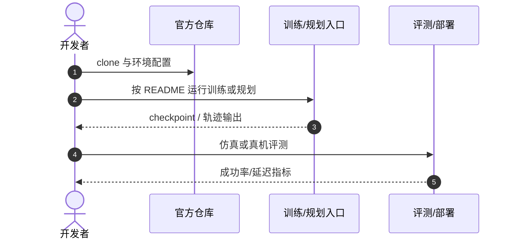

# Neural GCS

**Accelerating Mixed Discrete-Continuous Motion Planning via Neural Graphs of Convex Sets**（[arXiv:2608.15440](https://arxiv.org/abs/2608.15440)，[项目页](https://neural-gcs.github.io/)）——Northeastern University（RIVeR Lab）等。

## 一句话定义

**学习模块可以先替规划器筛路，而不是直接取代规划器。**

## 英文缩写速查

| 缩写 | 英文全称 | 简要说明 |
|------|----------|----------|
| GCS | Graphs of Convex Sets | 离散-连续耦合规划框架 |
| GAT | Graph Attention Network | 图注意力候选路径预测 |
| DoF | Degrees of Freedom | 机械臂自由度 |

## 为什么重要

- 纳入 [具身智能小站 2026-08-23 九篇盘点](../../sources/blogs/wechat_embodied_station_9_papers_open_source_2026-08-23.md) 的「长视野 VLA → 动作分布 → 真实交互」主线。
- 开源状态（入库日）：**已开源**。

## 核心信息

| 项 | 内容 |
|----|------|
| **机构** | Northeastern University（RIVeR Lab）等 |
| **出处** | arXiv:2608.15440（2026-08） |
| **开源** | **已开源** |

### 流程总览

## 评测

| 项 | 内容 |
|----|------|
| **主结果** | 3D 四旋翼、7-DoF KUKA IIWA、planar pushing；**100%** 成功率下相对 nominal GCS 最高 **两个数量级** 加速，解有次优性。 |

- 数据出处：[ingest 摘录](../../sources/papers/neural_gcs_arxiv_2608_15440.md)。

## 结论

**神经候选生成 + 轻量排序可让 GCS 在线重规划进入实用延迟区间。**

- GAT 单次前向替代昂贵凸松弛
- ranking network 按估计代价排序候选
- 提前终止搜索保持高成功率
- 接触丰富 pushing 与避障导航均验证
- 官方 GitHub 已链

## 源码运行时序图

## 与其他页面的关系

- [smooth-navigation-path-generation](../methods/smooth-navigation-path-generation.md)
- [manipulation](../tasks/manipulation.md)
- [locomotion](../tasks/locomotion.md)
- [vla-robustness-9-papers-technology-map](../overview/vla-robustness-9-papers-technology-map.md)

## 参考来源

- [neural_gcs_arxiv_2608_15440](../../sources/papers/neural_gcs_arxiv_2608_15440.md)
- [neural-gcs](../../sources/sites/neural-gcs.md)
- [neural-graphs-of-convex-sets](../../sources/repos/neural-graphs-of-convex-sets.md)
- [wechat_embodied_station_9_papers_open_source_2026-08-23](../../sources/blogs/wechat_embodied_station_9_papers_open_source_2026-08-23.md)

## 推荐继续阅读

- [arXiv:2608.15440](https://arxiv.org/abs/2608.15440)
- [官方代码](https://github.com/RIVeR-Lab/neural-graphs-of-convex-sets)
