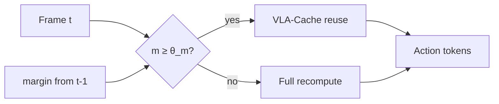

# Neural Introspection Gating（Gated VLA-Cache · arXiv:2608.10824）

**Neural Introspection Gating**（*Neural Introspection Gating for Adaptive KV-Cache Reuse in Vision-Language-Action Models*，[arXiv:2608.10824](https://arxiv.org/abs/2608.10824)）由 **东京大学（The University of Tokyo）** Wu / Kawaharazuka / Okada 提出（**IROS 2026**）：在 VLA-Cache 的观测空间缓存之上，增加 **零成本 logit-margin 内省门控**，模型犹豫时强制全量重算。[项目页](https://zjw4321.github.io/neural-introspection-gating-page/)。

## 一句话定义

**视觉看起来没变，不等于动作还敢复用缓存：用 top-1/top-2 动作 margin 决定 KV 是否作废。**

## 英文缩写速查

| 缩写 | 英文全称 | 简要说明 |
|------|----------|----------|
| VLA | Vision-Language-Action | 图像+语言→动作的自回归策略 |
| KV | Key-Value cache | Transformer 层缓存的键值状态 |
| NIG | Neural Introspection Gating | 本工作的内省门控模块 |
| OFT | OpenVLA Fine-Tuning（OpenVLA-OFT） | 高效微调变体；本文第二骨干 |
| LIBERO | — | 操纵基准四套件（Spatial/Object/Goal/Long） |

## 为什么重要

- **VLA 实时性瓶颈在视觉 prompt 前向：** 相邻帧大量冗余，但盲缓存会在抓取对齐等关键步注入误差。
- **训练无关、可插拔：** 不改权重，只改推理调度；适合已有 OpenVLA 部署。
- **把「模型不确定」变成可测信号：** margin 是解码副产品，无需额外前向。

## 核心信息

| 项 | 内容 |
|----|------|
| **机构** | 东京大学（The University of Tokyo） |
| **基线** | VLA-Cache（patch 相似度 + task-relevant + entropy-adaptive） |
| **骨干评测** | OpenVLA、OpenVLA-OFT |
| **开源** | **截至 2026-08-13 未开源**（项目页 GitHub 禁用） |
| **源码运行时序图** | **不适用**（无可运行官方实现） |

## 核心原理

### VLA-Cache 三阶段（保留）

1. **Static patch detection** — 帧间 patch 余弦相似度 \(>\tau\)（默认 0.996）标可复用。
2. **Task-relevant filtering** — 高 text→vision attention 的静态块强制重算。
3. **Entropy-adaptive layer reuse** — 低熵层多复用、高熵层多重算。

### 内省门控（新增）

对上一时刻 \(D\) 维动作 token，算均值 margin：

\[
m_{t-1}=\frac{1}{D}\sum_{d=1}^{D}\bigl[p_1(a_{t-1}^{d})-p_2(a_{t-1}^{d})\bigr]
\]

若 \(m_{t-1}<\theta_m\)，丢弃缓存并对当前帧 **full inference**；否则走 VLA-Cache。

### 流程总览

## 工程实践

| 项 | 建议读法 |
|----|----------|
| 适用动作头 | **离散动作 token + softmax**；连续/flow 头需另定义置信 |
| 调参 | \(\theta_m\) 控制「更稳 vs 更省」；Long/Goal 上盲缓存伤分时优先收紧 |
| 开销 | 门控本身零额外前向；触发 full 时局部回升 TFLOPs |
| 何时不必上 | OpenVLA-OFT 上盲缓存已稳时，增益有限 |
| 开源跟进 | 盯项目页 GitHub 按钮是否启用 |

## 实验与评测

OpenVLA（Success % / TFLOPs）：

| Suite | Full | VLA-Cache | Gated（Ours） |
|-------|------|-----------|---------------|
| Spatial | 78.8 / 1.89 | 78.8 / 1.43 | **79.4 / 1.55** |
| Object | 70.4 / 1.86 | 69.4 / 1.44 | 67.8 / 1.54 |
| Goal | 77.2 / 1.83 | 74.0 / 1.40 | **77.4 / 1.50** |
| Long | 54.0 / 1.88 | 50.2 / 1.43 | **54.8 / 1.54** |
| Avg | 70.1 / 1.87 | 68.1 / 1.43 | **69.9 / 1.53** |

OpenVLA-OFT：平均约 **95.7% / 3.13 TFLOPs**，与 Full/Cache 基本持平、开销略增。

## 结论

**高效 VLA 推理不能只看「画面变没变」，还要看「模型当下敢不敢用旧 KV」；logit margin 是最便宜的那根保险丝。**

1. **优先在 Goal/Long 等盲缓存掉点的套件上开闸** — Spatial 上收益有限。
2. **保留约 80% 算力节省是设计目标，不是再抠到极限 cache** — 1.54 vs 1.43 TFLOPs 换回 Long 掉点值得。
3. **OFT 已稳时别指望再涨分** — 门控的价值是安全网。
4. **选型坐标：** 要训练无关加速 → NIG/VLA-Cache；要小模型重训 → TinyVLA/SmolVLA 路线。

## 局限与风险

- Object 套件上相对 Cache 略降（67.8 vs 69.4），门控非处处支配。
- 阈值阈值与阈值敏感；跨模型需重标定 \(\theta_m\)。
- 代码未开源，工程移植需自接 OpenVLA 推理栈。

## 与其他工作对比

| 工作 | 关系 |
|------|------|
| VLA-Cache | 直接基线；本工作加模型内置信门 |
| FastV / PyramidDrop | 层内/跨层视觉 token 剪枝；不针对时序 KV 复用 |
| 小模型 VLA | 重训换速度；本方法保 7B 骨干 |

## 关联页面

- [VLA](../methods/vla.md)
- [LIBERO](./libero-benchmark.md)
- [VLA 开源复现景观](../overview/vla-open-source-repro-landscape-2025.md)

## 参考来源

- [论文归档](../../sources/papers/neural_introspection_gating_arxiv_2608_10824.md)
- [项目页归档](../../sources/sites/neural-introspection-gating-github-io.md)

## 推荐继续阅读

- 项目页结果表：<https://zjw4321.github.io/neural-introspection-gating-page/>
- 论文 HTML：<https://arxiv.org/html/2608.10824>
