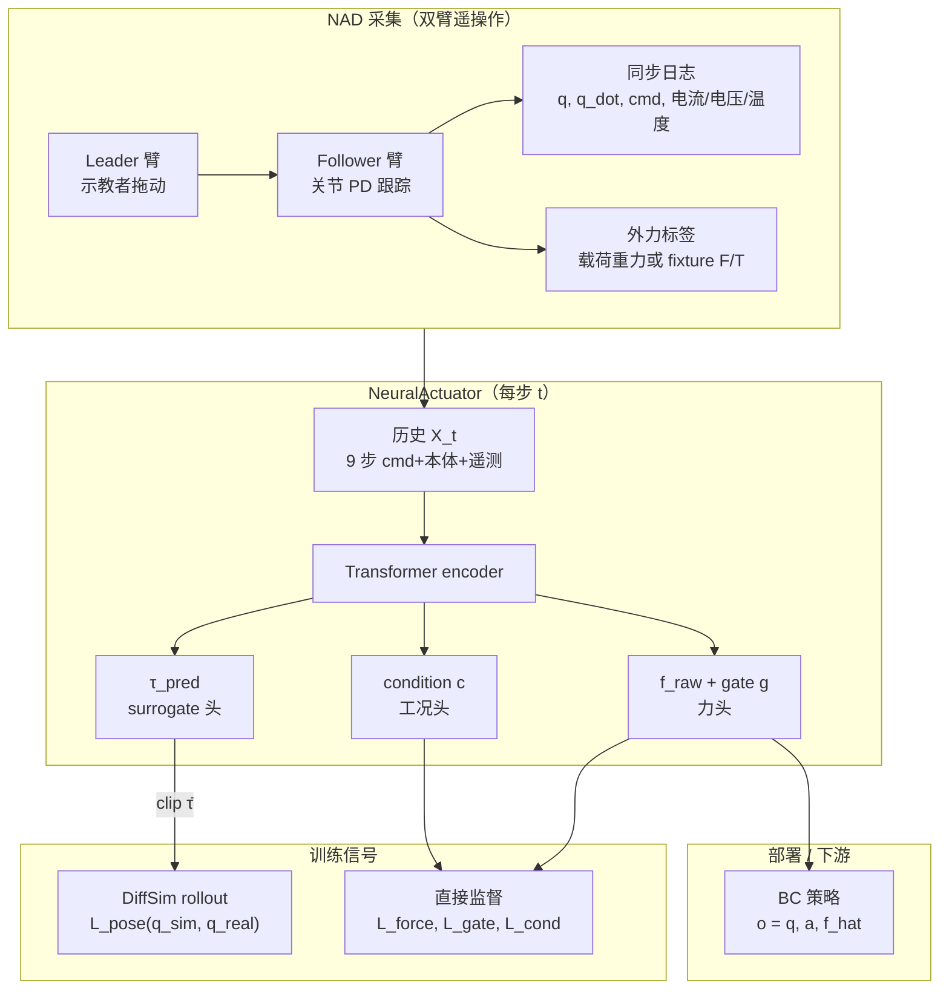

# NeuralActuator（Neural Actuation Modeling · arXiv:2607.11734）

**NeuralActuator**（*Neural Actuation Modeling for Robot Dynamics and External Force Perception*，[arXiv:2607.11734](https://arxiv.org/abs/2607.11734)，MIT CDFG 等，[项目页](https://frank-zy-dou.github.io/projects/NeuralActuator/index.html)，[代码](https://github.com/Frank-ZY-Dou/Dynamics-Modeling/tree/main/NeuralActuator)）面向 **低成本舵机操作臂**，用 **历史相关的 Transformer** 同时学习：(i) **可微仿真所需的广义力矩 surrogate**（无需直接 effort 标签）；(ii) **部署时无 F/T 传感器的外力估计 + 接触概率门控**；(iii) **电机工况分数**。配套发布 **Neural Actuation Dataset（NAD）** 与 **双臂 leader–follower 遥操作采集系统**。

## 一句话定义

**把「不可靠的 τ=K_t I」换成可微仿真监督的多任务执行器网络——同一模块既缩小 sim-to-real 动力学 gap，又为 BC 策略提供在线力反馈。**

## 英文缩写速查

| 缩写 | 英文全称 | 简要说明 |
|------|----------|----------|
| NAD | Neural Actuation Dataset | 同步状态、执行器遥测与外力标签的真机数据集 |
| DiffSim | Differentiable Simulation | 通过 pose rollout 反传监督 torque surrogate 头 |
| BC | Behavior Cloning | 下游模仿学习；冻结 NeuralActuator 提供 $\hat f$ |
| F/T | Force/Torque Sensor | 推理阶段 **不需要**；训练/评测可用 fixture 传感器 |
| MAE | Mean Absolute Error | rollout 关节角（deg）与力（N）主指标 |
| SO-101 | — | LeRobot 栈 **6-DoF 低成本臂**，跨平台验证平台之一 |
| PD | Proportional–Derivative | follower 关节空间闭环跟踪 leader 状态 |
| IoU | Intersection over Union | 可微渲染 silhouette 监督实验中的对齐指标 |

## 为什么重要

- **奖项：** RSS 2026 **最佳系统论文奖**；本库节点已存在，本次由量子位报道交叉回链。
- **执行器 gap 的新监督范式：** 与依赖 **关节力矩传感** 或 **可靠电流标定** 的 [Actuator Network](../methods/actuator-network.md) / 经典 ID 不同，**torque surrogate 头仅用 pose 轨迹 + 可微物理反传**，适配 Dynamixel 等 **无可靠 τ 标签** 的平台。
- **动力学 + 力感知统一：** 同一遥测历史预测 **simulator-equivalent 输入** 与 **末端 3D 外力**；contact gate 抑制无接触时的力幻觉——与 [Current as Touch](./paper-current-as-touch-proprioceptive-contact.md) 的 **CRP 柔顺接口** 形成 **力估计 vs 力控接口** 对照。
- **可复现实验栈：** NAD 覆盖 **自由运动、已知载荷、六轴 fixture 交互、Joint 3 机械受限**；三平台（**OpenManipulator-X ~$500**、**SO-101**、**Franka 离线 benchmark**）跨度大，便于对照 [BAM](./paper-bam-extended-friction-servo-actuators.md) 等 **解析摩擦** 路线。
- **下游闭环实证：** 冻结模块接入 BC 后 pick-and-place **80%→92.5%**、lift-and-hold **85%→95%**；position-only 基线出现 **>1200 mA 过流保护** 早停。

## 流程总览

## 核心结构与方法

| 模块 | 要点 |
|------|------|
| **输入特征** | 命令 $q^{cmd}$、本体 $q,\dot q$、跟踪误差、平台遥测 $u$（电流 / load register / 力矩指令）、$V,T$；**8 历史 + 当前 = 9 token** |
| **Torque surrogate** | 预测 $\tau^{pred}$，**clip 后** 作为 DiffSim 广义控制输入；**不假设** 固定 $K_t$；载荷/接触未进前向模型时 surrogate 可 **吸收 lumped 效应** |
| **Force + gate** | $\hat f = g \cdot \hat f_{raw}$；$g_{gt}=\mathbb{I}[\|f_{gt}\|>\epsilon]$（$\epsilon=0.01$ N） |
| **Motor condition** | 每通道 $c_j\in[0,1]$；OpenManipulator-X 实验 **仅 Joint 3** 有 rubber-band 受限监督 |
| **架构** | 4× gated-attention Transformer；**1.44M** 参数；mean pooling → 四 MLP 头 |
| **推理** | GPU **~0.25 ms** mean / **4019 Hz** batch=1；满足 **60 Hz** 控制 |

### 与经典力估计的关系

操纵器方程 $\tau_{ID} = M\ddot q + C\dot q + g = \tau_{act} + J_v^\top f^{ext}$ 提供 **物理语境**，但实现 **不强制** 可辨识分解：surrogate 驱动仿真，力头 **独立监督**，不经 $J_v^\top$ 回灌状态更新。经典 **ID-Linear / ID-Friction / GMO** 基线用 **$K_t i + b$** 近似 $\tau_{act}$，低成本舵机上残差污染 $\hat f^{ext}$。

## 实验要点

| 轴 | 报告口径（项目页 / 论文） |
|----|---------------------------|
| **Rollout（无载 @600）** | 关节 MAE **~3.1°**；gripper slide **0.2 mm** |
| **力传感器测试 @500** | Force MAE **0.23 N**；关节 **1.78–3.31°** |
| **载荷测试 @600** | Force MAE **0.11 N** avg |
| **力基线 avg** | ID-Linear **1.41 N** → NeuralActuator **0.12 N** |
| **Joint 3 工况** | Acc **91.0%** / AUC **0.95** |
| **BC（40 trials）** | Pick-place **92.5%** vs **80%**；Go up-stay **95%** vs **85%** |
| **跨平台** | SO-101 rollout+force；Franka **仅离线** 载荷 $f_z$ MAE **~0.28 N @500** |
| **架构消融** | vs MLP/GRU/LSTM（同 ~1.4M 参数），Transformer Force **0.23 N** 最优 |

## 与其他路线对比

| 路线 | 监督信号 | 力感知 | 可解释性 |
|------|----------|--------|----------|
| **NeuralActuator** | Pose + DiffSim；力/门/工况直接标签 | **联合学习**，无部署 F/T | 中（surrogate 非校准 τ） |
| **[Actuator Network](../methods/actuator-network.md)** | 真机 **τ 或电流标定** 序列 | 通常无 | 低（黑箱 MLP） |
| **[BAM](./paper-bam-extended-friction-servo-actuators.md)** | 摆锤 **CMA-ES** 摩擦参数 | 无 | 高（M1–M6 解析） |
| **[Current as Touch](./paper-current-as-touch-proprioceptive-contact.md)** | 演示学 **CRP** | 电流→柔顺 **位置** | 中（接口层） |
| **[SAGE](./sage-sim2real-actuator-gap-estimator.md)** | sim/real 成对重放 | 无 | 中（gap 度量） |

## 常见误区或局限

- **误区：** 把 **torque surrogate** 当成 **物理关节力矩**；论文明确在 **无载荷/接触的前向模型** 下它是 **simulator-equivalent 广义输入**，可吸收未建模效应。
- **误区：** 认为 Franka 实验验证了 **在线动力学**；Franka 仅为 **future-state-conditioned 离线载荷力** benchmark。
- **误区：** condition 头等于 **电机故障诊断**；实验仅是 **rubber-band 机械受限 vs 正常** 的受控二分类。
- **局限：** 训练 rollout 为 **recorded-telemetry-conditioned**（非 counterfactual 指令预测）；未见载荷 **泛化** 仅有限 unseen geometry 测试；NAD **未开源链接** 于项目页（以论文/页为准）。

## 关联页面

- [Sim2Real](../concepts/sim2real.md)、[System Identification](../concepts/system-identification.md)
- [Actuator Network](../methods/actuator-network.md)、[Implicit / Explicit 执行器建模](../concepts/implicit-explicit-actuator-modeling.md)
- [BAM 扩展摩擦](./paper-bam-extended-friction-servo-actuators.md)、[SAGE](./sage-sim2real-actuator-gap-estimator.md)
- [Current as Touch](./paper-current-as-touch-proprioceptive-contact.md)、[LeRobot](./lerobot.md)
- [执行器驱动链选型闭环知识链](../queries/actuator-drive-chain-selection-loop.md) — NeuralActuator 是③层数据驱动执行器网络路线的方法来源

## 推荐继续阅读

- [NeuralActuator 论文（arXiv:2607.11734）](https://arxiv.org/abs/2607.11734)
- [项目页与定量结果表](https://frank-zy-dou.github.io/projects/NeuralActuator/index.html)
- [官方代码（Dynamics-Modeling/NeuralActuator）](https://github.com/Frank-ZY-Dou/Dynamics-Modeling/tree/main/NeuralActuator)
- [Actuator Network（ANYmal 经典路线）](../methods/actuator-network.md)
- [BAM：舵机解析摩擦 sim2real](./paper-bam-extended-friction-servo-actuators.md)

## 参考来源

- [NeuralActuator 论文归档](../../sources/papers/neuralactuator_arxiv_2607_11734.md)
- Dou et al., *NeuralActuator: Neural Actuation Modeling for Robot Dynamics and External Force Perception*, arXiv:2607.11734
- [项目页](https://frank-zy-dou.github.io/projects/NeuralActuator/index.html)
- [Frank-ZY-Dou/Dynamics-Modeling（NeuralActuator 子目录）](https://github.com/Frank-ZY-Dou/Dynamics-Modeling/tree/main/NeuralActuator)
