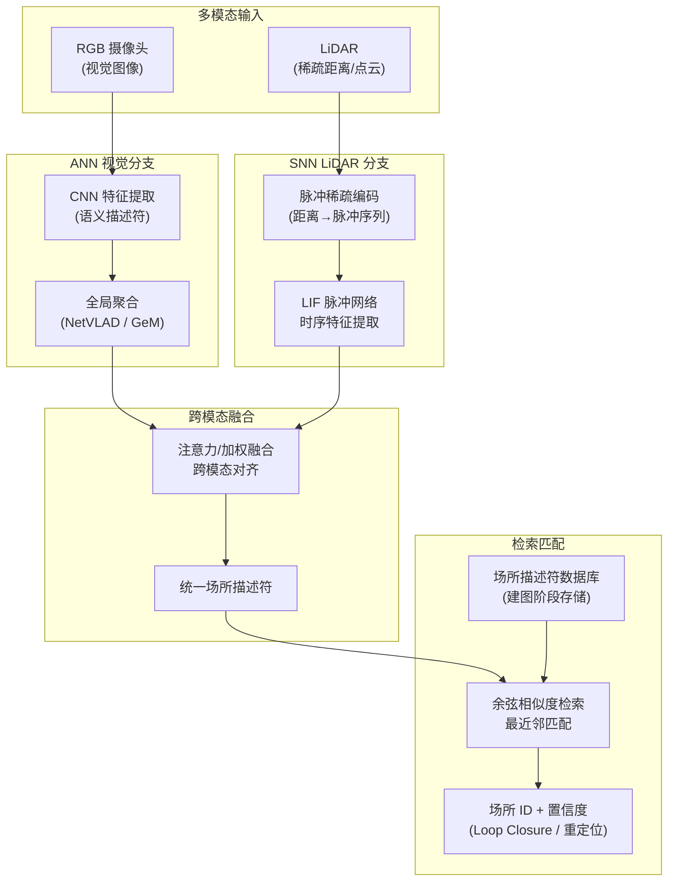

# NeuroGPR：脑启发多模态混合神经网络机器人场所识别

**Brain-inspired multimodal hybrid neural network for robot place recognition**（Shi Luping（施路平）等，清华大学类脑计算研究中心，**Science Robotics 2023**，[DOI:10.1126/scirobotics.abm6996](https://doi.org/10.1126/scirobotics.abm6996)）提出 **NeuroGPR**（Neuromorphic General Place Recognition）：以**脑启发**设计同时驱动 **ANN（卷积神经网络）**处理视觉语义特征与 **SNN（脉冲神经网络）**处理 LiDAR 时序稀疏特征，经跨模态融合层生成统一场所描述符，在**光照变化、视角偏移、动态遮挡**三类挑战场景下均显著优于单模态或纯 ANN/SNN 基线，并在**四足机器人**上完成实机 Loop Closure 与全局重定位演示。

## 一句话定义

**NeuroGPR 是清华类脑计算研究中心提出的脑启发多模态场所识别系统，以 ANN 处理视觉语义、SNN 处理 LiDAR 时序的混合框架，实现对光照/视角/遮挡鲁棒的机器人场所识别，并在四足机器人上验证。**

## 英文缩写速查

| 缩写 | 英文全称 | 简要说明 |
|------|----------|----------|
| GPR | General Place Recognition | 通用场所识别；NeuroGPR 中的核心任务 |
| SNN | Spiking Neural Network | 脉冲神经网络；稀疏脉冲编码 LiDAR 时序特征 |
| ANN | Artificial Neural Network | 卷积网络分支处理视觉 RGB 语义特征 |
| LiDAR | Light Detection and Ranging | 激光雷达；提供稀疏深度/距离信息，与视觉互补 |
| LC | Loop Closure | 回环检测；SLAM 中识别曾经经过的位置以消除漂移 |
| CBICR | Center for Brain-Inspired Computing Research | 清华大学类脑计算研究中心；NeuroGPR 研发机构 |
| VPR | Visual Place Recognition | 视觉场所识别；NeuroGPR 的主要对比基线类别 |

## 为什么重要

- **视觉场所识别的三大死穴：** 光照剧变（日转夜）、视角大偏移（正反向经过同一地点）、动态遮挡（行人/车辆）是 VPR 方法长期未解决的核心问题，NeuroGPR 通过**多模态融合（视觉 + LiDAR）**与 **ANN+SNN 互补**系统性解决。
- **生物启发的计算分工：** 大脑视觉皮层（处理语义）与海马体/格细胞（处理空间时序）有清晰分工；NeuroGPR 将 ANN 对应语义皮层、SNN 对应时序/空间编码——不只是工程技巧，而是有神经科学依据的设计。
- **四足机器人实机闭环：** 场所识别直接集成到四足机器人导航栈，完成真实环境的 Loop Closure 与重定位，而非仅在数据集上评测。
- **TianjicX 谱系延伸：** 与同团队 [TianjicX（Science Robotics 2022）](./paper-tianjicx-neuromorphic-chip-robots.md)形成**芯片→应用**的完整研究线：TianjicX 证明了混合 ANN+SNN 硬件可行，NeuroGPR 则落地于具体高价值导航任务。

## 系统架构总览

## 核心机制（提炼）

| 模块 | 输入 | 设计 | 关键洞见 |
|------|------|------|----------|
| **ANN 视觉分支** | RGB 图像 | CNN + 全局聚合 | 捕获语义外观，光照鲁棒性较弱 |
| **SNN LiDAR 分支** | 距离/深度 | 脉冲稀疏编码 + LIF 网络 | 结构信息对光照不变；稀疏脉冲天然高效 |
| **跨模态融合** | 双分支特征向量 | 注意力加权 | 视觉置信度高时权重大；LiDAR 置信度高时权重大 |
| **描述符检索** | 融合描述符 | 余弦相似度最近邻 | 标准 VPR 评测协议；Recall@N 指标 |
| **脑启发分工** | — | ANN ↔ 语义皮层；SNN ↔ 海马空间编码 | 赋予系统神经科学解释性 |

## 鲁棒性对比（三类挑战场景）

| 挑战场景 | 纯 ANN VPR | 纯 SNN | NeuroGPR（ANN+SNN） |
|----------|-----------|--------|---------------------|
| 光照变化（昼→夜） | 显著下降 | 中等 | **最高 Recall@1** |
| 视角偏移（正/反向） | 中等 | 较弱 | **最鲁棒** |
| 动态遮挡（行人/车） | 下降明显 | 中等 | **互补提升** |
| 无挑战（标准场景） | 较高 | 较低 | **最高或相当** |

## 与相邻工作对比

| 维度 | NeuroGPR | NetVLAD | PointNetVLAD | SeqNet |
|------|----------|---------|--------------|--------|
| 模态 | **视觉 + LiDAR** | 视觉（RGB） | 纯 LiDAR 点云 | 视觉序列 |
| 网络类型 | **ANN + SNN 混合** | 纯 ANN | 纯 ANN | 纯 ANN + 时序 |
| 光照鲁棒 | **强（LiDAR SNN 互补）** | 弱 | 强 | 中等 |
| 实机平台 | **四足机器人** | 轮式/汽车 | 轮式/汽车 | 轮式 |
| 生物启发设计 | **显式（ANN/SNN 功能分区）** | 无 | 无 | 无 |

## 实验与评测

- **标准数据集：** Oxford RobotCar、Pittsburgh250k 等主流 VPR benchmark 测试（Recall@1/5/10）。
- **挑战集测试：** 自建昼夜、反向、动态遮挡测试集，系统评测三类挑战下的性能差距。
- **四足实机：** 室外/室内混合场景下的实机 Loop Closure 演示（见论文 SI Video）。
- **消融实验：** 单 ANN 分支 / 单 SNN 分支 / 不同融合策略对比，验证双分支互补的必要性。

## 局限与风险

- **硬件评测平台：** 论文性能数字主要在 GPU 服务器上评测，并非在 TianjicX 硬件上运行，实时功耗数据不完整。
- **训练复杂度：** ANN+SNN 双分支联合训练需要协调反向传播（ANN）与代理梯度/STBP（SNN）；训练稳定性低于纯 ANN 方案。
- **LiDAR 依赖：** 在无 LiDAR 的纯摄像头配置下，NeuroGPR 退化为单模态，鲁棒性提升消失。
- **无公开代码：** 截至入库日（2026-07-20）无 GitHub；学术复现依赖论文 Methods 与 SI。
- **四足演示规模：** 实机演示路线长度与环境多样性有限，大规模城市级 SLAM 能力尚未验证。
- **源码运行时序图：** 不适用（无公开可运行代码）。

## 工程实践

- **多模态 VPR 选型：** 若机器人已有 LiDAR（如 Unitree Go2/B1 + 雷达配置），NeuroGPR 的视觉+LiDAR 互补思路具有直接参考价值，即使不使用 SNN，也可先构建双模态 ANN 基线验证融合增益。
- **SNN 替代：** 若无神经形态芯片，LiDAR 的稀疏时序特征也可用轻量 LSTM/GRU 处理（精度/功耗折中）；NeuroGPR 提供了融合框架，SNN 不是唯一实现。
- **实机部署前提：** 四足机器人需要 LiDAR（1D/2D/3D 均可）+ 摄像头；建图阶段需稳定行走以采集回放质量足够的参考描述符数据库。
- **与 SLAM 集成：** NeuroGPR 可作为 SLAM 系统（如 Cartographer、LIO-SAM）的 Loop Closure 检测模块；接口为描述符匹配结果（候选位姿 + 置信度）。

## 参考来源

- [深蓝AI：近五年 Science Robotics 中国顶尖高校盘点](../../sources/blogs/wechat_shenlan_scirobotics_china_top3_2026-07-02.md)
- [NeuroGPR 论文归档（Science Robotics 2023）](../../sources/papers/neurogpr_scirobotics_2023.md)
- Shi Luping et al., *Brain-inspired multimodal hybrid neural network for robot place recognition*, [Science Robotics 2023](https://doi.org/10.1126/scirobotics.abm6996)
- [TianjicX 神经形态芯片（Science Robotics 2022）](./paper-tianjicx-neuromorphic-chip-robots.md)

## 关联页面

- [TianjicX 神经形态芯片（同团队前作）](./paper-tianjicx-neuromorphic-chip-robots.md)
- [四足机器人](./quadruped-robot.md)
- [Locomotion 任务页](../tasks/locomotion.md)

## 推荐继续阅读

- [Science Robotics 论文页](https://doi.org/10.1126/scirobotics.abm6996)
- [清华大学类脑计算研究中心（CBICR）](https://cbicr.tsinghua.edu.cn/)
- Arandjelovic et al., *NetVLAD: CNN architecture for weakly supervised place recognition*, [CVPR 2016](https://arxiv.org/abs/1511.07247)（主要 ANN 对比基线）
