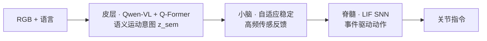
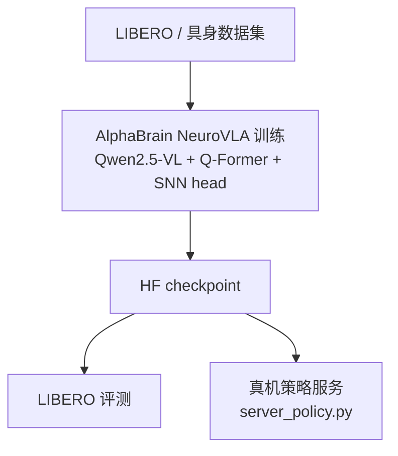
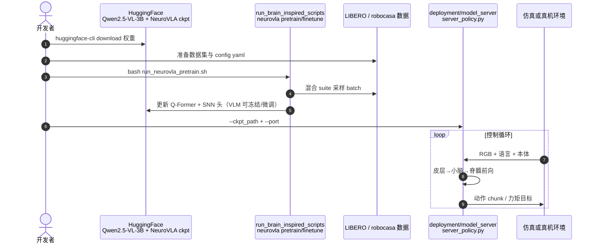

# NeuroVLA：脑启发流体反射具身控制

**NeuroVLA**（*A Brain-inspired Embodied Intelligence for Fluid and Fast Reflexive Robotics Control*，[arXiv:2601.14628](https://arxiv.org/abs/2601.14628)）由 **HKUST / SIAT / AI² Robotics** 等提出：按 **皮层–小脑–脊髓** 组织 VLA，在真机报告 **运动抖动显著下降**、**碰撞撤退 <20 ms** 与神经形态处理器 **~0.4 W** 量级功耗。可复现实现维护于 [AlphaBrain](https://github.com/AlphaBrainGroup/AlphaBrain)（MIT）。

## 一句话定义

**用大 VLM 做语义运动意图，高频反馈模块稳定轨迹，脉冲 SNN 头做事件驱动动作与反射级响应——把「三层控制架构」落到可训练的 VLA 系统。**

## 英文缩写速查

| 缩写 | 英文全称 | 简要说明 |
|------|----------|----------|
| NeuroVLA | Neuromorphic Vision-Language-Action | 本文脑启发 VLA 框架 |
| VLA | Vision-Language-Action | 视觉-语言-动作统一策略 |
| SNN | Spiking Neural Network | 脉冲神经网络动作头 |
| LIF | Leaky Integrate-and-Fire | 带泄漏积分发放神经元 |
| Q-Former | Querying Transformer | 从 VLM 隐层蒸馏任务相关特征 |
| LIBERO | LIfe-long BEnchmark for Robot manipulation | 操作基准套件 |

## 为什么重要

- **分层 VLA 实例：** 不是单 MLP 动作头，而是把 **规划 / 稳定 / 快速执行** 拆到可解释模块，对接 [具身三层控制架构](../concepts/embodied-three-layer-control-architecture.md) 选型讨论。
- **反射时延数据点：** 论文与科普文均强调 **本地感觉运动回路** 比皮层回路快一个数量级，对安全架构设计有参考价值。
- **工程可触：** AlphaBrain 提供 LIBERO 训练/评测与 HF 权重，降低复现门槛。

## 核心信息

| 项 | 内容 |
|----|------|
| **机构** | 香港科技大学（HKUST）；中国科学院深圳先进技术研究院（SIAT）；AI² Robotics 等 |
| **骨干** | Qwen-VL / Qwen2.5-VL + 层-wise Q-Former |
| **动作头** | LIF 脉冲残差网络 + 连续解码 |
| **开源** | **已开源**：[AlphaBrainGroup/AlphaBrain](https://github.com/AlphaBrainGroup/AlphaBrain) + [HF 权重](https://huggingface.co/AlphaBrainGroup)；[guoweiyu/NeuroVLA](https://github.com/guoweiyu/NeuroVLA) 为论文引用入口 |

## 核心原理

### 三层模块（归纳）

- **皮层：** VLM 提取多模态表征；Q-Former 作信息瓶颈，输出紧凑任务意图。
- **小脑：** 利用本体/触觉等高频反馈抑制抖动、跟踪相位（论文图示：倒水、摇停、碰撞恢复）。
- **脊髓：** 膜电位跨时间步保留 → 工作记忆；运动变化时发放，静态近静默。

### 流程总览（训练→部署）

## 源码运行时序图

官方可复现路径以 [AlphaBrain](https://github.com/AlphaBrainGroup/AlphaBrain) 为准（归档见 [sources/repos/alphabrain.md](../../sources/repos/alphabrain.md)）：

- **最短评测路径：** `pip install -e .` → 下载 `neurovla-libero-all4suite` → 启 `server_policy.py` → LIBERO eval 管线。
- **与经典反射层差异：** 脉冲脊髓仍为 **学习模块**，部署时需与硬件急停链 **并联**，勿替代认证级安全 PLC。

## 工程实践

| 主题 | 要点 |
|------|------|
| 复现入口 | [docs/quickstart/neurovla.md](https://github.com/AlphaBrainGroup/AlphaBrain/blob/main/docs/quickstart/neurovla.md) |
| 配置参考 | Q-Former 层 36→37、8 queries、768-d；`action_dim=7`、chunk 16（LIBERO 发布） |
| 注意力后端 | 默认 SDPA；有匹配 flash-attn 时可切换 |
| 与分层栈关系 | 大脑/小脑/脊髓 **同网不同模块**；真机仍建议保留 **独立反射安全链** |
| 功耗叙事 | 神经形态 FPGA 为论文亮点；通用 GPU 训练/推理功耗远高于 0.4 W 宣传点 |

## 评测与可复现口径

| 维度 | 归档可核对的口径 |
|------|------------------|
| 仿真基准 | **LIBERO** 四套件混合（`libero_all`）训练 + LIBERO eval 管线；公开权重 `neurovla-libero-all4suite` |
| 评测入口 | `deployment/model_server/server_policy.py --ckpt_path ... --port ...` → LIBERO eval 客户端 |
| 真机报告 | 运动 **抖动显著下降**、碰撞撤退 **<20 ms**、长时序任务优于无状态 MLP 动作头 |
| 功耗报告 | 自研神经形态处理器 **~0.4 W** 量级；通用 GPU 训练/推理不适用该数字 |
| 动作规格 | `action_dim=7`、chunk 16（LIBERO 发布配置） |

- **读法提醒：** 上述抖动 / 反射 / 功耗均为 **论文与仓库自报**，[来源归档](../../sources/papers/neurovla_arxiv_2601_14628.md) 未收录逐项横比表；与其他 VLA 的成功率对照请以各自 LIBERO 套件与评测脚本重跑为准，勿跨页直接横比数字（口径见 [具身大模型评测基准选型闭环](../overview/hub-embodied-eval-benchmark.md)）。
- **最短复现路径：** `pip install -e .` → `huggingface-cli download` 权重 → 起 `server_policy.py` → LIBERO eval。

## 与其他工作对比

| 对照 | 差异点 | 取舍 |
|------|--------|------|
| 单动作头 VLA（[VLA](../methods/vla.md)） | NeuroVLA 把动作头换成 **LIF 脉冲残差 + 连续解码**，膜电位跨步保留即隐式时序记忆 | 换来事件稀疏与短延迟，代价是训练栈与部署链更复杂 |
| MPC/WBC 小脑栈（[MPC 与 WBC 集成](../concepts/mpc-wbc-integration.md)） | 小脑层在此是 **学习式自适应模块**，不是 QP 求解器 | 二者可并存：VLA 出目标、WBC 跟踪；不必二选一 |
| 经典阈值反射层（[具身三层控制架构](../concepts/embodied-three-layer-control-architecture.md)） | 「脊髓」是可训练模块而非固定阈值比较 | 行为不如纯阈值反射易形式化验证，真机须与独立急停链 **并联** |
| 分层策略网络（[人形策略网络架构](../concepts/humanoid-policy-network-architecture.md)） | 三层同网不同模块，而非大模型 + 独立小 MLP 双进程 | 模块边界可解释，但无法按层独立换版 |

## 局限与风险

- **分层边界学习化：** 脊髓模块可训练，行为不如纯阈值反射易形式化验证。
- **硬件依赖：** 最优能效数字绑定自研神经形态处理器，复现者难 1:1 对齐。
- **基准范围：** 公开权重以 LIBERO 为主，跨本体/人形全身推广需自行验证。
- **科普文引用：** [深蓝三层架构长文](../../sources/blogs/wechat_shenlan_embodied_three_layer_control_2026-09-16.md) 为架构导读，技术细节以论文与 AlphaBrain 为准。

## 结论

**NeuroVLA 的价值在于把「皮层规划 + 快速反射」写进同一 VLA 训练栈，并用脉冲头换取事件稀疏与短延迟，而不是证明所有机器人都应取消独立安全 PLC。**

- 选型时把其看作 **三层架构的学习型实例**，与 MPC/WBC 小脑栈可并存（VLA 出目标，WBC 跟踪）。
- 复现优先 **AlphaBrain + HF 权重**，勿仅 fork 论文说明仓。
- 安全相关：保留 **<20 ms** 碰撞响应作为设计目标，但认证仍要测 **独立急停与力矩饱和**。
- 与纯 VLA 对比：额外模块带来可解释的「脊髓」叙事，也增加训练与部署复杂度。
- 关注 **持续学习** 变体（Experience Replay）是否满足产线增量任务需求。

## 关联页面

- [具身三层控制架构](../concepts/embodied-three-layer-control-architecture.md)
- [VLA](../methods/vla.md)
- [人形策略网络架构](../concepts/humanoid-policy-network-architecture.md)
- [MPC 与 WBC 集成](../concepts/mpc-wbc-integration.md)

## 参考来源

- [NeuroVLA 论文归档](../../sources/papers/neurovla_arxiv_2601_14628.md)
- [AlphaBrain 仓库归档](../../sources/repos/alphabrain.md)
- [深蓝具身智能 · 三层控制架构](../../sources/blogs/wechat_shenlan_embodied_three_layer_control_2026-09-16.md)

## 推荐继续阅读

- [AlphaBrain 文档](https://alphabraingroup.github.io/AlphaBrain/) — NeuroVLA quickstart 与 API
- [arXiv:2601.14628](https://arxiv.org/abs/2601.14628) — 论文全文
