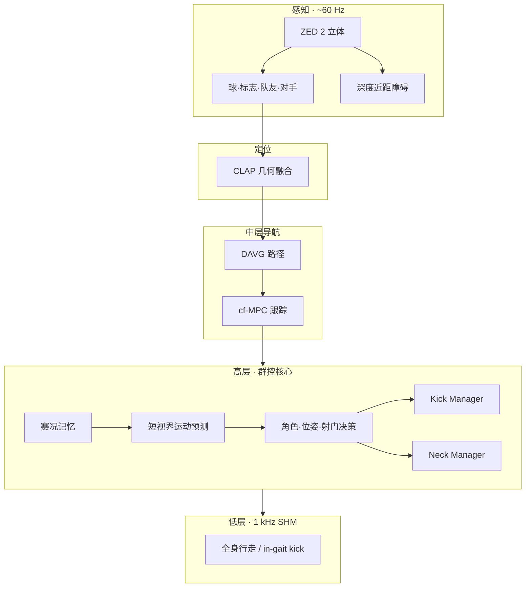

# ARTEMIS：A Hierarchical, Model-Based System for High-Performance Humanoid Soccer

**ARTEMIS**（*Advanced Robotic Technology for Enhanced Mobility and Improved Stability*，arXiv:2512.09431，UCLA RoMeLa 等）是 **RoboCup 2024 Adult-Size Humanoid Soccer 冠军** 的软硬件一体方案：成人尺寸 QDD 人形、in-gait 大力踢球、立体视觉感知，以及 **集中式 behavior planner** 驱动的 **多机战术协调**（角色、射门、避障导航）。

## 一句话定义

**用强感知把球和队友都看见，用 MPC 躲开对手和边界，再用集中行为管理器决定谁进攻谁防守——把单机 RL 射门技能嵌进能打赢真机联赛的全栈。**

## 英文缩写速查

| 缩写 | 英文全称 | 简要说明 |
|------|----------|----------|
| ARTEMIS | Advanced Robotic Technology for Enhanced Mobility and Improved Stability | 本文 UCLA 成人尺寸人形足球平台 |
| CLAP | — | 几何定位模块；融合场地标志与惯性估计位姿 |
| cf-MPC | Collision-free Model Predictive Control | 无碰撞模型预测跟踪中层导航 |
| DAVG | Dynamic Augmented Visibility Graphs | 动态可见图路径规划 |
| QDD | Quasi-Direct-Drive | 准直驱高扭矩关节，支撑动态踢球与行走 |
| ROS 2 | Robot Operating System 2 | 感知/定位/导航/行为高层节点通信框架 |

## 为什么重要（含群控视角）

- **真机国际赛冠军验证：** 相对 [Swarm 人形足球](paper-humanoid-soccer-swarm-intelligence.md) 的 Webots 仿真，ARTEMIS 在 **Adult-Size 对抗赛** 证明 **集中式战术栈 + 强感知** 路线可夺冠。
- **明确处理队友/对手：** 检测管道输出 **球、球门、队友、对手**；cf-MPC 把其他机器人当作 **移动障碍**——这是群控与单机射门 RL 的核心差异。
- **指出 RL 技能模块的嵌入位：** 论文批评近年 deep RL 足球技能 **未建模队友/对手**，必须外包给手工栈；ARTEMIS 提供 **可嵌入的完整架构** 参照。
- **Paper Notebooks 待深读：** 姊妹仓库 PROGRESS 仍标记待深读；本页基于 arXiv 一手论文 **群控相关章节** 策展（非深读笔记全文）。

## 方法栈

| 层级 | 模块 | 作用 |
|------|------|------|
| 感知 | ZED 2 立体 + 检测管道 | 球、球门、队友、对手与近距障碍 |
| 定位 | CLAP 几何融合 | 场地标志 + 惯性估计全局位姿 |
| 中层导航 | DAVG 路径 + cf-MPC 跟踪 | 动态避障、无碰撞轨迹跟踪 |
| 高层群控 | Behavior planner + Kick/Neck Manager | 角色、desired pose、射门与视线决策 |
| 低层执行 | 1 kHz SHM 全身控制 | in-gait 行走与大力踢球 |

参考 **仅参与训练奖励塑形** 的 RL 技能模块可嵌入 Kick Manager；论文强调近年 deep RL 足球技能多未建模队友/对手，需外包给上述手工栈。

## 系统架构（群控相关）

- **Behavior planner：** 根据 evolving game state 选 **desired pose、角色、kick**；与 kick/neck manager 分工。
- **通信：** 论文侧重 **机载视觉互见**；非 SPL 式极限 WiFi 拍卖（见 [人形多机协调](../concepts/humanoid-multi-robot-coordination.md) 三线对比）。

## 实验与评测

- **RoboCup 2024 Adult-Size：** 冠军；真机对抗下 in-gait 踢球、避障与战术切换。
- **受控实验：** 论文另报告定量/定性消融（细节见 arXiv 正文 §IV–VII）。
- **与 swarm 论文不可直接比数值：** 联赛规则、机体尺寸、对手强度不同；选型应看 **部署形态**（真机联赛 vs 仿真 swarm 基准）。

## 与其他页面的关系

- [人形多机协调](../concepts/humanoid-multi-robot-coordination.md) — 集中 vs 去中心化总览
- [Swarm Intelligence 人形足球](paper-humanoid-soccer-swarm-intelligence.md) — 去中心化对照
- [Humanoid Soccer](../tasks/humanoid-soccer.md)
- [paper-notebook-category-05-locomotion](../overview/paper-notebook-category-05-locomotion.md)
- [RAVEN：RL 自适应可见图 + cf-MPC](./paper-raven-rl-adaptive-visibility-graph-mpc.md) — 同实验室在 **DAVG+cf-MPC** 上用 RL 调节障碍膨胀，专攻延迟与跟踪误差下的人形导航

## 参考来源

- [artemis_humanoid_soccer_team_coordination_arxiv_2512_09431.md](../../sources/papers/artemis_humanoid_soccer_team_coordination_arxiv_2512_09431.md)
- [humanoid_pnb_a-hierarchical-model-based-system-for-high-perfo.md](../../sources/papers/humanoid_pnb_a-hierarchical-model-based-system-for-high-perfo.md)
- 论文：<https://arxiv.org/abs/2512.09431>

## 推荐继续阅读

- Wang, Q., et al. (2025). arXiv:2512.09431.
- Nadiri, F., & Rad, A. B. (2025). *Swarm Intelligence for Collaborative Play in Humanoid Soccer Teams*. Sensors. <https://doi.org/10.3390/s25113496>
- [Humanoid Robot Learning Paper Notebooks · PROGRESS.md](https://github.com/ImChong/Humanoid_Robot_Learning_Paper_Notebooks/blob/main/papers/PROGRESS.md)
- Hou et al., *RAVEN* ([arXiv:2607.15701](https://arxiv.org/abs/2607.15701)) — DAVG-cfMPC 导航骨干的强化学习几何自适应
