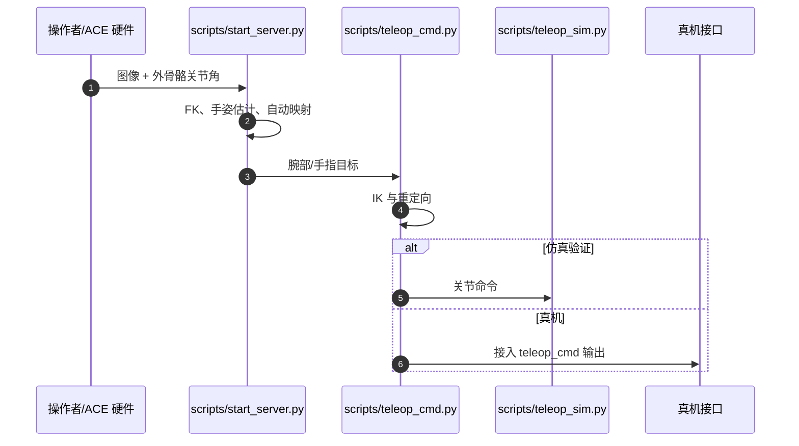

# ACE：跨平台低成本视觉—外骨骼灵巧遥操作

**ACE**（*A Cross-Platform Visual-Exoskeletons System for Low-Cost Dexterous Teleoperation*，[arXiv:2408.11805](https://arxiv.org/abs/2408.11805)）由加州大学圣地亚哥分校提出，发表于 CoRL 2024。

## 一句话定义

**ACE 用外骨骼编码器可靠测腕部位姿、用始终朝向手掌的相机估计手指，再把二者映射到异构机械臂与手/夹爪，以约 600 美元硬件换取跨平台遥操作能力。**

## 英文缩写速查

| 缩写 | 英文全称 | 简要说明 |
|------|----------|----------|
| ACE | Cross-Platform Visual-Exoskeletons System | 本文视觉—外骨骼遥操作系统 |
| FK | Forward Kinematics | 从外骨骼关节编码器计算腕部位姿 |
| IK | Inverse Kinematics | 将缩放后的腕部目标解成机器人关节 |
| EE | End Effector | 被映射的机器人手、夹爪或腕部末端 |
| IL | Imitation Learning | 使用 ACE 示范训练自主操作策略 |

## 为什么重要

- **把精度和泛化拆开：** 腕部用 FK 保精度，手指用视觉保异构末端适配性。
- **跨平台不是只换 URDF：** 工作空间中心、控制缩放、normal/mirror/gripper 模式共同处理机器人与任务尺度差异。
- **能直接进入数据闭环：** 论文不只展示遥操作，还在 xArm/Ability 与 H1/Inspire 上训练六项模仿学习任务。
- **成本可比较：** 论文估算 ACE 约 0.6k 美元，远低于商业动捕，同时支持桌面与移动底座。

## 核心信息

| 项 | 内容 |
|----|------|
| 机构 | 加州大学圣地亚哥分校（UC San Diego） |
| 发表 | CoRL 2024 |
| 输入 | 双臂外骨骼编码器 + 两个手前 RGB 相机 |
| 输出 | 腕部 6D 目标 + 手指/夹爪命令 |
| 平台 | xArm+Ability、H1+Inspire、GR-1+夹爪、B1+Z1、Franka+夹爪 |
| 频率 | 手姿跟踪约 27 Hz；更高频相机可提升至约 100 Hz |
| 成本 | 论文表中约 0.6k 美元 |
| 开源 | 软件与硬件文件公开；软件许可未明确 |

## 流程总览

## 核心机制（方法栈）

### 1）视觉—运动学互补捕获

相机固定在外骨骼末端并始终面向手，降低纯外部视觉的遮挡；外骨骼六个 Dynamixel 关节经 FK 给出毫米级腕部位置，避免仅靠视觉估计手根漂移。

### 2）任务尺度感知的腕部映射

系统先对齐人/机器人工作空间中心，再用缩放系数把人腕相对位移映射到任务空间。机器人侧用 IK 求关节，因此不用复制目标机器人的连杆尺寸，也能按精细或大范围任务调倍率。

### 3）末端重定向与控制模式

- 拟人手使用 3D 手关键点进行运动重定向。
- 平行夹爪把拇指—食指距离线性映射到开合量。
- normal/mirror 模式支持操作者位于机器人后方或前方；轴锁与重新映射用于现场调姿。

## 源码运行时序图

仓库最小路径为 `pip install -e .`，再依次启动 `start_server.py`、`teleop_cmd.py` 与可选 `teleop_sim.py`；真机安全滤波和控制接口需按平台补接。

## 与其他工作对比

| 维度 | ACE | GELLO | Bunny-VisionPro |
|------|-----|-------|-----------------|
| 腕部输入 | 外骨骼 FK | 同构 leader 关节 | Vision Pro 腕姿 |
| 手指输入 | 手前相机 | 通常夹爪 | Vision Pro 手关键点 |
| 跨平台 | IK + 尺度映射 | 受同构结构限制 | 模块化重定向 |
| 触觉 | 无 | 可感受 leader 机械反馈 | 振动触觉设备 |

## 工程实践

- **校准先于调参：** 为六个 Dynamixel 配唯一 ID，求关节 offset，再确认相机 index/FPS。
- **先仿真后真机：** 用键盘 server + Isaac Gym 仿真验证配置、方向与缩放，再接机器人命令。
- **关键参数：** `pos_scale`、`roll_scale`、`pitch_scale`、`yaw_scale` 决定工作空间与灵敏度。
- **开源状态：** [软件仓库](https://github.com/ACETeleop/ACETeleop)公开 server/controller/simulation，[硬件仓库](https://github.com/ACETeleop/ACE_hardware)公开 STL 与装配说明；截至 2026-07-28 软件仓库未声明标准 SPDX 许可证。

## 实验与评测

- 腕部 FK 平均误差约 **1 mm**；卷尺 20→40 cm 真机复现累计平均误差约 **3 mm**。
- 六名操作者的仿真 target-reaching：小工作空间/小目标成功率 **97.1%**，GELLO 为 **47.6%**；大工作空间 ACE 为 **78.6%**，GELLO 为 **68.7%**。
- 六项 IL 任务覆盖 xArm+Ability 与 H1+Inspire；示范采集成功率从 25/29 到 120/123，策略分阶段成功率随长时程阶段累积下降。
- 结果说明 ACE 的强项是不同尺度下的适配，而非所有设置都胜出：中等工作空间/中等目标成功率 GELLO **93.8%**、ACE **87.5%**。

## 结论

**ACE 的真正贡献是用“腕部运动学精度 + 手指视觉泛化 + 可调尺度 IK”构成可迁移接口，而不是单纯制造一套便宜外骨骼。**

1. **跨平台依赖软件映射** — 换机器人时必须重新核对工作空间中心、倍率、IK 与安全约束。
2. **毫米级腕部测量是硬指标** — 视觉主要承担手指适配，不应把整套系统误读为纯视觉遥操作。
3. **细任务收益最大** — 小工作空间成功率优势明显；同构 leader 在匹配尺度下仍有竞争力。
4. **IL 结果证明数据可用** — 但长时程分阶段成功率下降，不能把高采集成功率等同于策略端到端成功率。
5. **复现入口完整但授权需确认** — 代码和 STL 可访问，不代表任意商业复用。

## 局限与风险

- 无操作员触觉反馈，接触力主要靠视觉判断；精细插接仍可能过力或滑脱。
- 手姿估计受照明、相机模糊与残余遮挡影响；27 Hz 也低于高动态手指动作需求。
- 真机滤波、PID、限位与奇异规避由具体平台负责，仓库示例不能替代安全控制层。
- 跨平台实验丰富，但任务和操作者规模仍有限，未证明长时间人体工学与大规模数据产能。

## 与其他页面的关系

- 路线定位：[遥操作纵深 Stage 1](../../roadmap/depth-teleoperation.md) 的低成本外骨骼接口。
- 主任务：[Teleoperation](../tasks/teleoperation.md)。
- 输入选型：[数据手套 vs 视觉遥操作](../comparisons/data-gloves-vs-vision-teleop.md)。
- 视觉/触觉对照：[Bunny-VisionPro](./paper-notebook-bunny-visionpro-real-time-bimanual-dexterous-tel.md)。
- 全身同构 leader 对照：[CHILD](./paper-notebook-child-a-whole-body-humanoid-teleoperation-system.md)。

## 参考来源

- [Humanoid Paper Notebooks 来源归档](../../sources/papers/humanoid_pnb_ace.md)
- [ACE 项目页核查](../../sources/sites/ace-teleop.md)
- [ACE 代码仓库核查](../../sources/repos/ace-teleop.md)
- 论文：<https://arxiv.org/abs/2408.11805>

## 推荐继续阅读

- 项目页：<https://ace-teleop.github.io/>
- 硬件装配：<https://github.com/ACETeleop/ACE_hardware>
