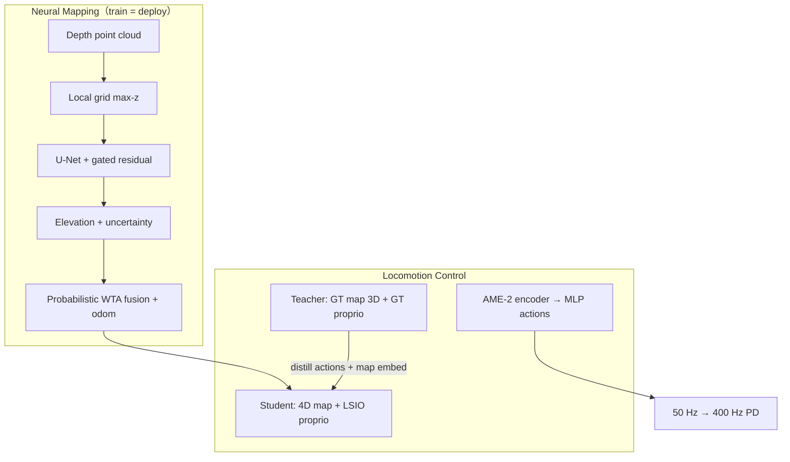

# AME-2 — Agile and Generalized Legged Locomotion

**一句话定义**：在 [AME（AME-1）](./paper-ame-attention-based-map-encoding.md) 的 **本体条件地图注意力** 之上，引入 **全局地形上下文 + 轻量 Bayesian 深度映射（带不确定性）+ Teacher（GT 地图）→ Student（在线同栈映射）蒸馏**，使 **ANYmal-D** 与 **LimX TRON1** 在 **同一训练配方** 下兼具 **parkour 级敏捷**（~**2 m/s** 往返最难跑酷）与 **稀疏/组合/未见地形零样本泛化**。

## 英文缩写速查

| 缩写 | 英文全称 | 简要说明 |
|------|----------|----------|
| AME-2 | Attention-based Map Encoding (v2) | 全局+局部特征与神经映射统一框架 |
| AME-1 | Attention-based Map Encoding (v1) | [前作 arXiv:2506.09588](./paper-ame-attention-based-map-encoding.md) |
| MHA | Multi-Head Attention | 全局+本体 query 对 local map features 加权 |
| RL | Reinforcement Learning | PPO goal-reaching loco |
| PPO | Proximal Policy Optimization | RSL-RL + Isaac Gym |
| LSIO | Long-Short I/O | Student 本体 20 步时序嵌入 |
| MoE | Mixture of Experts | 非对称 critic（非 actor） |
| GT | Ground Truth | Teacher 用仿真特权高程与 proprio |
| Sim2Real | Simulation to Real | 训练/部署 **同一映射管线** |
| ANYmal | ANYbotics Quadruped | 双前向深度 + LiDAR-inertial odom |
| TRON1 | LimX Dynamics TRON1 | 双足平台；DLIO 里程计 |

## 为什么重要

- **打破 agility ↔ generalization 折中**：跑酷 **端到端 depth** 策略（如 generalist distillation）**零样本泛化弱**；**泛化型** elevation-map RL（含 AME-1）**敏捷与遮挡鲁棒受限**于 **经典 mapping 延迟/滤波**。AME-2 用 **并行仿真内在线神经映射 + 不确定性显式建模**，使 **Student 部署栈 = 训练栈**。
- **AME 编码器 v2 的必要性**：仅 proprio-query 的 AME-1 在 **复杂/混合地形** 上 motion pattern 不足；**global features 参与 query** 后，同一 policy **按地形切换攀爬/跳跃/踏石**（论文 Sec. VI–VII）。
- **工程可部署**：1000 并行 env 映射 **<0.3 ms/GPU**、机载 **~5 ms/帧**；相对 Neural Processes 类 mapping **>13 GB/env** 不可_massively parallel train。

## 核心信息

| 字段 | 内容 |
|------|------|
| 机构 | 苏黎世联邦理工（ETH Zürich）RSL；ETH AI Center |
| 平台 | ANYmal-D；LimX TRON1 |
| 项目页 | <https://sites.google.com/leggedrobotics.com/ame-2> |
| 训练 | Isaac Gym；Teacher **80k** / Student **40k** iter；ANYmal **~60×4090-days** |
| arXiv | <https://arxiv.org/abs/2601.08485> |

## 流程总览

## AME-2 编码器（相对 AME-1）

1. **CNN + positional MLP** → 逐点 **local features**。
2. **Max-pool + MLP** → **global features**（整体地形上下文）。
3. **global ∥ proprio → query**，**MHA** 加权 local features。
4. **global ∥ weighted local** → **map embedding** → action MLP。

Teacher 输入 **3D** 坐标；Student 输入 **4D** $(x,y,z,u)$（$u$ 为不确定性）。

## 神经映射要点

| 环节 | 设计 |
|------|------|
| **局部预测** | 深度投影 grid；**β-NLL**（$\beta=0.5$）训练 U-Net；**TV batch 重加权** |
| **融合** | **Probabilistic Winner-Take-All**：遮挡区 **不因一致错误预测降 uncertainty** |
| **数据** | Warp 射线 **5400 万帧/机器人**；locomotion 地形 + 随机 box/heightfield |
| **Student 训练** | 部分 env **全图特权**、部分 **在线部分图** → **map reuse**（同楼梯上下） |

## Teacher–Student

- **Teacher**：GT 高程 + GT proprio（含 $v_b$）；**MoE critic** + contact 特权。
- **Student**：在线映射 + **LSIO 20 步**本体（**无 $v_b$**，因 odom 噪声/延迟）；损失 = PPO + action distill + **map embedding MSE**；前 **5k** iter **关 PPO surrogate**。
- **连续部署**：actor 观测 **clip 目标距离 2 m**、去掉 remaining time；远目标时 **随机 yaw** 便于 steering。

## 训练地形与奖励

- **训练**：dense / climbing / sparse 三类 **primitive** 地形 + 课程。
- **测试**：未见或 **训练+未见组合**（梁+沟、双行错落踏石、钻石布局等）。
- **奖励**：goal position/heading + move + stand；**不显式 foothold 位置奖/罚**，允许 **膝接触、近缘脚** 等全身行为涌现。

## 实验与评测

### 敏捷（相对 prior SOTA）

| 平台 | 结果 |
|------|------|
| **ANYmal-D** | **零样本** prior 最难 **parkour + rubble**；peak **>1.5 m/s**，parkour 往返 **~2 m/s** |
| **TRON1** | 上攀 **0.48 m** / 下攀 **0.88 m**（prior biped ~0.5 m @ H1 更大硬件） |

### 泛化（稀疏/未见）

- 19 cm **非固定** 梁/踏石、**曲梁浮块**、梁+沟 **组合**、10 cm **高度差双行踏石**、钻石踏石等（Fig. 11）。
- **主动感知**：首次攀台失败 → 碰撞补全地图 → **重试成功**（对比 generalist **缺长期空间记忆**）。

### 鲁棒

- TRON1 在 **解锁轮式平台车** 上攀/平衡；ANYmal **膝撑** 恢复 **倾斜非固定踏石**。

## 与其他工作对比

| 方法 | 敏捷 | 泛化 | 映射 | 可解释 |
|------|------|------|------|--------|
| 单目 generalist [48] | 高 | 低（需 finetune） | 隐式 | 低 |
| 经典 elevation + RL | 中 | 中 | 慢/启发式滤波 | 中 |
| [AME-1](./paper-ame-attention-based-map-encoding.md) | 中 | 高 | 经典 mapping | **注意力** |
| [Extreme Parkour](./extreme-parkour.md) | 高 | 弱 | 深度蒸馏 | 低 |
| **AME-2** | **高** | **高** | **学习+不确定性** | **保留** |

## 常见误区与局限

- **不是 raw depth 端到端 loco**：深度仅进 **映射模块**；控制侧仍是 **显式高程 + AME-2**。
- **训练成本仍高**（数十 GPU·天）；**2.5D** 与 **SLAM/深度质量** 仍绑定 sim2real 上限。
- **未覆盖 manipulation**：手臂未与 loco 联合优化。

## 参考来源

- [humanoid_pnb_ame-2-agile-and-generalized-legged-locomotion-vi.md](../../sources/papers/humanoid_pnb_ame-2-agile-and-generalized-legged-locomotion-vi.md)
- [ame_arxiv_2506_09588.md](../../sources/papers/ame_arxiv_2506_09588.md)
- Zhang et al., *AME-2*, [arXiv:2601.08485](https://arxiv.org/abs/2601.08485)
- He et al., *AME-1*, [arXiv:2506.09588](https://arxiv.org/abs/2506.09588)

## 关联页面

- [AME（AME-1）](./paper-ame-attention-based-map-encoding.md)
- [ANYmal](./anymal.md)
- [楼梯与障碍 Locomotion](../tasks/stair-obstacle-perceptive-locomotion.md)
- [Terrain Adaptation](../concepts/terrain-adaptation.md)
- [Sim2Real](../concepts/sim2real.md)

## 推荐继续阅读

- [AME-2 项目页](https://sites.google.com/leggedrobotics.com/ame-2)
- [Discrete Terrain Minimal Proximity Sensing](./paper-discrete-terrain-minimal-proximity-sensing.md) — 同 lab 稀疏地形另一感知轴
