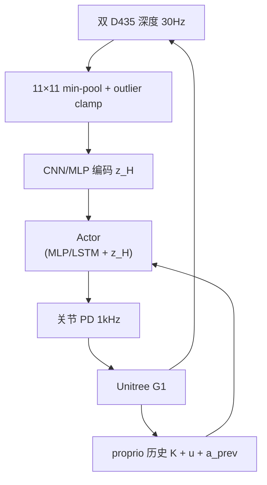

# Architecture Is All You Need

**Architecture Is All You Need: Diversity-Enabled Sweet Spots for Robust Humanoid Locomotion**（Werner, Yang, Ames；[arXiv:2510.14947](https://arxiv.org/abs/2510.14947)）主张：非结构化地形上 **鲁棒人形 locomotion** 的关键不是更大网络或更重感知，而是 **分层、多速率控制架构（LCA）** 与 **两阶段训练课程**。在 **Unitree G1** 上，two-stage LCA 在楼梯与 ledge 任务上 **稳定成功**，而 one-stage 感知策略 **多次零成功**。

## 一句话定义

**先训 blind proprio 稳定器、再接入低速局部高度图导航层，用最小 LCA 在 G1 上做到 one-stage 端到端感知策略做不到的楼梯与 ledge 鲁棒性。**

## 英文缩写速查

| 缩写 | 英文全称 | 简要说明 |
|------|----------|----------|
| LCA | Layered Control Architecture | 快 reflex + 慢 navigation 的分层控制 |
| RL | Reinforcement Learning | 本文 locomotion 策略学习框架 |
| WBC | Whole-Body Control | 全身关节协调与接触约束基础设施 |
| OOD | Out-of-Distribution | 相对训练分布更难的地形泛化评测 |
| PD | Proportional–Derivative | 1 kHz 关节位置跟踪低层控制器 |

## 为什么重要

- **架构 > 规模：** 同一奖励与相近 backbone 下，**是否分层 + 是否两阶段** 决定 sim/hardware 成败，而非 CNN vs MLP 细节。
- **对接 GNC 经典：** 与航空航天「慢 guidance + 快 feedback」及 Doyle/Ames **diversity-enabled sweet spots** 理论同构——机器人侧首次用 **最小 LCA** 在 G1 硬件验证。
- **工程可落地：** 无需 footstep MIP、U-Net 地形网或世界模型；11×11 高度图 + 双深度相机 + 简单 min-pool 即可。

## 核心信息

| 字段 | 内容 |
|------|------|
| **机构** | 加州理工学院（Caltech） |
| **平台** | Unitree G1；Isaac Sim 训练（4096 envs，RTX 4090） |
| **感知** | 双 Intel RealSense D435；30 Hz 深度→点云→11×11 网格 |
| **控制频率** | 策略 50 Hz；PD 1 kHz |
| **开源** | **截至入库日未开源**（arXiv 无官方代码链接） |

## 核心原理

### 1) 最小 LCA 接口

- **快层（稳定器）：** 仅 proprio 历史 $o_k$ + 速度指令 $u$ + 上一动作 $a_{k-1}$；负责接触扰动拒绝与短视野平衡。
- **慢层（导航）：** 局部高度图 $H^\pi\in\mathbb{R}^{11\times 11}$（机器人系 1 m×1 m，带噪声）；编码为 $z_H$ 与 proprio 拼接进 actor。
- **Critic：** 非对称——见 **完美** 高度图与更长视野，标准 locomotion 非对称 AC 做法。

### 2) 两阶段课程

| 阶段 | Actor 感知 | 目的 |
|------|------------|------|
| Stage 1 blind | $H\equiv 0$ | 四类地形各 25%，先学 **可迁移 stabilizer** |
| Stage 2 vision | 启用 $H$ | 在稳定快层上学习 **长视野条件化** |

论文强调：先解 **快率** 子问题再解慢率，降低 one-stage 对初始条件/优化的敏感性（§II-A 序列优化视角）。

### 3) 感知过滤（部署）

深度图 merge → 11×11 **cell min height**（处理楼梯遮挡）→ $\mu_z\pm\sigma_z$ **离群 clamp** → 策略输入。刻意保持 **简单、可调参少**。

### 流程总览

## 源码运行时序图

**不适用** — 截至 2026-09-21 论文与 arXiv **未发布** 官方可运行仓库；复现需自建 Isaac Sim + G1 部署栈。若代码后续开放，预期运行时序为：**深度采集 → 高度图滤波 → 50 Hz 策略 → 1 kHz PD 力矩**。

## 工程实践

| 项 | 建议 |
|----|------|
| 架构 | **不要** 把慢感知与快 stabilizer 绑成单网络一步训完；优先 LCA + 两阶段 |
| 课程 | Stage 1 必须覆盖 **上/下楼梯 + uneven + 平地** 混合，避免 blind 过拟合单一地形 |
| 感知 | 11×11 @ 1 m 足够；优先 **鲁棒 downsampling** 而非更大 FOV 网络 |
| 编码器 | CNN 与 MLP 差距 **小于** one-stage vs two-stage 差距 |
| 真机 | 感知可放 Orin NX，策略主机需稳定 50 Hz；注意 leg shadow 导致的小空洞 |
| 奖励 | phase–contact XNOR、track lin vel exp 等 **标准 locomotion 项** 即可，非性能主因 |

## 实验与评测

### 仿真

- **7 策略变体：** blind；3× one-stage（MLP/LSTM × CNN/MLP encoder）；3× two-stage 同构。
- **训练：** 40k steps，4096 envs；奖励曲线 **各策略接近**，差异主要体现在 **OOD uneven** 与 **硬件**。
- **OOD uneven：** two-stage 成功率 **平均约 +10 pp** vs one-stage，foot–env 横向冲击（contacts/step）更低。

### 真机（Table V，每任务 5 trials）

| Policy | Stair ↑ | Stair ↓ | Hinged Ledge | Soft Ledge |
|--------|---------|---------|--------------|------------|
| Blind | 3/5 | 2/5 | **5/5** | **5/5** |
| One-Stage MLP | 1/5 | 1/5 | 0/5 | 0/5 |
| Two-Stage CNN | **4/5** | **5/5** | **5/5** | **5/5** |
| Two-Stage MLP | **4/5** | **5/5** | **5/5** | 4/5 |

- **读点：** one-stage 在 **需 foresight 的楼梯** 与 **ledge** 上崩溃；blind 在 ledge 强但 **楼梯 ascent 弱**；two-stage **同时** 覆盖导航与接触鲁棒。

## 与其他工作对比

本文的对照组不是别的论文，而是 **同一份感知与本体条件下的三种架构选择**：

| 维度 | 两阶段 LCA（本文） | one-stage 端到端感知策略 | 纯 blind proprio 策略 |
|------|---------------------|---------------------------|------------------------|
| 感知进入方式 | 慢层 11×11 局部高度图，快层只吃 proprio | 感知与控制耦合在同一网络一次训完 | 无外感知 |
| 训练结构 | Stage 1 blind stabilizer → Stage 2 接入高度图 | 单阶段 | 单阶段 |
| 楼梯 / ledge | **稳定成功** | **多次零成功** | 无法主动应对几何 |
| 对初始条件/优化的敏感性 | 低（先解快率子问题） | 高 | 低但能力受限 |

- **标题不是在说「架构比数据重要」这种大话：** 它说的是一件很具体的事——**把快率稳定与慢率几何条件化混在一个网络里一次训完，会让优化问题变难到多次零成功**；解法是拆成两个速率层、两个阶段，而不是加大网络或加重感知。
- **别把结论外推成「感知无用」：** Stage 2 的高度图是楼梯/ledge 成功的必要条件；本文否定的是 **耦合方式**，不是感知本身。
- **复现边界：** 截至入库日 **未开源**，且真机结论绑定 **Unitree G1 + 双 D435 + 50 Hz/1 kHz** 这一组配置；换本体或换感知频率前，快慢层的分界点需要重新标定。与 [YAHMP](./paper-yahmp.md) 等分层 locomotion 工作横比时，先对齐「慢层看到什么」再比成功率。

## 结论

**鲁棒感知 locomotion 的首要杠杆是「快 reflex + 慢导航」的分层与训练顺序，而不是更大的感知网络。**

1. **LCA 是最小充分结构** — 11×11 高度图 + 小 CNN/MLP 即可；复杂估计器非必要。
2. **两阶段 blind→vision** 是 sim+real 增益来源；one-stage 在相同奖励下 **硬件失败**。
3. **Blind 策略不是最终解** — 它提供 stabilizer，但缺少楼梯等 **长视野** 行为。
4. **网络细节次要的** — LSTM/CNN 差异小于架构分治；勿误把 ablation 当主结论。
5. **理论对齐** — 与 diversity-enabled sweet spots / 多速率控制理论一致，强调 **接口窄、信息分频**。
6. **开源缺口** — 复现前需自建 Isaac+G1 栈；关注作者是否后续释码。

## 局限与风险

- **无官方代码**，第三方复现成本高（G1 + 双 D435 + Isaac）。
- **高度图仅 1 m** — 更长远地形/动态障碍需扩展慢层或全局 planner。
- **50 Hz 策略 + 1 kHz PD** — 极端冲击下延迟与 PD 调参仍敏感。
- **奖励与地形随机化** 细节影响绝对成功率，但 **不改变** LCA vs monolithic 的相对排序（论文主张）。

## 关联页面

- 分类：[paper-notebook-category-05-locomotion.md](../overview/paper-notebook-category-05-locomotion.md)
- 栈地图：[humanoid-rl-motion-control-body-system-stack.md](../overview/humanoid-rl-motion-control-body-system-stack.md)
- 对照消融框架：[paper-yahmp.md](./paper-yahmp.md)

## 参考来源

- [humanoid_pnb_architecture-is-all-you-need-diversity-enabled-s.md](../../sources/papers/humanoid_pnb_architecture-is-all-you-need-diversity-enabled-s.md)
- 论文：<https://arxiv.org/abs/2510.14947>

## 推荐继续阅读

- Doyle et al., diversity-enabled sweet spots（PNAS 2021）
- Matni, Ames & Doyle, control architecture theory（arXiv:2401.15185）
