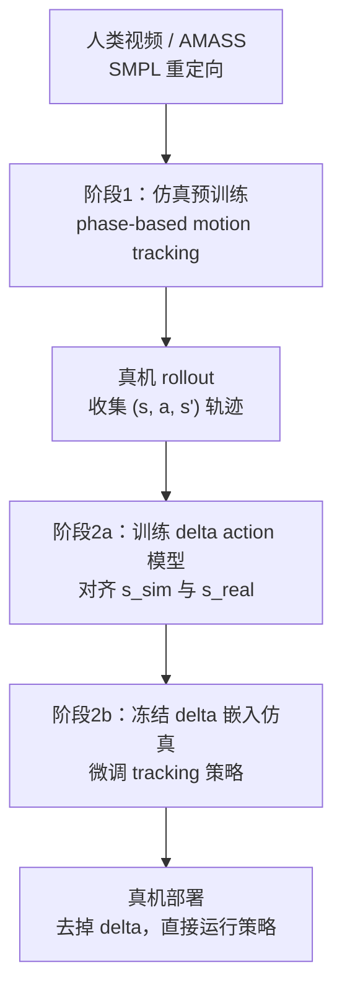
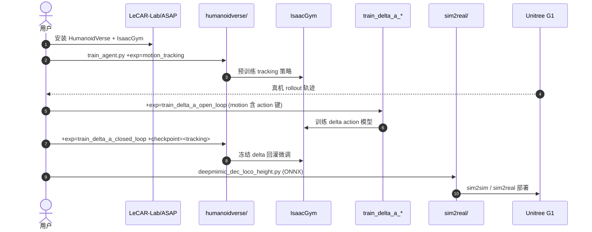

# ASAP：Aligning Simulation and Real-World Physics for Agile Humanoid Skills

**ASAP**（*Aligning Simulation and Real-World Physics for Learning Agile Humanoid Whole-Body Skills*，[RSS 2025](https://agile.human2humanoid.com/)，[arXiv:2502.01143](https://arxiv.org/abs/2502.01143)）由 **CMU LECAR Lab × NVIDIA** 提出：针对 **敏捷全身技能** 的 sim–real **动力学失配**，用 **两阶段 delta action** 管线——仿真预训练 tracking → 真机数据训残差动力学 → 回灌仿真微调 → 真机 **无 delta** 部署——在 Unitree G1 侧跳、前跳、踢球、球星庆祝等动作上显著降低跟踪误差。

## 一句话定义

ASAP 把 sim–real 动力学差建成可学习的 **delta action 模型**，冻结嵌入仿真器对齐物理后再微调 tracking 策略，真机部署时移除 delta，使高动态全身动作不必牺牲在保守域随机化或昂贵 SysID 上。

## 英文缩写速查

| 缩写 | 英文全称 | 简要说明 |
|------|----------|----------|
| ASAP | Aligning Simulation And real-world Physics | 本文方法 |
| RL | Reinforcement Learning | motion tracking 与 delta 模型训练 |
| SysID | System Identification | 传统参数辨识基线 |
| DR | Domain Randomization | 域随机化基线 |
| Sim2Real | Simulation to Real | IsaacGym→真机 G1 等迁移场景 |
| WBT | Whole-Body Tracking | 全身参考动作跟踪任务 |

## 为什么重要

- **残差 Sim2Real 的可操作范式：** 与 [residual-policy-learning](../methods/residual-policy-learning.md) 谱系一致，但修正作用在 **动力学/动作层** 并强调 **回灌仿真微调**——论文对照显示「只学 delta 不回灌」不够。
- **承认真机数据采集代价：** 敏捷动作 rollout 受电机过热、硬件损伤与规模限制；ASAP 把这一工程现实写进方法边界，而非假设无限真机数据。
- **工程完整开源：** [LeCAR-Lab/ASAP](https://github.com/LeCAR-Lab/ASAP)（MIT）基于 [HumanoidVerse](./humanoidverse.md)，发布 motion 数据、PHC 风格重定向、delta 训练 CLI、MuJoCo sim2sim 与 UnitreeSDK sim2real。

## 流程总览

## 核心信息

| 项 | 内容 |
|----|------|
| **机构** | 卡内基梅隆大学（CMU）；英伟达（NVIDIA） |
| **平台** | Unitree G1（29 DoF 部署文档见 README） |
| **venue** | RSS 2025 |
| **项目页** | <https://agile.human2humanoid.com/> |
| **代码** | <https://github.com/LeCAR-Lab/ASAP>（MIT，**已开源**） |
| **框架** | 基于 [HumanoidVerse](./humanoidverse.md) + [human2humanoid](./human2humanoid.md) 工程栈 |

## 核心原理

### 1. 四步 ASAP 框架（项目页）

1. **预训练 + 真机轨迹：** 人类 motion 重定向后在仿真训练多个 motion tracking 策略，并 rollout 真机轨迹。
2. **Delta action 训练：** 最小化仿真状态 \(s_t\) 与真机状态 \(s^r_t\) 偏差，学习补偿动力学失配的残差动作模型。
3. **策略微调：** **冻结** delta 模型，将其并入仿真器对齐「真实物理」，再微调预训练 tracking 策略。
4. **真机部署：** 运行微调策略，**不再携带** delta 模型。

### 2. 评测与迁移场景

论文评估 **IsaacGym→IsaacSim**、**IsaacGym→Genesis**、**IsaacGym→真机 G1** 三类迁移；相对 SysID、DR、以及 **仅学 delta 动力学但不回灌仿真** 的基线，跟踪误差显著下降（项目页 Before/After demo 含 LeBron James 等全身动作）。

### 3. 与 RobotDancing 等同协议基线

[RobotDancing](./paper-notebook-robotdancing-residual-action-rl-enables-robust-l.md) Table V 将 ASAP-style 作为 **同协议重实现** 基线——引用时需标明非原论文报告值。

## 源码运行时序图

官方 [LeCAR-Lab/ASAP](https://github.com/LeCAR-Lab/ASAP) 提供完整训练与部署入口。

关键复现路径：`humanoidverse/train_agent.py`（tracking → delta 开环 → delta 闭环微调）→ `sim2real/rl_policy/deepmimic_dec_loco_height.py`；真机 delta 数据采集 demo 见 `sim2real/rl_policy/listener_deltaa.py`。

## 工程实践（含开源状态）

| 项 | 结论 |
|----|------|
| 开源结论 | **已开源**（MIT）；项目页链 GitHub，README TODO（code、motion 数据、retargeting、sim2sim、sim2real、delta 训练）均已勾选完成 |
| Motion 数据 | `humanoidverse/data/motions/` 含 raw SMPL 与 retargeted G1（TairanTestbed singles） |
| 重定向 | 五步 PHC 风格管线：`fit_smpl_shape.py` → AMASS → `fit_smpl_motion.py` |
| Delta 训练 | motion 文件需额外 `"action"` 键；开环 `+exp=train_delta_a_open_loop`，闭环 `+exp=train_delta_a_closed_loop` |
| 部署 | MuJoCo sim2sim + UnitreeSDK2 Python sim2real；G1 需 29 DoF  waist 解锁（README 安全免责声明） |
| 依赖框架 | [HumanoidVerse](./humanoidverse.md) 提供多 sim 训练底座 |

## 结论

**ASAP 的核心判断是：高动态全身的 sim2real 瓶颈在动力学失配，且这份失配可以用真机 rollout 学到的 delta action 显式补偿——但补偿必须回灌进仿真做策略微调，部署时再摘掉。**

- **回灌是必要条件：** 论文与项目页强调，仅训练 delta 动力学而不用于仿真微调，效果不及完整 ASAP 管线；SysID 与纯 DR 亦落后。
- **修正层在动力学而非策略容量：** 继续堆 tracking 网络不如对齐 sim 与 real 的状态转移；这与 residual-policy 谱系一致，但 ASAP 针对 **全身敏捷技能** 与 **G1 真机** 给出完整开源闭环。
- **真机数据是硬成本：** 电机过热、硬件损伤与采集规模限制直接约束 delta 模型质量——方法诚实承认这一边界，而非假设无限真机 rollouts。
- **工程选型：** 若目标为 LeCAR 系敏捷 tracking + sim2real，优先 **ASAP 仓库**（含数据与部署）；若只需多 sim locomotion 基线，可先读 [HumanoidVerse](./humanoidverse.md)。
- **安全：** README 明确真机部署风险，研究用途免责声明——无 sim2real 经验者不应直接上硬件。

## 局限与风险

- **流程闭到真机：** 需要真机 rollout 与二次微调，比纯仿真 DR 更重。
- **上游重定向质量：** 人类视频 → SMPL → G1 误差进入 tracking 与 delta 训练链。
- **IsaacGym 旧栈：** Preview4 + Python 3.8 环境维护成本；IsaacSim/Genesis 需额外环境。
- **高动态硬件压力：** 敏捷动作本身损伤与过热风险仍在，delta 不能替代硬件保护策略。

## 与其他页面的关系

- 42 篇栈姊妹篇：[paper-hrl-stack-25-asap](./paper-hrl-stack-25-asap.md)
- Sim2Real 地图：[freedof-sim2real-44-papers-technology-map](../overview/freedof-sim2real-44-papers-technology-map.md)
- 残差谱系：[residual-policy-learning](../methods/residual-policy-learning.md)
- 框架底座：[HumanoidVerse](./humanoidverse.md)、[human2humanoid](./human2humanoid.md)

## 参考来源

- [humanoid_pnb_asap-aligning-simulation-and-real-world-physics.md](../../sources/papers/humanoid_pnb_asap-aligning-simulation-and-real-world-physics.md)
- [asap-agile-human2humanoid.md](../../sources/sites/asap-agile-human2humanoid.md)
- [asap.md](../../sources/repos/asap.md)
- [humanoidverse.md](../../sources/repos/humanoidverse.md)
- 深读笔记：<https://imchong.github.io/Robot_Learning_Paper_Notebooks/papers/03_High_Impact_Selection/ASAP_Aligning_Simulation_and_Real-World_Physics_for_Agile_Humanoid_Skills/ASAP_Aligning_Simulation_and_Real-World_Physics_for_Agile_Humanoid_Skills.html>

## 推荐继续阅读

- 项目页：<https://agile.human2humanoid.com/>
- 官方代码：<https://github.com/LeCAR-Lab/ASAP>
- 论文 PDF：<https://arxiv.org/pdf/2502.01143>
