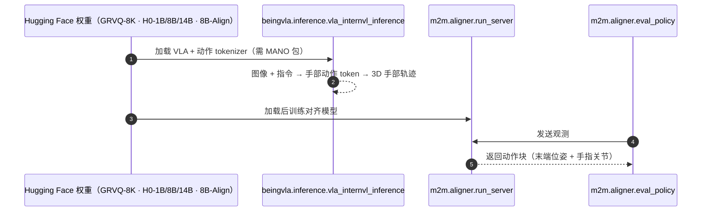

# Being-H0

**Being-H0: Vision-Language-Action Pretraining from Large-Scale Human Videos** 收录于 [Robot Learning Paper Notebooks](https://imchong.github.io/Robot_Learning_Paper_Notebooks/index.html)（分类：06_Manipulation），深读笔记已完成。本页编译自深读笔记与 arXiv 论文正文（实验数字、开源状态于 2026-09-28 核对），细节以论文 PDF 为准。

## 一句话定义

Being-H0 是一个在大规模人类视频上训练的灵巧视觉-语言-动作模型（VLA）。现有 VLA 在高灵巧操作上吃力、对新场景泛化差，主因是依赖有 sim-to-real 差距的合成数据或缺规模与多样性的遥操作演示。为破数据瓶颈，本文把人手当作基础操作器（foundation manipulator），利用网络数据中丰富的灵巧性与可扩展性。方法核心是物理指令微调（physical instruction tuning）：结合大规模人类视频 VLA 预训练、3D 推理的物理空间对齐、以及面向机器人任务的后训练适配。还提出部件级运动 token 化（part-level motion tokenization），达毫米级重建精度以建模精确手部轨迹；并构建融合动捕、VR、RGB-only 视频的百万级运动指令数据集。实验显示 Being-H0 在手部动作生成与指令跟随上优异，随模型与数据规模良好扩展，并在真机操作上随物理指令微调见效。

## 英文缩写速查

| 缩写 | 含义 |
|---|---|
| VLA | Vision-Language-Action 模型 |
| Physical Instruction Tuning | 物理指令微调（本文范式） |
| Motion Tokenization | 运动 token 化（部件级，毫米级精度） |
| Foundation Manipulator | 基础操作器（人手） |
| Physical Space Alignment | 物理空间对齐（3D 推理） |
| Post-training Adaptation | 后训练适配到机器人任务 |

## 为什么重要

- **"人手 = 基础操作器"**是把网络视频转成操作先验的有力视角；
- **物理空间对齐**让 2D 视频学到 3D 可执行动作，弥合 sim-to-real；
- **运动 token 化**把连续手轨离散化，便于 VLA 建模；
- 与 H-RDT、In-N-On 等共同壮大"人类视频 → 灵巧操作"路线。

## 解决什么问题

VLA 高灵巧操作难、泛化差： - 合成数据有 **sim-to-real 差距**； - 遥操作演示**缺规模与多样性**。

Being-H0 要：把**人手**当基础操作器，从**网络规模人类视频**学灵巧 VLA，破数据瓶颈。

## 核心机制

1. **人手作基础操作器**：从网络规模人类视频学灵巧 VLA；
2. **物理指令微调**：VLA 预训练 + 物理空间对齐 + 机器人适配；
3. **部件级运动 token 化**：毫米级精度建模手轨迹；
4. **百万级多源数据 + 规模化**：动捕/VR/RGB，随规模扩展、真机见效。

方法拆解（深读笔记小节）：物理指令微调（核心范式）；部件级运动 token 化（毫米级）；多源数据管线；结果；🧭 整体流程（mermaid）。

## 核心信息

| 字段 | 内容 |
|------|------|
| 分类 | 06_Manipulation |
| 深读笔记 | <https://imchong.github.io/Robot_Learning_Paper_Notebooks/papers/06_Manipulation/Being-H0__Vision-Language-Action_Pretraining_from_Large-Scale_Human_Videos/Being-H0__Vision-Language-Action_Pretraining_from_Large-Scale_Human_Videos.html> |
| arXiv | <https://arxiv.org/abs/2507.15597> |
| 源码 | **部分开源**：[BeingBeyond/Being-H0](https://github.com/BeingBeyond/Being-H0) 已放出推理 / 评测脚本、GRVQ 手部动作 tokenizer 与 1B / 8B / 14B 权重、后训练数据；README TODO 中训练代码、真机开发、仿真基准仍未勾选（2026-09-28 核对）。后续系列统一到 [BeingBeyond/Being-H](https://github.com/BeingBeyond/Being-H) |
| 作者 | Hao Luo、Yicheng Feng、Wanpeng Zhang、Sipeng Zheng、Haoqi Yuan、Qin Jin、Zongqing Lu 等（北大 / BAAI 等） |
| 发表 | 2025 年 7 月 |
| 笔记阅读日期 | 2026-06-21 |

## 源码运行时序图

当前可复现的是推理与评测链路；预训练 / 后训练脚本仍在 TODO 中。

## 实验与评测

**设置**：预训练数据 UniHand（动捕 / VR / 纯 RGB 视频合成的百万级动作–语言指令，EgoDex 占主体）；手部动作用分组残差量化（GRVQ）离散化。评测分两部分：

1. **手部动作生成基准**（留出 5% UniHand）：head split = EgoDex、tail split = TACO / HOI4D / H2O / OakInk2；指标 MPJPE、MWTE、PA-MPJPE、M2T R@3、FID，任务含视觉条件生成、上下文续写、动作→文本翻译。
2. **真机灵巧操作**：Franka FR3 + 6-DoF Inspire 手 + RealSense L515；每任务 50–100 条遥操作轨迹后训练，20 次随机初始化试验。

真机成功率（论文 Table 7）：

| 任务 | GR00T N1.5 | InternVL3（同架构无手部预训练） | **Being-H0** |
|------|----:|----:|----:|
| Pick-Place-Toy 见过 / 未见 / 杂乱 | 0.75 / 0.40 / 0.50 | 0.55 / 0.55 / 0.50 | **0.75 / 0.65 / 0.60** |
| Close-Toolbox | 0.80 | 0.50 | **0.85** |
| Close-Lid | 0.50 | 0.25 | **0.60** |
| Pour-Cup | 0.90 | 0.55 | **1.00** |
| Unfold-Clothes | 0.60 | 0.45 | **0.75** |

- **数据效率**：Pick-Place-Toy 用 25% 数据即追平 InternVL3 的 100%；Close-Lid 在 25% 数据下基线 0%、Being-H0 15%。
- **消融**：去掉视角不变的分布均衡，tail split 明显退化；去掉上下文续写监督，各项生成指标一致下降；训练样本到 2.5M 仍在提升，但最大规模时 PA-MPJPE 略降、语义指标继续上升。

## 与其他工作对比

| 工作 | 人类视频 → 动作的方式 | 与 Being-H0 的差异 |
|------|------|------|
| [GR00T N1.5](./isaac-gr00t.md) | 隐式潜动作 | 见过物体上接近，未见物体与杂乱场景明显落后；Being-H0 用显式手部动作 token |
| InternVL3（同架构） | 无手部预训练 | 隔离出「物理指令微调」本身的贡献 |
| [H-RDT](./paper-notebook-h-rdt-human-manipulation-enhanced-bimanual-robot.md) | 48 维手部姿态 + 扩散 / 流匹配 | 连续动作回归、面向双臂夹爪；Being-H0 自回归离散 token、面向灵巧手 |
| [Being-H0.7](../methods/being-h07.md) | 潜空间世界–动作模型 | 同团队后续版本，路线从显式手部 token 转向潜空间世界模型 |

## 结论

**Being-H0 的核心赌注是「人手即基础操作器」：与其等遥操作数据攒够规模，不如把网络规模人类视频转成操作先验，再用物理指令微调补上 3D 与机器人侧的落差。**

- 真正起作用的是三段式范式的完整链条：大规模人类视频 VLA 预训练 → 3D 推理的物理空间对齐 → 面向机器人任务的后训练适配；缺了中间一段，2D 视频学不出可执行动作。
- 部件级运动 token 化（毫米级重建精度）是前置条件而非附加项——离散化精度不够，灵巧性在进入 VLA 之前就已损失。
- 数据侧靠动捕 / VR / RGB-only 视频混合出百万级运动指令集，主要论据是随模型与数据规模的良好扩展，而不是单点任务成绩。
- 它回应的是两个具体瓶颈：合成数据的 sim-to-real 差距、遥操作演示的规模与多样性不足；与 H-RDT、In-N-On 同属「人类视频 → 灵巧操作」路线。
- 真机上显式手部 token 的收益体现在泛化：未见物体 0.65（GR00T N1.5 0.40），杂乱场景 0.60（0.50）；同架构去掉手部预训练的 InternVL3 在每个任务上都更低。

## 局限与风险

- **2D 视频的空间歧义**：弱透视投影下深度不确定，论文建议后续引入深度、触觉、音频等多感官信号。
- **真机只验证单臂 + 灵巧手**：Franka + Inspire 手，双臂、人形与夹爪未覆盖；每任务仍需 50–100 条遥操作后训练。
- **规模化的权衡**：数据量增大时语义对齐指标继续上升，但手指细节精度（PA-MPJPE）略降。
- **开源边界**：可跑推理与评测；训练代码、真机开发与仿真基准在 README TODO 中未完成，无法端到端复现预训练。

## 与其他页面的关系

- 分类父节点：[paper-notebook-category-06-manipulation](../overview/paper-notebook-category-06-manipulation.md)
- 总索引：[humanoid-paper-notebooks-index.md](../overview/humanoid-paper-notebooks-index.md)
- VLA 方法总览：[vla](../methods/vla.md)
- 对比基线 GR00T N1.5：[isaac-gr00t](./isaac-gr00t.md)
- Being-H 系列统一代码库：[cn-os-being-h](./cn-os-being-h.md)
- 后续版本 Being-H0.7：[being-h07](../methods/being-h07.md)
- 同为人手视频预训练的扩散路线：[paper-notebook-h-rdt-human-manipulation-enhanced-bimanual-robot](./paper-notebook-h-rdt-human-manipulation-enhanced-bimanual-robot.md)

## 参考来源

- [Being-H0 源码归档](../../sources/repos/being-h0.md)（<https://github.com/BeingBeyond/Being-H0>）

- [humanoid_pnb_being-h0.md](../../sources/papers/humanoid_pnb_being-h0.md)
- 深读笔记：<https://imchong.github.io/Robot_Learning_Paper_Notebooks/papers/06_Manipulation/Being-H0__Vision-Language-Action_Pretraining_from_Large-Scale_Human_Videos/Being-H0__Vision-Language-Action_Pretraining_from_Large-Scale_Human_Videos.html>
- 论文：<https://arxiv.org/abs/2507.15597>
- 论文正文（Table 7、数据效率与消融）：<https://arxiv.org/html/2507.15597>
- 官方代码：<https://github.com/BeingBeyond/Being-H0>
- [being-h0.md](../../sources/repos/being-h0.md) — 仓库归档

## 推荐继续阅读

- [机器人论文阅读笔记：Being-H0](https://imchong.github.io/Robot_Learning_Paper_Notebooks/papers/06_Manipulation/Being-H0__Vision-Language-Action_Pretraining_from_Large-Scale_Human_Videos/Being-H0__Vision-Language-Action_Pretraining_from_Large-Scale_Human_Videos.html)
- 项目页：<https://research.beingbeyond.com/being-h0>
- 模型集合：<https://huggingface.co/collections/BeingBeyond/being-h0-688dcc58cbd6b452f16bd7ec>
