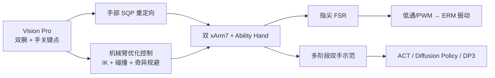
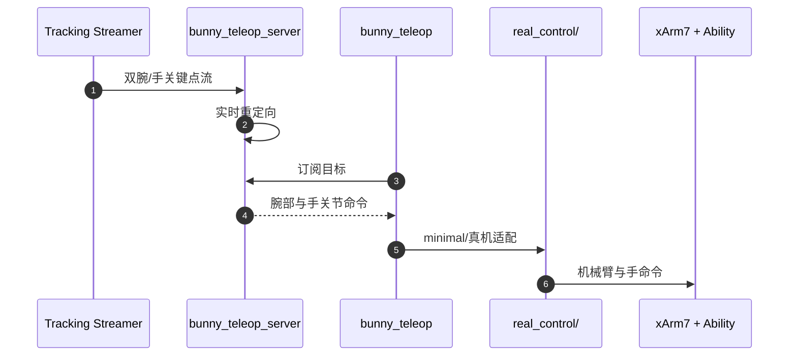

# Bunny-VisionPro：Vision Pro 双手灵巧遥操作与触觉反馈

**Bunny-VisionPro**（*Real-Time Bimanual Dexterous Teleoperation for Imitation Learning*，[arXiv:2407.03162](https://arxiv.org/abs/2407.03162)）由香港大学与加州大学圣地亚哥分校提出。

## 一句话定义

**Bunny-VisionPro 把 Vision Pro 的双腕/手指追踪拆成实时手部重定向与带安全代价的机械臂优化控制，并把机器人指尖触觉回灌为操作者手上的振动反馈。**

## 英文缩写速查

| 缩写 | 英文全称 | 简要说明 |
|------|----------|----------|
| VR | Virtual Reality | Apple Vision Pro 提供双腕与手关键点 |
| SQP | Sequential Quadratic Programming | 在线求解手部重定向约束优化 |
| IK | Inverse Kinematics | 腕姿到双机械臂关节的基础映射 |
| FSR | Force-Sensitive Resistor | 机器人指尖压力测量与触觉输入 |
| ERM | Eccentric Rotating Mass | 操作者侧低成本振动执行器 |
| IL | Imitation Learning | 用遥操作示范训练 ACT/DP/DP3 |

## 为什么重要

- **双手不是两套单手拼接：** 双臂轨迹、手指接触和物体交接存在时空耦合，需统一处理碰撞与奇异点。
- **把实时性量化：** 手重定向约 3.43 ms，完整机械臂约束控制约 15.93 ms，均支持超过 60 Hz。
- **遥操作质量影响策略泛化：** 同样模型下，Bunny 示范相对 AnyTeleop+ 平均提高策略成功率及未见物体泛化。
- **触觉价值被单独验证：** 振动反馈改善遮挡或硬物任务的定位信心，但论文也明确触觉装置未参与早期示范采集。

## 核心信息

| 项 | 内容 |
|----|------|
| 机构 | 香港大学（HKU）；加州大学圣地亚哥分校（UC San Diego） |
| 输入 | Apple Vision Pro 双腕位姿与手关键点 |
| 平台 | 2×xArm7 + 2×6-DoF Ability Hand，共 24 DoF |
| 触觉 | 每手 30 个指尖 FSR；操作者侧 ERM 振动 |
| 控制 | 手部 SQP 重定向；腕部优化控制含 IK、碰撞、奇异规避 |
| 评测 | Telekinesis 10 项；6 项自定义双手任务；ACT/DP/DP3 |
| 开源 | MIT，基础链与真机/触觉已发；安全优化模块仍在 TODO |

## 流程总览

## 核心机制（方法栈）

### 1）高频手部重定向

目标函数匹配缩放后的人手关键向量与机器人手 FK 向量，并惩罚相邻帧关节跳变；对 Ability Hand 的闭环连杆约束做降维处理，使有 loop joint 的求解从约 34.98 ms 降到约 3.43 ms。

### 2）统一机械臂安全优化

腕部目标不只做 IK：目标同时考虑位置/旋转误差、关节平滑、可操作度与球体近似自碰撞距离。奇异代价仅在最小奇异值低于阈值时激活，避免持续干扰正常跟踪。

### 3）人侧触觉闭环

机器人指尖 FSR 经校准和低通后转成 PWM，驱动操作者手上的 ERM；这是接触提示而非真实力反射，因此能提示“碰到了”，不能精确重现接触力方向与大小。

## 源码运行时序图

复现可拉取 Docker 服务端并 `pip install bunny_teleop`，再运行 `examples/minimal/minimal.py`；主仓库的真机入口面向 XArm7+Ability Hand。

## 与其他工作对比

| 维度 | Bunny-VisionPro | AnyTeleop+ | ACE |
|------|-----------------|------------|-----|
| 输入 | Vision Pro | Vision Pro（公平改造） | 外骨骼 + 手前相机 |
| 双臂安全 | 论文含碰撞/奇异优化 | 复杂轨迹易激进 | 由平台侧补充 |
| 触觉 | FSR→ERM 振动 | 无 | 无 |
| 开源边界 | 基础链已发，安全模块缺 | 依赖组合实现 | 软件/硬件公开 |

## 工程实践

- **服务端隔离：** 重定向重计算放 Docker 服务端，机器人客户端保持轻量，方便换平台。
- **先做频率预算：** 完整机械臂控制约 15.93 ms；网络、Vision Pro streaming 与机器人 SDK 延迟还需另计。
- **触觉需重新标定：** FSR 零漂和黏性封装形变会影响力值，触觉提示与学习输入不能共享未经处理的标定。
- **开源状态：** [主仓库](https://github.com/Dingry/BunnyVisionPro)为 MIT，已含客户端、XArm7+Ability 真机和触觉入口；截至 2026-07-28，collision/singularity/collision-free retargeting 仍列 TODO，不能按 README 直接复现论文完整安全控制。

## 实验与评测

- Telekinesis 10 项中，Bunny 在 **9/10** 项达到或超过既有基线；剪刀拾取为 7/10，受 Ability Hand 自由度限制。
- 六项自定义任务相对 AnyTeleop+：成功率高 **11%**，完成时间约为对方 **45%**，episode 长度低 **19%**，臂关节变化低 **43%**。
- 五名无经验操作者、每项五次的触觉用户研究中，10 个“操作者×任务”比较有 **9 个**维持或提高成功率。
- ACT、Diffusion Policy、DP3 三模型三任务平均成功率提高 **22%**；空间泛化提高 **14%**、未见物体提高 **26%**。
- 30 条示范的长时程任务，子任务成功率 **73%**，整项成功率 **38%**。

## 结论

**Bunny-VisionPro 证明双手遥操作的主要收益来自高频、平滑且带约束的轨迹，而触觉是提升接触可见性的辅助通道，不是全部性能来源。**

1. **先保实时再加约束** — 3.43 ms 手重定向与 15.93 ms 臂控制是系统可用的前提。
2. **示范质量会传导到泛化** — 同模型比较下，轨迹一致性改善未见物体与空间泛化。
3. **长时程仍是瓶颈** — 子任务 73% 到整项 38% 的落差说明误差累积显著。
4. **触觉结论需谨慎读** — 早期示范采集未使用人侧触觉，不能把 IL 增益归因于振动反馈。
5. **论文能力大于公开实现** — 公开仓库可跑基础链，但完整安全模块需自行补齐。

## 局限与风险

- Apple Vision Pro 成本、生态和 Tracking Streamer 依赖削弱“普适低成本”定位。
- 球体碰撞模型是近似；复杂手—臂—环境接触仍需机器人侧急停、限速和安全区域。
- ERM 只提供事件/强度提示，不是双边力反馈；过度振动也会增加操作者负担。
- 评测集中于 xArm7+Ability Hand，跨不同臂手形态的真实部署证据有限。

## 与其他页面的关系

- 路线定位：[遥操作纵深 Stage 4](../../roadmap/depth-teleoperation.md) 的视觉手姿与触觉接口。
- 主任务：[Teleoperation](../tasks/teleoperation.md)。
- 低成本外骨骼对照：[ACE](./paper-notebook-ace-a-cross-platform-visual-exoskeletons-system.md)。
- 无机器人采集对照：[DexUMI](./paper-notebook-dexumi-using-human-hand-as-the-universal-manipul.md)。
- 下游方法：[Imitation Learning](../methods/imitation-learning.md)。

## 参考来源

- [Humanoid Paper Notebooks 来源归档](../../sources/papers/humanoid_pnb_bunny-visionpro.md)
- [Bunny-VisionPro 项目页核查](../../sources/sites/bunny-visionpro.md)
- [Bunny-VisionPro 代码仓库核查](../../sources/repos/bunny-visionpro.md)
- 论文：<https://arxiv.org/abs/2407.03162>

## 推荐继续阅读

- 官方文档：<https://dingry.github.io/BunnyVisionPro/>
- 代码：<https://github.com/Dingry/BunnyVisionPro>
