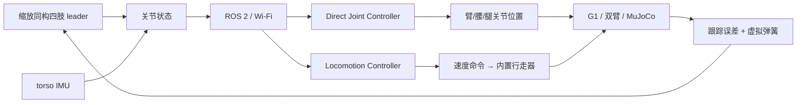
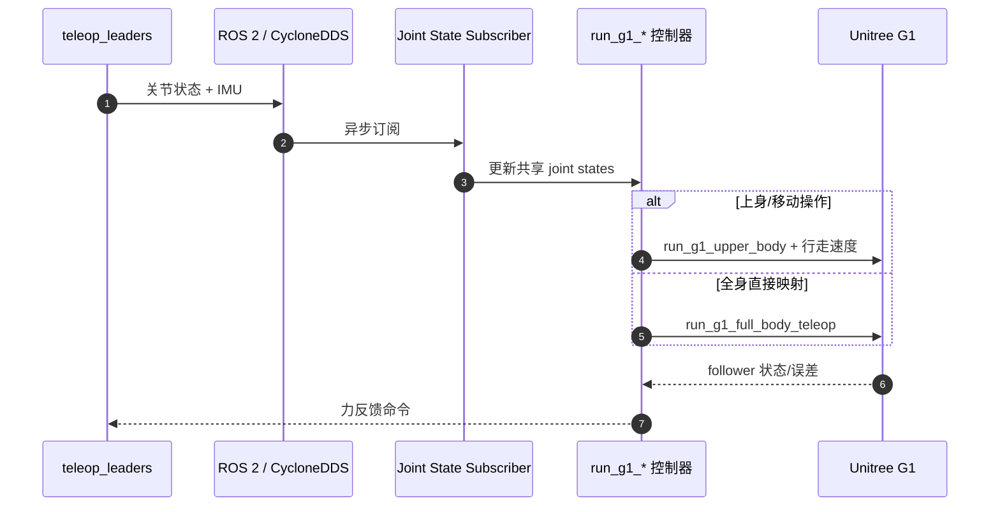

# CHILD：婴儿背带式全身人形关节遥操作

**CHILD**（*Controller for Humanoid Imitation and Live Demonstration*，[arXiv:2508.00162](https://arxiv.org/abs/2508.00162)）由伊利诺伊大学厄巴纳-香槟分校 KIMLAB 提出，发表于 Humanoids 2025。

## 一句话定义

**CHILD 是一套可穿戴、可重构的缩放同构 leader：操作者直接摆动四肢关节控制人形，也可把腿临时切换成行走摇杆，从而在全身复现和移动操作之间切换。**

## 英文缩写速查

| 缩写 | 英文全称 | 简要说明 |
|------|----------|----------|
| CHILD | Controller for Humanoid Imitation and Live Demonstration | 本文全身关节级 leader 系统 |
| ROS 2 | Robot Operating System 2 | leader 与 follower 的 Wi-Fi 消息层 |
| IMU | Inertial Measurement Unit | 测 torso 绝对姿态并映射腰部/仿真躯干 |
| DoF | Degree of Freedom | 被直接映射或切换模式的关节自由度 |
| WBC | Whole-Body Control | CHILD 的邻接控制层；本文主要使用直接映射/内置行走器 |

## 为什么重要

- **全身关节级而非只给末端：** 能表达腿、腰与臂的构型，覆盖脚接球、爬行等末端 IK 接口难描述的动作。
- **同一硬件支持两种控制哲学：** 全身模式直接跟关节；移动操作模式让下身交给稳定行走控制器。
- **降低建造门槛：** 3D 打印、Dynamixel 与树莓派构成，论文成本低于 1k 美元、连续运行超过 2 h。
- **提供本体反馈：** 虚拟弹簧和跟踪误差反馈限制奇异构型，并让操作者感知 follower 跟不上。

## 核心信息

| 项 | 内容 |
|----|------|
| 机构 | 伊利诺伊大学厄巴纳-香槟分校（UIUC） |
| 发表 | Humanoids 2025 |
| 形态 | 婴儿背带 torso；七个可插拔 limb mount；可换显示器支架 |
| 传感/计算 | Dynamixel 编码器、BNO055 IMU、Raspberry Pi 5 |
| 通信 | Wi-Fi + ROS 2 / CycloneDDS |
| follower | Unitree G1；多个双臂系统；MuJoCo 仿真 |
| 指标 | 平均延迟约 14 ms；成本略低于 1k 美元；续航 >2 h |
| 开源 | BOM/STL/软件已公开，仓库未声明许可证 |

## 流程总览

## 核心机制（方法栈）

### 1）缩放同构 leader 与可插拔 torso

每条 leader 保持 follower 对应肢体的关节拓扑，仅把连杆平移按比例缩小（G1 臂约 0.9，定制臂约 0.65）。七个插槽、卡扣与 pogo pin 让四肢组合能快速替换。

### 2）直接关节与移动操作双模式

- `Direct Joint Controller` 把 leader 位置直接发给 follower，IMU 姿态可映射三自由度 torso。
- `Locomotion Controller` 把某条腿的髋关节 roll/pitch/yaw 解释成侧向/前后/转向速度，交给 G1 内置行走器；对应手臂保持上一姿态。
- 双握把长按用于同步、启停与模式切换，避免一连网就突然跳到 leader 姿态。

### 3）自适应力反馈

关节虚拟弹簧把冗余 7-DoF 臂偏向基准构型；follower 与 leader 的大位置误差触发反馈，使操作者感到跟踪受阻。它是安全/可操作性提示，不等于环境端力的高保真双边回传。

## 源码运行时序图

仓库先在 CHILD 端启动 `leader_hw_g1_all_limbs.launch.py`，再在 G1 端运行 `run_g1_upper_body` 或 `run_g1_full_body_teleop`；复现依赖 ROS 2 Humble、PAPRAS、Dynamixel 与 Unitree SDK。

## 与其他工作对比

| 维度 | CHILD | ACE | VR + 全身跟踪策略 |
|------|-------|-----|--------------------|
| 输入 | 同构关节 leader | 腕部外骨骼 + 手视觉 | 头手稀疏追踪 |
| 下身 | 直接关节或行走摇杆 | 主要腕/手接口 | 学习式全身补全 |
| 反馈 | 虚拟弹簧/跟踪误差 | 无触觉 | 通常无力反馈 |
| 泛化 | 换 leader 构型 | IK/重定向换平台 | 换策略/机器人模型 |

## 工程实践

- **先做 follower 映射表：** 配置 leader motor→joint 和 follower joint，确认方向、零位、缩放与关节限位。
- **网络是控制环一部分：** 固定 ROS domain/CycloneDDS peer，记录 14 ms 外的丢包和抖动，而不只测平均延迟。
- **模式切换必须可恢复：** 腿作摇杆时臂保持上一姿态，恢复前应检查物体载荷和碰撞空间。
- **开源状态：** [官方仓库](https://github.com/uiuckimlab/CHILD)含 BOM、STL、`hw_interface/`、`teleop_sw/` 与 G1 指令；截至 2026-07-28 未见许可证，属于可复现源码/设计公开而非授权边界清晰的软件包。

## 实验与评测

- 移动操作示例完成“桌边取箱→行走搬运→另一桌放置”，上身用直接映射、下身用 G1 内置行走器。
- 全身示例用脚接球、放球并踢回；论文明确真机由龙门架和人员支撑，不能据此推断无保护动态平衡。
- MuJoCo 中展示爬行，两名操作者在显示器支架上控制四肢，骨盆固定、IMU 控制朝向。
- 定量系统指标主要是 **约 14 ms 平均延迟、<1k 美元、>2 h 续航**；论文没有大规模任务成功率或用户研究。

## 结论

**CHILD 的价值是把“全身关节表达能力”做成便携、低延迟的物理接口，但动态稳定仍依赖 follower 控制器或外部保护。**

1. **直接映射适合构型表达** — 脚、腰和爬行姿态比末端 IK 更自然。
2. **行走模式适合实用搬运** — 下身交给稳定控制器，牺牲直接腿控换取可移动性。
3. **硬件可重构不等于软件即插即用** — 每个 follower 仍需映射、限位、安全状态与 SDK 适配。
4. **14 ms 只是平均链路指标** — 真机还需监控尾延迟、Wi-Fi 丢包和模式切换瞬态。
5. **评测应按演示证据读** — 脚接球有支撑，未证明自由站立下的全身动态遥操作。

## 局限与风险

- 同构 leader 需要按目标肢体设计/打印，跨机器人泛化弱于纯视觉或任务空间接口。
- 单人穿戴近似直立时最多舒适控制两肢；复杂全身动作要支架与多人。
- 力反馈主要反映构型/跟踪误差，不提供环境接触方向和真实力矩。
- 直接腿关节控制有跌倒与夹伤风险；必须使用支撑、限位、急停和经过验证的机器人状态机。

## 与其他页面的关系

- 路线定位：[遥操作纵深 Stage 3](../../roadmap/depth-teleoperation.md) 的全身关节级接口。
- 主任务：[Teleoperation](../tasks/teleoperation.md)。
- 控制前置：[Whole-Body Control](../concepts/whole-body-control.md)。
- 稀疏视觉路线：[Whole-Body Tracking Pipeline](../concepts/whole-body-tracking-pipeline.md)。
- 跨平台外骨骼对照：[ACE](./paper-notebook-ace-a-cross-platform-visual-exoskeletons-system.md)。

## 参考来源

- [Robot Learning Paper Notebooks 来源归档](../../sources/papers/humanoid_pnb_child.md)
- [CHILD 项目页核查](../../sources/sites/child-teleoperation.md)
- [CHILD 代码/硬件仓库核查](../../sources/repos/child-teleoperation.md)
- 论文：<https://arxiv.org/abs/2508.00162>

## 推荐继续阅读

- 项目页：<https://uiuckimlab.github.io/CHILD-pages/>
- 运行说明：<https://github.com/uiuckimlab/CHILD/blob/main/Teleop_Instruction.md>
