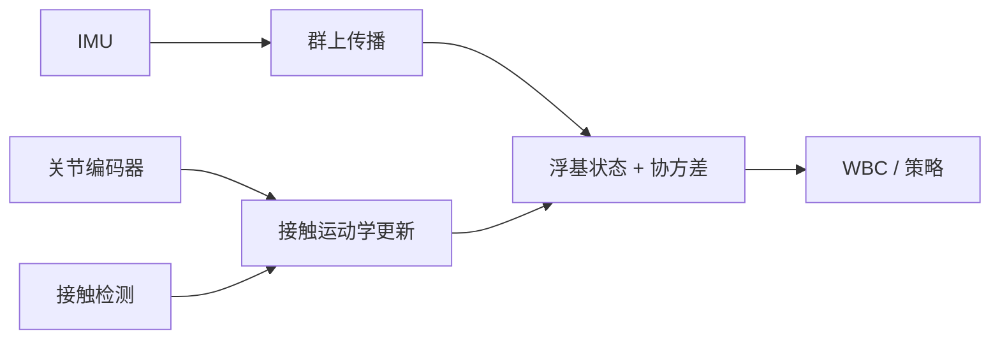

# Contact-Aided InEKF（接触辅助不变 EKF）

**Contact-Aided Invariant Extended Kalman Filtering for Legged Robot State Estimation**（[arXiv:1805.10410](https://arxiv.org/abs/1805.10410)；相关扩展/期刊版本常见引用 [arXiv:1904.09251](https://arxiv.org/abs/1904.09251)）把接触点近似静止的事实写进 Lie 群不变滤波，用 IMU 传播 + 足端运动学更新估计浮基状态。HMI 编号 **P074**。

## 一句话定义

当脚可靠接触且不滑动时，把接触点当作短时世界系锚点，在矩阵 Lie 群上做不变 EKF，得到更稳的基座姿态/速度/位置估计。

## 英文缩写速查

| 缩写 | 英文全称 | 简要说明 |
|------|----------|----------|
| InEKF | Invariant Extended Kalman Filter | 在李群误差上构造的不变扩展卡尔曼滤波 |
| IMU | Inertial Measurement Unit | 高频传播姿态与速度 |
| EKF | Extended Kalman Filter | 欧氏线性化基线 |
| WBC | Whole-Body Control | 常消费估计输出的下游控制 |

## 为什么重要

- 腿式机器人没有固定基座：只有 IMU + 腿部运动学时，接触约束是抑制漂移的关键观测。
- InEKF 的 log-linear 误差动力学对大姿态误差更友好，不只是「换个坐标写 EKF」。
- 接触切换会改变状态维度——估计器与控制状态机必须共用接触逻辑。

## 核心原理

- **传播**：IMU 角速度/加速度驱动群上状态。
- **更新**：接触成立时，足端正运动学提供相对基座观测；新接触增广状态，离地移除。
- **输出**：基座姿态、速度、位置及协方差给 WBC/RL。

## 方法栈与流程

把上面的传播/更新/输出三段落成一条可核对的滤波流水线：

1. **建群上状态**：把浮基姿态/速度/位置（及接触点锚点）表示为矩阵 Lie 群元素，误差在群上定义为不变误差。
2. **IMU 传播**：用高频 IMU 角速度/加速度驱动群上状态与协方差前向传播。
3. **接触检测**：判定哪些足端可靠接触且不滑动；新接触增广状态，离地移除对应锚点。
4. **接触运动学更新**：接触成立时，足端正运动学给出相对基座观测，作为不变 EKF 的量测更新，利用「接触点近似静止」抑制漂移。
5. **输出接口**：把基座姿态/速度/位置**及协方差**一并交给 WBC / RL 下游，而非只给点估计。

要点：不变误差带来 log-linear 误差动力学，对大姿态误差更友好——这是相对普通 EKF 的核心差异，而非「多堆传感器」。

## 工程实践

1. 接触概率、迟滞与创新检验必不可少——脚滑时「静止」伪观测会污染速度。
2. 对齐 IMU–编码器时间戳；运动学参数与足端柔顺影响长期漂移。
3. 把协方差交给下游，而不是只甩一个点估计。

## 源码运行时序图

**不适用**（方法论文；社区有多种 InEKF 实现，本库不绑定单一官方训练仓）。

## 实验与评测读法

- 关注大扰动后的收敛、接触切换一致性，以及相对普通 EKF 的漂移。
- 预印本与期刊版章节组织可能不同，引用时写清版本。

## 结论

**Contact-Aided InEKF 的核心是「接触锚点 + 不变误差」，不是多堆传感器。**

- 接触模型错了会比没有更新更糟。
- 协方差是接口的一部分。
- 与感知 loco / WBC 联调时，先统一接触状态机。
- HMI P074 与 Paper Notebooks 状态估计分类指向同一工作线。

## 局限与风险

- 软土、脚尖滚动、误接触会破坏静止假设。
- 不能替代完整外感知定位；只是腿式本体估计骨干之一。
- 旧 stub 仅索引；本页升格后仍以 PDF 公式为准。

## 与其他工作对比

| 维度 | 本工作（Contact-Aided InEKF） | [EKF](../formalizations/ekf.md) | [State Estimation](../concepts/state-estimation.md) | [Sensor Fusion](../concepts/sensor-fusion.md) |
|------|------------------------------|---------------------------------|-----------------------------------------------------|-----------------------------------------------|
| 方法族 | 矩阵 Lie 群上的不变 EKF | 欧氏空间线性化的扩展卡尔曼滤波 | 状态估计问题与范式的概念页 | 多传感器融合的概念页 |
| 误差表示 | 群上不变误差，log-linear 误差动力学 | 切空间局部线性化，误差随姿态增大失真 | 涵盖滤波/优化多种表示 | 不限定滤波形式 |
| 关键假设 | 接触点在接触且不滑时近似世界系静止 | 线性化点邻域内近似成立 | 依具体方法而定 | 各源观测可标定/时间对齐 |
| 输入/输出 | IMU + 足端运动学 + 接触检测 → 浮基状态 + 协方差 | 通用预测/更新 → 状态 + 协方差 | 视方法而定 | 多模态观测 → 融合估计 |
| 关系/取舍 | 用接触约束抑制漂移，对大姿态误差更稳；接触模型错则更糟 | InEKF 的欧氏基线 | 本工作是其腿式浮基实例 | 本工作是 IMU-运动学融合的具体实现 |

## 关联页面

- [State Estimation](../concepts/state-estimation.md)
- [EKF](../formalizations/ekf.md)
- [Sensor Fusion](../concepts/sensor-fusion.md)
- [HMI 论文导读](../queries/hmi-papers-coverage.md)

## 参考来源

- [humanoid_pnb_contact-aided-invariant-ekf-for-legged-robots.md](../../sources/papers/humanoid_pnb_contact-aided-invariant-ekf-for-legged-robots.md)
- [humanoid-motion-intelligence.md](../../sources/repos/humanoid-motion-intelligence.md)

## 推荐继续阅读

- [arXiv:1805.10410](https://arxiv.org/abs/1805.10410)
- [arXiv:1904.09251](https://arxiv.org/abs/1904.09251)（相关版本）
- [HMI P074](https://github.com/RealXiaoze/humanoid-motion-intelligence/blob/main/%E8%AE%BA%E6%96%87%E4%B8%8E%E9%A1%B9%E7%9B%AE/%E8%AE%BA%E6%96%87%E9%80%90%E7%AF%87%E8%A7%A3%E8%AF%BB/P074.md)
- [深读笔记入口](https://imchong.github.io/Humanoid_Robot_Learning_Paper_Notebooks/index.html)
