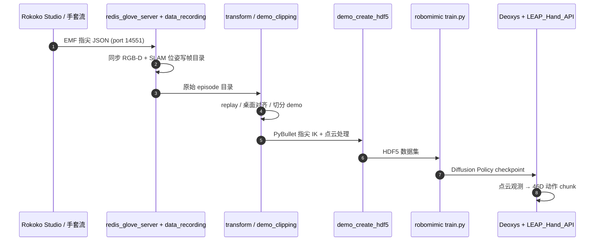

# DexCap：便携灵巧 mocap 与 DexIL 模仿学习

**DexCap**（*Scalable and Portable Mocap Data Collection System for Dexterous Manipulation*，[arXiv:2403.07788](https://arxiv.org/abs/2403.07788)，RSS 2024）由斯坦福大学 Chen Wang 等提出，隶属 The Movement Lab 与 Stanford Vision and Learning Lab。

## 一句话定义

**DexCap 用胸挂 RGB-D + SLAM 腕追踪 + EMF 数据手套采集人类灵巧操作，经点云观测与指尖 IK 重定向训练 Diffusion Policy，使 LEAP Hand 双臂在共享相机视角下复现野外示范。**

## 英文缩写速查

| 缩写 | 英文全称 | 简要说明 |
|------|----------|----------|
| mocap | Motion Capture | 捕捉人体/手部运动轨迹 |
| EMF | Electromagnetic Field | Rokoko 手套用电磁场测相对掌系指尖位置 |
| SLAM | Simultaneous Localization and Mapping | 多相机追踪腕/掌 6-DoF 位姿 |
| IK | Inverse Kinematics | 指尖目标 → LEAP Hand 16 维关节角 |
| FK | Forward Kinematics | 关节角 → 机器人手点云 mesh |
| IL | Imitation Learning | 从人类示范学习控制策略 |
| DP | Diffusion Policy | 以点云为条件的扩散动作序列生成 |

## 为什么重要

- **把 mocap 从实验室搬到野外：** 可穿戴背包方案（约 40 分钟续航）摆脱固定动捕室，支持 in-the-wild 物体交互采集。
- **相对 VR 视觉 teleop 更抗遮挡：** 项目页对比显示握杯柄等遮挡场景下 Quest 类视觉追踪失败，而 SLAM+EMF 组合仍稳定。
- **采集吞吐显著高于 teleoperation：** 宣称约为 teleop 的 **3×**，接近自然人类动作节奏——对规模化 dexterous IL 数据很关键。
- **观测视角人机一致：** 相机架快拆（<20 s）可在人与机器人间切换，减少 sim2real / human2robot 视觉域差。
- **学术线 → 产业线：** 同团队后续 [OM-1 / Reward AI](./reward-ai-om1.md) 把可穿戴 mocap 推到商业 Omnibody 栈（闭源，非本仓库等价物）。

## 核心信息

| 项 | 内容 |
|----|------|
| 机构 | 斯坦福大学（Stanford）— TML / SVL |
| 硬件 | 胸挂 RGB-D LiDAR + 3×SLAM 相机；Rokoko EMF 手套；NUC 背包 |
| 机器人 | 双臂 + LEAP Hand（每手 16 DoF 关节；策略动作 46 维含双臂） |
| 算法 | DexIL：点云观测 + 指尖 IK 重定向 + Diffusion Policy（20 步 action chunk） |
| 修正 | rollout 脚踏切换 residual 腕修正 / 全手 teleop IK；与原数据混合 fine-tune |
| 评测 | 6 项灵巧任务；30 min mocap 无 teleop 自主 rollout；in-the-wild 未见物体 |
| 开源 | **已开源**（MIT 代码 + [HF 数据集](https://huggingface.co/datasets/chenwangj/DexCap-Data)） |

## 流程总览

## 核心机制

### 1）DexCap 可穿戴 mocap

标定阶段 SLAM 相机置于胸挂支架；采集时移至手背追踪掌位。每帧同步：胸相机 RGB-D、相机/双手 6-DoF 位姿、相对掌系指尖 3D（EMF 手套）。相对纯视觉方案，EMF 不受手指互遮影响。

### 2）观测与动作重定向

- **观测：** RGB-D 融合为 3D 点云，变换到机器人操作空间；去除桌面/背景冗余点；当人手在视野内时用 FK 生成 LEAP Hand 点云 mesh 叠加，缩小 human-hand vs robot-hand 视觉差。
- **动作：** 指尖 IK 把 EMF 测得的指尖 3D 映射到 LEAP Hand 16 维关节；机械臂跟随腕部位姿。

### 3）DexIL 模仿学习

Diffusion Policy 以固定世界系下的 chest 点云为条件，输出 20 步未来目标位姿（46 维，含双臂与双手）。训练基于 [robomimic](https://github.com/ARISE-Initiative/robomimic) 格式 HDF5；部署侧机械臂用 [Deoxys](https://github.com/UT-Austin-RPL/deoxys_control)，LEAP Hand 用 [LEAP_Hand_API](https://github.com/leap-hand/LEAP_Hand_API)。

### 4）人机闭环修正（可选）

策略 rollout 失败时，操作者脚踏切换两种模式：**residual**（仅叠加人类腕部 3D delta，省力但需精细控制）与 **teleop IK**（全手动作直接映射，控制力强但费力）。修正轨迹存入新数据集，与原 mocap 均匀采样后 fine-tune（论文示例：1 h mocap + 30 次修正完成泡茶、剪刀等长程任务）。

## 源码运行时序图

复现路径：NUC 端 `conda env create -f install/env_nuc_windows.yml` 后跑 `STEP1_collect_data`；Ubuntu 工作站 `pip install -r install/env_ws_requirements.txt` 并 editable 安装 `STEP3_train_policy`，再 `demo_create_hdf5.py` 与 `scripts/train.py --config training_config/*.json`。也可直接下载 [HF 数据集](https://huggingface.co/datasets/chenwangj/DexCap-Data) 跳过采集。

## 实验与评测

| 维度 | 要点 |
|------|------|
| 任务规模 | 6 项单/双手灵巧操作；另展示 in-the-wild 采集与未见物体泛化 |
| 数据效率 | **30 分钟** 人类 mocap（无 teleop）即可训练可自主 rollout 的策略 |
| 长程任务 | 泡茶、剪刀等需 **1 h mocap + 30 次 HITL 修正** fine-tune |
| 对比基线 | 项目页强调相对 VR 视觉 hand tracking 的遮挡鲁棒性；吞吐约为 teleop **3×** |
| 局限 | 需定制可穿戴硬件（SLAM 相机、EMF 手套、胸挂 RGB-D）；LEAP Hand + 特定双臂栈，跨本体需重新 IK 与点云处理 |

## 工程实践

| 项 | 内容 |
|----|------|
| 代码 | [j96w/DexCap](https://github.com/j96w/DexCap)（MIT） |
| 数据 | [chenwangj/DexCap-Data](https://huggingface.co/datasets/chenwangj/DexCap-Data)（原始 + 处理后） |
| 硬件文档 | [2024-08 硬件/软件/采集教程](https://docs.google.com/document/d/1ANxSA_PctkqFf3xqAkyktgBgDWEbrFK7b1OnJe54ltw/edit) |
| 采集命令 | `python data_recording.py -s --store_hand -o ./save_data_scenario_1` |
| 训练入口 | `STEP3_train_policy/robomimic/scripts/train.py` |
| 开源状态 | **已开源** — 采集、处理、建集、训练四阶段均有脚本；硬件需自行组装 |

## 局限与风险

- **硬件门槛：** 非纯软件方案；需 Rokoko 手套、多 SLAM 相机、RGB-D LiDAR 与 NUC 背包，复现成本高于桌面 VR teleop。
- **平台绑定：** 默认 LEAP Hand + Deoxys 双臂栈；换 Allegro / Shadow 等需改 IK 与点云 mesh 生成。
- **SLAM 漂移：** 仓库提供 `--calib` 与 `calculate_offset_vis_calib.py`，长 session 仍可能需人工修正初始漂移。
- **与 OM-1 勿混读：** [Reward AI OM-1](./reward-ai-om1.md) 为商业闭源后继，DexCap 开源边界 **不等价** 于 OM-1 全栈。
- **点云策略泛化：** 依赖 chest 固定视角点云；大幅改变相机布局或光照需重新采集或域随机化。

## 结论

**DexCap 把「野外可穿戴 mocap + 点云模仿学习」做成可复现开源管线，30 分钟人类示范即可驱动 LEAP 双臂灵巧任务，是 EMF 手套路线相对 VR 视觉 teleop 的强对照。**

- 真影响指标的是 **SLAM+EMF 抗遮挡** 与 **人机共享 chest 相机** 的组合，而非单纯换更大的 IL 模型。
- **3× teleop 吞吐** 与 **无 teleop 30 min 训练** 是规模化 dexterous 数据的核心卖点；长程任务仍依赖 HITL 修正数据。
- 复现优先走官方 GitHub 四阶段脚本 + HF 数据集；硬件 BOM 以 2024-08 Google Doc 为准。
- 选型上可与 [DexUMI](./paper-notebook-dexumi-using-human-hand-as-the-universal-manipul.md)、AnyTeleop 等并列，见 [灵巧数据采集指南](../queries/dexterous-data-collection-guide.md)。
- 产业演进读 [OM-1](./reward-ai-om1.md)，但 **勿把闭源 OM-1 当 DexCap 代码的超集**。
- 策略头为点云 [Diffusion Policy](../methods/diffusion-policy.md)；换 VLA 需自行改观测与 action 空间。

## 与其他页面的关系

- 分类父节点：[paper-notebook-category-06-manipulation](../overview/paper-notebook-category-06-manipulation.md)
- 数据采集综述：[dexterous-data-collection-guide.md](../queries/dexterous-data-collection-guide.md)
- 手套 vs 视觉 teleop：[data-gloves-vs-vision-teleop.md](../comparisons/data-gloves-vs-vision-teleop.md)
- 产业后继：[OM-1（Reward AI）](./reward-ai-om1.md)
- 方法栈：[imitation-learning.md](../methods/imitation-learning.md)、[diffusion-policy.md](../methods/diffusion-policy.md)

## 参考来源

- [humanoid_pnb_dexcap-scalable-and-portable-mocap-data-collecti.md](../../sources/papers/humanoid_pnb_dexcap-scalable-and-portable-mocap-data-collecti.md)
- [dexcap.md（项目页）](../../sources/sites/dexcap.md)
- [dexcap.md（代码仓库）](../../sources/repos/dexcap.md)
- 论文：<https://arxiv.org/abs/2403.07788>

## 推荐继续阅读

- [DexCap 项目页](https://dex-cap.github.io/) — 硬件示意、遮挡对比与 in-the-wild 视频
- [DexCap GitHub](https://github.com/j96w/DexCap) — 采集/训练完整脚本
- [DexCap-Data（Hugging Face）](https://huggingface.co/datasets/chenwangj/DexCap-Data) — 原始与处理后示范
