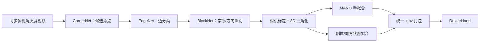
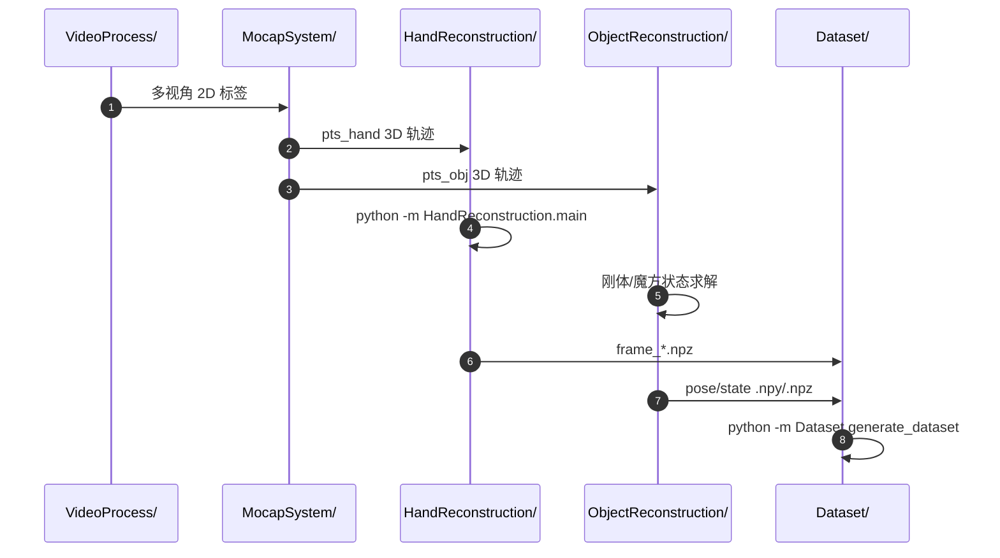

# DexterCap：低成本自动化灵巧手—物运动捕获

**DexterCap**（*An Affordable and Automated System for Capturing Dexterous Hand-Object Manipulation*，[arXiv:2601.05844](https://arxiv.org/abs/2601.05844)）由北京大学与腾讯 Robotics X 提出，入选 Eurographics 2026。

## 一句话定义

**DexterCap 把唯一字符编码的密集标记直接贴到手指刚性区域，以多视角识别、三角化和 MANO/物体拟合自动恢复细粒度在手操作轨迹。**

## 英文缩写速查

| 缩写 | 英文全称 | 简要说明 |
|------|----------|----------|
| HOI | Hand-Object Interaction | DexterHand 聚焦的细粒度手—物交互 |
| MANO | Model with Articulated and Non-rigid deformations | 被 3D 手部 markers 拟合的参数手模型 |
| MRE | Marker Reconstruction Error | MANO 表面预测 marker 与观测 3D marker 的距离 |
| MSNR | Motion Signal-to-Noise Ratio | 衡量重建轨迹信噪与平滑质量 |
| FPS | Frames Per Second | 官方系统以 20 FPS 采集多视角灰度视频 |

## 为什么重要

- **补足在手操作数据缺口：** 多数 HOI 数据偏抓取/搬运，DexterCap覆盖重抓、滑动、旋转和魔方关节状态。
- **遮挡时身份仍可恢复：** 每个 block 的字符 ID 避免同质圆点被交换，减少逐帧人工 relabel。
- **输出能接学习/重定向：** 手部为 MANO 参数、物体为位姿或铰接状态，便于后续生成、仿真与机器人映射。
- **不把“低成本”误写成单目：** 它仍是同步工业多相机笼，只是相对商业 Vicon 降低硬件与后处理成本。

## 核心信息

| 项 | 内容 |
|----|------|
| 机构 | 北京大学（Peking University）；腾讯 Robotics X |
| 发表 | Eurographics 2026 / Computer Graphics Forum |
| 采集 | 2048×2448 灰度、20 FPS、1 ms 曝光、多相机同步 |
| 场地 | 约 2×1×2 m 相机框架 |
| 标记 | 每手 19 片、超过 500 个可检测角点 |
| 输出 | MANO 手参数；刚体 6D 位姿；魔方铰接状态；`.npz` |
| 数据 | DexterHand，基元至 2×2×2 魔方，多数序列 >10 min |
| 开源 | 处理代码和最终参数公开；原始/中间数据缺失，许可未声明 |

## 流程总览

## 核心机制（方法栈）

### 1）字符编码密集贴片

贴片固定在指节、手背和手掌等较刚性区域，避免整只手套拉伸/滑动；白格字符与方向构成唯一标签。超过 500 个角点提供冗余，使部分 marker 被手指/物体遮挡时仍可三角化。

### 2）Corner→Edge→Block 三级识别

CornerNet 用低阈值优先召回角点；EdgeNet 判断候选点之间是否为模板邻边；BlockNet 分类字符与朝向。后两级剔除前级假阳性，邻块 voting 平均纠正约 1.825% 标签。

### 3）手与物体分路重建

3D 手 marker 通过形状标定与逐帧优化拟合 MANO；刚体用 marker 对模型注册，2×2×2 魔方则按共面性检测面旋转、拆分子块并用 Kabsch 求位姿，最后吸附到 90° 离散状态。

## 源码运行时序图

可先下载 DexterHand 并运行 `Dataset.visualize`；完整重建需另行下载 MANO。公开数据不含原始视频/中间 marker track，因此不能仅凭发布资产端到端复跑官方 capture。

## 与其他工作对比

| 维度 | DexterCap | 商业 Vicon 数据 | 单目 HaMeR |
|------|-----------|-----------------|------------|
| 身份跟踪 | 字符编码密集贴片 | 同质 marker + 人工清理 | 无 marker |
| 遮挡 | 多视角冗余 | 多视角但易交换 | 严重退化 |
| 输出 | MANO + 物体/铰接状态 | marker/拟合轨迹 | 单手姿态 |
| 使用成本 | 自建多相机 + 自动处理 | 设备昂贵 | 硬件低但精度弱 |

## 工程实践

- **先做一次性标定：** 相机内外参、用户 MANO shape、物体模型与 marker 模板是后续自动化的前提。
- **保留 raw→3D 可追溯链：** 生产采集应保存视频、2D 标签、3D marker 与最终参数，避免只剩 `.npz` 无法诊断。
- **滤波不可替代物理检查：** 官方对 20 Hz 数据用 5 Hz Butterworth；还要检查穿透、速度尖峰与 marker visibility。
- **开源状态：** [仓库](https://github.com/PKU-MoCCA/dextercap)公开五阶段代码，[Hugging Face](https://huggingface.co/datasets/pku-mocca/DexterHand)公开最终参数；截至 2026-07-28 全量数据仍标 coming soon，且原始视频/中间轨迹未发、仓库无许可证。

## 实验与评测

- 3D marker 三角化重投影误差 **1.42 px**（相机标定为 0.4 px）。
- MANO MRE：高可见标定阶段 **0.77±0.28 mm**，动态遮挡阶段 **2.06±1.09 mm**。
- 刚体 object marker 重建误差 **1.512 mm**；手—物平均穿透 **3.8±3.1 mm**。
- 轨迹 MSNR **9.31±0.22**、jerk **0.76±0.18 m/s³**，优于文中若干商业/视觉数据基线；coherence 0.68 并非最高。
- 数据覆盖 cuboid、cylinder、plate、prism、ring 与 Rubik's Cube，但规模/主体数量仍有限。

## 结论

**DexterCap 的核心不是“给手贴更多点”，而是用可识别身份的稠密标记把遮挡下的自动标号与模型重建变成可扩展流水线。**

1. **动态阶段 MRE 才是实用指标** — 2.06 mm 比标定阶段 0.77 mm 更接近真实遮挡条件。
2. **低 jerk 不等于接触真实** — 仍需结合 3.8 mm 穿透和物体状态检查物理合理性。
3. **MANO 输出利于生态衔接** — 但没有力、触觉和接触语义，不能直接等同机器人示范。
4. **魔方展示了铰接扩展性** — 每类复杂物体仍需专用 marker 模型和求解逻辑。
5. **当前开放资产不是完整复现包** — 可运行重建模块，但缺 raw/intermediate 使官方数据链不可完全重放。

## 局限与风险

- 所有视角同时严重遮挡时仍会出现穿透和错误姿态；贴片也会干扰裸手接触。
- 系统需要同步工业相机、较大框架和较亮环境，不适合随身/野外实时遥操作。
- 数据集中主体、物体和双手/工具任务多样性有限，且缺少力、接触区域与意图标注。
- 仓库许可证未声明，数据与代码的再分发/商业使用需要额外核查。

## 与其他页面的关系

- 路线定位：[遥操作纵深 Stage 4/5](../../roadmap/depth-teleoperation.md) 的离线手部数据采集支线，而非实时遥操作器。
- 手部表示：[Dexterous Kinematics](../concepts/dexterous-kinematics.md)。
- 数据到机器人：[Motion Retargeting Pipeline](../concepts/motion-retargeting-pipeline.md)。
- 无机器人策略学习对照：[DexUMI](./paper-notebook-dexumi-using-human-hand-as-the-universal-manipul.md)。
- 主任务背景：[Teleoperation](../tasks/teleoperation.md)。

## 参考来源

- [Humanoid Paper Notebooks 来源归档](../../sources/papers/humanoid_pnb_dextercap.md)
- [DexterCap 项目页核查](../../sources/sites/dextercap.md)
- [DexterCap 代码/数据核查](../../sources/repos/dextercap.md)
- 论文：<https://arxiv.org/abs/2601.05844>

## 推荐继续阅读

- 项目页：<https://pku-mocca.github.io/Dextercap-Page/>
- DexterHand：<https://huggingface.co/datasets/pku-mocca/DexterHand>
