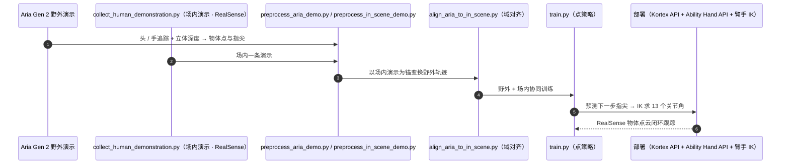

# Dexterity from Smart Lenses

**Dexterity from Smart Lenses: Multi-Fingered Robot Manipulation with In-the-Wild Human Demonstrations** 收录于 [Robot Learning Paper Notebooks](https://imchong.github.io/Robot_Learning_Paper_Notebooks/index.html)（分类：06_Manipulation），深读笔记已完成。本页编译自深读笔记与 arXiv 论文正文（实验数字、开源状态于 2026-09-28 核对），细节以论文 PDF 为准。

## 一句话定义

本文提出 AINA 框架，让机器人从 Aria Gen 2 智能眼镜采集的人类演示中学操作策略——核心主张是：现在可以从任何人、任何地点、任何环境采集的数据中学多指策略，无需机器人专属数据。借助 Aria Gen 2 的高清 RGB 相机、机载 3D 头/手跟踪、立体深度估计，AINA 学一个基于 3D 点的策略架构，可直接部署——不需要在线纠正、强化学习或仿真，且对背景变化鲁棒。在9 个日常操作任务上评测，与以往人到机器人策略学习方法对比并做设计消融：仅用野外人类视频数据训练的策略即可成功迁移到多指机器人操作，无需额外机器人训练数据。

## 英文缩写速查

| 缩写 | 含义 |
|---|---|
| AINA | 本文框架名 |
| Smart Lenses | 智能眼镜（Aria Gen 2） |
| In-the-Wild | 野外，非受控的真实环境 |
| Multi-Fingered | 多指（灵巧手） |
| 3D Point Policy | 基于 3D 点的策略表示 |
| Stereo Depth | 立体深度估计 |

## 为什么重要

- **智能眼镜把"人人可采"变为现实**：极大降低多指操作数据门槛；
- **3D 点表示**是跨具身迁移的实用桥梁；
- **免 RL/仿真直接部署**降低工程复杂度；
- 与 In-N-On、EgoDex、EgoMI 等第一视角人类数据路线共同推进"从人类视频学操作"。

## 解决什么问题

多指操作数据贵： - 机器人专属采集成本高、难规模化； - 想**直接从野外人类演示**学，但有**具身差异**与**部署难**。

AINA 要：用**智能眼镜**采集的**野外人类演示**学多指策略，**免机器人数据**、可**直接部署**。

## 核心机制

1. **智能眼镜野外演示学多指操作**：任何人/地点/环境，免机器人专属数据；
2. **基于 3D 点的策略**：利用眼镜的 3D 头/手 + 深度缓解具身差异；
3. **直接部署**：不需在线纠正、RL 或仿真，背景鲁棒；
4. **9 任务验证**：仅野外人类数据即迁移多指机器人。

方法拆解（深读笔记小节）：Aria Gen 2 智能眼镜采集；基于 3D 点的策略；直接部署、对背景鲁棒；评测；🧭 整体流程（mermaid）。

## 核心信息

| 字段 | 内容 |
|------|------|
| 分类 | 06_Manipulation |
| 深读笔记 | <https://imchong.github.io/Robot_Learning_Paper_Notebooks/papers/06_Manipulation/Dexterity_from_Smart_Lenses__Multi-Fingered_Manipulation_with_In-the-Wild_Human_Demos/Dexterity_from_Smart_Lenses__Multi-Fingered_Manipulation_with_In-the-Wild_Human_Demos.html> |
| arXiv | <https://arxiv.org/abs/2511.16661> |
| 源码 | **已开源**：[facebookresearch/AINA](https://github.com/facebookresearch/AINA)（Aria Gen 2 与场内演示预处理、域对齐、点策略训练、手眼标定与 Kinova + Ability 手部署驱动说明；附示例数据与权重下载脚本） |
| 作者 | Irmak Guzey、Haozhi Qi、Julen Urain、Lerrel Pinto、Jitendra Malik、Homanga Bharadhwaj 等（Meta / NYU / Berkeley） |
| 发表 | 2025 年 11 月 |
| 笔记阅读日期 | 2026-06-21 |

## 源码运行时序图

部署前需先运行 `hand_eye_calibration.py` 并更新 `aina/utils/constants.py` 中的相机内外参。

## 实验与评测

**设置**：采集端只有 Aria Gen 2 眼镜（机载 3D 头 / 手追踪 + 立体深度），野外演示在不同桌面、高度与头部初始帧下录制；每个任务再录 1 条「场内」人类演示（不到 1 分钟）用于对齐与协同训练。部署端为 Kinova Gen3（7-DoF）+ Psyonic Ability 手（6-DoF），两台 RealSense；策略以物体点云 + 指尖为输入、预测下一步指尖位置，再由臂–手联合 IK 求关节角。9 个日常任务（按烤面包机、捡玩具、开烤箱、开抽屉、擦拭、平面重定向、倒杯、收纳等）。

| 数据配方（Table I，每项 ≥10 次） | 按烤面包机 | 捡玩具 |
|------|---:|---:|
| 仅场内 1 条演示 | 30% | 10% |
| 仅野外演示 | 0% | 0% |
| 场内只用于坐标变换 + 野外 | 0% | 10% |
| 场内只用于训练 + 野外 | 60% | 20% |
| **场内（变换 + 训练）+ 野外（AINA）** | **86%** | **86%** |

| 输入表示（Table II，15 次） | 开烤箱 | 开抽屉 |
|------|---:|---:|
| Masked BAKU（RGB） | 6/15 | 1/15 |
| Masked BAKU + 历史帧 | 0/15 | 0/15 |
| **AINA（3D 点）** | **12/15** | **11/15** |

- **工作台高度变化**（每级加 1 条场内演示，Table III）：捡玩具 5/10、6/10、2/10；擦拭 5/10、5/10、8/10。捡玩具最高一级失败源于那条场内演示本身偏离野外分布。
- **新物体**：不重训、只换 GroundedSAM 提示词零样本部署；形状相近的新物体（新烤面包机、白色橡皮）可迁移。
- 人类演示没有力信息，抓取任务用「拇指与其他指尖距离 < 5 cm 就再收紧」的阈值规则补偿。

## 与其他工作对比

| 工作 | 数据来源 | 与 AINA 的差异 |
|------|------|------|
| HuDOR（仅场内 + RL） | 单条场内人类视频 + 在线 RL | AINA 不用 RL；仅场内演示时空间泛化差（30% / 10%） |
| EgoZero（仅野外） | 野外第一视角演示 + ArUco 标记迁移 | 无场内对齐时预测动作严重错位 |
| [Masked BAKU](./paper-notebook-dexterity-from-smart-lenses-multi-fingered-robot.md#实验与评测)（RGB 基线） | 相同数据、图像输入 | 人头移动与固定机器人相机的视角差导致分布外 |
| [In-N-On](./paper-notebook-in-n-on-scaling-egocentric-manipulation-with-in.md) | 野外 + 任务对齐人数据，人形 | 同样「野外 + 场内」分层，但需少量机器人演示且面向人形；AINA 零机器人数据 |

## 结论

**AINA 真正下的赌注是「把数据源从机器人换成智能眼镜」：用 3D 点表示吃掉具身差异，换来免机器人数据、免 RL、免仿真的直接部署。**

- 起作用的不是普通的 2D 视频模仿，而是 Aria Gen 2 的 **机载 3D 头/手跟踪 + 立体深度** 撑起的 **3D 点策略表示**——这才是跨具身迁移的那座桥。
- 取舍很明确：放弃在线纠正、强化学习与仿真，换极短的部署链路与对背景变化的鲁棒性；代价是策略上限被野外人类演示本身的质量与覆盖度框住。
- 适用边界看证据形态：本页给出的支撑是 **9 个日常操作任务** 上的多指迁移，超出该任务分布的能力本页并未声称。
- 定位上与 In-N-On、EgoDex、EgoMI 同属「从第一视角人类数据学操作」路线，差别在于 AINA 把 **采集端硬件（智能眼镜）** 当成规模化的关键变量。
- 配方消融说明「一条场内演示」是关键粘合剂：只用野外数据 0%，只用场内数据 30% / 10%，两者按 AINA 方式组合后达 86% / 86%。

## 局限与风险

- **无力反馈**：仅靠手部姿态估计拿不到接触力，精细灵巧操作受限；作者建议引入 EMG 或测力手套。
- **Aria 相机快门时差**：RGB 与 SLAM 相机快门不同步，头部快速转动会让物体像素与深度错位，目前靠要求采集者慢转头缓解。
- **部署传感器不一致**：部署用 RealSense 而非 Aria 实时流（FoundationStereo 实时深度尚难），关键点存在轻微偏差。
- **单臂 + 义肢手**：只验证 Kinova + Ability 手，双手与人形未覆盖；每个新场景 / 高度仍需补 1 条场内演示。

## 与其他页面的关系

- 分类父节点：[paper-notebook-category-06-manipulation](../overview/paper-notebook-category-06-manipulation.md)
- 总索引：[humanoid-paper-notebooks-index.md](../overview/humanoid-paper-notebooks-index.md)
- 机器人平台 Kinova Gen3：[kinova-gen3](./kinova-gen3.md)
- 部署前的手眼标定：[hand-eye-calibration](../concepts/hand-eye-calibration.md)
- 野外 + 任务对齐人数据的另一种组合：[paper-notebook-in-n-on-scaling-egocentric-manipulation-with-in](./paper-notebook-in-n-on-scaling-egocentric-manipulation-with-in.md)
- 人手动捕驱动多指操作：[paper-notebook-object-centric-dexterous-manipulation-from-human](./paper-notebook-object-centric-dexterous-manipulation-from-human.md)
- 可穿戴采集 + 主动视觉：[paper-notebook-egomi-learning-active-vision-and-whole-body-mani](./paper-notebook-egomi-learning-active-vision-and-whole-body-mani.md)

## 参考来源

- [humanoid_pnb_dexterity-from-smart-lenses.md](../../sources/papers/humanoid_pnb_dexterity-from-smart-lenses.md)
- 深读笔记：<https://imchong.github.io/Robot_Learning_Paper_Notebooks/papers/06_Manipulation/Dexterity_from_Smart_Lenses__Multi-Fingered_Manipulation_with_In-the-Wild_Human_Demos/Dexterity_from_Smart_Lenses__Multi-Fingered_Manipulation_with_In-the-Wild_Human_Demos.html>
- 论文：<https://arxiv.org/abs/2511.16661>
- 论文正文（Table I–III、局限节）：<https://arxiv.org/html/2511.16661>
- 官方代码：<https://github.com/facebookresearch/AINA>

## 推荐继续阅读

- [机器人论文阅读笔记：Dexterity from Smart Lenses](https://imchong.github.io/Robot_Learning_Paper_Notebooks/papers/06_Manipulation/Dexterity_from_Smart_Lenses__Multi-Fingered_Manipulation_with_In-the-Wild_Human_Demos/Dexterity_from_Smart_Lenses__Multi-Fingered_Manipulation_with_In-the-Wild_Human_Demos.html)
- 项目页：<https://aina-robot.github.io>
