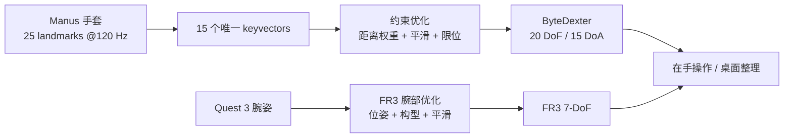

# ByteDexter：20-DoF 连杆手与人手运动重定向

**Dexterous Teleoperation of 20-DoF ByteDexter Hand via Human Motion Retargeting**（[arXiv:2507.03227](https://arxiv.org/abs/2507.03227)）由 ByteDance Seed 提出。

## 一句话定义

**ByteDexter 把 20-DoF 紧凑连杆手、Manus 手套的关键向量重定向和 Quest 3→Franka 腕部映射合成一套 27-DoF 实时手臂遥操作系统。**

## 英文缩写速查

| 缩写 | 英文全称 | 简要说明 |
|------|----------|----------|
| DoF | Degree of Freedom | ByteDexter 有 20 DoF，其中 15 个主动驱动 |
| DoA | Degree of Actuation | 论文手部 15 个可独立驱动通道 |
| MCP | Metacarpophalangeal Joint | 长指二自由度耦合、拇指解耦的掌指关节 |
| PIP | Proximal Interphalangeal Joint | 主动近端指间关节 |
| DIP | Distal Interphalangeal Joint | 被动耦合远端指间关节 |
| FR3 | Franka Research 3 | 承载 ByteDexter 的 7-DoF 机械臂 |

## 为什么重要

- **硬件与重定向共同设计：** 紧凑连杆传动的耦合/限位直接进入求解器，而不是把机械手当理想独立关节。
- **拇指是灵巧性的决定项：** 三执行器驱动四 DoF，MCP 屈伸与外展/内收解耦，扩大对掌与精细抓取空间。
- **人手映射按接触语义选向量：** 指尖—指尖距离支持捏取，指尖—掌部距离支持 power grasp，比直接角度复制更适合异构手。
- **覆盖长时程操作：** 除在手重抓/滑动/旋转，还展示九件化妆品的连续桌面整理。

## 核心信息

| 项 | 内容 |
|----|------|
| 机构 | 字节跳动 Seed（ByteDance Seed） |
| 手部 | 20 DoF、15 主动 DoF、15 电机 |
| 尺寸/质量 | 255×118×77 mm；1.3 kg |
| 系统 DoF | ByteDexter 20 + FR3 7 = 27 |
| 人侧输入 | Manus Quantum Metaglove（120 Hz、25 landmarks）+ Meta Quest 3 |
| 控制频率 | 手传动 100 Hz；VR 腕部 50 Hz；FR3 阻抗 1 kHz |
| 末端 | 预留指尖与掌部触觉集成结构 |
| 开源 | 截至 2026-07-28 未公开代码、CAD、固件或数据 |

## 流程总览

## 核心机制（方法栈）

### 1）并—串联长指与解耦拇指

四根长指采用 2-DoF MCP、1-DoF PIP 和被动 DIP；耦合 MCP 在屈曲时会压缩外展范围。拇指改用三执行器驱动四 DoF，使 MCP 外展在约 -4° 到 90° 范围内与屈伸解耦。

### 2）微秒级传动运动学

连杆 FK/IK 被写成带显式坐标变换的约束非线性方程，由 Ceres 求解；微秒级计算支持 15 DoA 的 100 Hz 控制。C++ 多线程 API 在主机和掌内控制板之间双向传输，并按另一 MCP DoF 动态收紧可行限位。

### 3）keyvector 人手重定向

系统不依赖腕到指尖向量，而以各指 MCP 为局部参考，组合指尖—指尖和指间向量；长度相关权重强调近接触时的捏合精度，时间正则抑制手套噪声与突然跳变。

### 4）腕部与手指异步协调

Quest 控制器固定在手套背面，使腕部和手指共享操作员参考。腕部优化约束 FR3 关节位置/速度并保持自然臂角，手部独立求解后在真实世界合流。

## 源码运行时序图

**不适用。** 截至 2026-07-28，[官方项目页](https://byte-dexter.github.io/)只提供论文、方法和视频，未列公开 GitHub、CAD、控制 API、固件或数据；论文描述的 C++/Ceres 运行入口无法从公开资产核对。

## 与其他工作对比

| 维度 | ByteDexter | DexPilot 类映射 | DexUMI |
|------|------------|-----------------|--------|
| 目标手 | 自研 20-DoF 连杆手 | 通用机械手 | Inspire/XHand 外骨骼 |
| 输入 | Manus + Quest 3 | 手姿/手套 | 直接人手操作 |
| 映射 | MCP 局部 keyvectors | 常用腕—指尖向量 | 机械同构 + 视觉适配 |
| 数据方式 | 在机器人在线遥操作 | 在机器人在线 | 无机器人采集后编译 |

## 工程实践

- **三层频率分开验收：** 手套 120 Hz、重定向/手控 100 Hz、腕映射 50 Hz、FR3 1 kHz，不应用单一“实时”指标替代端到端抖动。
- **动态限位必须进入控制器：** 连杆 MCP 可行域随另一 DoF 改变，静态 box limit 会产生不可达电机目标。
- **以 keyvector 误差调任务：** 捏取看拇—食/中指距离，power grasp 看指尖—掌距离，并监控非任务手指碰撞。
- **开源状态：** **未开源**；公开页面可做方法理解与硬件选型，不能支持复现或二次集成。

## 实验与评测

- 与修改版 DexPilot 比较五轮拇—食、拇—中指开合：本文映射获得更紧的捏合距离，并减少非任务手指碰撞；论文图示为主，未给统一成功率表。
- 在手操作覆盖三种基元：重抓、相对掌面滑动、物体/部件旋转；实例包括瓶体重抓、多物抓持、旋盖和推开盖。
- 长时程评测在一次连续 trial 中整理随机分布的九件化妆/护肤物品，并操作多抽屉收纳盒。
- 论文展示滑脱后的在线恢复，但没有多操作者统计、任务成功率、寿命测试或触觉闭环评测。

## 结论

**ByteDexter 展示了机械结构、传动求解和人手重定向协同设计的能力，但公开证据更适合验证“能做什么”，不足以判断可复现性与统计鲁棒性。**

1. **15 主动 DoF 是控制事实** — 20 DoF 中存在被动耦合，策略/接口不能假设 20 个独立命令。
2. **局部 keyvector 更贴合接触** — 绕开非拟人掌宽造成的腕—指尖比例误差。
3. **多频率控制栈可实时运行** — 微秒传动求解不是端到端延迟，仍需合并手套、VR 与通信预算。
4. **长时程展示有系统价值** — 九件物品连续整理说明手臂协调和在线恢复可行。
5. **缺少统计与开源资产** — 无代码/CAD且评测偏定性，选型时应要求更多重复试验与接口资料。

## 局限与风险

- 项目未开源，无法核查 Ceres 参数、动态限位、通信协议或实际触觉接口。
- 1.3 kg 手模组对机械臂负载、惯量与碰撞安全提出较高要求。
- Manus/Quest 是商业设备；手套标定、穿戴舒适性和长期漂移未充分量化。
- 论文没有跨不同操作者、不同 ByteDexter 个体或大样本成功率，泛化结论有限。

## 与其他页面的关系

- 路线定位：[遥操作纵深 Stage 4](../../roadmap/depth-teleoperation.md) 的高 DoF 手套→机械手分支。
- 主任务：[Teleoperation](../tasks/teleoperation.md)。
- 运动学前置：[Dexterous Kinematics](../concepts/dexterous-kinematics.md)。
- 重定向抽象：[Motion Retargeting](../concepts/motion-retargeting.md)。
- 无机器人采集对照：[DexUMI](./paper-notebook-dexumi-using-human-hand-as-the-universal-manipul.md)。

## 参考来源

- [Humanoid Paper Notebooks 来源归档](../../sources/papers/humanoid_pnb_dexterous-teleoperation-of-20-dof-bytedexter-han.md)
- [ByteDexter 项目页与开源核查](../../sources/sites/bytedexter.md)
- 论文：<https://arxiv.org/abs/2507.03227>

## 推荐继续阅读

- 项目页：<https://byte-dexter.github.io/>
- [数据手套 vs 视觉遥操作](../comparisons/data-gloves-vs-vision-teleop.md)
