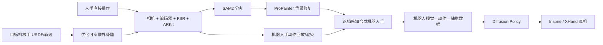
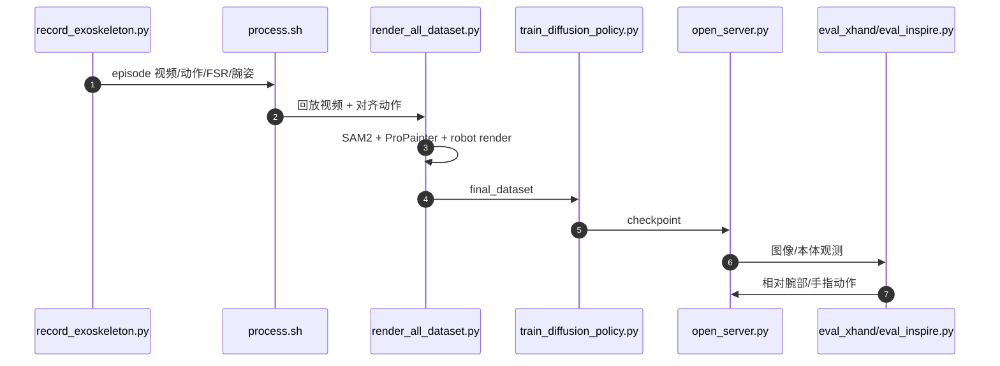

# DexUMI：把人手作为通用灵巧操作采集接口

**DexUMI**（*Using Human Hand as the Universal Manipulation Interface for Dexterous Manipulation*，[arXiv:2505.21864](https://arxiv.org/abs/2505.21864)）由 Stanford、Columbia、J.P. Morgan AI Research、CMU 与 NVIDIA 提出，是 CoRL 2025 Best Paper Finalist。

## 一句话定义

**DexUMI 让人戴着按目标机械手运动学优化的外骨骼直接操作物体，再把人手视频与动作离线“编译”为机器人手观测—动作数据，用于训练可部署的灵巧策略。**

## 英文缩写速查

| 缩写 | 英文全称 | 简要说明 |
|------|----------|----------|
| DexUMI | Dexterous Universal Manipulation Interface | 本文无机器人数据采集与策略学习框架 |
| UMI | Universal Manipulation Interface | 手持无机器人采集范式；DexUMI 扩展到多指手 |
| FSR | Force-Sensitive Resistor | 外骨骼指尖记录与目标手对应的触觉通道 |
| SAM2 | Segment Anything Model 2 | 分割人手和外骨骼以生成视频 mask |
| DP | Diffusion Policy | 使用处理后视觉、动作与可选触觉训练的策略 |
| ARKit | Apple Augmented Reality Kit | iPhone 提供采集期 6D 腕部位姿 |

## 为什么重要

- **采集时不占机器人：** 人手直接完成任务，避免机械手速度、故障和昂贵机时限制数据产能。
- **同时处理动作与观测 embodiment gap：** 外骨骼匹配运动学，视频修复/渲染匹配机器人部署外观。
- **直接获得人类触觉：** 操作者真实接触物体，外骨骼 FSR 记录对应触觉，而不是只靠遥操作画面猜接触。
- **不止概念验证：** 在欠驱动 Inspire 与全驱 XHand 两种硬件、四类精细/长时程任务上评测并开放全链。

## 核心信息

| 项 | 内容 |
|----|------|
| 机构 | 斯坦福大学；哥伦比亚大学；摩根大通 AI Research；卡内基梅隆大学；英伟达 |
| 发表 | CoRL 2025（Best Paper Finalist）；PMLR 305:437–459 |
| 目标手 | Inspire Hand（12 DoF/6 主动）；XHand（12 主动 DoF） |
| 采集 | 外骨骼编码器/FSR + 腕下 150° 相机 + iPhone ARKit |
| 视觉适配 | SAM2 分割 → ProPainter 修复 → 机器人手渲染/遮挡合成 |
| 策略 | Diffusion Policy；相对腕/手指动作；可选触觉 |
| 结果 | 两平台平均任务成功率 86%；采集吞吐为传统遥操作 3.2× |
| 开源 | MIT；CAD、样例数据、处理、训练和部署入口齐全 |

## 流程总览

## 核心机制（方法栈）

### 1）面向目标手的外骨骼优化

系统从目标手 URDF 或实测指尖轨迹初始化参数化连杆，优化外骨骼指尖工作空间覆盖，同时把可穿戴性写成几何约束。目标不是复制全部连杆，而是优先匹配最常接触物体的指尖运动学。

### 2）自然接触与动作记录

操作者直接用外骨骼包覆的人手操作物体，编码器读指关节，iPhone ARKit 读腕部 6D 位姿，腕下广角相机看手—物接触；FSR 记录触觉。采集时机器人不在场。

### 3）视觉域编译

SAM2 去除人手/外骨骼，ProPainter 填背景；再根据动作回放生成目标机器人手图像，并利用外骨骼/机器人 mask 的交集保持正确的手—物遮挡，而不是简单把渲染手覆盖在最上层。

### 4）相对动作与触觉策略

策略输出相对动作，降低绝对标定误差并增强闭环修正。实验显示相对手指轨迹普遍优于绝对值；噪声触觉并非总有益，只在触觉曲线干净、动作表示能反应式修正时改善任务。

## 源码运行时序图

仓库提供从 45 FPS 采集到 `accelerate launch` 训练与两种手部署的入口；可先用官方 sample data 验证离线处理，再投入 CAD 和真机搭建。

## 与其他工作对比

| 维度 | DexUMI | 传统在线遥操作 | DexterCap |
|------|--------|----------------|-----------|
| 采集时机器人 | 不需要 | 必须在线 | 不需要 |
| 人侧接触 | 直接接触/自然触觉 | 远程视觉/有限反馈 | 直接接触但贴 markers |
| 动作对齐 | 外骨骼匹配目标手 | 在线重定向 | 先恢复 MANO 再重定向 |
| 视觉对齐 | 修复 + 机器人手渲染 | 直接采机器人画面 | 输出参数轨迹为主 |

## 工程实践

- **先跑样例数据：** 验证 SAM2 checkpoint、ProPainter、Record3D fork 与目录约定，再采自己的 episode。
- **硬件适配是每种手一次性成本：** Inspire/XHand CAD 不能直接当任意新手的通用外骨骼，需重新优化、打印和标定。
- **质检三类对齐：** 编码器→电机回归、外骨骼/机器人视觉重合、触觉零漂；任一错误都会进入策略监督。
- **开源状态：** [real-stanford/DexUMI](https://github.com/real-stanford/DexUMI)以 MIT 发布硬件指南、处理/训练/部署和 sample data；数据入口见 [UMI Data](https://umi-data.github.io/)。

## 实验与评测

- 四任务、每设置 20 次：cube pick、egg carton、tea picking with tool、四阶段 kitchen；两种机械手平均成功率 **86%**。
- Tea picking 在 XHand 与 Inspire 上平均成功率 **85%**，展示跨欠驱动/全驱硬件迁移。
- 相对动作显著优于绝对动作；例如 Inspire cube 为 **1.00 vs 0.10**，XHand kitchen salt 为 **0.75 vs 0.00**（带触觉、inpaint 设置）。
- 不做软件适配时，策略可学粗略靠近但精细交互失败；绿色 mask/raw 基线明显低于 inpaint。
- 15 分钟 tea-picking 采集对比中，DexUMI 成功示范吞吐是传统遥操作的 **3.2×**，但仍慢于裸手。

## 结论

**DexUMI 的决定性贡献是把目标机械手的动作域和视觉域都前置到数据采集/编译阶段，使“人直接做”能成为机器人策略训练数据。**

1. **外骨骼解决动作 gap** — 指尖工作空间匹配比事后通用重定向更接近目标手可行域。
2. **视觉适配不是装饰** — 没有机器人手 inpaint/render，精细接触策略显著退化。
3. **相对动作是关键选型** — 对标定误差和触觉反应更稳，绝对手指轨迹不应作为默认。
4. **触觉收益有条件** — 传感器零漂会让结果变差；先看信号质量再扩输入维度。
5. **吞吐优势来自无机器人采集** — 3.2× 对比传统遥操作，但每种手仍需外骨骼设计成本。

## 局限与风险

- 新机械手仍需硬件特定优化与人工可穿戴性调参，“universal”指框架通用而非一件硬件通吃。
- SAM2 漏分、ProPainter 模糊、光照不一致和 3D 打印件形变会制造观测/动作标签误差。
- Inspire/XHand 的背隙和摩擦使编码器→电机映射具有方向性滞回，渲染手与真实执行会错位。
- FSR 零漂明显；触觉输入可能降低而非提升策略性能。
- 腕下视角和遮挡合成假设限制相机布局，不一定直接迁移到外部相机或双手任务。

## 与其他页面的关系

- 路线定位：[遥操作纵深 Stage 4–5](../../roadmap/depth-teleoperation.md) 的“无机器人采集→策略”分支。
- 主任务：[Teleoperation](../tasks/teleoperation.md)。
- 下游：[Imitation Learning](../methods/imitation-learning.md) 与 [Diffusion Policy](../methods/diffusion-policy.md)。
- 参数捕获对照：[DexterCap](./paper-notebook-dextercap.md)。
- 在线视觉遥操作对照：[Bunny-VisionPro](./paper-notebook-bunny-visionpro-real-time-bimanual-dexterous-tel.md)。

## 参考来源

- [Humanoid Paper Notebooks 来源归档](../../sources/papers/humanoid_pnb_dexumi-using-human-hand-as-the-universal-manipul.md)
- [DexUMI 项目页核查](../../sources/sites/dexumi.md)
- [DexUMI 代码仓库核查](../../sources/repos/dexumi.md)
- 论文：<https://arxiv.org/abs/2505.21864>
- PMLR：<https://proceedings.mlr.press/v305/xu25b.html>

## 推荐继续阅读

- 项目页：<https://dex-umi.github.io/>
- 部署指南：<https://dex-umi.github.io/tutorial/deployment.html>
