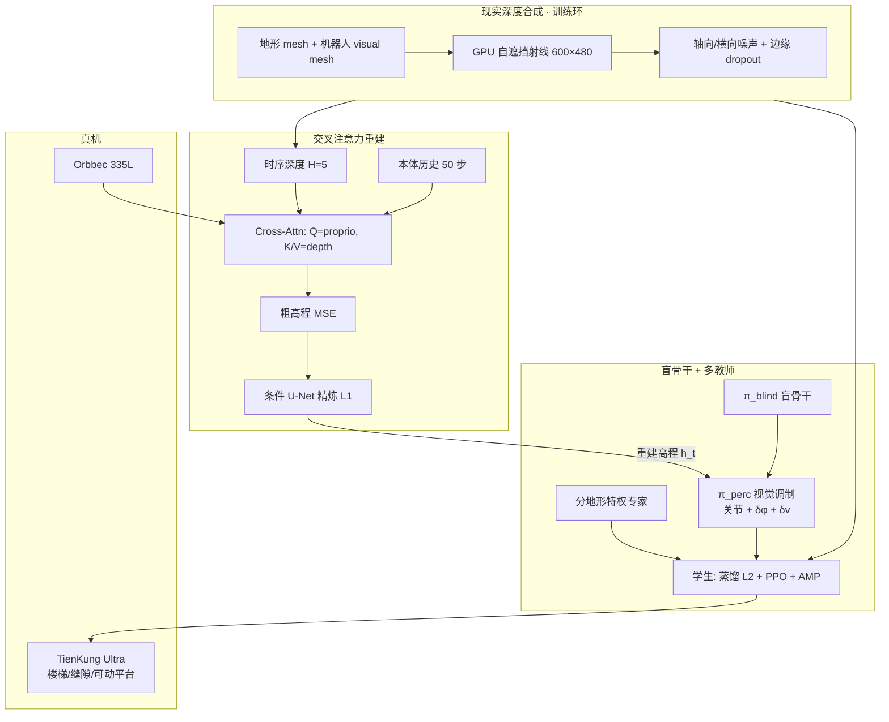

# DPL（单深度感知人形行走，2025/2026）

**DPL: Depth-only Perceptive Humanoid Locomotion via Realistic Depth Synthesis and Cross-Attention Terrain Reconstruction**（Jingkai Sun\*、Gang Han\*、Pihai Sun\* 等；北京人形机器人创新中心 / 香港大学 / 中国科学技术大学 / 香港科技大学；[arXiv:2510.07152](https://arxiv.org/abs/2510.07152)，**IEEE Robotics and Automation Letters 已接收**）提出在**仅单深度相机、无外定位**条件下的感知行走框架：用现实深度合成缩小深度域隙，用跨模态 Transformer 从噪声/遮挡深度重建局部高程，再用盲骨干 + 多教师蒸馏把重建结果焊进可端到端微调的 RL 策略。

> 本页原为 Paper Notebooks **深读索引 stub**；2026-08-06 据 arXiv **v3（RA-L 接收稿）** 升格为完整实体页（原地升级，未新建重复节点）。

## 一句话定义

**DPL 不在「纯端到端深度→动作」与「多传感器 elevation map」之间二选一，而是用可进 RL 环的现实深度合成 + 交叉注意力高程重建，让单深度人形策略在楼梯/缝隙等遮挡地形上既可训又可部署。**

## 英文缩写速查

| 缩写 | 英文全称 | 简要说明 |
|------|----------|----------|
| DPL | Depth-only Perceptive Locomotion | 本文单深度感知人形行走框架 |
| AMP | Adversarial Motion Prior | 用判别器约束人形步态风格（SFU/CMU mocap） |
| PPO | Proximal Policy Optimization | 策略与学生阶段主优化算法 |
| MAE | Mean Absolute Error | 高程重建误差（cm） |
| GRU | Gated Recurrent Unit | 重建模块时序记忆 |
| DoF | Degrees of Freedom | 自由度；TienKung Ultra 20 主动关节 |
| Sim2Real | Simulation to Real | 深度噪声/自遮挡/端到端微调支撑迁移 |
| RL | Reinforcement Learning | 感知策略训练主范式 |

## 为什么重要

- **钉住第三条工程路径：** 端到端深度贵且域隙大；elevation map 要多传感器与定位、延迟高、缝隙底部易盲。DPL 用**单深度 → 学习重建局部高程 → 盲骨干调制**折中二者。
- **深度合成进 RL 环：** 相对仅离线采深度训重建再冻结的先例（如 Duan et al. ICRA 2024），策略在训练期直接对重建误差与延迟做端到端微调——楼梯真机绊脚从 **8/10 → 4/10**。
- **遮挡几何可推断：** 缝隙底部深度相机看不见时，elevation map 常失败；交叉注意力 + 本体历史可重建缺口几何（Fig. 5），支撑跨缝策略。
- **机构/平台锚点：** 验证在 **TienKung Ultra + Orbbec 335L**，与仓库内大量 G1 深度论文形成硬件对照；机构见 [X-Humanoid](./x-humanoid.md)。

## 核心信息

| 字段 | 内容 |
|------|------|
| 机构 | 北京人形机器人创新中心（X-Humanoid）；香港大学（HKU）；中国科学技术大学（USTC）；香港科技大学（HKUST） |
| 发表 | arXiv v1 2025-10-08 → **v3 2026-08-03**；稿件 received 2025-10-08，revised 2026-01-16，**accepted 2026-06-09（IEEE RA-L）** |
| 平台 | **TienKung Ultra**（20 主动 DoF）；**Orbbec 335L** 单深度相机 |
| 栈 | Isaac Gym；策略 RTX 4090 × 4096 envs；重建 A100 × 2048 envs；策略 100 Hz / PD 1 kHz |
| 感知窗 | 前方 **1.0 m×1.0 m** 局部高程，**5 cm** 分辨率（相对浮动基座） |
| 开源 | **确认未开源**（截至 2026-08-06）：无项目页 / 无官方仓 |
| 深读分类 | Paper Notebooks `05_Locomotion`（本库升格后仍保留分类挂接） |

## 流程总览

## 核心原理（方法）

### 1）跨模态交叉注意力重建

深度经 CNN 压成空间特征；本体历史嵌入为 query，深度为 key/value：

$$
z^{\mathrm{fused}}_{t}=\mathrm{Attn}\bigl(Q=z^{\mathrm{prop}}_{t},\;K=z^{\mathrm{depth}}_{t},\;V=z^{\mathrm{depth}}_{t}\bigr).
$$

融合特征经 GRU → 粗高程 $\hat{H}^{\mathrm{rough}}$（MSE 监督）→ 条件 U-Net 精炼 $\hat{H}^{\mathrm{refined}}$（L1，强化边缘与平面）。直觉：深度 alone 噪声且局部，本体提供步态相位/姿态/速度，query 对齐后挑出与当前运动相关的地形区域。

### 2）现实深度合成

- **几何一致：** 针孔射线打到「静态地形 ∪ 刚体变换后的机器人 mesh」，自然产生**自遮挡阴影**（对照真实深度 Fig. 3）。
- **传感器噪声：** 距离相关轴向方差、横向扰动、不确定性与边缘结构孔洞（Kinect 经验参数族），训练时把理想射线深度推近真机分布。
- **闭环：** 合成深度服务重建模块与策略交互，而非仅离线数据集。

### 3）盲骨干 + 多教师蒸馏

- 盲策略提供稳定前进基线；感知策略输出调制关节动作，并残差调节步态相位与前向速度命令。
- 最终关节目标为盲/调制凸组合，避免「遇难停步刷奖励」的 reward hacking。
- 分地形专家（gap/stairs/flat 等）以 L2 动作监督学生；学生观测为**重建噪声高程**，联合 PPO 显式适应感知延迟与几何畸变。

## 工程实践

| 项 | 做法 |
|----|------|
| 传感器 | 单深度相机；**无需**外定位 / 多 LiDAR 建图栈 |
| 观测 | 本体（$\omega,q,\dot q,g,\hat v$）+ 命令 + 相位 + 前一动作 + 局部高程 |
| 动作 | 20 维关节目标 + $\delta\phi$ + $\delta v^x$；PD 1 kHz |
| 风格先验 | AMP（SFU + CMU mocap） |
| 延迟对照 | 本方法 ~**20 ms @ 30 Hz**；elevation map 基线受 20 Hz LiDAR + ~30 ms 建图拖累（Fig. 6） |
| 源码运行时序图 | **不适用**（截至 2026-08-06 无官方可运行仓库） |

## 实验与评测

### 仿真重建（Table II，MAE cm）

全模型在七类地形多数最优；去掉 GRU 或条件 U-Net 输入普遍变差。相对 CNN [22] / ResNet [4] 基线，离散与坡面等地形优势更清晰。

### 真机重建消融（Table III）

| 变体 | MAE (cm) |
|------|----------|
| Origin（无预处理） | 16.07 ± 8.38 |
| w/o Self-occlusion | 10.07 ± 7.48 |
| w/o Crop&Resize | 12.41 ± 8.32 |
| w/o Noise Model | 4.48 ± 0.77 |
| CNN-based [22] | 6.47 ± 1.32 |
| ResNet-based [4] | 5.31 ± 0.82 |
| **Ours** | **3.25 ± 0.56** |

### 策略消融与真机

- Fig. 2：去掉 multi-teacher / blind backbone / gait-command adaptation，在 gap、hurdle 等高难度 success/traversing 明显下降；无骨干时易出现「停住避罚」。
- Table IV：楼梯 10 级累计绊脚，端到端微调 **4/10** vs 无微调 **8/10**。
- Fig. 7–8：上下楼梯、连续缝隙、斜坡下台阶；**可动平台**踏步为零样本场景。

## 结论

**DPL 的关键判断是：单深度人形感知行走的瓶颈不在「再堆一个端到端网络」，而在把自遮挡噪声深度合成、可推断遮挡的高程重建、以及盲骨干多教师蒸馏放进同一可端到端微调的训练环。**

1. **第三条路径成立** — 单深度 + 学习重建局部高程，可避开多传感器 elevation map 的定位/延迟税，又不必从零啃端到端深度策略。
2. **重建误差是可操作杠杆** — 真机 MAE **3.25 cm**；自遮挡、裁剪与噪声模型缺一不可（Table III）。
3. **端到端微调吃延迟** — 同重建栈下，对感知频率/偏差做 RL 微调把楼梯绊脚从 8/10 降到 4/10。
4. **盲骨干防「停步刷奖励」** — 高难度地形上前进驱动力是架构级替代复杂 reward shaping 的手段。
5. **缝隙靠推断而非地图补丁** — 学习重建可补 elevation map 看不见的缺口底部（Fig. 5）。
6. **复现边界** — 截至入库无官方代码；数字绑定 TienKung Ultra + Orbbec，与 G1 多相机方案（如 [RPL](./paper-rpl-robust-humanoid-perceptive-locomotion.md)）不可直接横比。

## 常见误区或局限

- **误区：「DPL = 又一个 elevation map」。** 部署侧是**单深度相机学习重建**，不依赖全局定位与多传感器建图；对照的是 GPU elevation mapping 延迟曲线。
- **误区：「有重建就可以不做端到端微调」。** Table IV 显示冻结感知、只克隆专家动作在真机楼梯上绊脚翻倍。
- **误区：「单深度 ≈ RPL 多向深度」。** DPL 主战场是**前向复杂地形**；[RPL](./paper-rpl-robust-humanoid-perceptive-locomotion.md) 强调前后双深度双向/载荷。
- **局限：** 无开源；单前向视野；遮挡推断在极端几何/传感器失效时仍可能崩；AMP + 多教师栈训练配方偏重。

## 与其他工作对比

| 维度 | DPL | RPL | PHP | AME / AME-2 |
|------|-----|-----|-----|-------------|
| 机构 | X-Humanoid 等 | Amazon FAR | Amazon FAR | ETH RSL |
| 感知 | **单深度 → 学习高程** | 前+后深度蒸馏 | 单深度跑酷 | 高程扫描 / 神经映射 |
| 定位依赖 | **无外定位** | 无全局 map | 无 | 常需 odom/map 栈 |
| 训练 | 重建 + 盲骨干多教师 + e2e | 分地形专家 + DAgger | MM 参考 + DAgger+PPO | Teacher–Student 地图 |
| 平台 | **TienKung Ultra** | G1 | G1 | ANYmal / TRON1 |
| 开源 | **未见** | 未见 | 见各页 | 见各页 |

## 关联页面

- [楼梯与障碍 Locomotion 中心节点](../tasks/stair-obstacle-perceptive-locomotion.md) — 感知楼梯/缝隙索引挂接
- [Humanoid Locomotion](../tasks/humanoid-locomotion.md) — 人形行走任务总览
- [Terrain Adaptation](../concepts/terrain-adaptation.md) — 深度/高程感知闭环
- [Privileged Training](../concepts/privileged-training.md) — 专家特权 → 学生部分观测
- [RPL](./paper-rpl-robust-humanoid-perceptive-locomotion.md) — 多向深度蒸馏对照
- [CReF](./paper-cref.md) — 对照：同样用本体 query 交叉注意，但 **不重建高程**，直接深度→动作
- [X-Humanoid](./x-humanoid.md) / [天工开源](./tienkung-humanoid-open-source.md) — 机构与本体生态
- [分类 05_Locomotion](../overview/paper-notebook-category-05-locomotion.md) — Paper Notebooks 父节点

## 参考来源

- [DPL 论文摘录（arXiv:2510.07152）](../../sources/papers/dpl_arxiv_2510_07152.md)
- [humanoid_pnb_dpl 溯源锚点](../../sources/papers/humanoid_pnb_dpl-depth-only-perceptive-humanoid-locomotion-vi.md)

## 推荐继续阅读

- 论文 HTML：<https://arxiv.org/html/2510.07152>
- 论文 PDF：<https://arxiv.org/pdf/2510.07152>
- [RPL](./paper-rpl-robust-humanoid-perceptive-locomotion.md) — G1 多向深度 + 载荷对照
- [PHP](./paper-hrl-stack-22-perceptive_humanoid_parkour.md) — 人形深度跑酷技能链
- [AME-2](./paper-notebook-ame-2-agile-and-generalized-legged-locomotion-vi.md) — 神经高程映射 + Teacher–Student 对照
