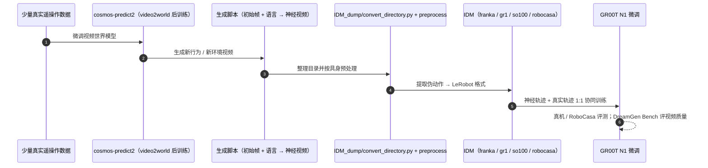

# DreamGen

**DreamGen: Unlocking Generalization in Robot Learning through Video World Models** 收录于 [Robot Learning Paper Notebooks](https://imchong.github.io/Robot_Learning_Paper_Notebooks/index.html)（分类：06_Manipulation），深读笔记已完成。本页编译自深读笔记与 arXiv 论文正文（实验数字、开源状态于 2026-09-28 核对），细节以论文 PDF 为准。

## 一句话定义

DreamGen 是一个简单而高效的四阶段流水线，通过神经轨迹（neural trajectories）——由视频世界模型生成的合成机器人数据——训练能跨行为、跨环境泛化的机器人策略。流程：① 用图像到视频生成模型；② 把模型适配到目标机器人本体，生成逼真合成视频；③ 用潜动作模型（latent action model）或逆动力学模型（inverse-dynamics model）从视频中恢复伪动作序列；④ 用这些数据训练策略。还提出 DreamGen Bench 评测视频生成质量。实验中，仅用单一取放任务、单一环境的遥操作数据，DreamGen 就让人形在已见与未见环境完成 22 种新行为，展示强行为与环境泛化，为超越人工采集地扩展机器人学习开辟新路径。

## 英文缩写速查

| 缩写 | 含义 |
|---|---|
| Video World Model | 视频世界模型，生成未来视频 |
| Neural Trajectory | 神经轨迹，生成的合成机器人数据 |
| Latent Action Model | 潜动作模型，从视频推动作 |
| Inverse-Dynamics | 逆动力学模型，从状态变化推动作 |
| Pseudo-action | 伪动作，恢复出的动作标签 |
| DreamGen Bench | 本文视频生成评测基准 |

## 为什么重要

- **"视频世界模型 + 伪动作恢复"是扩数据的新范式**：把生成视频变成可训练的动作数据；
- **跨行为/跨环境泛化**直击机器人学习的核心痛点；
- **最小真实数据 → 大量合成行为**性价比极高；
- 与 Humanoid World Models、DexMimicGen 等生成/世界模型工作呼应（同 NVIDIA 系）。

## 解决什么问题

机器人策略泛化差、数据采集贵： - 真实采集**少行为、少环境**； - 想**跨行为/跨环境泛化**，但缺数据。

DreamGen 要：用**视频世界模型**生成**带动作标签**的合成数据，**最小真实采集**就解锁泛化。

## 核心机制

1. **视频世界模型生成神经轨迹**：合成机器人数据训练策略；
2. **四阶段流水线**：生成→适配本体→恢复伪动作→训练；
3. **DreamGen Bench**：评测视频生成质量；
4. **强泛化**：单任务单环境数据 → 人形 22 种新行为。

方法拆解（深读笔记小节）：四阶段流水线；神经轨迹 = 合成机器人数据；DreamGen Bench；结果；🧭 整体流程（mermaid）。

## 核心信息

| 字段 | 内容 |
|------|------|
| 分类 | 06_Manipulation |
| 深读笔记 | <https://imchong.github.io/Robot_Learning_Paper_Notebooks/papers/06_Manipulation/DreamGen__Unlocking_Generalization_in_Robot_Learning_through_Video_World_Models/DreamGen__Unlocking_Generalization_in_Robot_Learning_through_Video_World_Models.html> |
| arXiv | <https://arxiv.org/abs/2505.12705> |
| 源码 | **已开源**：[NVIDIA/GR00T-Dreams](https://github.com/NVIDIA/GR00T-Dreams)（Cosmos-Predict2 视频模型微调 / 生成指引、IDM 伪动作提取转 LeRobot 格式、GR00T N1 微调、DreamGen Bench 复现） |
| 作者 | Joel Jang、Seonghyeon Ye、Ajay Mandlekar、Yuke Zhu、Linxi Fan、Dieter Fox、Jan Kautz 等（NVIDIA） |
| 发表 | 2025 年 5 月 |
| 笔记阅读日期 | 2026-06-21 |

## 源码运行时序图

复现主路径见仓库 README 的 5 个步骤；新具身需先按 3.3 节用少量真实轨迹训练自定义 IDM。

## 实验与评测

**设置**：视频世界模型（Cosmos 等）先在目标机器人数据上微调，再用初始帧 + 语言生成「神经轨迹」，由逆动力学模型（IDM）或潜动作（LAPA）补伪动作，与真实数据 1:1 协同训练下游策略。

- **仿真 RoboCasa（24 任务）**：视频模型用 1200 条人类演示训练；在低 / 中 / 高三档真实数据（720 / 2.4k / 7.2k 条）下，加入神经轨迹均提升 GR00T N1 成功率，且成功率随神经轨迹数量呈对数线性增长；**只用神经轨迹**训练也能达到 24 任务平均 **20.6%**。
- **真机数据增强**：GR1 人形 4 个任务、Franka 3 个、SO-100 2 个；默认只用 10%（GR1 / Franka 每任务 10 条）或 25%（SO-100）真实轨迹，每个 GR1 任务再生成 300 条神经轨迹。Diffusion Policy、π₀、GR00T N1 在所有具身上均提升，GR00T N1 增益最大。
- **新行为 / 新环境泛化**：只有单一环境的单一取放任务遥操作数据时，GR00T N1 在多数新行为 / 新环境任务上为 0%；DreamGen 让人形在已见环境学会新行为达 **43.2%**，在全新环境达 **28.5%**，共 22 种新行为。
- **DreamGen Bench**（指令跟随 IF / 物理对齐 PA，Qwen2.5-VL 与人工评分，人工相关性 >90%）：零样本视频模型几乎全部失败，微调后 Cosmos 与 WAN2.1 领先；例如 RoboCasa 上 Cosmos-sft IF 79.2（GPT）/ 93.8（人工），GR1 物体泛化 IF 90.0。基准分数与 RoboCasa 下游成功率正相关。

## 与其他工作对比

| 工作 | 合成数据来源 | 与 DreamGen 的差异 |
|------|------|------|
| [DexMimicGen](./paper-notebook-dexmimicgen-automated-data-generation-for-bimanu.md) / [MimicGen](./mimicgen.md) | 仿真中变换已有演示 | 依赖仿真资产与物理；DreamGen 直接生成视频，可覆盖工具、可变形物体等难仿真任务 |
| [GR00T-Dreams](./paper-gr00t-dreams-synthetic-trajectories.md) | Cosmos 生成 + IDM | 同一流水线的产品化 blueprint；DreamGen 是其第一篇论文 |
| LAPA 潜动作 | 视频 → 潜动作 | 论文中与 IDM 效果相近；IDM 可只用神经轨迹训练并直接评测，故作为默认 |
| [Masquerade](./paper-notebook-masquerade-learning-from-in-the-wild-human-video.md) | 把野外人类视频编辑成机器人视频 | 数据源是真实人类视频而非生成视频 |

## 结论

**DreamGen 把数据扩展从人工采集挪到视频世界模型上，真正的技术关口不是视频好不好看，而是能否从生成视频里恢复出可训练的动作标签。**

- 起作用的是四阶段流水线的中段：**本体适配 + 潜动作模型 / 逆动力学模型恢复伪动作**，它把「生成视频」变成「带动作标签的机器人数据」，前后两段才接得上。
- 最有说服力的是杠杆比，不是绝对分数：**单一取放任务、单一环境** 的遥操作数据，撬动人形在已见与未见环境上的 **22 种新行为**。
- 单独立 **DreamGen Bench** 评测视频生成质量，本身就承认生成质量与策略性能之间需要一座独立的度量桥；换言之，视频好 ≠ 策略好。
- 风险同样落在这条链上：泛化上限受视频世界模型保真度与伪动作恢复精度双重约束；新行为在已见环境 43.2%、全新环境 28.5%，离可靠部署仍有距离，且生成成本极高。
- 与 Humanoid World Models、DexMimicGen 等生成/世界模型工作呼应（同 NVIDIA 系），DreamGen 的落点是把生成内容直接变成 **策略训练数据**。

## 局限与风险

- **任务相对简单**：只覆盖机器人运动能力的一小部分，更复杂的灵巧行为未验证（论文自述）。
- **算力成本极高**：生成 24 万条 RoboCasa 样本用了 1500 张 L40、54 小时。
- **需要人工提供初始帧**：每条生成都要给起始画面，增加运营开销。
- **IDM 依赖目标具身的真实数据**：新具身的零样本泛化（零真实数据）仍是开放问题；仓库只内置 franka / gr1 / so100 / robocasa 四种 IDM。
- **评测器会幻觉**：DreamGen Bench 用轻量开源 VLM 打分，物理真实性评估不稳定。
- **未与人类视频学习方法直接比较**（论文自述）。

## 与其他页面的关系

- 分类父节点：[paper-notebook-category-06-manipulation](../overview/paper-notebook-category-06-manipulation.md)
- 总索引：[humanoid-paper-notebooks-index.md](../overview/humanoid-paper-notebooks-index.md)
- GR00T-Dreams blueprint 页：[paper-gr00t-dreams-synthetic-trajectories](./paper-gr00t-dreams-synthetic-trajectories.md)
- 生成式世界模型：[generative-world-models](../methods/generative-world-models.md)
- 生成式数据增强：[generative-data-augmentation](../methods/generative-data-augmentation.md)
- 下游策略 GR00T N1：[paper-hrl-stack-34-gr00t_n1](./paper-hrl-stack-34-gr00t_n1.md)
- 仿真评测 RoboCasa：[paper-notebook-robocasa-large-scale-simulation-of-everyday-task](./paper-notebook-robocasa-large-scale-simulation-of-everyday-task.md)

## 参考来源

- [humanoid_pnb_dreamgen.md](../../sources/papers/humanoid_pnb_dreamgen.md)
- 深读笔记：<https://imchong.github.io/Robot_Learning_Paper_Notebooks/papers/06_Manipulation/DreamGen__Unlocking_Generalization_in_Robot_Learning_through_Video_World_Models/DreamGen__Unlocking_Generalization_in_Robot_Learning_through_Video_World_Models.html>
- 论文：<https://arxiv.org/abs/2505.12705>
- 论文正文（仿真 / 真机结果、DreamGen Bench Table 2、局限节）：<https://arxiv.org/html/2505.12705>
- 官方代码：<https://github.com/NVIDIA/GR00T-Dreams>

## 推荐继续阅读

- [机器人论文阅读笔记：DreamGen](https://imchong.github.io/Robot_Learning_Paper_Notebooks/papers/06_Manipulation/DreamGen__Unlocking_Generalization_in_Robot_Learning_through_Video_World_Models/DreamGen__Unlocking_Generalization_in_Robot_Learning_through_Video_World_Models.html)
- 项目页：<https://research.nvidia.com/labs/gear/dreamgen>
