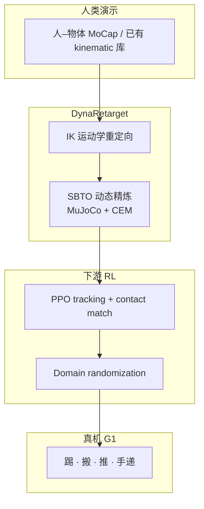

# DynaRetarget

**DynaRetarget**（*Dynamically-Feasible Retargeting using Sampling-Based Trajectory Optimization*，arXiv:[2602.06827](https://arxiv.org/abs/2602.06827)，[项目页](https://atarilab.github.io/dynaretarget.io/)）是 Atari Lab 等人提出的 **人形 loco-manipulation 重定向与部署** 管线：IK 运动学参考 → **SBTO** 动态精炼 → **PPO** 跟踪策略 + **domain randomization** → 真机零样本。算法细节见方法页 [DynaRetarget / SBTO](../methods/dynaretarget-sbto-motion-retargeting.md)；SBTO 实现见 [sbto](./sbto.md)（[GitHub](https://github.com/Atarilab/sbto)）。

本页同时索引 [Humanoid Paper Notebooks](https://imchong.github.io/Humanoid_Robot_Learning_Paper_Notebooks/index.html) **14_Human_Motion** 分类条目（深读笔记待姊妹仓库撰写）。

## 一句话定义

用 **增量时域采样式轨迹优化（SBTO）** 把 imperfect kinematic 人形–物体演示 refinement 为长时域动力学可行轨迹，再训 RL tracking policy 实现 contact-rich loco-manipulation 的 sim2real 零样本迁移。

## 英文缩写速查

| 缩写 | 英文全称 | 简要说明 |
|------|----------|----------|
| SBTO | Sampling-Based Trajectory Optimization | 增量扩展优化时域的 CEM + MuJoCo rollout 精炼器 |
| SBMPC | Sampling-Based Model Predictive Control | 短视距采样 MPC；SPIDER 等对照基线 |
| IK | Inverse Kinematics | 运动学前端，产出待精炼参考 |
| DR | Domain Randomization | RL 训练随机化以提升 sim2real |
| PPO | Proximal Policy Optimization | 下游 tracking 策略算法 |
| G1 | Unitree G1 Humanoid | 论文主实验与真机平台 |

## 为什么重要

- **填补 kinematic → dynamic 缺口：** [OmniRetarget](./paper-hrl-stack-03-omniretarget.md) 等 interaction-preserving **运动学** 参考在 loco-manipulation 上仍可能有缺失接触与穿透；DynaRetarget 在同一 tracking objective 下做 **physics-consistent refinement**。
- **长时域优于 SBMPC：** 相对 [SPIDER](../methods/spider-physics-informed-dexterous-retargeting.md) 的 SBMPC，SBTO 在 **285** 条 OmniRetarget G1–box motion 上成功率 **76.8% vs 37.9%**，轨迹更平滑。
- **下游 RL 与真机：** 精炼参考使 PPO tracking 成功率 **97.09%**（vs kinematic **79.41%**），样本效率更高；真机展示踢、搬、推、手递等 **contact-rich** 行为（Fig. 1）。
- **演示增广：** 单条参考可 refine 到不同 **质量/尺寸/几何**（box、cylinder、chair、shelf），利于 synthetic loco-manipulation 数据集扩展。

## 方法概要

| 模块 | 作用 |
|------|------|
| IK retargeting | 人–物体演示 → 运动学 robot–object 参考 |
| **SBTO** | CEM 采样 PD knot；增量 horizon + warm-start；可选 **SBTO_skip** 前缀缓存 |
| RL tracking | PPO + residual action；body/object/contact rewards；mjlab 8192 envs |
| Sim2Real | 物体位姿/速度/摩擦/外力 DR；无 object-tracking 早停 |

### 流程总览

## 实验与评测

- **Refinement（OmniRetarget 285 motions）：** SBTO_skip **76.8%** success；SPIDER **37.9%**；物体 pos/rot 误差显著更低（Table III）。
- **下游 RL（8 motions · 1024 episodes）：** DynaRetarget **97.09%** vs OmniRetarget kinematic **79.41%** object tracking success（Table V）。
- **增广：** box 质量 **0.1–8 kg**、边长 **0.2–0.4 m**；chair / shelf mesh 亦可 refine。
- **计算：** SBTO_skip 约 **20 s / 1 s** motion（112-core CPU）；相对 SPIDER 仿真步约 **0.96×**。

## 与其他工作对比

| 方法 | 精炼方式 | 长时域 | OmniRetarget 285 | 开源 |
|------|----------|--------|------------------|------|
| OmniRetarget | 仅 kinematic SOCP | — | 作为输入参考 | holosoma |
| SPIDER | SBMPC 短 horizon | 弱 | **37.9%** | 站点 |
| **DynaRetarget** | **SBTO 增量 full-horizon** | **强** | **76.8%** | **[sbto](https://github.com/Atarilab/sbto)** |

## 核心信息

| 字段 | 内容 |
|------|------|
| 分类 | Paper Notebooks **14_Human_Motion** |
| 深读状态 | 待撰写（[PROGRESS.md](https://github.com/ImChong/Humanoid_Robot_Learning_Paper_Notebooks/blob/main/papers/PROGRESS.md)） |
| 链接 | [项目页](https://atarilab.github.io/dynaretarget.io/) · [arXiv](https://arxiv.org/abs/2602.06827) · [SBTO 代码](https://github.com/Atarilab/sbto) · [项目页源码](https://github.com/Atarilab/dynaretarget.io) |

## 与其他页面的关系

- 方法细节：[dynaretarget-sbto-motion-retargeting.md](../methods/dynaretarget-sbto-motion-retargeting.md)
- 代码实体：[sbto](./sbto.md)
- Kinematic 上游：[OmniRetarget](./paper-hrl-stack-03-omniretarget.md)、[OmniRetarget 数据集](./omniretarget-dataset.md)
- 采样 refinement 对照：[SPIDER](../methods/spider-physics-informed-dexterous-retargeting.md)
- 流水线定位：[Motion Retargeting Pipeline](../concepts/motion-retargeting-pipeline.md)
- 同团队相关：[MotionDisco](./paper-motiondisco-extreme-humanoid-loco-manipulation.md)
- 分类父节点：[paper-notebook-category-14-human-motion](../overview/paper-notebook-category-14-human-motion.md)

## 参考来源

- [dynaretarget_arxiv_2602_06827.md](../../sources/papers/dynaretarget_arxiv_2602_06827.md) — 论文主归档
- [humanoid_pnb_dynaretarget-dynamically-feasible-retargeting-us.md](../../sources/papers/humanoid_pnb_dynaretarget-dynamically-feasible-retargeting-us.md) — Paper Notebooks 进度锚点
- [dynaretarget-github-io.md](../../sources/sites/dynaretarget-github-io.md) — 项目页
- [sbto.md](../../sources/repos/sbto.md) — SBTO 官方实现

## 推荐继续阅读

- arXiv：<https://arxiv.org/abs/2602.06827>
- 项目页：<https://atarilab.github.io/dynaretarget.io/>
- SBTO：<https://github.com/Atarilab/sbto>
- OmniRetarget 数据：<https://huggingface.co/datasets/omniretarget/OmniRetarget_Dataset>
