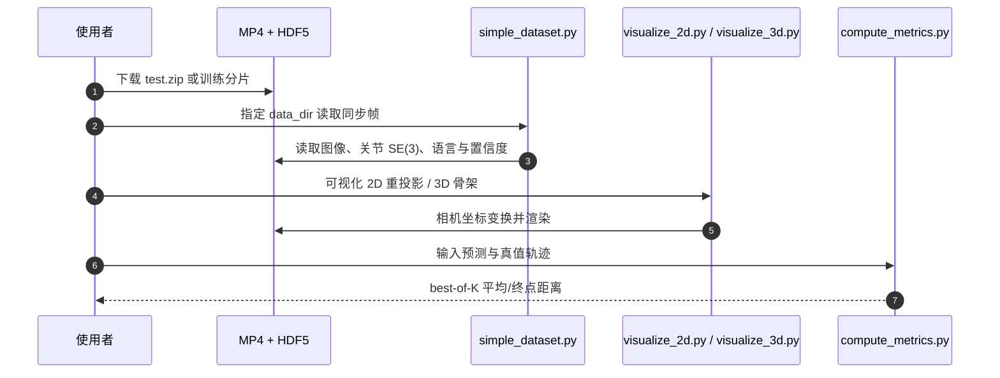

# EgoDex：从大规模第一视角视频学习灵巧操作

**EgoDex: Learning Dexterous Manipulation from Large-Scale Egocentric Video**（[arXiv:2505.11709](https://arxiv.org/abs/2505.11709)）由 Apple 提出，以 Apple Vision Pro 在采集时同步记录第一视角视频、头/上肢/双手三维骨架和语言标注，并建立手部轨迹预测基准。

## 一句话定义

**EgoDex 把“人类日常操作视频”变成可监督的灵巧轨迹语料：829 小时、90M 帧和 338K 段示范覆盖 194 个桌面任务，用原生 3D 手姿避开事后手姿估计的主要噪声。**

## 英文缩写速查

| 缩写 | 英文全称 | 简要说明 |
|------|----------|----------|
| SLAM | Simultaneous Localization and Mapping | Vision Pro 在机定位并提供稳定的 ARKit 世界坐标系 |
| IL | Imitation Learning | 从 EgoDex 示范学习未来双手轨迹 |
| BC | Behavioral Cloning | 确定性轨迹预测基线，单样本指标较强 |
| DDPM | Denoising Diffusion Probabilistic Model | 生成式多模态轨迹基线 |
| FM | Flow Matching | best-of-K 评测中表现最好的生成式表示 |
| OOD | Out-of-Distribution | 6 个未参与主训练分布的额外任务 |

## 为什么重要

- **规模跨越：** 829 小时、338K 轨迹比依赖真机的遥操作采集更易扩展，也比事后标手姿的人类视频集高一个数量级。
- **标注在采集时产生：** 30 Hz、1080p 视频与 3D 头、上肢、25 个/手关节位姿对齐，减少单目遮挡与尺度歧义。
- **下游不只机器人控制：** 数据可用于手轨迹预测、动作识别、接触/可供性学习、视频生成和世界模型。
- **明确暴露 embodiment gap：** 数据来自人手而非机器人，价值更偏预训练与动作先验，不能直接等同于可部署机器人示范。

## 核心信息

| 项 | 内容 |
|----|------|
| 机构 | 苹果公司（Apple） |
| 数据规模 | 829 h、90M 帧、338K episodes、194 tasks、约 2.0 TB |
| 采集 | Apple Vision Pro / visionOS 2 / ARKit；1080p、30 Hz |
| 标注 | 相机内外参、头/肩/臂/腕/手指 SE(3)、置信度、自然语言 |
| 任务划分 | reversible、reset-free、reset 三类桌面操作 |
| 基准输出 | 双手腕位置/6D 姿态 + 10 指尖位置，共 48 维动作 chunk |
| 开放状态 | **部分开源**：数据与样例工具公开；完整 X-IL 训练代码和权重未发布 |

## 流程总览

## 核心机制（方法栈）

### 1）原生三维动作标注

ARKit 将所有关节与相机外参表示在每段录制初始化的世界坐标系；学习时再变换到当前相机坐标。每帧可查询双腕、双手指尖和更完整的 68 个变换，并用置信度识别遮挡或跟踪失败。

### 2）可比较的动作表示与指标

策略输入当前 RGB、骨架状态与语言，输出固定时域的 48 维相对轨迹。评测对每个样本生成 K 条轨迹，取与真值最近的一条，再汇总 12 个关键点的平均三维距离与末帧距离；这使确定性 BC 和多模态生成策略可在同一标尺上比较。

### 3）规模与多模态建模

作者比较 encoder-decoder / decoder-only Transformer 与 BC、DDPM、FM，共训练 14 个模型。生成策略在 K 增大时能覆盖多解，但 K=1 时 BC 的均值预测反而更稳；视觉目标图像显著约束终点。

## 源码运行时序图

官方仓库可运行的是数据访问、可视化和指标链；论文 14 个 X-IL 模型的端到端训练不在仓库中，不能把样例代码误写成完整复现。

## 工程实践与开源状态

| 项 | 建议 / 状态 |
|----|-------------|
| 最小验证 | 先下载 16 GB test set，按同编号 `.mp4` / `.hdf5` 检查同步 |
| 环境 | Python 3.11、FFmpeg 7.1.1、`pip install -r requirements.txt` |
| 坐标 | 不要跨 episode 直接拼 ARKit world frame；先转当前相机或任务局部坐标 |
| 质量过滤 | 使用关节 confidence，语言与方向标签为 GPT-4/VLM 自动生成，需抽检 |
| 训练预算 | 论文默认 8×A100 80 GB、50K steps、batch 2048，约 72 h |
| 许可 | 数据 CC BY-NC-ND，商业与衍生发布受限；代码采用 Apple 源码许可 |
| 开源边界 | **部分开源**：数据、loader、visualizer、metric 已发布；训练配置/权重缺失 |

## 与其他工作对比

| 维度 | EgoDex | 机器人遥操作集 | Ego4D / Internet video |
|------|--------|----------------|------------------------|
| 规模方式 | 人自然操作 + 穿戴采集 | 占用具体机器人与操作员 | 被动互联网采集 |
| 动作标签 | 原生双手 3D 骨架 | 机器人 action/state | 通常无精确手姿 |
| 具身 | 人手统一先验 | 特定机器人 | 人类但标签弱 |
| 直接部署 | 需重定向/微调 | 较直接 | 需动作恢复 |

## 实验与评测

- **主基准：** 2 s horizon 下 EncDec+FM 的 K=10 平均/末帧误差为 **0.038/0.041 m**；EncDec+BC 的 K=1 为 **0.044/0.060 m**。
- **多模态取舍：** K=1 时 BC 比 DDPM/FM 约好 15%；K=5/10 时 FM 最多领先 34%，说明多样采样而非单次均值是生成策略优势。
- **时域：** BC 从 2 s 缩至 1 s，平均误差由 0.045 降至 0.031 m；增至 3 s 则升至 0.053 m。
- **目标条件：** 增加 goal image 后平均误差降低 22%、末帧误差降低 53%。
- **规模律与 OOD：** 随数据量增长持续改善；相近 OOD 任务接近主分布，差异大的任务明显退化。

## 结论

**EgoDex 的核心价值是“大规模、原生 3D、可下载的人手操作语料”，而不是一个已闭环验证的机器人策略。**

1. **先把它当预训练数据** — 人手轨迹仍需重定向、机器人数据微调或 RL 才能落地。
2. **K 的选择改变模型排名** — 单次执行看 BC，多样候选/规划看 FM 或扩散。
3. **目标图像比单纯增大模型更有效** — 500M 模型未优于 200M，goal conditioning 明显改善终点。
4. **坐标与置信度处理决定数据可用性** — episode 世界系不统一，遮挡帧不能盲吃。
5. **许可与训练缺口要提前预算** — 2 TB 数据受非商用、禁演绎限制，官方未给完整训练复现。

## 局限与风险

- 任务集中在桌面，场景与移动操作覆盖有限；194 类不代表环境组合多样性。
- 原生追踪仍是模型估计而非外部动捕真值，RGB 合成视角还会产生 2D 重投影错位。
- 语言和部分方向标签自动生成，可能有语义错误。
- 人手到异构机械手存在运动学、动力学和接触差距；论文没有实机机器人成功率。
- 数据 CC BY-NC-ND 对商业使用与衍生数据发布限制较强。

## 与其他页面的关系

- 数据消费者：[Imitation Learning](../methods/imitation-learning.md)、[Diffusion Policy](../methods/diffusion-policy.md)
- 人手到机器人映射：[Dexterous Kinematics](../concepts/dexterous-kinematics.md)
- 采集路线对照：[Teleoperation](../tasks/teleoperation.md)、[数据手套 vs 视觉遥操作](../comparisons/data-gloves-vs-vision-teleop.md)
- 路线位置：[遥操作纵深 Stage 5](../../roadmap/depth-teleoperation.md)

## 参考来源

- [humanoid_pnb_egodex.md](../../sources/papers/humanoid_pnb_egodex.md)
- [ml-egodex.md](../../sources/repos/ml-egodex.md)
- 论文：<https://arxiv.org/abs/2505.11709>

## 推荐继续阅读

- 官方仓库与数据下载：<https://github.com/apple/ml-egodex>
- 深读笔记：<https://imchong.github.io/Humanoid_Robot_Learning_Paper_Notebooks/papers/06_Manipulation/EgoDex__Learning_Dexterous_Manipulation_from_Large-Scale_Egocentric_Video/EgoDex__Learning_Dexterous_Manipulation_from_Large-Scale_Egocentric_Video.html>
