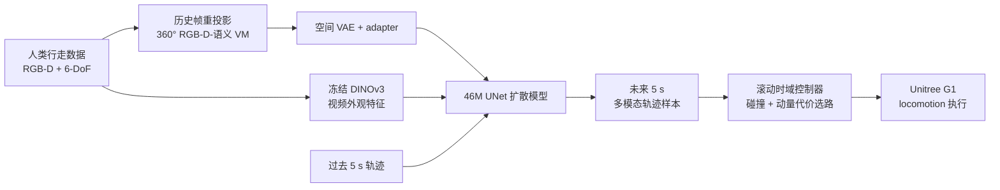

# EgoNav：从人类行走数据学习人形导航先验

**EgoNav**（*Learning Humanoid Navigation from Human Data*，[arXiv:2604.00416](https://arxiv.org/abs/2604.00416)）由斯坦福大学提出：只用 **5 小时人类第一视角行走数据**，学习与机器人本体解耦的多模态未来轨迹分布，再零样本部署到 Unitree G1。

## 一句话定义

**EgoNav 把导航中层写成「场景条件下哪些 6-DoF 路径可走」的扩散先验：360° 视觉记忆负责几何与语义，DINOv3 补透明物体和动态目标，滚动控制器从多条候选中选路。**

## 英文缩写速查

| 缩写 | 英文全称 | 简要说明 |
|------|----------|----------|
| VM | Visual Memory | 将历史 RGB-D 与语义重投影成 360° 全景记忆 |
| DDIM | Denoising Diffusion Implicit Model | 混合采样前 5 步，快速接近高概率轨迹 |
| DDPM | Denoising Diffusion Probabilistic Model | 混合采样后 5 步，恢复样本质量与多样性 |
| CFS | Collision-Free Score | 离线轨迹连续无碰撞步数得分 |
| ADE | Average Displacement Error | 预测与真值轨迹的平均位移误差 |
| VAE | Variational Autoencoder | 把 180×360×5 全景压成空间 latent |

## 为什么重要

- **把昂贵机器人数据换成人类数据：** 44 段普通步行覆盖 25 km，不需要遥操作机器人或为新本体重采集。
- **补齐导航分层的中间接口：** 高层目标规划决定“去哪”，低层 locomotion 决定“怎么迈腿”，EgoNav 输出两者之间的可行轨迹分布。
- **不是单一路径回归：** T 字路口、绕障等天然多解场景可保留多个 mode，避免均值轨迹穿墙。
- **把深度盲区纳入部署：** DINOv3 外观特征能识别深度相机看不见的玻璃；离线深度指标会低估其真机贡献。

## 核心信息

| 字段 | 内容 |
|------|------|
| 机构 | 斯坦福大学（Stanford University） |
| 数据 | 300 min、44 sequences、25+ km、20 Hz；6-DoF pose、RGB-D、8 类语义、预计算 VM |
| 模型 | 46M 参数非自回归 UNet；过去 5 s → 未来 5 s（100 steps） |
| 平台 | Intel RealSense T265 + D455；Unitree G1；Jetson Orin NX / Thor |
| 发表 | IEEE Robotics and Automation Letters，2026 |
| 项目页 / 开源 | [egonav.weizhuowang.com](https://egonav.weizhuowang.com/)；截至 **2026-07-28**，Code / Data 均标为 **Coming Soon / after review** |

## 流程总览

## 核心机制（方法栈）

### 1. 具身无关表示

模型在当前世界坐标系预测 \(p(\tau_{t:t+100}\mid \tau_{t-100:t}, VM, F_{\text{DINO}})\)，而非直接输出关节动作。轨迹由位置和 ortho6d 朝向表示，下游只需把短段轨迹转换成目标速度，因此能替换不同 locomotion 控制器。

### 2. 360° 场景记忆

约 90° 前视 RGB-D 会漏掉身后和侧方。VM 将历史点云变换到当前 egocentric frame，重投影为 **180×360×5**（RGB、depth、semantic）全景；冻结 VAE 压成 8×20×8 latent，再经 adapter 得到 64 维条件。Orin NX 上 VM 构建约 **30 ms**。

### 3. 多模态扩散与混合采样

- UNet 一次预测完整 100-step 轨迹，避免自回归误差累积。
- classifier-free guidance 训练时各条件以 10% 概率 dropout。
- 推理采用 **5 DDIM + 5 DDPM**；相对 1000-step full DDPM 减少约 100× 步数，同时比纯 DDIM 保留更好的 smoothness。

### 4. 滚动执行

控制器每周期从样本中按碰撞风险、动量连续性等代价选轨迹，只执行前段后重新感知。该设计使“扩散生成较慢”与“低层控制需要快刷新”解耦，但仍依赖可靠的轨迹跟踪器。

## 与其他工作对比

| 方法 | 训练数据 | 输出接口 | 目标条件 | 关键边界 |
|------|----------|----------|----------|----------|
| [NoMaD](./paper-notebook-nomad-goal-masked-diffusion-policies-for-navigat.md) | 100+ h 多机器人 RGB | 局部动作序列 | 图像目标 / 无目标 | 需要机器人驾驶数据 |
| [LookOut](./paper-notebook-lookout.md) | 4 h Aria 人类视频 | 单条 6-DoF 头部轨迹 | 无显式目标 | 回归式，未做真机闭环 |
| [NaVILA](./paper-notebook-navila-legged-robot-vision-language-action-model.md) | VLN + YouTube + VQA | 离散语言中层命令 | 自然语言 | VLA 推理较慢、输出单模态 |
| **EgoNav** | **5 h 人类 RGB-D** | **多条 6-DoF 轨迹** | 目前无显式目标 | 是导航先验，不是完整任务规划器 |

## 工程实践与开源状态

| 项 | 复现 / 部署读法 |
|----|-----------------|
| 传感器 | 训练与 G1 均使用 T265 位姿 + D455 RGB-D；论文未来工作才考虑单目深度 |
| 实时性 | VM/VAE/控制在 Orin NX；扩散在 Jetson Thor；项目页报告 110 trajectories/s、系统约 1.7 Hz |
| 安全 | 用 VM 点云离线筛碰撞；透明表面需要 DINOv3，不能只信深度 |
| 调试 | 同时看 CFS、Best-of-15、干预率；单看 ADE 会惩罚合理的多模态分支 |
| 开源 | **待发布**：项目页按钮截至 2026-07-28 仍为 Code/Data Coming Soon；没有可运行仓库、权重或下载链接 |

## 源码运行时序图

**不适用**：截至 **2026-07-28**，官方项目页尚未给出代码仓库、数据或模型下载；无法对齐 README 训练 / 推理入口。项目发布后应补 `sources/repos/` 与真实模块时序。

## 实验与评测

- **离线全量数据：** CFS **91.4**、Smoothness **4.82**、Best-of-1 ADE **0.76**、Best-of-15 **0.39**；pilot CFS 为 89.2。
- **消融：** 去语义 CFS 91.4→**84.1**；去 attention 为 **86.6**；只留历史轨迹为 **82.5**。完整数据相对 pilot 的 Best-of-15 从 0.47 降至 0.39。
- **真机闭环：** G1 在未见室内外环境累计 **37.5 min / 1137 m**；静态、走廊、玻璃、动态场景自主时间分别 **97.2% / 99.3% / 96.2% / 96.0%**。
- **玻璃消融：** 去 DINOv3 后玻璃场景干预率由 **0.77/min** 升至 **2.2/min**，说明深度派生离线指标不能覆盖透明物体风险。

## 结论

**EgoNav 的硬贡献是证明小规模人类行走数据可以训练可部署的人形导航中层先验；它尚未解决目标条件规划、单机完整实时化与开放复现。**

1. **先验与控制要解耦** — 把未来 6-DoF 路径作为公共接口，比直接迁移关节动作更利于跨本体。
2. **场景覆盖比模型堆大更关键** — 360° VM、语义与 DINOv3 分别补视场、类别和透明/动态盲区。
3. **评测要看多样性与干预** — Best-of-N 与真机 interventions 比单轨迹 ADE 更能反映部署价值。
4. **混合采样是实时关键** — 5 DDIM + 5 DDPM 在速度和样本质量间取得实际可用折中。
5. **暂不能当作可复现栈** — 代码、数据和权重仍待发布。

## 局限与风险

- 当前是 **goal-free traversal prior**；没有语言、图像或坐标目标条件，长程任务仍需外部 planner。
- 扩散算力分置 Orin NX 与 Jetson Thor，所谓实时并非低功耗单板端到端独立运行。
- 训练仅 5 小时校园数据；跨城市、拥挤公共空间、极端天气与法规约束未充分覆盖。
- 控制器的点云碰撞检测看不见透明面；DINOv3 只能提供经验补偿，不构成几何安全保证。
- 项目页“we release”与按钮“Coming Soon”存在发布时态差异，工程选型应以实际下载入口为准。

## 与其他页面的关系

- [导航纵深路线 Stage 3](../../roadmap/depth-navigation.md) — 人形第一视角与扩散导航的学习节点
- [分层四足导航栈](../concepts/hierarchical-quadruped-navigation-stack.md) — EgoNav 位于任务规划与低层 locomotion 之间
- [Sim2Real](../concepts/sim2real.md) — 人类数据到 G1 的 cross-embodiment transfer，不是传统仿真迁移
- [FocusNav](./paper-notebook-focusnav.md) — 直接联合局部导航与人形关节控制的对照
- [NavDP](./paper-notebook-navdp-learning-sim-to-real-navigation-diffusion.md) — 仿真 RGB-D + critic 生成选轨的扩散对照

## 参考来源

- [Paper Notebooks 原始归档](../../sources/papers/humanoid_pnb_egonav.md)
- [EgoNav 官方项目页核查](../../sources/sites/egonav.md)
- 论文：<https://arxiv.org/abs/2604.00416>

## 推荐继续阅读

- [EgoNav 深读笔记](https://imchong.github.io/Robot_Learning_Paper_Notebooks/papers/08_Navigation/EgoNav__Learning_Humanoid_Navigation_from_Human_Data/EgoNav__Learning_Humanoid_Navigation_from_Human_Data.html)
- [NoMaD 官方项目](https://general-navigation-models.github.io/nomad/) — 多机器人数据与图像目标条件的另一条扩散路线
