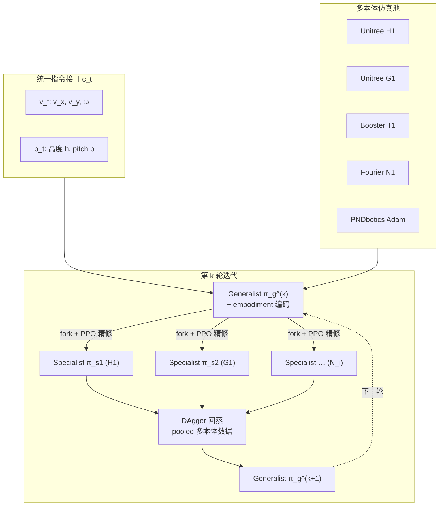

# EAGLE-WBC：跨本体人形全身控制的泛化—专家迭代蒸馏

**EAGLE**（*Embodiment-Aware Generalist Specialist Distillation for Unified Humanoid Whole-Body Control*，arXiv:[2602.02960](https://arxiv.org/abs/2602.02960)，**ICRA 2026**，**上海交通大学 / 上海人工智能实验室**）提出一条 **fleet-level 人形 WBC** 路线：用 **迭代 generalist–specialist 蒸馏** 把多种异构人形压进 **单一策略**，并暴露 **统一高维指令接口**（底盘速度 + 蹲站高度 + 躯干 pitch），在 **无需 per-robot 奖励重调** 的前提下完成跨本体部署。

## 一句话定义

**每轮从共享 generalist fork 出各本体 specialist 做 RL 精修，再以 DAgger 把多机专家经验回蒸进 generalist；配合 embodiment 条件化输入与统一命令向量，一份网络驱动 H1 / G1 / T1 / N1 / Adam（仿真 5 机、真机 4 机）。**

## 英文缩写速查

| 缩写 | 英文全称 | 简要说明 |
|------|----------|----------|
| WBC | Whole-Body Control | 协调全身关节满足多任务/约束的控制基础设施 |
| RL | Reinforcement Learning | specialist 阶段用 PPO 等与环境交互学习 |
| DAgger | Dataset Aggregation | 在 learner 状态上查询 expert 动作的在线蒸馏范式 |
| DoF | Degrees of Freedom | 不同人形关节数与拓扑差异是跨本体难点 |
| EAGLE | Embodiment-Aware Generalist Specialist Distillation | 本文方法简称（项目页亦写作 Eagle-WBC） |

## 为什么重要

- **问题切得准：** 主流 RL 人形 WBC 多为 **一机一策 + 一机一奖**；型号增多时调参成本近线性；且许多策略只跟 base 速度，**蹲 / 倾 / 转** 难以在同一接口下发。
- **闭环而非单次蒸馏：** 纯多本体共训易 **race-to-the-bottom**；EAGLE 用 specialist 把各机性能推满，再 DAgger 回蒸，让 generalist 吸收多专家 **上限** 而非折中。
- **指令即契约：** $c_t=[v_t,b_t]$ 把速度任务与行为任务写进同一向量，为上层 planner / VLA 提供 **跨机型一致的低层 API**。
- **工程信号强：** 项目页展示 **同一份权重** 在 H1、G1、N1、T1 真机上跟踪速度 / 高度 / pitch 组合——比单仿真曲线更能说明 fleet 可行性。
- **与跨具身选型正交：** 相对 [XHugWBC](./paper-xhugwbc-cross-humanoid.md) 的「训练期形态随机化 + 语义关节槽」，EAGLE 走 **蒸馏循环 + embodiment 编码**；相对 [Any2Any](../entities/paper-any2any-cross-embodiment-wbt.md) 的「冻结源机 + 后训练」，EAGLE 是 **从头联合训 generalist 再迭代扩展**。

## 流程总览

## 核心机制（归纳）

### 1）统一观测与命令

- **命令：** $c_t$ 合并 **任务命令** $v_t$（平面线速度、偏航角速度）与 **行为命令** $b_t$（基座高度、躯干 pitch）；项目页亦展示跨本体 **高度 / pitch** 演示。
- **观测：** 短窗 proprio $s_t$ 与 $c_t$ 组成 $o_t$；策略输出对齐 **最大 DoF + mask** 的统一动作空间。

### 2）Embodiment-aware 条件化

- 除本体感知外，输入含 **embodiment ID / 拓扑描述**（DoF 数、关节顺序 padding mask、URDF 语义特征等），使单网络在前向时区分「当前是 G1 还是 N1」。
- 消融（论文/笔记）：去掉 embodiment 编码后，在 **DoF 差异大** 的机器人上跟踪明显退化。

### 3）Generalist–specialist 迭代蒸馏

记第 $k$ 轮 generalist 为 $\pi_g^{(k)}$，本体 $i$ 的 specialist 为 $\pi_{s_i}^{(k)}$：

1. **Pool training（初轮或上一轮产物）：** 在多本体仿真池上维持 / 更新 $\pi_g^{(k)}$。
2. **Specialize：** 从 $\pi_g^{(k)}$ fork 各 $\pi_{s_i}^{(k)}$，在对应机器人上 **PPO 微调**，无需重调 per-robot 奖励（共享奖励结构 + embodiment 条件化）。
3. **Distill back：** 运行 $\pi_g$ 采集状态，用对应 specialist **重标注动作**，pooled 多本体数据上 **DAgger 风格模仿损失** 得到 $\pi_g^{(k+1)}$。
4. **Repeat** 直至各本体性能收敛。

**为何用 DAgger 而非纯 BC：** WBC 长 horizon、误差累积大；在 generalist 自身访问的状态分布上查询 specialist，可缓解 covariate shift（深读笔记与项目页均强调此点）。

### 4）训练与部署栈（公开信息）

| 项 | 内容 |
|----|------|
| 仿真 | Isaac Sim 类 GPU 大规模并行（论文/笔记归纳） |
| Specialist | PPO |
| 蒸馏 | DAgger |
| 部署 | 导出 **单一策略权重**；切换机器人仅需 embodiment 条件，无需重训 |

## 源码运行时序图

**不适用**（截至 2026-09-13，[项目页](https://eagle-wbc.github.io/) 无 GitHub / 权重 / 数据集链接，**确认未开源**）。若后续官方发布可运行训练/推理入口，应补 `sources/repos/` 与本节时序图。

## 实验与评测读法

| 维度 | 内容 |
|------|------|
| 仿真本体 | Unitree **H1**、**G1**；Booster **T1**；Fourier **N1**；PNDbotics **Adam**（**5** 种） |
| 真机本体 | **H1**、**G1**、**N1**、**T1**（**4** 种；Adam 未见真机条目） |
| 任务 | 变速行走、转向、蹲行、躯干前倾行走、抗扰动 |
| 对比读法 | vs **per-robot PPO**（专门调参）：相当或更好；vs **不蒸馏多本体共训**：EAGLE 显著更好；vs **无 embodiment 编码**：大 DoF 差平台掉点 |
| 证据层级 | 项目页真机视频为最强工程信号；精确数值表以 **论文 PDF** 为准 |

## 结论

**EAGLE 把「一份策略管多种人形」拆成可操作的训练闭环：generalist 兜共性、specialist 推各机上限、DAgger 把上限写回共性——前提是命令与 embodiment 条件化先把跨机接口对齐。**

- **闭环是方法本体：** 单次多机共训不够；**fork → PPO 精修 → pooled DAgger 回蒸 → 重复** 才是标题里 generalist–specialist 的含义，也是相对纯 joint training 的主要增益来源。
- **接口与策略同等重要：** 统一 $c_t=[v_t,b_t]$ 让蹲、倾、走、转走同一低层 API；没有命令空间对齐，「单策略」在上层无法成立。
- **真机 4 机同权重是硬信号：** 项目页 H1/G1/N1/T1 并排演示比仿真曲线更能支撑 fleet-level 叙事；Adam 目前以仿真为主。
- **扩展新机型的预期路径：** 为新机器人加一个 specialist + 再跑一轮蒸馏，而非从零重调全套奖励——但 **尚无开源代码** 验证工程成本。
- **选型边界：** 本文聚焦 **速度/姿态类统一 WBC**，非 motion tracking 全库覆盖；与 SONIC / HugWBC / XHugWBC 等路线互补，不宜直接比绝对 tracking 指标。

## 常见误区

1. **「多本体一起训就行」：** 纯共训易全体平庸；specialist 阶段负责把各机推满，蒸馏负责把上限合并。
2. **「蒸馏一次就够」：** 论文方法是 **迭代循环**；停止条件应是各本体接近 specialist，而非单轮 BC。
3. **「embodiment 编码可有可无」：** 消融显示在 DoF 差大的平台上 **明显掉点**；条件化是单网吃多机的关键之一。
4. **「已开源可复现」：** 2026-09-13 项目页 **无代码链接**；PDF 亦未给出仓库 URL → 按 **未开源** 规划。
5. **「与 XHugWBC 重复」：** XHugWBC 强调训练分布形态随机化与语义关节图；EAGLE 强调 **蒸馏循环 + 统一行为命令**——问题接口不同。

## 工程实践

| 检查项 | 建议 |
|--------|------|
| 开源状态 | **未开源**（2026-09-13 项目页核查）；勿假设有官方权重 |
| 复现入口 | 先读 arXiv PDF + [项目页](https://eagle-wbc.github.io/) 视频与 method 图；深读笔记可作中文导读 |
| 上层接口 | 若接 VLA / planner，优先对齐 $c_t$ 语义（速度 + 高度 + pitch）而非各机私有 API |
| 加新机器人 | 预期流程：新 specialist + 一轮蒸馏；实际成本待代码发布后核实 |

## 与其他页面的关系

- **概念：** [Whole-Body Control](../concepts/whole-body-control.md)
- **跨具身选型：** [cross-embodiment-transfer-strategy](../queries/cross-embodiment-transfer-strategy.md) — EAGLE 属「多具身联合训练 + 蒸馏压缩」支路
- **相邻跨本体 WBC：** [XHugWBC](./paper-xhugwbc-cross-humanoid.md)、Paper Notebooks [HugWBC](https://imchong.github.io/Robot_Learning_Paper_Notebooks/papers/03_High_Impact_Selection/HugWBC_A_Unified_and_General_Humanoid_Whole-Body_Controller/HugWBC_A_Unified_and_General_Humanoid_Whole-Body_Controller.html)
- **蒸馏范式：** [DAgger](../methods/dagger.md)、[Athena-WBC](./paper-athena-wbc-humanoid-longtail.md)（另一路 multi-teacher 蒸馏，偏 tracking 长尾）
- **分类父节点：** [paper-notebook-category-04-loco-manipulation-and-wbc](../overview/paper-notebook-category-04-loco-manipulation-and-wbc.md)

## 参考来源

- [EAGLE-WBC（arXiv:2602.02960）](../../sources/papers/eagle_wbc_arxiv_2602_02960.md)
- [EAGLE-WBC 项目页](../../sources/sites/eagle-wbc-github-io.md)
- [Paper Notebooks 深读锚点](../../sources/papers/humanoid_pnb_embodiment-aware-generalist-specialist-distillat.md)

## 推荐继续阅读

- [EAGLE-WBC 项目页](https://eagle-wbc.github.io/) — 真机四机演示与 method 图
- [arXiv:2602.02960](https://arxiv.org/abs/2602.02960) — 全文与实验表
- [机器人论文阅读笔记：EAGLE](https://imchong.github.io/Robot_Learning_Paper_Notebooks/papers/04_Loco-Manipulation_and_WBC/Embodiment-Aware_Generalist_Specialist_Distillation_for_Unified_Humanoid_Whole-B/Embodiment-Aware_Generalist_Specialist_Distillation_for_Unified_Humanoid_Whole-B.html)
- [跨具身策略迁移选型指南](../queries/cross-embodiment-transfer-strategy.md)
- [XHugWBC 实体页](./paper-xhugwbc-cross-humanoid.md) — 另一路跨人形 WBC 对照
